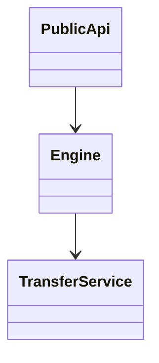
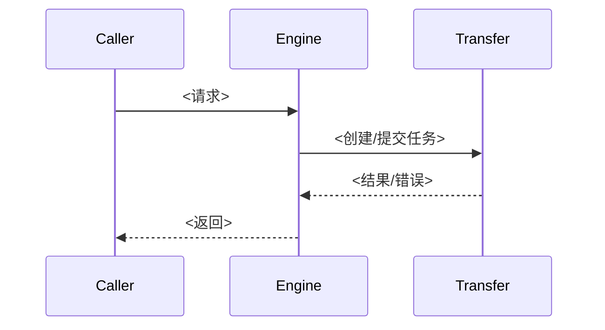

# HIXL SRS 模板

使用规则：

- 一级章节固定为：需求描述、功能要点、技术方案、相关文档、测试方案。
- 文档表述要合理分段和分点：需求描述用短段落，技术方案和测试方案用清晰小节或列表。
- 功能要点必须使用 Markdown 复选框，聚焦几个核心主要功能，通常 2-4 条，按具体需求来填写；不要把实现细节、类名、函数名或测试点拆成大量功能点。
- 需求描述用于描述本需求背景、要实现的特性、期望解决的问题等。
- 技术方案主要描述各功能点的技术实现思路；不需要单独增加影响范围表。
- 涉及跨模块调用、双端交互、异步/并发或状态流转时必须包含 Mermaid 时序图；纯文档、配置或局部结构变更可省略并说明原因。
- 如果本需求创建或改动大量类、组件、服务或核心结构，技术方案必须包含 Mermaid 类图说明它们之间的关系；简单局部改动不要硬塞类图。
- 伪代码按需要保留，避免把设计文档写成实现代码。
- 不确定内容集中写在“假设与待确认”，并说明影响。
- 测试方案每个小节用表格列出测试场景，固定包含“测试场景、测试功能、验证点”三列。

````markdown
# <需求名称> SRS

## 需求描述

请描述本需求的背景，要实现什么特性，期望解决什么问题等。

### 假设与待确认

- <假设或待确认项 1：说明不确认的原因，以及它会影响的设计、兼容性、性能或验收范围。>

## 功能要点

- [ ] <核心功能点 1：用户可见行为或主要能力>
- [ ] <核心功能点 2：关键内部能力或流程>

## 技术方案

### 设计思路

<按功能要点逐项说明技术实现思路，包括涉及的关键模块、类/函数、数据结构、调用关系、状态流转、线程/资源生命周期、异常处理和兼容策略。>

### 模块关系

<当需求创建或改动大量类、组件、服务或核心结构时，使用 Mermaid classDiagram 描述它们之间的关系；否则可删除本节。>



### <功能点 1>

#### 核心流程

<涉及跨模块调用、双端交互、异步/并发或状态流转时，使用 Mermaid sequenceDiagram 描述核心时序；纯文档、配置或局部结构变更可删除本节并说明原因。>



#### 关键伪代码

```cpp
Status HandleRequest(const Request &request) {
  // 只写核心分支，避免把设计文档写成实现代码。
  if (!Validate(request)) {
    return Status::InvalidParam;
  }
  return SubmitTransfer(request);
}
```

## 相关文档

- <新增或更新的文档路径，例如 `docs/design/<需求名>.md`。>
- <公开接口变更时同步 `docs/cpp/` 或 `docs/python/` 的条目。>
- <若不涉及文档，写“不涉及新增文档；如公开行为变化需同步接口文档”。>

## 测试方案

### 单元测试

- <测试文件路径，例如 `tests/cpp/hixl/engine/<name>_unittest.cc`。>

| 测试场景 | 测试功能 | 验证点 |
| --- | --- | --- |
| 正常路径 | <待验证功能> | <返回值、状态变化、资源生命周期或调用结果符合预期> |
| 边界参数 | <待验证功能> | <边界输入被正确处理，不发生越界或资源泄漏> |
| 失败分支 | <待验证功能> | <错误码、日志、回滚和资源释放符合设计> |
| 非法参数 | <参数校验> | <返回明确错误，不触发未定义行为> |

### 系统/集成测试

| 测试场景 | 测试功能 | 验证点 |
| --- | --- | --- |
| 端到端调用链 | <跨模块能力> | <调用链、状态流转和双端交互符合预期> |
| 传输模式覆盖 | <FabricMem/HCCL/Buffer 等路径> | <相关路径按设计选择、执行和回退> |

````
