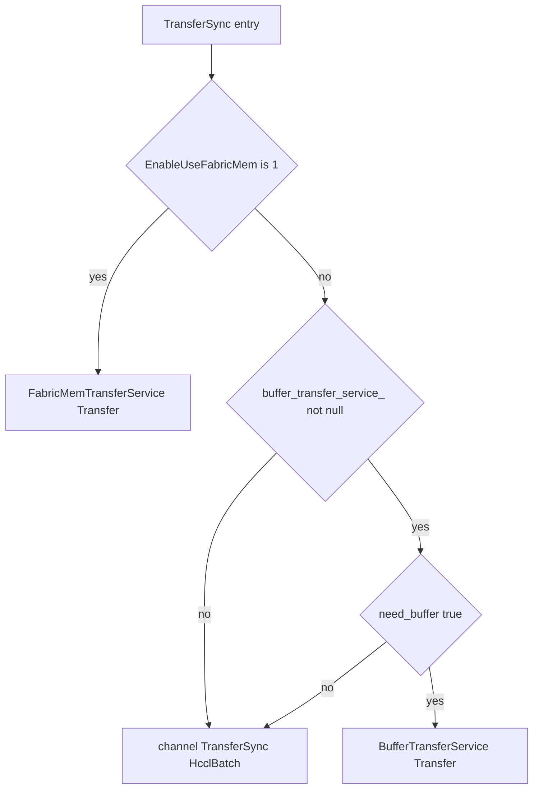

<!--
Copyright (c) 2026 Huawei Technologies Co., Ltd.
This program is free software, you can redistribute it and/or modify it under the terms and conditions of
CANN Open Software License Agreement Version 2.0 (the "License").
Please refer to the License for details. You may not use this file except in compliance with the License.
THIS SOFTWARE IS PROVIDED ON AN "AS IS" BASIS, WITHOUT WARRANTIES OF ANY KIND, EITHER EXPRESS OR IMPLIED,
INCLUDING BUT NOT LIMITED TO NON-INFRINGEMENT, MERCHANTABILITY, OR FITNESS FOR A PARTICULAR PURPOSE.
See LICENSE in the root of the software repository for the full text of the License.
-->

# ADXL 三种传输模式总览

本文供 **hixl-troubleshoot** 分诊使用：根据配置与日志判断问题落在 **HCCL直传**、**中转模式** 还是 **FabricMem模式**。实现描述对齐当前 `hixl` 仓库源码，细节以代码为准。

如果问题不是“当前走哪种模式”，而是“为什么慢、建链慢在哪、传输慢在哪”，继续看 [ADXL 性能问题统计日志查看指南](adxl-performance-statistics.md)。

## 一句话对比

| 模式                    | 典型场景                             | 硬件 / 约束                                                                                      | 开启option                                                                                     | 主要源码 |
|-----------------------|----------------------------------|----------------------------------------------------------------------------------------------|----------------------------------------------------------------------------------------------|----------|
| **HCCL直传（ROCE/HCCS）** | 默认开启，走 HCCL 单边 BatchGet/Put      | 依赖 rank table、建链成功；链路为 ROCE 或 HCCS（机器内默认走HCCS，跨机默认走ROCE，或者配置了HCCL_INTRA_ROCE_ENABLE则全部走ROCE） | 无                                                                                            | `channel.cc`（`HcclComm*` + `HcclBatchGet`/`HcclBatchPut`） |
| **FabricMem模式**       | 默认不是开启的，A3 超节点内基于统一编址的 D2RH/RH2D | 仅 Atlas A3 训练/推理系列；                                                                          | `OPTION_ENABLE_USE_FABRIC_MEM` = `"1"`；| `fabric_mem_transfer_service.{h,cc}`、`virtual_memory_manager.*`、`channel_msg_handler.cc`（share handle）、`channel.cc`（ImportMem） |
| **中转模式**              | RDMA 注册HOST内存大小受限制               | 除了定位问题，告诉用户不推荐使用，如果是注册HOST内存大小受限制，推荐用户升级25.5以后的HDK。                                          | 配置 `OPTION_BUFFER_POOL`（默认`4:8` MB）且 **`TransferSync` + `need_buffer == true`** | `buffer_transfer_service.{h,cc}`、`channel_manager.cc`（`PushBufferReq`/`PushBufferResp`） |

---

## HCCL 直传模式 — 实现要点

**谁创建**

- 未开启 FabricMem 时，`Channel::Initialize(false)` 走完整 HCCL comm 初始化。

**建链 / 初始化序列**（`channel.cc`）

- 全局互斥下 `HcclCommInitClusterInfoMemConfig(rank_table, local_rank_id, comm_config, &comm)`。
- 对已登记注册内存 `HcclCommBindMem(comm, reg_handle)`。
- `HcclCommPrepare(comm, &prepareConfig, timeout_sec)` 完成建链准备（plog 中常见 `HcclCommPrepare`、超时类问题见 skill 的 reference）。

**数据面**

- `Channel::TransferSync`：`StreamPool::TryAllocStream` → 内部 `TransferAsync(operation, op_descs, stream)` → **`HcclBatchGet` / `HcclBatchPut`**（经 `HcclAdapter`，对端 rank 为 `peer_rank_id`）→ `aclrtSynchronizeStreamWithTimeout`。
- 大批量描述符由 `BufferedTransfer` 按 `kMaxOpDescNum` 分批 `Flush` 调用上述 HCCL 接口。
- `Channel::TransferAsync`（对外异步）：分配 stream、提交 `TransferAsync(..., stream)`、`aclrtRecordEvent`，在 `GetTransferStatus` 中 `aclrtQueryEventStatus` + `aclrtSynchronizeStream`。

**与 AdxlInnerEngine 的衔接**

- `AdxlInnerEngine::TransferSync` 在 **无** `fabric_mem_transfer_service_`、且 **`buffer_transfer_service_ == nullptr` 或 `need_buffer == false`** 时调用 `channel->TransferSync`。
- `need_buffer` 由 `GetTransferType` 根据 `SegmentTable` 是否同时解析 local / remote 地址段得到（任一侧找不到 segment 则 `need_buffer` 为 true）。

---

## FabricMem 模式 — 实现要点

**谁创建、何时创建**

- `AdxlInnerEngine::Initialize` 解析 `OPTION_ENABLE_USE_FABRIC_MEM` 后，若开启：先 `VirtualMemoryManager::GetInstance().Initialize()`，再构造并 `FabricMemTransferService::Initialize`（流数量与 `task_stream_num_` 等相关）。
- 同一初始化路径仍会创建 `SegmentTable`、`StreamPool`，并调用 `ChannelMsgHandler::Initialize(..., fabric_mem_transfer_service_.get())`。

**建链 / Channel 与 HCCL 的关系**

- `Channel::Initialize(true)`（FabricMem）**不调用** `HcclCommInitClusterInfoMemConfig`、`HcclCommBindMem`、`HcclCommPrepare`；仅打日志标明 fabric mem 模式。
- 连接阶段通过控制面交换 **share handle** 等信息（`ChannelConnectInfo.share_handles`），对端 `Channel::ImportMem`：`VirtualMemoryManager::ReserveMemory`、`aclrtMemImportFromShareableHandleV2`、`aclrtMapMem`，维护 `new_va_to_old_va_` 与 `remote_pa_handles_`。

**注册内存**

- `ChannelMsgHandler` / `FabricMemTransferService::RegisterMem`：物理内存分配、导出 share handle（`GetShareHandles` 供建链携带）等与 Fabric 一致。

**数据面（同步 / 异步）**

- `FabricMemTransferService::Transfer`：`TryGetStream` → `DoTransfer` → 多流 `aclrtSynchronizeStreamWithTimeout`。
- `DoTransfer`：`TransOpAddr` 把用户 VA 映射到本端导入后的 VA；`ProcessCopyWithAsync` 对每条 `TransferOpDesc` 使用 **`aclrtMemcpyAsync`**，`kind` 为 **`ACL_MEMCPY_DEVICE_TO_DEVICE`**（READ/WRITE 交换 src/dst）。
- `TransferAsync` / `GetTransferStatus`：自建 `aclrtStream` 池、event 同步与 `req_2_async_record_` 管理（与 `Channel` 的 HCCL 异步路径分离）。

**排障锚点**

- 日志：`Initialize channel in use fabric mem mode`；`Failed to transfer via fabric mem transfer service`。
- `AdxlInnerEngine::TransferSync` 对 `ACL_ERROR_RT_SUSPECT_REMOTE_ERROR` 提示可能为临时 SDMA 错误、可重试。

---

## 中转（Buffer）模式 — 实现要点

**谁创建**

- `AdxlInnerEngine::InitBufferTransferService`：`ParseBufferPoolParams` 在非 FabricMem 下解析 `OPTION_BUFFER_POOL`；`"0:0"` 时 `npu_pool_size == 0`，**不创建** `BufferTransferService`。
- FabricMem 开启时不得与非禁用 BufferPool 同配；且 FabricMem 下不会走默认 buffer 池逻辑（见 `ParseBufferPoolParams` 中 `enable_use_fabric_mem_` 分支）。

**资源**

- 在 device 上 `aclrtMalloc` 两大块 NPU 内存，拆成 `LlmMemPool`，再交给 `BufferTransferService`，预分配多块 `buffer_size_`（由 `BUFFER_NUM:BUFFER_SIZE(MB)` 推导）。

**数据面与控制面协作**

- `BufferTransferService::Initialize` 启动多个工作线程：`ProcessBufferReqFirstStep`、`ProcessBufferResp`、`ProcessBufferReqSecondStep`、`ProcessCtrlMsg`。
- `Transfer` 入口：`DoTransferTask` 按 `TransferType` 做分批、`FlushBatch`、`TransferLargeData` 等；通过 **`SendBufferReq` / server 侧处理** 与对端协调，底层仍依赖已建立的 `Channel` 做 HCCL 或控制消息（与 `HandleBufferCopy`、`HandleBufferD2D` 等配套）。
- `ChannelManager` 收到 buffer 相关消息时 `PushBufferReq` / `PushBufferResp` 注入 `BufferTransferService` 队列。

**与 AdxlInnerEngine 的衔接**

- **仅** `TransferSync`：当 `buffer_transfer_service_ != nullptr` **且** `GetTransferType` 得到 `need_buffer == true` 时走 `BufferTransferService::Transfer`。
- **`TransferAsync` 不经过** `BufferTransferService::Transfer`；非 Fabric 时直接 `channel->TransferAsync`（HCCL 路径）。

---

## 选型与分支（同步传输）

---

## 互斥与配置摘要

- **`OPTION_ENABLE_USE_FABRIC_MEM`** 与 **非禁用的 `OPTION_BUFFER_POOL`** 不可同时配置（初始化报错）。
- FabricMem 为 1 时：不创建默认 NPU buffer 池；传输走 Fabric 路径。
- **`OPTION_BUFFER_POOL=0:0`**：关闭中转池（若 `need_buffer` 为 true 且无 buffer 服务，会落入 `channel->TransferSync`）。

---

## 异步路径（单独记忆）

| 条件           | 行为                                                                           |
|--------------|------------------------------------------------------------------------------|
| FabricMem 开启 | `fabric_mem_transfer_service_->TransferAsync` / `GetTransferStatus`          |
| HCCL直传       | `channel->TransferAsync` / `channel->GetTransferStatus`（HCCL + stream/event） |
| 中转           | 中转不支持异步传输                                                                    |

---

## 日志与报错线索（Skill）

| 线索 | 可能关联              |
|------|-------------------|
| `Initialize channel in use fabric mem mode` | FabricMem 建链/传输路径 |
| `HcclCommInitClusterInfoMemConfig` / `HcclCommPrepare` / `HcclCommBindMem` | HCCL 直传建链阶段       |
| `TransferSync success` + `HcclBatchGet` / `HcclBatchPut` | 直传数据面成功           |
| `Failed to transfer via buffer transfer service` | 中转模式              |
| `Failed to transfer via fabric mem transfer service` | FabricMem 数据面     |
| `wait socket establish timeout` + `HcclCommPrepare` | 建链                |

---
