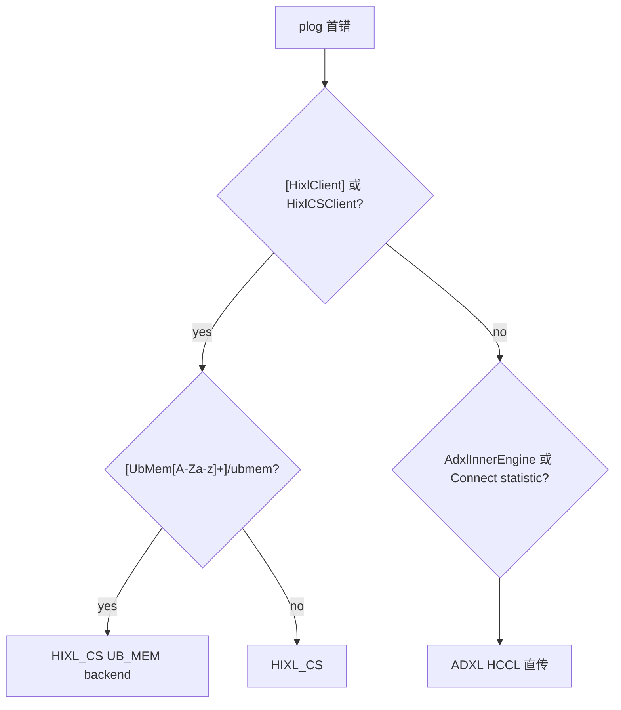

<!--
Copyright (c) 2026 Huawei Technologies Co., Ltd.
This program is free software, you can redistribute it and/or modify it under the terms and conditions of
CANN Open Software License Agreement Version 2.0 (the "License").
Please refer to the License for details. You may not use this file except in compliance with the License.
THIS SOFTWARE IS PROVIDED ON AN "AS IS" BASIS, WITHOUT WARRANTIES OF ANY KIND, EITHER EXPRESS OR IMPLIED,
INCLUDING BUT NOT LIMITED TO NON-INFRINGEMENT, MERCHANTABILITY, OR FITNESS FOR A PARTICULAR PURPOSE.
See LICENSE in the root of the software repository for the full text of the License.
-->

# HIXL 传输路径总览

本文供 **hixl-troubleshoot** 分诊使用：先判 **引擎/路径**，再判 **阶段**。实现描述对齐当前 `hixl` 仓库源码，细节以代码为准。

性能慢 → Wiki [性能统计日志解读.md](https://gitcode.com/cann/hixl/wiki/性能统计日志解读.md)（**ADXL直传** 有 EVENT 级聚合统计；**hixl_cs / UB_MEM 当前仓库暂无** 同类聚合统计，见 §0 表格「性能聚合统计」列）。

---

## 0. 先判路径

| 路径 | 触发条件 / 入口 | 源码 | 典型日志 | 性能聚合统计 |
|------|-----------------|------|----------|--------------|
| **HIXL_CS（含 UB_MEM）** | 配置了 `protocol_desc`，或 `version:1.3`；同超 `ubmem` / `OPTION_ENABLE_USE_FABRIC_MEM=1` 也走这条 | `src/hixl/cs/`、`src/hixl/cs/ubmem/`、`src/hixl/engine/hixl_engine.cc` | `[HixlClient]`、`[HixlServer]`、`[HixlCSServer]`、`[UbMemEndpoint]`、`[UbMemChannel]` | **当前代码无** |
| **ADXL直传** | 默认 | `src/llm_datadist/adxl/` | `AdxlInnerEngine`、`HcclCommPrepare`、`Connect statistic info`、`Direct transfer statistic info` | 有（`StatisticManager`） |

同超 UB_MEM 走 CS 的 `UbMemEndpoint` / `UbMemChannel`：它们和 `HcommEndpoint` / `HcommChannel` 一样继承 `Endpoint` / `Channel` 基类，`Endpoint::Create` 按协议选型。进程级资源只有 `VirtualMemoryManager` 里的全局 VA 池；本端注册表和对端映射都归各自的 endpoint 管。内存层（VMM / allocator / memory）也在 `src/hixl/cs/ubmem/`。

**快速 grep：**

```bash
grep -rniE "\[UbMem[A-Za-z]+\]|ubmem" ~/ascend/log
grep -rniE "AdxlInnerEngine|Connect statistic info|Direct transfer statistic|HcclCommPrepare" ~/ascend/log
grep -rniE "\[HixlClient\]|\[HixlServer\]|HixlCSClient|HixlCSServer" ~/ascend/log
```

---

## 1. 路径判断（决策树）


