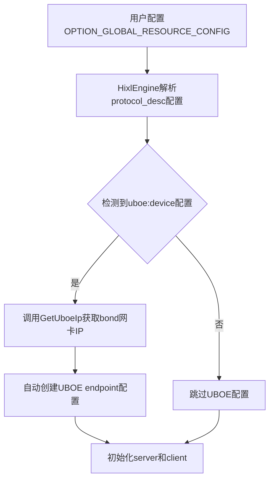
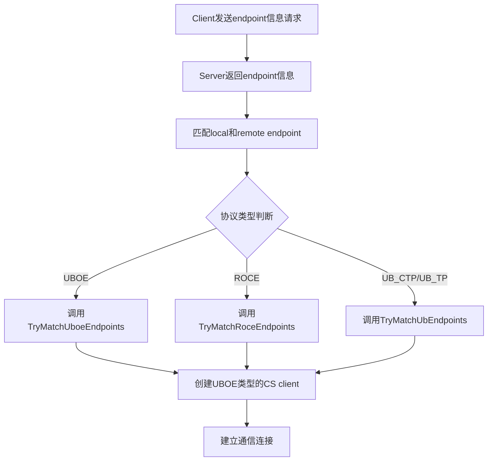
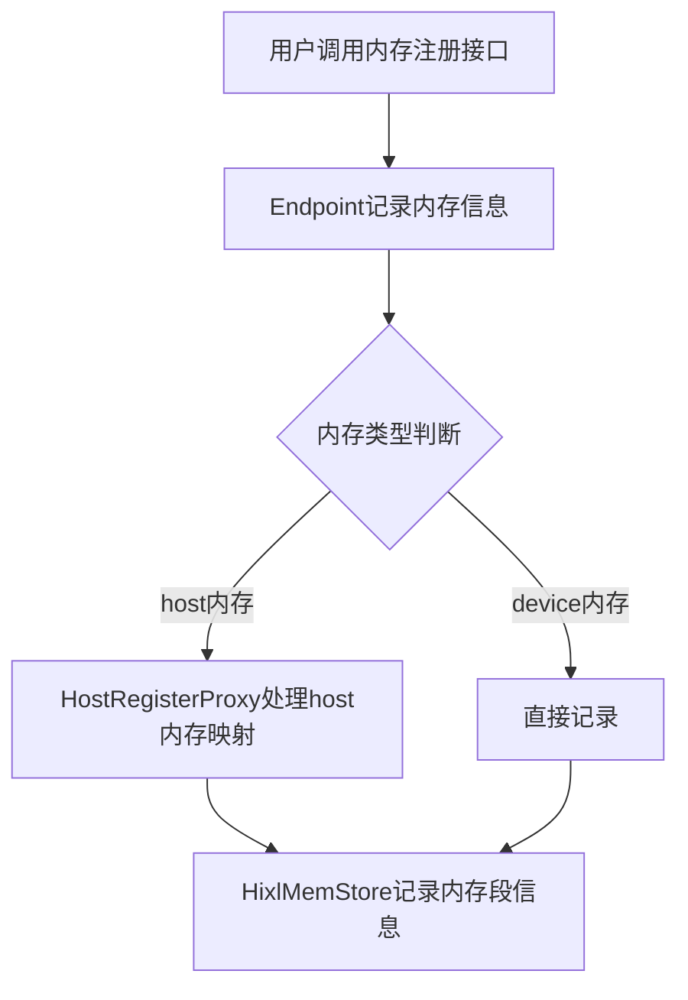
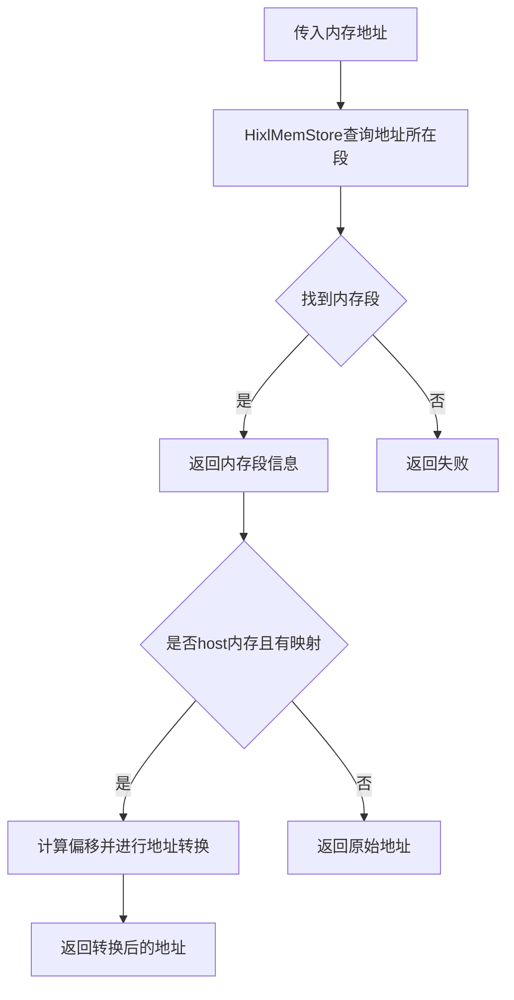

# HIXL UBOE协议支持设计文档

## 1. 需求概述

### 原始需求
1. HIXL支持UBOE协议
2. 支持自动配置UBOE endpoint信息

### 修改范围
- **涉及文件**：19个文件
- **代码变更**：579行新增，82行删除
- **起始commit**：26f6085d0b5ed35b694523e3c8dcdac9ed7419b2

## 2. 核心功能模块

### 2.1 UBOE协议类型定义

**文件**：`src/hixl/common/hixl_inner_types.h`

**修改内容**：
- 添加UBOE协议常量：`kProtocolUboe = "uboe"`

**设计目的**：
- 定义UBOE协议标识字符串
- 与现有ROCE、UB_CTP、UB_TP协议保持一致

### 2.2 UBOE通信类型支持

**文件**：`src/hixl/engine/hixl_client.h` 和 `src/hixl/engine/hixl_client.cc`

**修改内容**：
- 在 `CommType` 枚举中添加 `COMM_TYPE_UBOE = 6U`
- 在 `CommTypeToString` 函数中添加UBOE分支

**设计目的**：
- 为UBOE协议提供独立的通信类型标识
- 支持日志输出和调试

### 2.3 自动配置UBOE Endpoint

**文件**：`src/hixl/engine/hixl_engine.cc` 和 `src/hixl/engine/hixl_engine.h`

**修改内容**：
- 添加 `GetUboeIp` 函数：获取bond网卡IP地址
- 添加 `ParseCommResourceConfig` 函数：解析协议描述配置
- 在 `HixlEngine::Initialize` 中添加UBOE自动配置逻辑

**配置格式**：
```json
{
  "comm_resource_config.protocol_desc": ["uboe:device"]
}
```

**自动配置逻辑**：
1. 检查 `OPTION_GLOBAL_RESOURCE_CONFIG` 选项
2. 解析 `protocol_desc` 配置
3. 如果为 `["uboe:device"]`，自动创建UBOE endpoint
4. 从bond网卡获取IP地址
5. 构造endpoint配置：`{protocol: "uboe", comm_id: "bond_ip:16668", placement: "device"}`

### 2.4 内存存储增强

**文件**：`src/hixl/cs/hixl_mem_store.h` 和 `src/hixl/cs/hixl_mem_store.cc`

**修改内容**：
- 在 `MemoryRegion` 结构体中添加：
  - `bool is_host_mem`：标识是否为host内存
  - `void *register_dev_addr`：存储映射的device地址
- 修改 `RecordMemory` 函数：支持记录内存类型和映射地址
- 添加 `FindMemoryRegion` 函数：查询地址所在的内存段
- 修改 `CheckMergedRegionsAccess` 函数：支持物理地址连续性检查

**设计目的**：
- 支持host内存的device地址映射
- 提供快速的地址段查询功能
- 确保合并的内存段在物理地址空间连续

### 2.5 Host内存注册代理

**文件**：`src/hixl/cs/host_register_proxy.h` 和 `src/hixl/cs/host_register_proxy.cc`

**修改内容**：
- 定义 `RecordMemInfo` 结构体：记录内存信息
- 定义 `HostMemInfo` 结构体：记录host内存映射信息
- 实现 `HostRegisterProxy` 类：
  - 单例模式管理
  - 提供host内存注册和注销功能
  - 支持device ID区分

**设计目的**：
- 管理host内存到device内存的映射
- 提供线程安全的内存注册服务
- 支持多device场景

### 2.6 Endpoint内存管理增强

**文件**：`src/hixl/cs/endpoint.cc` 和 `src/hixl/cs/endpoint.h`

**修改内容**：
- 在 `Endpoint` 类中添加 `RegisterMem` 和 `DeregisterMem` 方法
- 支持在endpoint级别管理内存注册

**设计目的**：
- 支持endpoint级别的内存管理
- 与内存存储系统集成

### 2.7 Client内存管理增强

**文件**：`src/hixl/cs/hixl_cs_client.cc` 和 `src/hixl/cs/hixl_cs_client.h`

**修改内容**：
- 添加 `BatchTransferByUboe` 方法：UBOE协议的批量传输
- 实现地址转换逻辑：host地址到device地址的转换
- 添加模板方法 `ConvertAddr`：支持const和非const指针

**地址转换逻辑**：
1. 根据传输方向确定src/dst是client还是server
2. 查询地址所在的内存段
3. 如果是host内存且有映射，计算偏移并转换地址
4. 调用底层传输接口

### 2.8 控制消息扩展

**文件**：`src/hixl/common/ctrl_msg.h`

**修改内容**：
- 添加UBOE相关的控制消息类型

**设计目的**：
- 支持UBOE协议的控制消息交互

### 2.9 HCCS资源定义

**文件**：`src/hixl/proxy/hcomm/hcomm_res_defs.h`

**修改内容**：
- 添加UBOE相关的HCCS资源定义

### 2.10 测试支持

**文件**：`tests/depends/ascendcl/src/ascendcl_stub.cc`

**修改内容**：
-添加host注册代理相关的测试stub

## 3. 架构设计

### 3.1 协议层次结构

```
HixlEngine (引擎层)
  ├──   HixlClient (客户端层)
  │       ├── HixlCSClient (CS客户端层)
  │       │       ├── Endpoint (端点层)
  │       │       │       └── HostRegisterProxy (host内存注册)
  │       │       └── HixlMemStore (内存存储)
  │       └── ClientManager (客户端管理)
  └── HixlServer (服务端层)
          └── Endpoint (端点层)
```

### 3.2 UBOE协议流程

#### 初始化流程



#### 连接流程



#### 传输流程

```mermaid
graph TD
    A[用户调用批量传输接口] --> B{协议类型判断}
    B -->|UBOE| C[调用BatchTransferByUboe]
    B -->|{ROCE/UB_CTP/UB_TP}| D[调用对应的传输方法]
    C --> E[地址转换: host → device]
    E --> F[调用底层传输接口]
    D --> F
```

#### 内存管理流程



#### 查询流程



## 4. 关键技术点

### 4.1 地址转换算法

**偏移计算**：
```cpp
offset = current_addr - region.addr
converted_addr = region.register_dev_addr + offset
```

**线程安全**：
- 使用mutex保护内存存储
- 使用单例模式管理host注册代理

### 4.2 内存段连续性检查

**虚拟地址连续性**：
```cpp
prev_end == curr_start
```

**物理地址连续性**：
```cpp
prev_dev_end == curr_dev_start
```

**合并条件**：
- 虚拟地址连续
- 物理地址连续（当有映射时）

### 4.3 自动配置机制

**配置检测**：
- 检查 `OPTION_GLOBAL_RESOURCE_CONFIG` 选项
- 解析JSON格式的配置字符串
- 匹配 `protocol_desc` 数组

**Endpoint自动生成**：
- 协议：`uboe`
- 通信ID：`bond_ip:16668`
- 位置：`device`
- 网络实例：`stub_superpodr1_1`

## 5. 使用示例

### 5.1 自动配置UBOE

```cpp
std::map<AscendString, AscendString> options;
options["global_resource_config"] = R"({
  "comm_resource_config.protocol_desc": ["uboe:device"]
})";

HixlEngine engine;
engine.Initialize(options);
// 自动创建UBOE endpoint并建立连接
```

### 5.2 内存注册和传输

```cpp
// 注册host内存
void *host_addr = malloc(1024);
MemDesc mem{reinterpret_cast<uintptr_t>(host_addr), 1024};
MemHandle handle;
engine.RegisterMem(mem, MemType::MEM_HOST, handle);

// 批量传输
std::vector<TransferOpDesc> ops;
ops.push_back({local_addr, remote_addr, 1024});
engine.TransferSync("remote_engine", ops, READ, 1000);
// 自动进行地址转换和传输
```

## 6. 设计优势

1. **自动化配置**：无需手动配置UBOE endpoint
2. **透明地址转换**：用户无需关心host/device地址映射
3. **高效内存管理**：O(log n)的地址查询性能
4. **线程安全**：支持多线程并发访问
5. **向后兼容**：不影响现有ROCE和UB协议功能
6. **统一接口**：与现有协议保持一致的API接口
7. **独立处理流程**：UBOE协议有独立的匹配和处理逻辑，不与UB_CTP/UB_TP混淆

## 7. 总结

本次修改实现了完整的UBOE协议支持，包括：

1. ✅ 协议类型定义和通信类型支持
2. ✅ 自动配置UBOE endpoint机制
3. ✅ host内存到device内存的地址映射
4. ✅ 高效的内存段查询和管理
5. ✅ 线程安全的内存注册服务
6. ✅ UBOE协议的批量传输支持
7. ✅ 独立的UBOE协议处理流程

设计遵循了HIXL现有的架构模式，保持了代码的一致性和可维护性，同时提供了良好的扩展性。UBOE协议作为独立的协议类型，有完整的处理流程，不会与现有的UB_CTP/UB_TP协议处理逻辑产生冲突。
