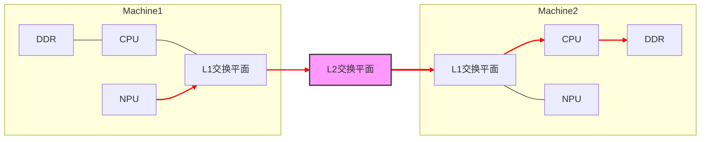

# FabricMem 模式
## 背景

随着大语言模型（LLM）参数规模的指数级增长，推理部署面临着前所未有的内存压力。以 GPT-4 级别的模型为例，千亿级参数在 FP16 精度下仅权重就需要数百 GB 显存，而更大的内存消耗来自 KV Cache——在长序列推理场景下，KV Cache 的容量需求往往超过模型权重本身数倍。

业界对此的解决方案是构建**多级缓存架构**，将 GPU 显存作为一级缓存，分布式 DRAM 作为二级缓存，SSD/NVMe 作为三级缓存。以 Mooncake 为代表的分布式 KV Cache 系统逐渐成为主流选择，HIXL作为一个传输后端，也已经接入了Mooncake，如何高效地在超节点之间进行KV Cache传输成为核心挑战。

在以DRAM构成的分布式内存池中，传统方案依赖 RoCE（RDMA over Converged Ethernet）网络，其满载带宽约 20GB/s，在Atlas 800T A3 超节点的部署场景下会成为明显的性能瓶颈。为此，HIXL提供了 Fabric Mem模式，可以将Atlas 800T A3 超节点内的传输带宽提升至百 GB/s 级别。

## 整体方案

在Atlas 800T A3 超节点内，所有计算节点的 DRAM 内存被统一编址，NPU 可以通过 HCCS高速链路直接访问远程节点的内存。

Fabric Mem 模式的核心价值在于：

- **超节点内 DRAM 统一编址**：打破节点边界，实现内存资源池化
- **D2RH/RH2D 高带宽传输**：设备到远程主机、远程主机到设备的双向高速通道
- **无需 CPU 介入的单边通信**：源端主动发起传输，对端零开销

### 基于 VMM 的内存管理

Fabric Mem 模式的底层依赖于CANN的 **Virtual Memory Manager** 机制, 实现了全局统一编址并支持各个进程直接访问，具体实现如下：

1. 每个进程申请自己的片上内存和DRAM内存: 先通过调用`aclrtMallocPhysical`申请物理内存，再通过调用`aclrtReserveMemAddress`申请虚拟内存，最后通过调用`aclrtMapMem`将物理内存映射到虚拟内存。
2. 进行物理地址的交换。
3. 将物理地址映射到访问进程的页表中。
4. 发起SDMA访问，可读写任何进程的片上内存和DRAM内存。

从本地NPU的片上内存直接往远程的HOST内存写数据的数据流向：

## 安装与运行依赖

| 依赖项                              | 版本要求                                                                                                               |
| -------------------------------- |--------------------------------------------------------------------------------------------------------------------|
| HDK                              | [26.0以上](https://support.huawei.com/enterprise/zh/undefined/ascend-hdk-pid-252764743/software)                     |
| LingQu Computing Network（灵衢计算网络） | [1.5.0以上](https://support.huawei.com/enterprise/zh/ascend-computing/lingqu-computing-network-pid-258003841/software) |
| CANN                             | **9.0以上**                                                                                                          |

- **启用方式**：初始化引擎时在 `options` 中配置 `OPTION_ENABLE_USE_FABRIC_MEM`，取值为 `"1"` 表示开启（取值为 `"0"` 表示关闭）。详见 [HIXL 接口 · options](cpp/HIXL接口.md)。
- **可选全局配置**：可通过 `OPTION_GLOBAL_RESOURCE_CONFIG` 配置 Fabric 虚拟内存池容量、起始地址、单任务流数量等，示例见 [HIXL 接口](cpp/HIXL接口.md) 中 `fabric_memory.`* 字段说明。

**硬件范围**：仅支持 **Atlas A3 训练系列产品**、**Atlas A3 推理系列产品**。

## 性能参考

### 真实场景单机16卡benchmark

**Benchmark 程序**：`fabric_mem_kv_benchmark`。

**在测什么**：单块大小为 DeepSeek-R1 KV 形状，**61×128K + 61×16K = 8784KB/块**。总块数 16/32/48/64 时，块在多卡间均分；**Put（D2RH）仅在 rank 0**；**Get（RH2D）每卡都执行**。对外打印的 Get 时间为 **10 次的算术平均**。

### 大块数据带宽测试

| 数据传输方向                          | 单次数据大小（GB）| 时间(us) | 带宽（GB/s） |
|---------------------------------| -----------------|------------|----------|
| RH2D                            | 1 | 9723| 103      |
| RH2D                            | 2 | 19388| 103      |
| D2RH                            | 1 | 15650| 64       |
| D2RH                            | 2 | 31250| 64       |
| RD2D                            | 1 | 6500| 155      |
| RD2D                            | 2 | 12929| 155      |
| D2RD                            | 1 | 7832 | 128      |
| D2RD                            | 2 | 15643 | 128      |
| 1 GB/s = 1024 * 1024 * 1024 B/s |