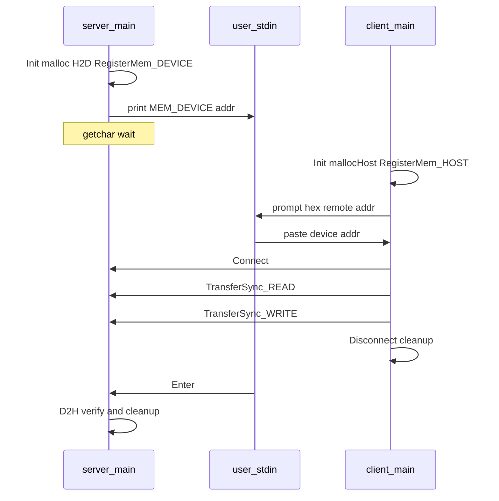

# HIXL 使用指导

本文档对 **HIXL（Huawei Xfer Library）** 做背景说明、通信原理梳理，并基于仓库内简洁样例说明如何编译、运行与理解执行过程。更完整的接口说明见 [C++ 接口](cpp/README.md) 与 [样例说明](../examples/cpp/README.md)。

---

## 1. HIXL 是什么

HIXL 是面向昇腾（Ascend）集群的**单边、点对点传输库**：在本地完成内存注册与数据准备后，由发起方通过单边操作直接读写对端已注册的内存区域，无需对端 CPU 参与每次数据传输。库在多种互联（如 HCCS、RoCE/RDMA 等）之上提供统一 C++/Python API，适用于 PD 分离、KV Cache 搬运、参数同步等场景。其上还可叠加 **LLM-DataDist** 等带 KV 语义的封装（本指导以底层 HIXL Engine 为主）。

---

## 2. 背景

分布式推理与训练在昇腾集群上同样面临**高带宽、低时延**的通信需求：**Host 与 NPU Device 内存并存**，数据路径需覆盖 **D2D、D2H、H2D** 等形态；业务上则常见大模型 **PD（Prefill/Decode）分离**、**KV Cache 跨设备或跨机搬运**、**RL 后训练中的参数切换**、**模型参数缓存** 等，要求在多进程、多卡乃至异构机型之间稳定、高效地搬移数据，并能在拓扑或实例数变化时完成链路与资源适配。

HIXL 在上述场景中的定位见仓库 [README](../README.md)：**HIXL Engine** 作为核心传输引擎，屏蔽昇腾系列芯片的底层差异，在 **HCCS、RoCE/RDMA** 等链路上提供统一的点对点传输能力（官方公开数据中，A3 上 128MB 量级传输可达约 119 GB/s（HCCS）与约 22 GB/s（RDMA）等量级，详见 Benchmarks）；**LLM-DataDist** 在 Engine 之上提供带 KV Cache 语义的接口，便于对接 Mooncake、DeepLink 以及 vLLM、SGLang 等生态。

实际部署时，业务进程或编排层需要完成 **Device 绑定、内存分配、Engine 寻址** 等准备工作，并在参与方之间交换**建链与远端可访问内存**所需的描述信息（控制面）；真正的数据搬运由 HIXL 的**单边 Read/Write**（同步或异步）在数据面完成。下文按「Engine 与连接 → 内存注册 → 传输」的顺序说明这些能力与 API 的对应关系。

---

## 3. 通信原理

HIXL 将一次端到端传输拆成可复用的几类能力，与 C++ API 大致对应如下。

| 环节 | 说明 |
|------|------|
| **Engine 标识** | 每个通信端点通过 **Engine** 字符串区分本端与对端，常见形式为 **`ip`**（Client）或 **`ip:port`**（监听侧 Server），与样例及环境配置一致。 |
| **初始化** | **Initialize(local_engine, options)** 在本进程绑定上述 Engine，完成引擎侧初始化；用毕调用 **Finalize** 释放。 |
| **内存注册** | **RegisterMem** 将 Host（`MEM_HOST`）或 Device（`MEM_DEVICE`）上的一段连续地址与长度登记到引擎，得到 **MemHandle**，使该区间可被硬件路径访问；不再使用时 **DeregisterMem**。 |
| **元数据与控制面** | 参与方需约定如何传递「对端可写/可读的缓冲区地址、长度」以及建链前提。生产环境可通过业务 RPC、配置中心或专用元数据服务交换；**仓库内教学样例**常用标准输入、本地文件、固定等待等极简带外方式演示。 |
| **建链** | **Connect(remote_engine)** 与对端 Engine 建立传输通路；结束后 **Disconnect(remote_engine)**。 |
| **数据传输** | **TransferSync**（或异步传输接口）根据 **TransferOpDesc** 指定本地地址、远端地址与长度，执行 **READ**（从远端读入本地）或 **WRITE**（从本地写入远端）。 |

**单边（One-sided）**：一次传输由发起端调用驱动；对端在传输发生前完成内存注册与建链相关准备即可，传输过程中无需对端 CPU 执行与本次搬运配对的 “recv” 逻辑。**零拷贝**：在引擎与链路支持下，数据可在已注册的用户缓冲区之间直接搬运，减少不必要的中间拷贝与额外内存占用。

---

## 4. 环境与编译（可运行前提）

- 已部署 **CANN** 与昇腾驱动，并已 `source` 对应 `set_env.sh` 或 `setenv.bash`（详见 [构建说明](build.md)、[样例 README](../examples/cpp/README.md)）。
- 样例多在**单机双 device** 上运行：`local_engine` / `remote_engine` 的 IP 部分相同；Server 侧 engine 为 **`ip:port`**，Client 侧为 **`ip`**（与仓库现有说明一致）。
- 使用 RoCE 传输时，可按样例说明设置 `HCCL_INTRA_ROCE_ENABLE=1`；执行前需确认 **device 间网络互通**、**TLS 策略一致**（参见 `examples/cpp/README.md` 中 `hccn_tool` 与 TLS 说明）。

编译带样例：

```bash
cd /path/to/hixl
bash build.sh --examples   # 具体选项以 build.sh -h 为准
# 可执行文件通常在 build/examples/cpp/ 下
```

---

## 5. 简洁可运行示例：h2d（`client` / `server`）

**场景**：Client 使用 **Host 内存**（`MEM_HOST`），Server 使用 **Device 内存**（`MEM_DEVICE`），演示 **H2D 方向**上的单边读、写。

源码位置：[examples/cpp/client.cpp](../examples/cpp/client.cpp)、[examples/cpp/server.cpp](../examples/cpp/server.cpp)。

专文（编译、执行、中文时序图）：[examples/cpp/h2d_client_server_使用指导.md](../examples/cpp/h2d_client_server_使用指导.md)。

**运行顺序与命令示例**（单机、两卡；IP 与端口按环境修改）：

1. 先启动 **Server**（占用带端口的 engine，例如 `10.10.10.0:16000`），记下终端打印的 **`registered MEM_DEVICE addr`**：

```bash
source ${HOME}/Ascend/cann/set_env.sh   # 按实际安装路径调整
HCCL_INTRA_ROCE_ENABLE=1 ./server 1 10.10.10.0:16000
```

2. 再启动 **Client**。在提示 **`enter remote MEM_DEVICE address (hex):`** 处输入上一步的地址（支持 `0x` 前缀）：

```bash
HCCL_INTRA_ROCE_ENABLE=1 ./client 0 10.10.10.0 10.10.10.0:16000
```

3. Client 完成传输后，回到 **Server** 终端按回车；Server 将 device 上的字 **D2H** 读回并打印，成功时应为 **2**。

参数含义：

- **Server**：`device_id`、`local_engine`（`ip:port`）。
- **Client**：`device_id`、`local_engine`（`ip`）、`remote_engine`（`ip:port`，与 Server 一致）。

双方均会 `aclrtSetDevice` 绑定 NPU；Client 的 Host 缓冲与 Server 的 Device 缓冲各注册到 HIXL。

---

## 6. 示例运行过程解析（与源码一致）

下列步骤与 [client.cpp](../examples/cpp/client.cpp)、[server.cpp](../examples/cpp/server.cpp) 中 **`main` 自上而下**的执行顺序一致。

### 6.1 Server（`server.cpp`）

| 步骤 | 代码在做什么 |
|------|----------------|
| S1 | **`aclrtSetDevice`**；构造 **`Hixl`**，**`Initialize(local_engine)`**（`ip:port`）。 |
| S2 | **`aclrtMalloc` + `aclrtMemcpy`（H2D）**：device 上 `sizeof(int32_t)`，初值 **1**。 |
| S3 | **`RegisterMem(..., MEM_DEVICE)`**；打印 **`registered MEM_DEVICE addr`**。 |
| S4 | **`getchar()`**：等待用户在 Client 完成传输后按回车（**非 HIXL 必需**，仅人工同步）。 |
| S5 | **`aclrtMemcpy`（D2H）**：读回 device 字，打印结果（期望 **2**）。 |
| S6 | **`DeregisterMem`**、**`aclrtFree`**、**`Finalize`**、**`aclrtResetDevice`**。 |

失败路径通过 **`CHECK_ACL` / `CHECK_HIXL`** 宏直接退出，不做回滚清理。

### 6.2 Client（`client.cpp`）

| 步骤 | 代码在做什么 |
|------|----------------|
| C1 | **`aclrtSetDevice`**；**`Initialize(local_engine)`**（`ip` 形式）。 |
| C2 | **`aclrtMallocHost`**；**`RegisterMem(..., MEM_HOST)`**；打印 **`registered MEM_HOST addr`**。 |
| C3 | **`scanf`**（十六进制）：读入 Server 的 **MEM_DEVICE** 字地址。 |
| C4 | **`Connect(remote_engine)`**。 |
| C5 | 构造 **`TransferOpDesc`**：`local` = **`&host_buf`**（与历史单文件样例一致）、`remote` = stdin 读入地址、`len` = `sizeof(int32_t)`。 |
| C6 | **`TransferSync(..., READ)`**：将 Server device 上的 **1** 读到 host。 |
| C7 | 将 `*host_buf` 置 **2**；**`TransferSync(..., WRITE)`** 写回 Server。 |
| C8 | **`Disconnect`**、**`DeregisterMem`**、**`aclrtFreeHost`**、**`Finalize`**、**`aclrtResetDevice`**。 |

### 6.3 双进程时序（人工协调）

| 顺序 | 进程 | 发生的事 |
|------|------|----------|
| 1 | Server | S1 → S3，打印 device 地址，阻塞在 S4 |
| 2 | Client | C1 → C3，输入 S3 中的地址 |
| 3 | Client | C4 → C7（READ + WRITE） |
| 4 | Server | 用户按回车 → S5 → S6 |
| 5 | Client | C8 |

### 6.4 交互示意



### 6.5 数据流小结与注意

- **READ**：Server device（初值 1）→ Client host 的 `*host_buf`。
- **WRITE**：Client host（**2**）→ Server device；Server D2H 后应看到 **2**。

**注意**：对端 device 地址通过**标准输入**传递，适用于单机演示；多机或生产环境应通过控制面安全交换远端内存描述，勿依赖人工复制裸指针。

---

## 7. 延伸阅读

- [README.md](../README.md)：架构与性能概览  
- [examples/cpp/README.md](../examples/cpp/README.md)：`server_server_d2d`、`fabric_mem_d2d` 等更多模式  
- [docs/cpp/HIXL接口.md](cpp/HIXL接口.md)：Initialize、RegisterMem、Connect、TransferSync 等完整说明  

---

*文档版本与仓库同步维护；接口与运行参数以对应源码与官方发布说明为准。*
