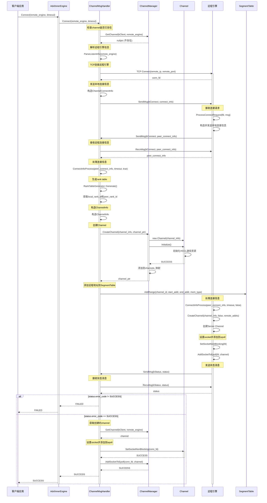
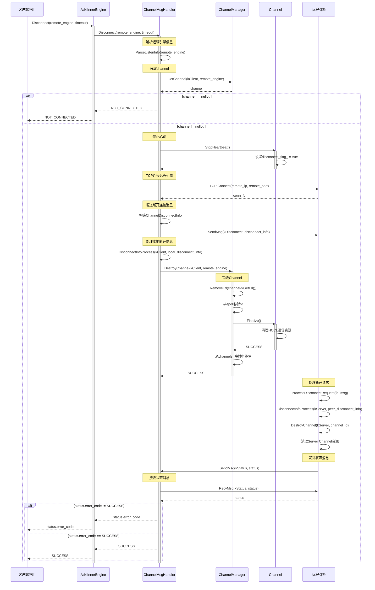
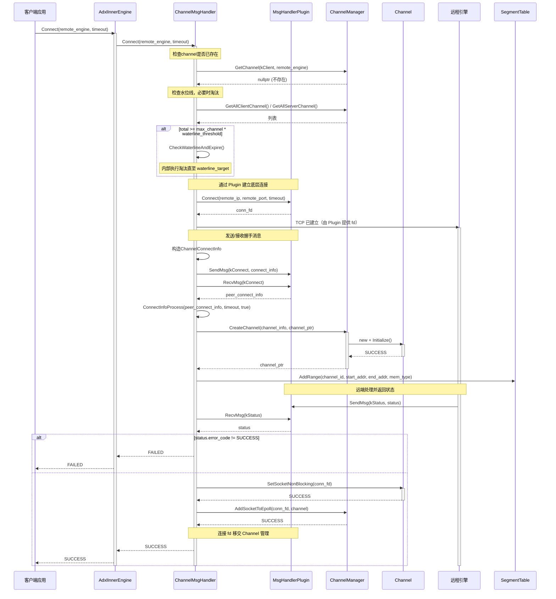
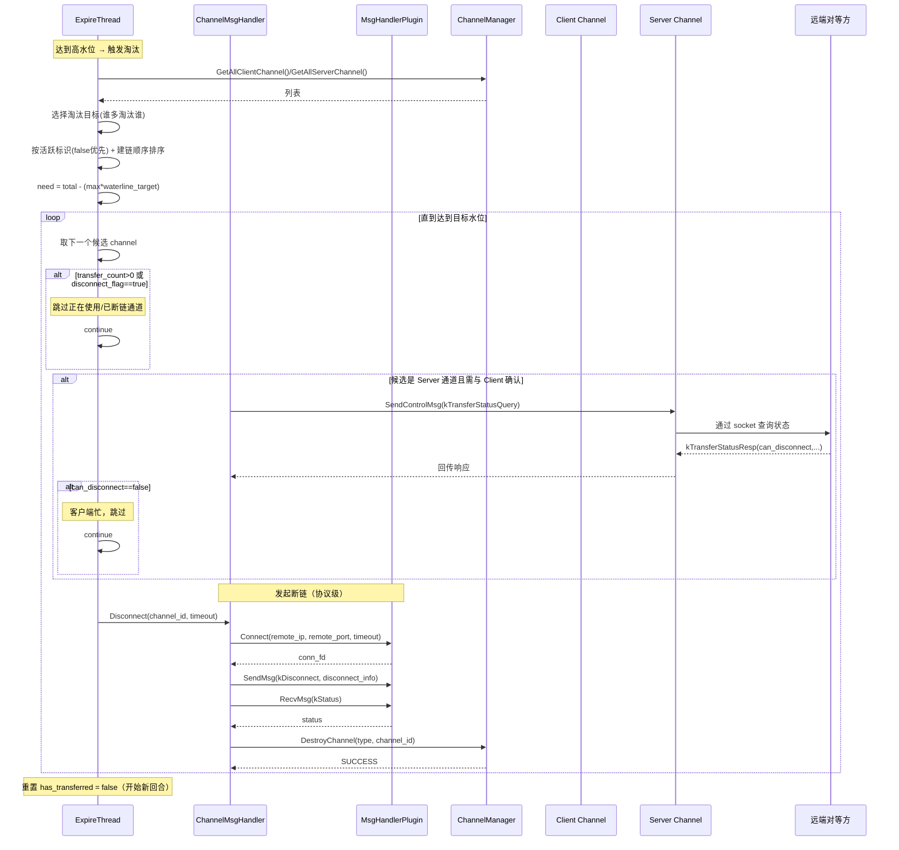
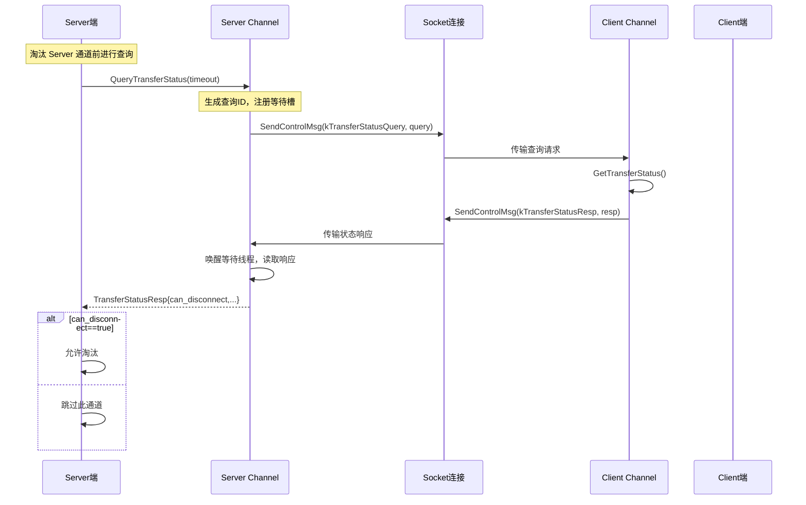

# AdxlInnerEngine Connect 和 Disconnect 时序图

## Connect 流程时序图

## Disconnect 流程时序图

## 关键组件说明

### AdxlInnerEngine

- 对外提供 `Connect` 和 `Disconnect` 接口
- 内部委托给 `ChannelMsgHandler` 处理

### ChannelMsgHandler
- 负责TCP连接管理和消息交换
- `Connect`: 建立TCP连接，交换连接信息，创建Channel
- `Disconnect`: 发送断开消息，销毁Channel

### ChannelManager
- 管理所有Channel的生命周期
- 提供Channel的创建、获取、销毁功能
- 管理epoll事件和心跳机制

### Channel
- 封装HCCL通信资源
- 提供数据传输功能
- 管理socket连接和心跳

### SegmentTable
- 记录本地和远程内存段信息
- 用于判断传输类型（H2H, H2D, D2H, D2D）

## 连接建立的关键步骤

1. **TCP连接建立**: 客户端通过TCP连接到远程引擎
2. **信息交换**: 双方交换 `ChannelConnectInfo`（包含channel_id, comm_res, addrs等）
3. **Rank Table生成**: 根据comm_res生成rank table，确定local_rank和peer_rank
4. **Channel创建**: 创建Channel对象并初始化HCCL通信资源
5. **地址注册**: 将远程内存地址信息添加到SegmentTable
6. **Epoll注册**: 将socket添加到epoll，用于后续消息接收

## 断开连接的关键步骤

1. **停止心跳**: 停止向远程引擎发送心跳消息
2. **TCP重连**: 重新建立TCP连接用于发送断开消息
3. **消息通知**: 发送 `ChannelDisconnectInfo` 通知远程引擎
4. **资源清理**: 
   - 从epoll移除socket
   - 销毁Channel并清理HCCL资源
   - 从ChannelManager中移除Channel
5. **状态确认**: 接收远程引擎的状态确认消息

## 引入 Expire 机制后的 Connect 流程时序图（含 MsgHandlerPlugin）

## Expire 淘汰流程详细时序图（含 MsgHandlerPlugin 在断链阶段）

## Server 端查询 Client 端传输状态时序图（控制消息路径说明）

