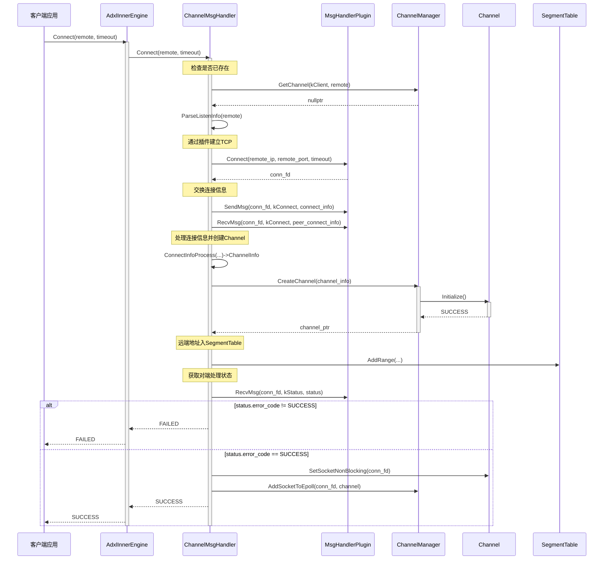
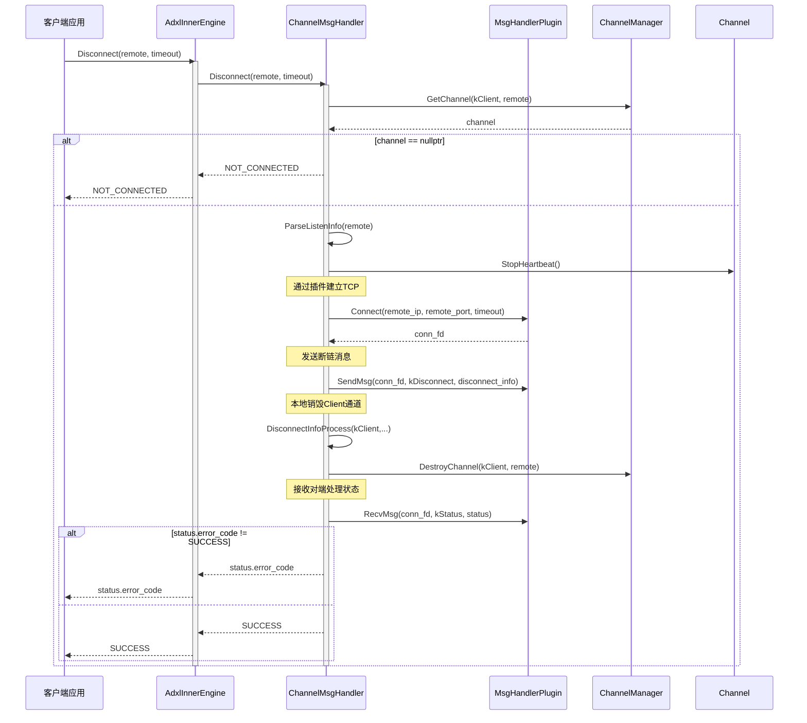
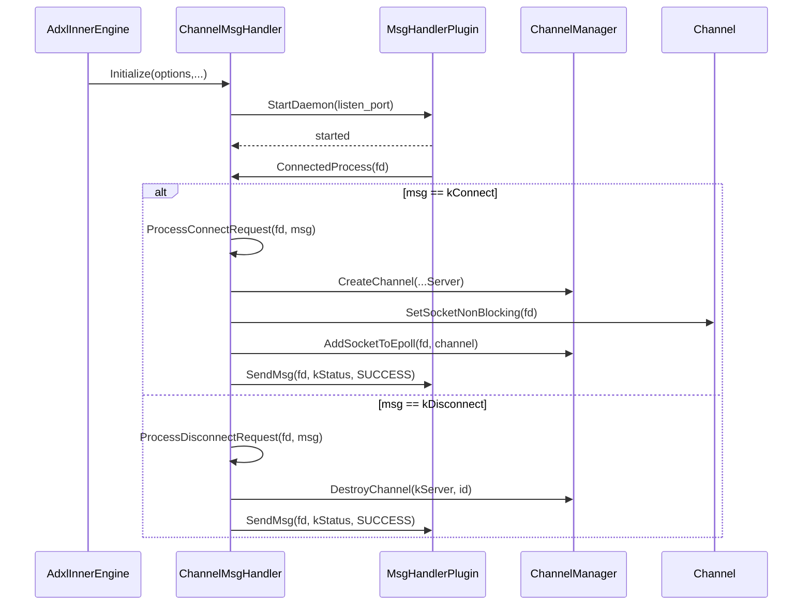
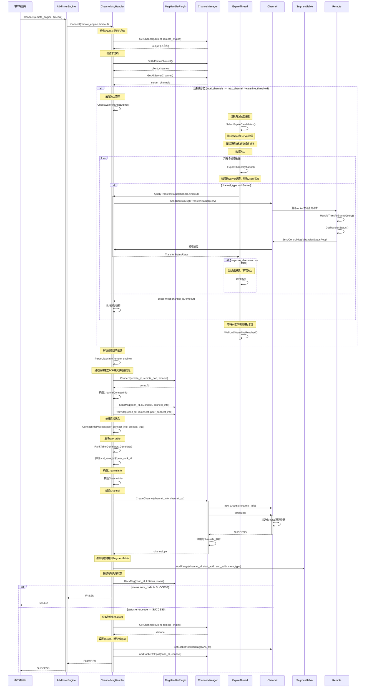
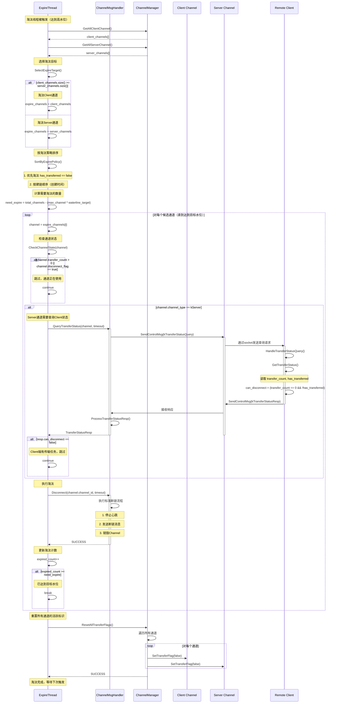
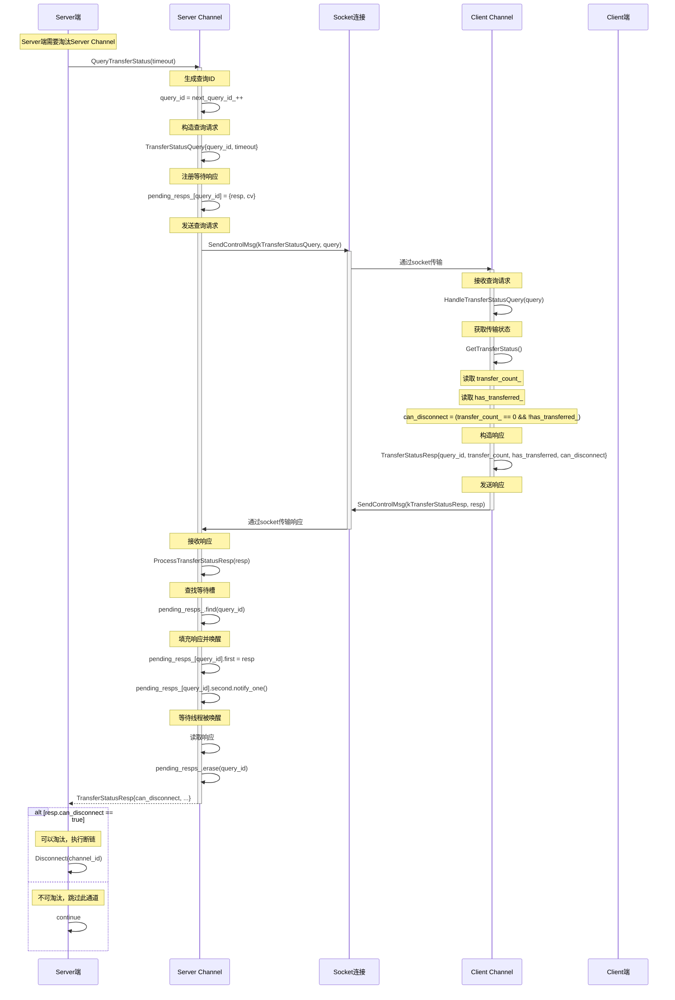
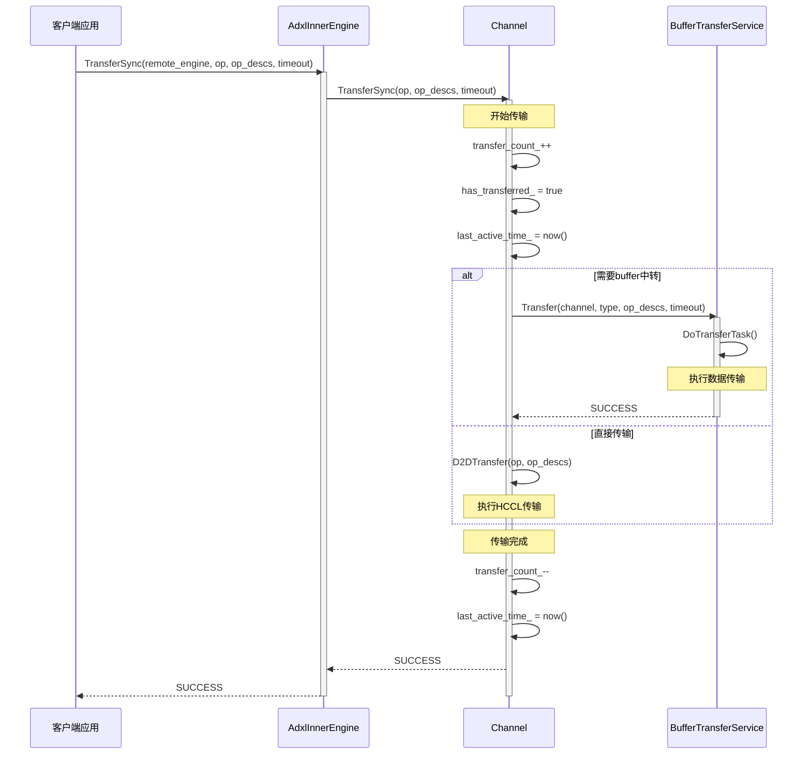

# AdxlInnerEngine Connect 和 Disconnect 时序图

## Connect 流程时序图（显式包含 MsgHandlerPlugin）

## Disconnect 流程时序图（显式包含 MsgHandlerPlugin）

## 守护与被动处理（StartDaemon / ConnectedProcess）

## 关键组件说明

### AdxlInnerEngine

- 对外提供 `Connect` 和 `Disconnect` 接口
- 内部委托给 `ChannelMsgHandler` 处理

### ChannelMsgHandler
- 负责TCP连接管理和消息交换
- `Connect`: 建立TCP连接，交换连接信息，创建Channel
- `Disconnect`: 发送断开消息，销毁Channel

### ChannelManager
- 管理所有Channel的生命周期
- 提供Channel的创建、获取、销毁功能
- 管理epoll事件和心跳机制

### Channel
- 封装HCCL通信资源
- 提供数据传输功能
- 管理socket连接和心跳

### SegmentTable
- 记录本地和远程内存段信息
- 用于判断传输类型（H2H, H2D, D2H, D2D）

## 连接建立的关键步骤

1. **TCP连接建立**: 客户端通过TCP连接到远程引擎
2. **信息交换**: 双方交换 `ChannelConnectInfo`（包含channel_id, comm_res, addrs等）
3. **Rank Table生成**: 根据comm_res生成rank table，确定local_rank和peer_rank
4. **Channel创建**: 创建Channel对象并初始化HCCL通信资源
5. **地址注册**: 将远程内存地址信息添加到SegmentTable
6. **Epoll注册**: 将socket添加到epoll，用于后续消息接收

## 断开连接的关键步骤

1. **停止心跳**: 停止向远程引擎发送心跳消息
2. **TCP重连**: 重新建立TCP连接用于发送断开消息
3. **消息通知**: 发送 `ChannelDisconnectInfo` 通知远程引擎
4. **资源清理**: 
   - 从epoll移除socket
   - 销毁Channel并清理HCCL资源
   - 从ChannelManager中移除Channel
5. **状态确认**: 接收远程引擎的状态确认消息

---

## 引入 Expire 机制后的 Connect 流程时序图

## Expire 淘汰流程详细时序图

## Server 端查询 Client 端传输状态时序图

## 传输状态更新时序图（TransferSync 时）

## Expire 机制关键组件说明

### ChannelMsgHandler 新增功能

- **水位线管理**: 
  - `max_channel`: 最大通道数上限
  - `waterline_threshold`: 高水位阈值（如 0.9，表示达到 max_channel * 0.9 时触发淘汰）
  - `waterline_target`: 目标水位（如 0.8，表示淘汰到 max_channel * 0.8）

- **淘汰线程**: 
  - `ExpireThread`: 独立线程，监听水位线并执行淘汰
  - `CheckWaterlineAndExpire()`: 检查水位并触发淘汰
  - `SelectExpireCandidates()`: 选择淘汰候选通道
  - `QueryTransferStatus()`: 查询对端传输状态（用于Server通道）

### Channel 新增状态字段

- `transfer_count_`: 原子变量，当前在途传输任务数
- `disconnect_flag_`: 原子变量，是否正在断链
- `has_transferred_`: bool变量，本轮是否发生过数据传输
- `last_active_time_`: 最近活跃时间戳

### 淘汰策略

1. **选择淘汰目标**: 
   - 比较Client和Server通道数量
   - 谁多淘汰谁，一样多优先淘汰Client

2. **排序规则**:
   - 第一优先级: `has_transferred == false` 的通道优先
   - 第二优先级: 按建链顺序（创建时间）排序

3. **保护机制**:
   - `transfer_count > 0`: 正在传输，不可淘汰
   - `disconnect_flag == true`: 正在断链，跳过
   - Server通道需查询Client状态，`can_disconnect == false` 时跳过

4. **状态重置**:
   - 每轮淘汰完成后，所有通道的 `has_transferred` 重置为 `false`
   - 开始新一轮的活跃度追踪

