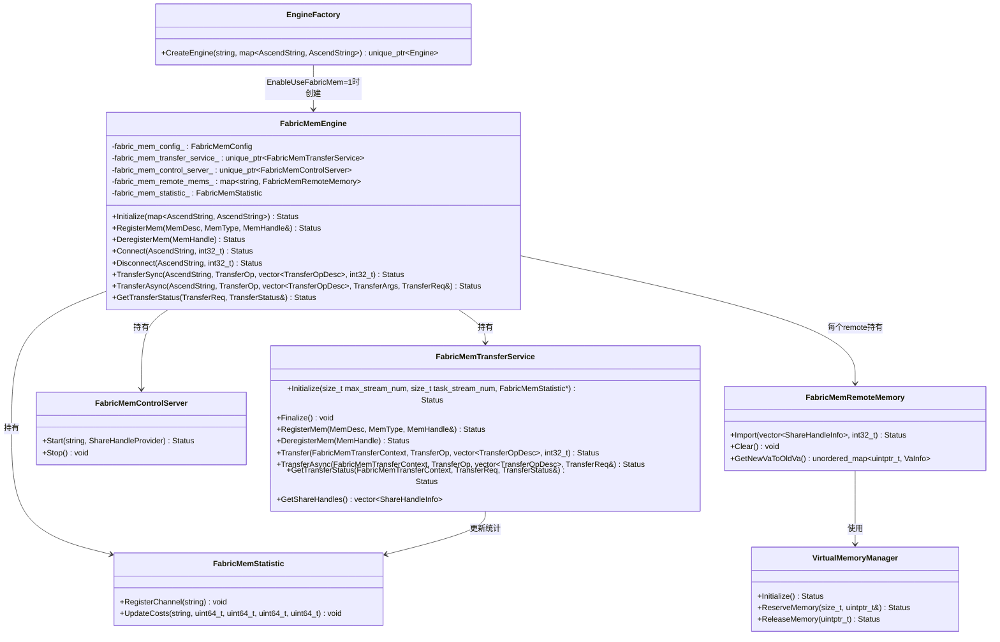
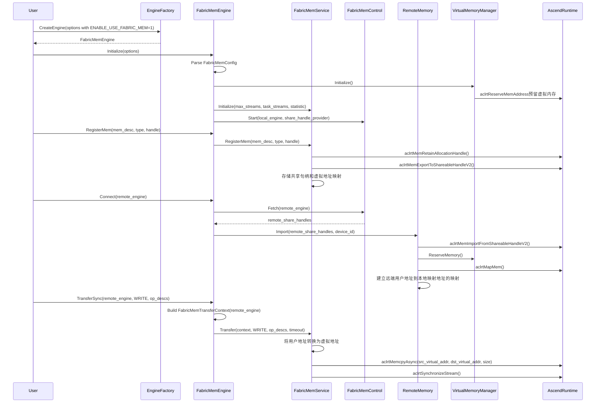

# FabricMem传输模式需求

##### 介绍

**需求的背景**：
1. 随着大语言模型(LLM)推理规模的扩大，KV Cache规模越来越大，Mooncake store等分布式DRAM缓存池场景对NPU到DRAM(D2RH)传输性能提出了更高要求。
2. A3服务器提供FabricMemory技术，支持超节点内DRAM内存统一编址，能够利用HCCS链路进行D2RH/RH2D传输。
3. 其他模式的限制与劣势：
   * 底层调用HCCL接口的HCCS传输模式不支持D2RH传输。
   * 中转模式在A3上会占用HBM带宽，对模型推理影响较大。

##### 输入&输出

**使用时的输入介绍**：
1. **配置选项**：通过`OPTION_ENABLE_USE_FABRIC_MEM`选项启用FabricMem模式，值为"1"表示启用。
2. **内存描述**：注册内存时使用`MemDesc`结构体，包含内存地址和长度。
3. **传输操作**：传输时使用`TransferOp`枚举(READ/WRITE)描述方向，使用`TransferOpDesc`描述传输地址。

**使用example**：
```cpp
// 初始化HIXL引擎，启用FabricMem模式
Hixl engine1;
std::map<AscendString, AscendString> options1;
options1[OPTION_ENABLE_USE_FABRIC_MEM] = "1";
engine1.Initialize("127.0.0.1:26000", options1);

// 注册内存
std::vector<uint8_t> buffer(size, 0xAA);
hixl::MemDesc mem_desc{};
mem_desc.addr = reinterpret_cast<uintptr_t>(buffer.data());
mem_desc.len = size;
MemHandle handle = nullptr;
engine1.RegisterMem(mem_desc, MEM_HOST, handle);

// 建立连接
engine1.Connect("127.0.0.1:26001");

// 执行传输
TransferOpDesc desc{src_addr, dst_addr, size};
engine1.TransferSync("127.0.0.1:26001", WRITE, {desc});
```

**使用时传出的输出介绍**：
1. **内存句柄**：注册内存时返回`MemHandle`，用于标识已注册的内存区域。
2. **传输请求**：异步传输时返回`TransferReq`，用于异步传输状态查询。
3. **传输状态**：查询异步任务状态时返回`TransferStatus`枚举。

##### 处理

FabricMem由独立的`FabricMemEngine`承载，不再侵入`HixlEngine`、`AdxlInnerEngine`、`ChannelMsgHandler`或`Channel`。`EngineFactory`在发现`OPTION_ENABLE_USE_FABRIC_MEM=1`时创建`FabricMemEngine`，后续注册、建链、传输、统计和资源清理由`src/hixl/fabric_mem`与`src/hixl/engine/fabric_mem_engine.cc`负责。

**类图**：


**时序图**（FabricMem模式下的数据传输）：


**整个特性的处理过程介绍**：
1. **初始化阶段**：
   - 用户通过`OPTION_ENABLE_USE_FABRIC_MEM`选项启用FabricMem模式。
   - `EngineFactory`根据该选项创建`FabricMemEngine`，不进入`AdxlInnerEngine`或`HixlEngine`。
   - `FabricMemEngine`解析`FabricMemConfig`，初始化`VirtualMemoryManager`、`FabricMemTransferService`、`FabricMemControlServer`和`FabricMemStatistic`。

2. **内存注册阶段**：
   - 用户调用`RegisterMem`注册内存。
   - `FabricMemTransferService`通过`aclrtMemRetainAllocationHandle`获取物理内存句柄。
   - 使用`aclrtMemExportToShareableHandleV2`导出为Fabric可共享句柄。
   - 将共享句柄信息存储在`share_handles_`中。

   **H2H传输模式的特殊性**：
   - 对于HOST内存，FabricMem传输需要额外的转换处理。
   - HOST内存需要先通过`aclrtMemRetainAllocationHandle`获取物理内存句柄。
   - 然后使用`aclrtMemExportToShareableHandleV2`导出为共享句柄。
   - 然后进行VMM映射，将物理内存映射到虚拟地址空间。

3. **连接建立阶段**：
   - 本端`FabricMemControlClient`向对端`FabricMemControlServer`拉取`share_handles_`。
   - `FabricMemEngine`通过`FabricMemRemoteMemory`导入远程内存的共享句柄。
   - 使用`aclrtMemImportFromShareableHandleV2`导入共享句柄，映射到虚拟地址空间。
   - 建立远端用户地址到本地映射地址的映射关系，并登记到`fabric_mem_remote_mems_`。

4. **数据传输阶段**：
   - `FabricMemEngine`根据remote engine取得`FabricMemRemoteMemory`中的地址映射。
   - `FabricMemTransferService`进行用户地址和映射地址转换。
   - 从stream pool获取任务需要的流资源。
   - 使用`aclrtMemcpyAsync`执行内存拷贝操作。
   - 同步传输阻塞等待；异步传输通过EventRecord和`aclrtQueryEventStatus`跟踪状态。
   - 传输耗时、真实拷贝耗时、总字节数和op desc数量记录在`FabricMemStatistic`中。

5. **资源清理阶段**：
   - 用户调用`DeregisterMem`注销内存。
   - 释放物理内存句柄和共享句柄。
   - 连接断开或Finalize时清理远端导入映射、流、异步资源和统计通道。

##### 端到端使用流程

1. **内存申请**：
   ```cpp
   void *fabric_ptr = nullptr;
   Hixl::MallocMem(MEM_HOST, mem_size, &fabric_ptr);
   ```
   - FabricMem host内存申请由`FabricMemTransferService::MallocMem`统一封装。
   - 底层会完成虚拟地址预留、物理内存申请和映射。
   - 传输完成后通过`Hixl::FreeMem`释放。

2. **引擎初始化和内存注册**：
   - 启用FabricMem模式：`options[OPTION_ENABLE_USE_FABRIC_MEM] = "1"`。
   - 初始化Hixl。
   - 注册内存：`engine.RegisterMem(desc, MEM_HOST, handle)`或`engine.RegisterMem(desc, MEM_DEVICE, handle)`。

3. **连接建立和数据交换**：
   - 调用`Connect`方法建立连接。
   - `FabricMemEngine`会拉取并导入远端共享句柄。

4. **数据传输和验证**：
   - 执行传输：`engine.TransferSync(remote_engine, WRITE, {desc})`。
   - 验证传输结果：读取远程写入的数据并验证。

##### 关键检查点

**检查点列表**：
1. **Engine路由检查**：`OPTION_ENABLE_USE_FABRIC_MEM=1`时必须由`EngineFactory`创建`FabricMemEngine`。
2. **配置合法性检查**：`FabricMemConfig`解析`EnableUseFabricMem`、`GlobalResourceConfig`、流数量、虚拟地址容量和起始地址。
3. **内存类型检查**：在FabricMem模式下，HOST内存注册需要额外的本地导入和映射处理。
4. **传输参数检查**：验证传输描述中的地址范围是否在本端已注册或对端已导入的内存范围内。
5. **流资源管理检查**：确保流池中的流资源正确分配和释放，避免资源泄漏。
6. **异步请求状态检查**：异步传输时正确跟踪请求状态，确保状态查询的准确性。
7. **内存映射清理检查**：连接断开时正确清理`FabricMemRemoteMemory`中的导入映射关系。
8. **并发安全检查**：多线程环境下对共享数据结构的访问安全。
9. **对端异常下线**：对端异常下线时，需要清理相关资源，避免资源泄漏。

**性能关键点**：
1. **流池管理**：预创建和管理设备流，避免频繁创建销毁的开销。
2. **多流并发**：支持一次使用多条流并发处理。
3. **异步操作**：支持异步传输，允许重叠计算和通信。

**兼容性考虑**：
1. **向后兼容**：默认不启用FabricMem模式，保持与传统ADXL/HCCL路径的兼容性。
2. **统计归属**：FabricMem传输统计由`FabricMemStatistic`维护，ADXL侧`StatisticManager`只维护ADXL/HCCL路径的建链与传输统计。
