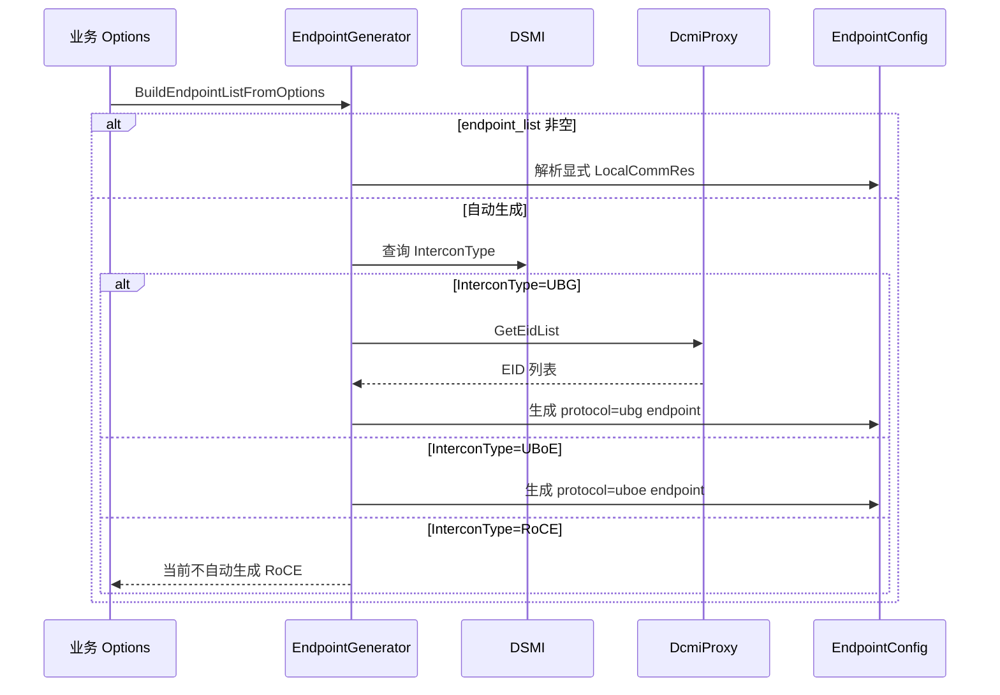
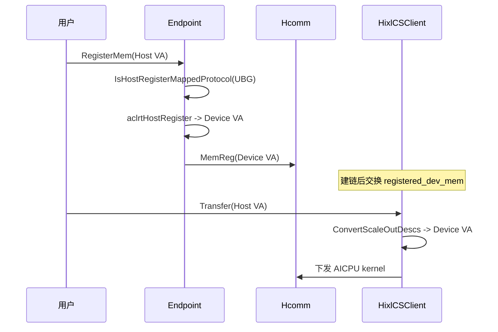
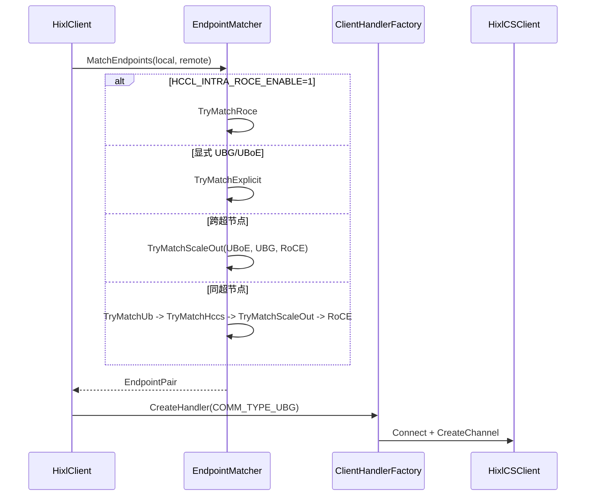

# HIXL 单边通信支持 UBG RFC

## 需求描述

PC16 液冷服务器计划发布 UBG 能力。UBG 定位为基于 UBoE 的增强协议，HIXL 侧建链、Host 内存映射、地址转换等流程大部分复用 UBoE，仅在 ScaleOut 资源标识、协议枚举和自动选链策略上扩展 UBG。

当前 HIXL 已支持 `LocalCommRes` 1.3、`GlobalResourceConfig.protocol_desc` 自动生成 UBoE endpoint，以及 UBoE Host 内存 `aclrtHostRegister` 映射与传输前 VA 转换。本需求在此基础上新增 UBG 协议支持，覆盖以下三类能力：

1. **自动获取 UBG 通信资源**：支持显式配置 `"ubg:device"`，也支持无配置时按 DSMI `InterconType` 自动探测并生成 UBoE/UBG local comm res。
2. **单边通信支持 UBG**：UBG 下 Host 内存注册、Device VA 映射、控制面同步和传输前地址翻译与 UBoE 一致。
3. **自动选取 ScaleOut 口**：按强制 RoCE、跨超节点、超节点内三张优先级表选择 UBoE/UBG/RoCE/UB/HCCS。

UBoE 与 UBG 资源标识差异：

| 协议 | `comm_id` 来源 | 地址类型 |
| ---- | -------------- | -------- |
| UBoE | `hccn_tool` 查询 Bond IP | IP |
| UBG  | DCMI/URMA `GetEidList` 查询 EID | EID |

### 假设与待确认

- **InterconType=UBG 取值**：驱动会新增 UBG 取值，具体枚举值、查询命令字和返回结构待确认。影响无配置自动生成和显式 `"ubg:device"` 校验逻辑。
- **UBG EID 可直接写入 `comm_id`**：PC16 UBG 优先复用已有 `DcmiProxy::GetEidList` 链路；需与底层确认返回 EID 是否可直接作为 UBG endpoint 的 `comm_id`，以及是否只生成单个 UBG endpoint。
- **Hcomm UBG 协议枚举**：`COMM_PROTOCOL_UBG` 枚举值和 endpoint/channel 创建语义待 Hcomm/驱动确认。影响 `ConvertToEndpointDesc` 和 CS 层 endpoint 创建。
- **UBG endpoint 匹配规则**：当前设计按 protocol 一致允许尝试建链，不要求两端 EID 相等；若驱动明确 EID 对端关系，需再补充 CS 层匹配规则。
- **RoCE 无配置自动生成**：当前明确不支持；`InterconType` 为 0/1（RoCE 类）时不自动生成 RoCE local comm res。

## 功能要点

- [ ] **UBG 通信资源自动获取**：支持 `"ubg:device"` 显式配置和无配置时 DSMI `InterconType` 自动探测；UBG 场景调用已有 DCMI/URMA EID 查询接口，将 EID 写入 local comm res 的 `comm_id`。
- [ ] **UBG 单边通信承载**：UBG 下 Host 内存注册、Device VA 映射、控制面同步和传输前地址翻译复用 UBoE 逻辑，通过统一协议能力判断扩展 UBG。
- [ ] **ScaleOut 口自动选链**：重构 `EndpointMatcher::MatchEndpoints`，实现强制 RoCE 最高优先、跨超节点 UBoE/UBG/RoCE、超节点内 UB/HCCS/UBoE/UBG/RoCE 优先级表；显式指定 UBG/UBoE 时不自动派生其他 ScaleOut 协议。

## 技术方案

### 设计思路

UBG 改造遵循“基于 UBoE 扩展、最小侵入”原则：

- **资源生成层**：在 `EndpointGenerator` 中新增 UBG 识别与默认 endpoint 生成；复用 `local_comm_res_generator_v1.cc`、`rootinfo_builder_generator_v1.cc`、`dcmi_proxy.*` 已有 DCMI EID 查询能力。
- **协议选链层**：在 `EndpointMatcher::MatchEndpoints` 中重构优先级表；Engine 层负责协议选择，CS 层 `EndpointStore::MatchEndpoint` 负责底层 endpoint 查找。
- **内存传输层**：将 UBoE 专用判断抽象为 `IsHostRegisterMappedProtocol`，初始包含 UBoE 和 UBG；`ConvertUboeDescs` 泛化为 `ConvertScaleOutDescs`。

### 自动资源获取

#### 触发条件

| 路径 | 条件 |
| ---- | ---- |
| 显式触发 | `protocol_desc` 含 `"ubg:device"`，且 `endpoint_list` 为空；`InterconType` 为 UBG；DCMI 返回有效 EID |
| 无配置探测 | 未配置 `LocalCommRes.endpoint_list` 和 `protocol_desc`；`InterconType` 为 UBG；DCMI 返回有效 EID |
| 不触发 | 显式 `endpoint_list` 非空；`InterconType` 为 RoCE 类（0/1）；DSMI/DCMI 查询失败 |

#### InterconType 取值与自动生成策略

| 取值 | 含义 | 无配置自动生成 |
| ---- | ---- | -------------- |
| 0 | RoCE over DPU | 不自动生成 |
| 1 | RoCE over CPU | 不自动生成 |
| 2 | UBoE over NPU | 生成 UBoE local comm res |
| 3 | UBoE over SWITCH | 生成 UBoE local comm res |
| 4 | UBoE over DPU | 生成 UBoE local comm res |
| 待新增 | UBG | 生成 UBG local comm res |

#### UBG endpoint 输出格式

```json
{
  "version": "1.3",
  "net_instance_id": "superpod1_1",
  "endpoint_list": [
    {
      "protocol": "ubg",
      "comm_id": "000000000000004000100000dfdf1672",
      "placement": "device"
    }
  ]
}
```

#### EID 获取调用链

```text
BuildEndpointListFromOptions / GenerateLocalCommRes
  -> DSMI 查询 InterconType
  -> InterconType=UBG 时:
       DcmiProxy::LoadDcmi()
       DcmiProxy::GetLogicIdFromPhyId(npu_id, &logic_id)
       DcmiProxy::GetUrmaDeviceCnt(logic_id, &dev_cnt)
       DcmiProxy::GetEidList(logic_id, urma_dev_index, eid_list, &eid_cnt)
       -> 校验 EID 非空且格式合法
       -> 写入 protocol=ubg, comm_id=EID, placement=device
```

#### 核心流程



#### 关键伪代码

```cpp
Status GenDefaultUbgEndpointConfig(EndpointConfig &cfg) {
  if (GetScaleOutInterconType() != INTERCON_TYPE_UBG) {
    return FAILED;  // 显式 ubg:device 但非 UBG，返回可诊断错误
  }
  std::string eid;
  HIXL_CHK_STATUS_RET(GetUbgEidFromDcmi(eid), "get ubg eid failed");
  cfg.protocol = kProtocolUbg;
  cfg.comm_id = eid;
  cfg.placement = kPlacementDevice;
  return SUCCESS;
}
```

### UBG 单边通信与 Host 内存映射

UBG 复用 UBoE Host 内存处理流程，仅扩展协议判断：

```cpp
bool IsHostRegisterMappedProtocol(CommProtocol protocol) {
  static const std::unordered_set<CommProtocol> kMappedProtocols = {
      COMM_PROTOCOL_UBOE,
      COMM_PROTOCOL_UBG,
  };
  return kMappedProtocols.count(protocol) > 0;
}
```

处理流程：

1. `Endpoint::RegisterMem`：Host 内存先 `aclrtHostRegister` 映射 Device VA，再注册给 Hcomm。
2. 建链后通过控制面交换 Host VA 与 Device VA 映射关系（`HixlMemDesc::registered_dev_mem`）。
3. 传输前 `ConvertScaleOutDescs` 将 Host VA 转为 Device VA 后下发 AICPU kernel。



`ConvertToEndpointDesc` 对 UBG 的处理：

- `protocol=ubg` 映射为 `COMM_PROTOCOL_UBG`
- `comm_id` 通过 `ParseEidAddress` 解析为 `COMM_ADDR_TYPE_EID`

### ScaleOut 自动选链

#### 优先级表

| 场景 | 优先级 |
| ---- | ------ |
| 指定 RoCE 环境（`HCCL_INTRA_ROCE_ENABLE=1`） | RoCE |
| 超节点间 | UBoE → UBG → RoCE |
| 超节点内 | UB → HCCS → UBoE → UBG → RoCE |

规则说明：

- 强制 RoCE 最高优先；开启后即使显式配置 UBG/UBoE 也只尝试 RoCE。
- 显式指定 UBG/UBoE 时只创建指定协议链路，失败不自动降级。
- ScaleOut 匹配要求本端与对端 `protocol` 一致（均为 `ubg` 或均为 `uboe`）。
- UB-CTP/UB-TP 匹配：先校验对端 `dst_eid == 本端 comm_id`，再降级校验 `plane`。

#### 选链时序



### 模块改造点

| 模块 | 文件 | 改造内容 |
| ---- | ---- | -------- |
| 类型与常量 | `hixl_inner_types.h`、`hcomm_res_defs.h`、`client_handler.h` | 新增 `kProtocolUbg`、`COMM_PROTOCOL_UBG`、`COMM_TYPE_UBG` |
| 资源生成 | `endpoint_generator.cc` | 新增 `IsUbgProtocolDescEnabled`、`GenDefaultUbgEndpointConfig`、InterconType wrapper、DCMI EID 查询接入 |
| 协议选链 | `endpoint_matcher.cc` | 重构优先级表，新增 UBG/ScaleOut 匹配 |
| Endpoint 转换 | `endpoint_generator.cc` | `ConvertToEndpointDesc` 支持 `protocol=ubg`，EID 解析 |
| Host 内存 | `endpoint.cc`、`hixl_cs_client.cc` | `IsHostRegisterMappedProtocol`、`ConvertScaleOutDescs` |
| CS 匹配 | `endpoint_store.cc` | UBG 初期按 protocol 一致匹配 |

## 相关文档

- 详细设计：[HIXL单边通信支持UBG需求开发设计.md](./HIXL单边通信支持UBG需求开发设计.md)
- 前置学习：[HIXL_UBG需求前置学习指南.html](./HIXL_UBG需求前置学习指南.html)
- 接口文档（UBG 合入后需同步）：
  - `docs/cpp/HIXL数据结构.md`：补充 `protocol=ubg` 字段说明
  - `docs/cpp/HIXL接口.md`：补充 UBG 相关 option 说明
- 不涉及公开 API 签名变更；配置格式扩展 `protocol_desc` 和 `endpoint_list.protocol`。

## 测试方案

### 单元测试

| 测试场景 | 测试功能 | 验证点 |
| -------- | -------- | ------ |
| `ubg:device` 解析 | `EndpointGenerator` 识别 UBG 协议描述 | 正确识别并触发 UBG 生成路径 |
| InterconType=UBG mock | DSMI 返回 UBG 时自动生成 | 生成 `protocol=ubg`、`comm_id=EID`、`placement=device` |
| InterconType=UBoE mock | 无配置时 UBoE 自动生成 | 生成 UBoE endpoint，不生成 UBG |
| InterconType=RoCE mock | 无配置时 RoCE 不自动生成 | 不生成 RoCE endpoint |
| 显式 `ubg:device` 但 InterconType 非 UBG | 配置与设备不一致 | 返回可诊断错误 |
| DCMI EID mock | EID 查询与写入 | EID 正确写入 `comm_id`，格式为 32 位十六进制 |
| DCMI 加载失败 / EID 为空 | 异常路径 | 返回失败，日志包含 device id 和错误原因 |
| 强制 RoCE 优先级 | `HCCL_INTRA_ROCE_ENABLE=1` | 即使显式 UBG/UBoE 也只匹配 RoCE |
| 跨超节点优先级 | UBoE/UBG/RoCE 遍历 | 按 UBoE → UBG → RoCE 顺序匹配 |
| 超节点内优先级 | UB/HCCS/UBoE/UBG/RoCE 遍历 | 按 UB → HCCS → UBoE → UBG → RoCE 顺序匹配 |
| 显式 UBG 不派生 | 显式指定 UBG | 不自动创建 UBoE/RoCE 链路 |
| ScaleOut 协议不一致 | 本端 UBG、对端 UBoE | 建链失败 |
| UBG Host VA 转换 | `ConvertScaleOutDescs` | Host VA 正确转为 Device VA |
| UBG endpoint 转换 | `ConvertToEndpointDesc` | EID 解析为 `COMM_ADDR_TYPE_EID` |
| CS 层 UBG 匹配 | `EndpointStore::MatchEndpoint` | protocol 一致时允许建链 |

建议测试文件：

- `tests/cpp/hixl/engine/endpoint_generator_ut.cc`
- 建议新增 `tests/cpp/hixl/engine/hixl_engine_ubg_unittest.cc`
- `tests/cpp/hixl/engine/hixl_engine_unittest.cc`
- `tests/cpp/hixl/cs/hixl_mem_store_uboe_ut.cc` 或新增 UBG 测试
- `tests/cpp/hixl/cs/endpoint_store_ut.cc`

### 系统/集成测试

| 测试场景 | 测试功能 | 验证点 |
| -------- | -------- | ------ |
| UBG 自动资源 + 建链 | 无配置或 `ubg:device` 端到端 | 自动获取 EID、生成 endpoint、建 UBG 链路 |
| UBG Host 内存传输 | Client/Server UBG + Host mem | 注册 Device VA、传输前 VA 翻译、读写成功 |
| 显式 UBG 建链 | 显式 `LocalCommRes` 仅 UBG | 仅创建 UBG 链路 |
| 强制 RoCE 覆盖 | UBG + RoCE 共存 + `HCCL_INTRA_ROCE_ENABLE=1` | 仅创建 RoCE 链路 |

上机集成测试依赖真实 PC16 硬件、DSMI `InterconType=UBG` 和 Hcomm UBG 协议能力，UT/ST mock 无法完全替代，需在驱动和 Hcomm 能力就绪后补充。

## 验收标准

- [ ] 配置 `"ubg:device"` 且 `InterconType=UBG`、DCMI 返回有效 EID 时，自动生成 `protocol=ubg`、`comm_id=<eid>`、`placement=device` endpoint。
- [ ] 无配置且 `InterconType=UBG` 时，自动探测并生成 UBG local comm res。
- [ ] 无配置且 `InterconType` 为 UBoE 取值（2/3/4）时，自动生成 UBoE local comm res。
- [ ] 无配置且 `InterconType` 为 RoCE 取值（0/1）时，不自动生成 RoCE local comm res。
- [ ] 显式配置 `"ubg:device"` 但 `InterconType` 非 UBG 时，返回可诊断错误。
- [ ] DCMI 查询失败或 EID 为空时，返回可诊断错误。
- [ ] 显式配置 UBG/UBoE 时，不创建其他 ScaleOut 协议链路。
- [ ] 本端与对端 ScaleOut 协议不一致时建链失败。
- [ ] `HCCL_INTRA_ROCE_ENABLE=1` 时，即使显式配置 UBG/UBoE 也只尝试 RoCE。
- [ ] UBG Host 内存完成 `aclrtHostRegister`、Hcomm Device VA 注册、控制面映射同步和传输前地址翻译。
- [ ] 原有 UBoE、RoCE、HCCS、UB 测试不回退。

## 备注

### 依赖

| 依赖方 | 内容 | 状态 |
| ------ | ---- | ---- |
| 驱动 DSMI | `InterconType` 新增 UBG 取值及查询接口 | 待驱动开发 |
| 驱动 DCMI | `GetEidList` 返回 UBG 可用 EID | 已有接口，待 UBG 场景验证 |
| Hcomm | `COMM_PROTOCOL_UBG` 枚举及 endpoint/channel 创建 | 待确认 |
| PC16 硬件 | UBG ScaleOut 物理链路 | 目标产品形态 |

### 风险

| 风险 | 影响 | 应对 |
| ---- | ---- | ---- |
| `InterconType=UBG` 未落地 | 无法判断 ScaleOut 口类型 | wrapper + mock 先完成 HIXL 侧开发 |
| DCMI EID 与 UBG 建链要求不一致 | 生成错误 endpoint | 与底层确认 `GetEidList` 返回 EID 可直接用于 UBG |
| Hcomm 未提供 UBG 协议枚举 | 无法创建 UBG channel | 确认 ABI 后再合入 |
| 显式协议与强制 RoCE 冲突 | 用户预期不一致 | 文档固化：强制 RoCE 最高优先 |

### 里程碑

1. 接入类型与配置解析：UBG 常量、`protocol_desc` 解析。
2. 接入 InterconType 与 DCMI EID 查询：ScaleOut 类型判断、EID 获取与校验。
3. 支持 endpoint 转换与建链匹配：UBG `EndpointDesc`、ScaleOut 匹配、优先级表。
4. 泛化 Host 映射传输：UBG 接入 `IsHostRegisterMappedProtocol` 和 `ConvertScaleOutDescs`。
5. 补齐测试与文档。
