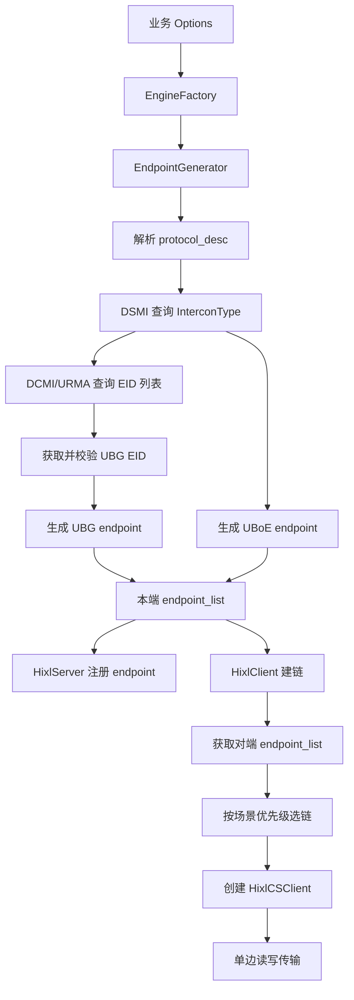
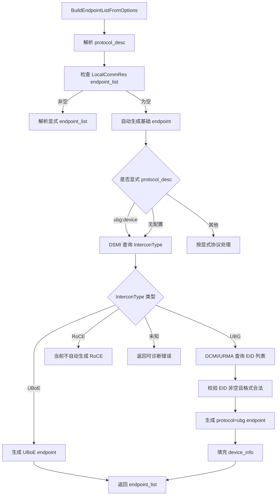
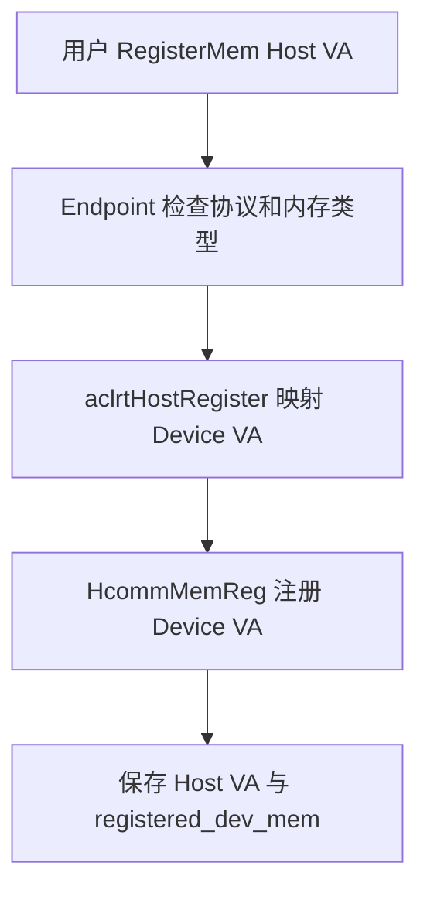
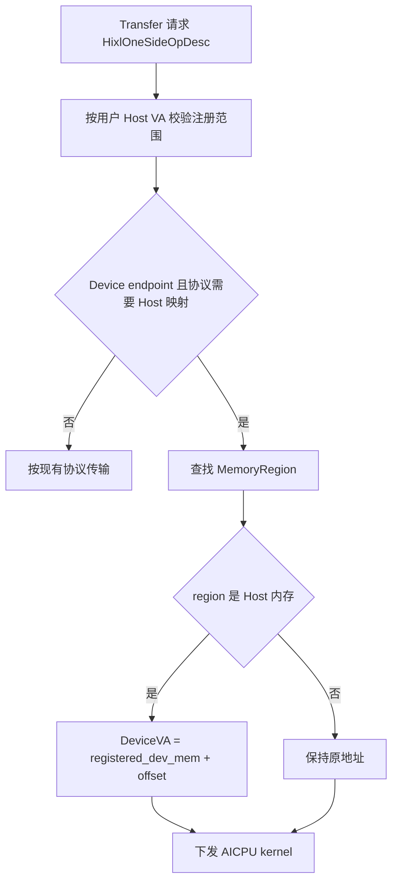
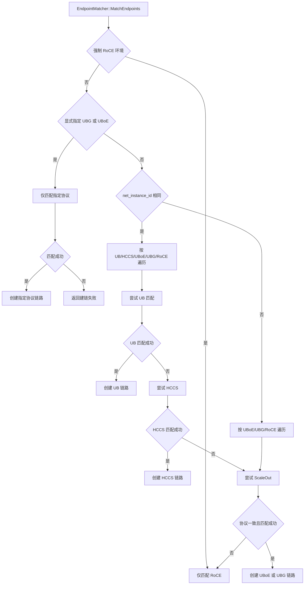

# HIXL 单边通信支持 UBG 需求开发设计

## 1. 文档目的

本文面向 HIXL 单边通信新增 UBG 能力进行需求分析与开发设计，覆盖以下三项需求：

- HIXL 单边通信可自动获取 UBG 通信资源。
- HIXL 单边通信支持 UBG 协议承载。
- HIXL 通信资源支持自动选取 ScaleOut 口。

本文基于仓库现有 HIXL 1.3 `endpoint_list`、UBoE 自动资源获取、Client/Server endpoint 协商、Host VA 到 Device VA 映射和 AICPU kernel 下发链路进行扩展设计。

## 2. 背景与术语

HIXL 当前已支持通过 `LocalCommRes` 1.3 格式描述本地通信资源，并已有自动生成 local comm res 的基础能力。PC16 液冷服务器发布 UBG 时，能力定位为基于 UBoE 增强，建链、内存映射和地址转换大部分复用 UBoE。UBoE 与 UBG 都属于 ScaleOut 口通信资源，但资源标识和获取方式不同：

- UBoE：判断 ScaleOut 口配置为 UBoE 后，使用 `hccn_tool` 获取 Bond 聚合设备 IP，endpoint 的 `comm_id` 填 IP。
- UBG：判断 ScaleOut 口配置为 UBG 后，通过 DCMI/URMA 设备接口获取 EID，endpoint 的 `comm_id` 填获取到的 UBG EID。
- 未显式配置 local comm res 或协议描述时，HIXL 按 DSMI `InterconType` 自动识别 UBoE/UBG 并生成对应配置；当前不支持无配置场景自动生成 RoCE。

术语说明：


| 术语                  | 说明                                                 |
| ------------------- | -------------------------------------------------- |
| UB                  | 超节点内通信承载类型，包含 `ub_ctp`、`ub_tp` endpoint。           |
| UBoE                | ScaleOut 口协议，当前 endpoint 使用 IP 作为 `comm_id`。       |
| UBG                 | ScaleOut 口协议，本需求新增，endpoint 使用 EID 作为 `comm_id`。   |
| RoCE                | RDMA over Converged Ethernet，跨超节点或强制 RoCE 场景的默认承载。 |
| HCCS                | 当前超节点内已有 fallback 通信协议。                            |
| ScaleOut 口          | 超节点间扩展通信口，可配置为 UBoE 或 UBG。                         |
| `net_instance_id`   | 超节点归属标识，用于判断本端与对端是否属于同一超节点。                        |
| EID                 | UBG/UB 类协议使用的通信实体标识。                               |
| DSMI `InterconType` | 驱动 DSMI 接口返回的超节点互联类型字段，需新增或识别 UBG 取值。              |
| DCMI / URMA device  | 用于查询 URMA 设备数量和 EID 列表的设备管理接口链路。                   |
| Mesh EID            | 非 PG EID，按 die/port 归属筛选后用于本地 mesh 维度通信资源。         |
| CLOS PG EID         | PG EID，用于跨 Group 通信的全局 EID 候选。                     |
| PC16 液冷服务器          | 本需求 UBG 发布的目标产品形态，UBG 能力按 UBoE 扩展方式实现。              |


## 3. 现有实现基础

当前 HIXL 已具备以下基础能力，可作为 UBG 的扩展点：


| 能力                        | 现有位置                                                                                                    | 现状                                                                                         |
| ------------------------- | ------------------------------------------------------------------------------------------------------- | ------------------------------------------------------------------------------------------ |
| 通信资源配置入口                  | `include/hixl/hixl_types.h`                                                                             | 已定义 `GlobalResourceConfig`、`LocalCommRes` option key。                                      |
| endpoint 内部结构             | `src/hixl/common/hixl_inner_types.h`                                                                    | `EndpointConfig` 已包含 `protocol`、`comm_id`、`placement`、`plane`、`dst_eid`、`net_instance_id`。 |
| `protocol_desc` 解析        | `src/hixl/common/hixl_utils.cc`                                                                         | 已解析 `comm_resource_config.protocol_desc` 数组。                                               |
| UBoE endpoint 自动生成        | `src/hixl/engine/endpoint_generator.cc`                                                                 | 已支持 `uboe:device` 触发默认 UBoE endpoint 生成。                                                   |
| local comm res 自动生成与 EID 查询 | `src/hixl/engine/local_comm_res_generator_v1.cc`、`src/hixl/engine/rootinfo_builder_generator_v1.cc`、`src/hixl/proxy/dcmi_proxy.*` | 已有自动生成 local comm res 的需求实现，且已有 DCMI/URMA EID 查询、字符串转换和筛选基础能力。 |
| Client/Server endpoint 交换 | `src/hixl/engine/hixl_client.cc`、`src/hixl/engine/endpoint_matcher.cc`、`src/hixl/engine/hixl_server.cc` | Client 通过 socket 获取 Server endpoint 列表后，调用 `EndpointMatcher::MatchEndpoints` 执行协议匹配。       |
| Host 内存映射注册               | `src/hixl/cs/endpoint.cc`                                                                               | UBoE + Host 内存注册时先 `aclrtHostRegister`，再用 Device VA 注册给 Hcomm。                             |
| Host VA 转 Device VA       | `src/hixl/cs/hixl_cs_client.cc`                                                                         | UBoE Device endpoint 传输前调用 `ConvertUboeDescs`，内部通过 `ConvertHostRegisterAddr` 完成地址转换。       |


当前需要重点调整的差异点：

- UBoE 默认资源获取使用 Bond IP；UBG 默认资源获取调用已有 DCMI/URMA EID 查询接口，并将获取到的 EID 放入 local comm res / endpoint 的 `comm_id`。
- UBoE 当前匹配逻辑只要求双方存在 `protocol=uboe`；UBG 自动选链先按 ScaleOut 协议一致性匹配，EID 用于 Hcomm endpoint/channel 创建。
- 当前 `EndpointMatcher::MatchEndpoints` 流程为：先尝试 UBoE；若 `MustUseRoce()` 命中则强制 RoCE 并返回；否则正常路径尝试 UB，UB 失败后尝试 HCCS。RoCE 是强制条件分支，不是普通同超节点路径的第二优先级。本需求需要按指定 RoCE 环境、超节点间、超节点内三张优先级表重构。

## 4. 总体需求

### 4.1 自动获取 UBG 通信资源

HIXL 需支持两类 UBG 通信资源自动获取入口。

显式配置入口：

```json
{
  "comm_resource_config.protocol_desc": ["ubg:device"]
}
```

无配置自动探测入口：

- 用户未显式配置 `LocalCommRes.endpoint_list`。
- 用户未显式配置 `comm_resource_config.protocol_desc`。
- HIXL 通过 DSMI 查询 `InterconType`，根据返回值自动生成 UBoE 或 UBG local comm res。
- 当前 RoCE 不参与无配置自动生成；即 `InterconType` 返回 RoCE 类取值时，不自动生成 RoCE local comm res。

当显式配置启用 UBG，或无配置探测到 ScaleOut 口为 UBG，HIXL 自动生成本地通信资源：

```json
{
  "version": "1.3",
  "net_instance_id": "superpod1_1",
  "endpoint_list": [
    {
      "protocol": "ubg",
      "comm_id": "000000000000004000100000dfdf1672",
      "placement": "device"
    }
  ]
}
```
 
生成规则：

- `protocol` 固定为 `"ubg"`。
- `comm_id` 填调用已有 DCMI/URMA EID 查询接口获取到的 UBG EID。
- `placement` 固定为 `"device"`。
- `net_instance_id` 继续用于超节点归属判定，自动生成规则复用现有 A2/A3 逻辑；如平台不支持自动生成 `net_instance_id`，应返回可诊断错误，避免默认值导致超节点归属误判。

### 4.2 单边通信支持 UBG

UBG 下 Host 内存注册和传输需满足：

- Host 内存注册时先通过 `aclrtHostRegister(..., ACL_HOST_REGISTER_MAPPED)` 映射到 Device 侧。
- 将映射后的 Device VA 注册给 Hcomm。
- Client/Server 建链时，通过控制面交换 Host VA 与 Device VA 的对应关系。
- Client 读写远端 Server Host 内存时，基于 Host VA 与 Device VA 映射关系做地址翻译，再下发 AICPU kernel。

该能力应复用当前 UBoE 设计，仅新增 UBG 协议判断。建议将 UBoE 专用判断抽象为“协议是否需要 Host 注册映射”的统一能力判断，后续新增协议时只需加入协议集合或能力表。

### 4.3 自动选取 ScaleOut 口

协议选择需满足以下规则：

- 指定 RoCE 环境优先级最高，命中后只创建 RoCE 链路。
- 未指定 RoCE 环境时，业务 Option 显式指定 UBG/UBoE 协议，则仅创建对应协议类型链路，不自动派生其他协议链路。
- 基于 `net_instance_id` 完成超节点归属判定。
- 本端与对端同一超节点时，优先采用 UB 协议，走超节点内建链逻辑。
- 跨超节点时，按 UBoE、UBG、RoCE 优先级遍历；开启环境变量 `HCCL_INTRA_ROCE_ENABLE=1` 或业务显式指定 RoCE 时，直接创建 RoCE 链路。
- UB-CTP/UB-TP 匹配先校验对端 endpoint `dst_eid` 与本端 endpoint `comm_id`，再降级校验 `plane`。
- 当业务 Option 未显式配置 UBG/UBoE，且 UB-CTP/UB-TP 本地规则匹配失败时，如果 ScaleOut 口已配置 UBG/UBoE，则启用 ScaleOut 口发起建链，并校验本端与对端 endpoint 的 ScaleOut 口协议类型一致。

优先级表：


| 场景         | 优先级                           |
| ---------- | ----------------------------- |
| 指定 RoCE 环境 | RoCE                          |
| 超节点间       | UBoE / UBG / RoCE             |
| 超节点内       | UB / HCCS / UBoE / UBG / RoCE |


说明：

- “指定 RoCE 环境”指 `HCCL_INTRA_ROCE_ENABLE=1` 或明确要求强制 RoCE 的业务配置。
- `HCCL_INTRA_ROCE_ENABLE=1` 优先级最高；开启后即使业务显式指定 UBG/UBoE，也只尝试创建 RoCE 链路。
- 未开启强制 RoCE 时，显式指定 UBG/UBoE 属于业务强约束，不参与自动派生；若指定协议无法建链，应返回失败而不是自动降级到其他 ScaleOut 协议。

## 5. 配置与接口设计

### 5.1 `GlobalResourceConfig`

新增协议描述：


| 配置项                                  | 类型    | 说明                                                |
| ------------------------------------ | ----- | ------------------------------------------------- |
| `comm_resource_config.protocol_desc` | 字符串数组 | 支持新增 `"ubg:device"`，表示自动获取本地 UBG Device endpoint。 |


示例：

```json
{
  "comm_resource_config.protocol_desc": ["ubg:device"]
}
```

兼容策略：

- 保留已有 `"uboe:device"` 行为。
- 业务不会同时配置 `"uboe:device"` 和 `"ubg:device"`；若后续发现同时配置，建议按非法配置处理并返回可诊断错误，避免自动资源语义不明确。
- 若配置了 `LocalCommRes` 且 `endpoint_list` 非空，应以显式 `endpoint_list` 为准，不再追加自动 UBG/UBoE endpoint。

### 5.2 `LocalCommRes` 1.3 endpoint

`endpoint_list[].protocol` 新增支持 `"ubg"`。


| 字段                | UBG 填写规则                                              |
| ----------------- | ----------------------------------------------------- |
| `protocol`        | 必选，固定 `"ubg"`。                                        |
| `comm_id`         | 必选，填 UBG EID，例如 `"000000000000004000100000dfdf1672"`。 |
| `placement`       | 必选，固定 `"device"`。                                     |
| `plane`           | 可选，UBG 默认不依赖；若驱动或拓扑要求区分平面，可后续扩展。                      |
| `dst_eid`         | 可选，UBG 默认不依赖；UB-CTP/UB-TP 仍按既有含义使用。                   |
| `net_instance_id` | 必选，位于 JSON 顶层，用于超节点归属判定。                              |


### 5.3 ScaleOut 类型判断与 EID 获取接口

UBG 自动资源获取包含两类外部接口能力：

- ScaleOut 口协议类型判断：用于确认当前设备 ScaleOut 口配置为 UBoE 还是 UBG。
- EID 获取：通过已有 DCMI/URMA 设备接口获取当前 NPU 对应的 EID 列表，并将获取到的 EID 放入 UBG local comm res。现有代码已具备 EID 字符串转换、byte6 解析、Mesh/CLOS PG 筛选能力；PC16 UBG 按 UBoE 增强方式实现，优先复用已有查询与解析链路。

ScaleOut 口协议类型判断可通过 DSMI 类接口完成：

```cpp
int dsmi_get_device_info(unsigned int device_id,
                         DSMI_MAIN_CMD main_cmd,
                         unsigned int sub_cmd,
                         void *buf,
                         unsigned int *size);
```

接口约束：

- 通过 DSMI 查询 `InterconType` 字段，驱动会新增 UBG 取值。
- 查询结果有效代表物理链路可用。
- 当 `InterconType` 为 UBG 取值时，进入 DCMI/URMA EID 获取流程，并将 EID 写入 UBG endpoint 的 `comm_id`。
- 当 `InterconType` 为 UBoE 取值时，保持现有 UBoE 路径，查询 Bond IP。
- 当前无配置自动生成只覆盖 UBoE/UBG；`InterconType` 为 RoCE 类取值时，不自动生成 RoCE local comm res。
- 当 DSMI 调用失败或返回类型未知时，自动资源获取失败并输出包含 device id、sub command、返回码的错误日志。

当前已知 `InterconType` 取值含义如下，UBG 取值待驱动新增：

| 取值 | 含义 | HIXL 无配置自动生成策略 |
| ---- | ---- | ---------------------- |
| 0 | RoCE over DPU | 当前不自动生成 RoCE |
| 1 | RoCE over CPU | 当前不自动生成 RoCE |
| 2 | UBoE over NPU，David 直连出 UBoE | 生成 UBoE local comm res |
| 3 | UBoE over SWITCH，Host 网卡出 RoCE | 生成 UBoE local comm res |
| 4 | UBoE over DPU | 生成 UBoE local comm res |
| 待新增 | UBG | 生成 UBG local comm res |

DCMI/URMA EID 获取调用链建议：

```text
GenerateLocalCommRes
  -> BuildNpuRootinfos(related_npu_ids)
  -> for each npu_id:
       BuildNpuRootInfo(npu_id, is_server, root_info)
         -> GetUrmaDeviceList(npu_id)
         -> LoadUrmaDevicesFromDcmi(npu_id)
              -> DcmiProxy::LoadDcmi()
              -> DcmiProxy::GetLogicIdFromPhyId(npu_id, &logic_id)
              -> DcmiProxy::GetUrmaDeviceCnt(logic_id, &dev_cnt)
              -> for each urma_dev_index:
                   DcmiProxy::GetEidList(logic_id, urma_dev_index, eid_list, &eid_cnt)
```

DCMI 接口职责：


| 接口                                                                    | 功能              | 参数说明                           |
| --------------------------------------------------------------------- | --------------- | ------------------------------ |
| `DcmiProxy::LoadDcmi()`                                               | 加载 `libdcmi.so` | 通过 `dlopen` 动态加载。              |
| `DcmiProxy::GetLogicIdFromPhyId(phy_id, &logic_id)`                   | 根据物理 ID 获取逻辑 ID | 输入物理 NPU ID，输出逻辑 ID。           |
| `DcmiProxy::GetUrmaDeviceCnt(logic_id, &dev_cnt)`                     | 获取 URMA 设备数量    | 输入逻辑 ID，输出 URMA 设备数量。          |
| `DcmiProxy::GetEidList(logic_id, urma_dev_index, eid_list, &eid_cnt)` | 获取 EID 列表       | 输入逻辑 ID 和 URMA 设备索引，输出 EID 数组。 |


DCMI 返回的 EID 原始格式为 16 字节：

```cpp
union DcmiUrmaEid {
  unsigned char raw[16];
  struct {
    unsigned long subnet_prefix;
    unsigned long interface_id;
  } in6;
};

struct DcmiUrmaEidInfo {
  DcmiUrmaEid eid;
  unsigned int eid_index;
};
```

EID 字符串格式：

- 将 16 字节 `raw` 按原始字节序转为 32 位十六进制字符串。
- 不包含 `:` 分隔符。
- 示例：`0000:0000:007f:0200:0010:0000:df00:9001` 转为 `00000000007f020000100000df009001`。

现有 EID 解析与筛选规则：

- 读取 EID 第 6 字节，即字符串索引 `10-11` 对应的字节。
- 高半字节 bit2 表示 `die_id`：`die_id = (high_nibble & 0x4) ? 1 : 0`。
- 高半字节为 `0x3` 或 `0x7` 时表示 PG EID。
- 低半字节表示端口号 `port`。
- Mesh EID：非 PG EID，且 `die_id == mesh_die_id`。Pod 场景 0-3 组使用 die0，4-7 组使用 die1；Server 场景固定 die1。
- CLOS PG EID：PG EID，用于跨 Group 通信的全局 EID。

`BuildNpuRootInfo` 可输出如下结构：

```cpp
struct NpuRootInfo {
  std::map<std::string, std::string> port_to_eid; // "die/port" -> Mesh EID
  std::vector<ClosPgEid> clos_pg_eids;            // CLOS PG EID 列表
};
```

注意：上述 `port_to_eid` 和 `clos_pg_eids` 当前由 `local_comm_res_generator_v1.cc` 用于生成 `protocol=ub-ctp` 的 endpoint。PC16 UBG 的自动 local comm res 生成应复用已有 `DcmiProxy`、`GetEidList`、EID 字符串转换和 `ParseEidByte6` 等基础能力；若直接复用 `CollectMeshPorts` / `CollectClosPgEids` 的筛选结果，需要保证其产出的 EID 与底层 UBG 建链要求一致。

## 6. 总体架构




## 7. 资源自动获取设计

### 7.1 触发条件

触发 UBG 自动资源获取有两条路径：

显式触发：

- `GlobalResourceConfig` 中包含 `"ubg:device"`。
- 未配置 `LocalCommRes`，或配置了 `LocalCommRes` 但 `endpoint_list` 为空。
- 当前设备 ScaleOut `InterconType` 有效且类型为 UBG。
- DCMI/URMA 能获取非空 EID 列表。

无配置自动探测触发：

- 未配置 `LocalCommRes.endpoint_list`。
- 未配置 `comm_resource_config.protocol_desc`。
- DSMI `InterconType` 返回 UBG 取值。
- DCMI/URMA 能获取非空 EID 列表。

不触发条件：

- 用户显式提供非空 `endpoint_list`。
- 未显式配置 `"ubg:device"` 且无配置自动探测未命中 UBG。
- DSMI `InterconType` 返回 RoCE 类取值；当前不做 RoCE 无配置自动生成。
- 当前引擎不是 HIXL 后端，或 option 校验失败。

### 7.2 生成流程




建议新增封装：


| 函数                                      | 责任                                      |
| --------------------------------------- | --------------------------------------- |
| `IsUbgProtocolDescEnabled`              | 判断 `protocol_desc` 是否包含 `"ubg:device"`。 |
| `IsScaleOutProtocolDescEnabled`         | 泛化判断是否启用 UBoE/UBG 这类 ScaleOut 协议。       |
| `GetScaleOutInterconType`               | 调 DSMI 查询 ScaleOut 口互联类型。               |
| `LoadUrmaDevicesFromDcmi` / `GetUbgEid` | 复用现有 DCMI/URMA EID 查询、字符串转换和 byte6 解析能力，获取 UBG endpoint 所需 EID。 |
| `GenDefaultUbgEndpointConfig`           | 生成 `protocol=ubg` 的 `EndpointConfig`。   |


### 7.3 与 UBoE 的关系

UBoE 与 UBG 的自动获取路径应共用触发框架，但资源查询逻辑保持独立：


| 协议   | `InterconType` | `comm_id` 来源                                   | endpoint 地址类型 |
| ---- | -------------- | ---------------------------------------------- | ------------- |
| UBoE | UBOE           | `hccn_tool -g -ip -i <phy_id> -d bond<phy_id>` | IP            |
| UBG  | UBG            | DCMI/URMA 查询 EID                                 | EID           |


如果 `protocol_desc` 配置 `"ubg:device"`，但 DSMI 返回 UBoE，应返回失败并提示 ScaleOut 口配置与业务期望不一致。`protocol_desc` 不考虑同时配置 UBoE 和 UBG 的业务场景；若出现该配置，按非法配置处理。

## 8. UBG 单边通信设计

### 8.1 Host 内存注册

当前 UBoE 注册流程如下：




UBG 应复用该流程，将判断条件从 `protocol == UBOE && mem.type == HOST` 泛化为：

- endpoint 为 Device placement。
- protocol 属于需要 Host 映射的 ScaleOut 协议集合，初始包含 UBoE、UBG。
- 注册内存类型为 Host。

建议新增辅助函数：

```cpp
bool IsHostRegisterMappedProtocol(CommProtocol protocol);
```

其语义为：该协议下 Host 内存需要先映射为 Device VA 后再注册给 Hcomm。实现上建议使用协议能力集合或映射表，避免后续代码中反复写 `protocol == UBOE || protocol == UBG`：

```cpp
bool IsHostRegisterMappedProtocol(CommProtocol protocol)
{
    static const std::unordered_set<CommProtocol> kMappedProtocols = {
        COMM_PROTOCOL_UBOE,
        COMM_PROTOCOL_UBG,
    };
    return kMappedProtocols.count(protocol) > 0;
}
```

后续如果有新 ScaleOut 协议也需要 Host 映射，只需加入该集合，不再修改注册、内存同步和传输转换各处判断。

### 8.2 映射关系同步

Client/Server 建链后需要同步远端内存信息。现有 `HixlMemDesc::registered_dev_mem` 可承载 Host VA 映射后的 Device VA。UBG 可复用该字段：

- `mem.addr` 保持用户 Host VA。
- `registered_dev_mem` 保存 `aclrtHostRegister` 后的 Device VA。
- 控制面 JSON 序列化/反序列化继续携带该字段。
- `HixlMemStore` 记录 server/client 两侧内存区域时，保存 `is_host_mem` 与 `register_dev_addr`。

### 8.3 传输地址翻译




地址翻译规则：

```text
offset = user_addr - region.addr
device_addr = region.register_dev_addr + offset
```

地址字段含义：

- 当前 master 的 CS 层传输使用 `HixlOneSideOpDesc`，包含 `remote_buf`、`local_buf` 和长度。
- `ConvertUboeDescs` 不再按 `is_get` 区分 src/dst，而是固定将 `remote_buf` 按 Server 区域转换，将 `local_buf` 按 Client 区域转换。
- UBG 泛化后应保持该语义：转换远端 Host 内存时查 Server regions，转换本端 Host 内存时查 Client regions。

建议将 `ConvertUboeDescs` 泛化命名为 `ConvertScaleOutDescs`，并复用 `IsHostRegisterMappedProtocol` 或同类能力判断，避免 UBG 复用时语义不清。

## 9. 自动选链设计

HIXL 建链包含两层匹配，需要分别改造：

- Engine 层：`HixlClient` 获取对端 `EndpointConfig` 后调用 `EndpointMatcher::MatchEndpoints` 执行协议选择，生成 `HandlerCreateArgs::EndpointPair` 并决定创建 `DIRECT` 或 `UB` handler。
- CS 层：`HixlCSClient` 在创建 channel 前向 Server 发送 `MatchEndpointReq`，Server 侧 `EndpointStore::MatchEndpoint` 基于底层 `EndpointDesc` 查找已创建 endpoint。

UBG 需要同时覆盖这两层：Engine 层负责 UBG/UBoE/RoCE/UB/HCCS 的优先级选择，CS 层负责 `EndpointDesc` 的协议与地址字段匹配。

### 9.1 输入与判断条件

协议选择输入：

- 本端 `endpoint_list`。
- 对端 `endpoint_list`。
- 本端和对端 `net_instance_id`。
- `HCCL_INTRA_ROCE_ENABLE` 环境变量。
- 业务是否显式指定 UBG/UBoE。

关键判断：


| 判断项         | 规则                                                           |
| ----------- | ------------------------------------------------------------ |
| 强制 RoCE     | `HCCL_INTRA_ROCE_ENABLE=1` 或业务显式要求 RoCE。                     |
| 同超节点        | 本端 `net_instance_id` 与对端 `net_instance_id` 一致。               |
| 跨超节点        | 本端 `net_instance_id` 与对端 `net_instance_id` 不一致。              |
| 显式 ScaleOut | 业务通过 `LocalCommRes` 或 `protocol_desc` 明确指定 UBG/UBoE。         |
| ScaleOut 一致 | 本端和对端 ScaleOut endpoint 的 `protocol` 一致，均为 `ubg` 或均为 `uboe`。 |


### 9.2 决策流程




### 9.3 显式协议规则

显式指定 UBG/UBoE 时：

- 若 `HCCL_INTRA_ROCE_ENABLE=1`，强制 RoCE 优先，显式 UBG/UBoE 不生效。
- 只创建对应协议链路。
- 不自动补充另一种 ScaleOut 协议。
- 不自动降级为 RoCE/HCCS/UB，除非业务配置明确允许 fallback。
- 本端与对端协议不一致时失败，例如本端 `ubg`、对端 `uboe`。

显式来源建议定义为：

- `LocalCommRes.endpoint_list` 中只包含或明确包含目标 ScaleOut protocol。
- `GlobalResourceConfig.protocol_desc` 中只有 `"ubg:device"` 或只有 `"uboe:device"`。

`protocol_desc` 不考虑同时包含 UBG/UBoE 的业务场景；若出现该配置，建议直接返回参数错误。

### 9.4 UB-CTP/UB-TP 匹配规则

UB 匹配需按两级规则进行：

1. 精确 EID 规则：对端 endpoint `dst_eid` 与本端 endpoint `comm_id` 一致时，允许建链。
2. 平面降级规则：若 EID 规则无法匹配，则对端 endpoint `plane` 与本端 endpoint `plane` 一致时，允许建链。

建议将当前 `MatchKey::Matches` 的“任一方 `dst_eid` 为空则忽略”语义拆分为两个显式阶段，便于日志和测试覆盖：

- `TryMatchUbByDstEid`
- `TryMatchUbByPlane`

拆分时需保持现有通配语义：当 `dst_eid` 为空时，仍允许按 `plane` 和 `placement` 降级匹配，避免破坏已有 UB 端点配置。

### 9.5 ScaleOut 匹配规则

ScaleOut 匹配包含 UBoE 与 UBG：

- 双方 endpoint protocol 必须一致。
- UBoE endpoint 地址类型为 IP，可沿用当前 IP 转换逻辑。
- UBG endpoint 地址类型为 EID，应使用 EID 解析逻辑填充 `EndpointDesc.commAddr`，供 Hcomm endpoint/channel 创建使用。
- HIXL 层 UBG 自动选链先按 protocol 一致判断是否允许尝试建链；是否需要基于 EID 关系做进一步匹配，依赖驱动/拓扑语义确认。
- 如果协议一致但地址解析失败，返回参数错误。
- 如果协议不一致，记录本端和对端 protocol 后返回匹配失败。

建议新增：

```cpp
Status TryMatchScaleOutEndpoints(const std::vector<EndpointConfig> &local_endpoint_list,
                                 const std::vector<EndpointConfig> &remote_endpoint_list,
                                 const std::vector<std::string> &protocol_priority);
```

其中 `protocol_priority` 可按场景传入 `{"uboe", "ubg"}`。

## 10. 模块改造点

### 10.1 类型与常量


| 文件                                      | 改造                                         |
| --------------------------------------- | ------------------------------------------ |
| `src/hixl/common/hixl_inner_types.h`    | 新增 `kProtocolUbg = "ubg"`。                 |
| `src/hixl/proxy/hcomm/hcomm_res_defs.h` | 新增 `COMM_PROTOCOL_UBG`，具体枚举值需与 Hcomm/驱动确认。 |
| `src/hixl/engine/client_handler.h`      | 新增 `CommType::COMM_TYPE_UBG`。              |


### 10.2 Engine 选择

当前 `EngineFactory::UseUboe` 只识别 `"uboe:device"`。需泛化为 ScaleOut 协议检测：

- `UseScaleOutProtocol(options)`：识别 `"uboe:device"`、`"ubg:device"`。
- 任一 ScaleOut 协议启用时使用 `HixlEngine`。

### 10.3 endpoint 生成

`EndpointGenerator` 需扩展：

- 解析 `ubg:device`。
- 自动生成 UBG endpoint。
- DSMI 查询 `InterconType`，DCMI/URMA 查询并校验 EID。
- `ConvertToEndpointDesc` 支持 `protocol=ubg`。
- `FillDeviceInfoIfNeeded` 对 UBG Device endpoint 生效。

UBG `EndpointDesc` 转换建议：

- `protocol=ubg` 映射为 `COMM_PROTOCOL_UBG`。
- `comm_id` 按 EID 解析，复用或抽象现有 `ParseEidAddress`。
- UBG 的 `EndpointDesc.commAddr.type` 应设置为 `COMM_ADDR_TYPE_EID`，与 `ub_ctp` / `ub_tp` 使用 EID 地址的语义保持一致。
- `placement=device` 时填充物理 device 信息。

### 10.4 Client 协议匹配

`EndpointMatcher::MatchEndpoints` 建议重构为：

```text
1. 若强制 RoCE，调用 RoCE 匹配。
2. 解析显式协议约束。
3. 若显式指定 UBG/UBoE，调用指定协议匹配，失败即返回。
4. 若跨超节点，按 UBoE、UBG、RoCE 匹配。
5. 若同超节点，按 UB、HCCS、UBoE、UBG、RoCE 匹配。
```

同时保留：

- 创建 CS Client 后的内存注册回放。
- RDMA tc/sl 传递。
- `ClientHandlerFactory` 会根据匹配结果创建 `DIRECT` 或 `UB` handler；新增 UBG 后需确保 handler 类型和 `CommType::COMM_TYPE_UBG` 能正确传递。

### 10.5 CS 层内存注册与传输

需要把 UBoE 专用逻辑泛化：


| 当前逻辑                                                 | 改造后                                                                                             |
| ---------------------------------------------------- | ----------------------------------------------------------------------------------------------- |
| `endpoint.protocol == COMM_PROTOCOL_UBOE`            | `IsHostRegisterMappedProtocol(endpoint.protocol)`                                               |
| `ConvertUboeDescs`                                   | `ConvertScaleOutDescs`                                                                          |
| `COMM_TYPE_UBOE` / `CommTypeToString` / handler 参数传递 | 增加 `COMM_TYPE_UBG`，并确保 `EndpointMatcher` 到 `ClientHandlerFactory` 的匹配结果可正确创建 UBG direct handler |


### 10.6 EndpointStore 匹配

`EndpointStore::MatchEndpoint` 是 CS 层底层 endpoint 匹配入口。当前 `EndpointDesc` 等价比较中，HCCS、UB-CTP/UB-TP、RoCE 有协议专属地址比较，其它协议在 protocol 相同后直接匹配成功。

UBG endpoint 等价规则建议：

- 当前设计按 protocol 一致允许 UBG 尝试建链，EID 用于填充底层 `EndpointDesc.commAddr`。
- 初期可沿用当前“非 HCCS/UB/RoCE 协议按 protocol 匹配”的行为，避免错误要求两端本端 EID 相等。
- 若后续驱动明确 UBG EID 存在本端/对端映射关系，再在 `EndpointStore::MatchEndpoint` 或 `EndpointDesc` 等价比较中补充 UBG 专属匹配分支。

在驱动 EID 语义未明确前，不建议在 HIXL 层要求本端和对端 EID 相等，因为 `comm_id` 更可能表示各自本端 EID，跨端相等不一定成立。

## 11. 数据结构与兼容性

### 11.1 `EndpointConfig`

无需新增字段，UBG 可复用：

- `protocol = "ubg"`
- `comm_id = EID`
- `placement = "device"`
- `net_instance_id = 超节点标识`

### 11.2 `HixlMemDesc`

无需新增字段，继续使用：

- `mem.addr`：用户传入地址。
- `registered_dev_mem`：Host 映射后的 Device VA。

### 11.3 兼容性要求

- 已有 UBoE、RoCE、HCCS、UB endpoint JSON 继续兼容。
- 显式 `endpoint_list` 非空时，保持以用户配置为准。
- 无配置场景新增按 DSMI `InterconType` 自动生成 UBoE/UBG，RoCE 取值暂不自动生成。
- 新增 UBG 枚举值需与 Hcomm/驱动 ABI 保持一致，不能自行选择与外部不一致的值。

## 12. 异常处理与日志


| 场景                                  | 处理                                                        |
| ----------------------------------- | --------------------------------------------------------- |
| `ubg:device` 配置存在但 DSMI 不支持         | 返回失败，日志提示 DSMI 能力缺失。                                      |
| 配置 `ubg:device` 但 DSMI 返回非 UBG      | 返回失败，日志提示 ScaleOut 口协议类型与配置不一致。                           |
| DCMI 加载失败、URMA 设备数量为 0、EID 列表为空     | 返回失败，日志提示 DCMI/URMA 查询失败及 phy/logical device id。          |
| EID 为空、格式非法或无法得到 UBG 可用 EID | 返回 `PARAM_INVALID` 或 `FAILED`，日志输出 EID 原始数量、选择条件和 NPU id。 |
| 本端 UBG、对端 UBoE                      | 匹配失败，日志输出双方 protocol。                                     |
| Host register 失败                    | 返回失败，日志输出 Host VA、size、devPhyId。                          |
| Device VA 映射缺失                      | 返回失败，日志输出地址和 server/client 区域。                            |
| UB/HCCS/ScaleOut/RoCE 均匹配失败         | 返回失败，日志输出已尝试的协议列表。                                        |


## 13. 测试设计

### 13.1 单元测试


| 测试文件建议                                                   | 测试点                                                                                      |
| -------------------------------------------------------- | ---------------------------------------------------------------------------------------- |
| `tests/cpp/hixl/engine/endpoint_generator_ut.cc`         | `ubg:device` 解析、InterconType mock 返回 UBG、DCMI/URMA EID mock、EID 写入 `comm_id`、非 UBG 返回失败。 |
| 建议新增 `tests/cpp/hixl/engine/hixl_engine_ubg_unittest.cc` | UBG endpoint 初始化、显式 UBG 配置、自动 UBG 配置、混合 UBG/RoCE 配置。                                     |
| `tests/cpp/hixl/engine/hixl_engine_unittest.cc`          | 三张优先级表、显式 UBG/UBoE 不派生、跨超节点 ScaleOut 一致性校验。                                              |
| `tests/cpp/hixl/cs/hixl_mem_store_uboe_ut.cc` 或新增 UBG 测试 | UBG Host VA 到 Device VA offset 转换。                                                       |
| `tests/cpp/hixl/cs/endpoint_store_ut.cc`                 | UBG 当前按 protocol 一致允许尝试建链，EID 作为 Hcomm endpoint 创建参数；EID 关系匹配待驱动确认。                      |


### 13.2 场景测试矩阵


| 场景                 | 本端 endpoint                    | 对端 endpoint                    | 期望                         |
| ------------------ | ------------------------------ | ------------------------------ | -------------------------- |
| 自动 UBG             | `protocol_desc=["ubg:device"]` | 同左                             | 生成 UBG endpoint 并建 UBG 链路。 |
| 显式 UBG             | `LocalCommRes` 仅 UBG           | UBG                            | 仅创建 UBG。                   |
| 显式不一致              | UBG                            | UBoE                           | 建链失败。                      |
| 强制 RoCE            | UBG/RoCE                       | UBG/RoCE                       | 仅创建 RoCE。                  |
| 跨超节点 ScaleOut      | UBoE/UBG/RoCE                  | 同协议 ScaleOut/RoCE              | 按 UBoE、UBG、RoCE 顺序匹配。      |
| 超节点内 UB 成功         | UB/HCCS/UBG/RoCE               | UB/HCCS/UBG/RoCE               | 优先 UB。                     |
| 超节点内 UB 失败 HCCS 成功 | HCCS/UBG/RoCE                  | HCCS/UBG/RoCE                  | 使用 HCCS。                   |
| 超节点内 UB/HCCS 失败    | UBG/RoCE                       | UBG/RoCE                       | 使用 UBG，失败后 RoCE。           |
| Host 内存传输          | UBG Device endpoint + Host mem | UBG Device endpoint + Host mem | 注册 Device VA，传输前完成 VA 翻译。  |


### 13.3 验收标准

- 配置 `"ubg:device"` 且 InterconType 返回 UBG，DCMI/URMA 返回有效 EID 时，自动生成 `protocol=ubg`、`comm_id=<eid>`、`placement=device` endpoint。
- 显式配置 `"ubg:device"` 时，InterconType 返回非 UBG、DCMI/URMA 查询失败、EID 为空或格式非法时，返回可诊断错误。
- 显式配置 UBG/UBoE 时，不创建其他 ScaleOut 协议链路。
- 本端与对端 ScaleOut 协议不一致时建链失败。
- 指定 RoCE 环境、跨超节点、超节点内三类优先级均有 UT 覆盖。
- UBG Host 内存完成 `aclrtHostRegister`、Hcomm Device VA 注册、控制面映射同步和传输前地址翻译。
- 原有 UBoE、RoCE、HCCS、UB 测试不回退。

## 14. 风险与依赖


| 风险/依赖                                 | 影响                               | 应对                                                                         |
| ------------------------------------- | -------------------------------- | -------------------------------------------------------------------------- |
| `InterconType=UBG` 判断接口未落地            | 无法判断 ScaleOut 口是否为 UBG           | 先通过 wrapper 和 mock 完成 HIXL 侧开发，接口稳定后接入真实 DSMI/驱动能力。                        |
| DCMI/URMA EID 查询能力尚未接入 UBG 自动 endpoint 生成 | 无法自动填充 UBG `comm_id`             | 复用现有 `DcmiProxy` 和 `rootinfo_builder_generator_v1.cc` 中的 EID 查询、字符串转换和 byte6 解析逻辑，补充 DCMI 加载失败、URMA 设备数量为 0、EID 列表为空等 UBG 场景测试。 |
| DCMI 返回 EID 与 UBG 建链要求不一致      | 可能生成错误的 UBG endpoint             | PC16 UBG 按 UBoE 增强实现，优先复用已有 DCMI EID 查询链路；需与底层确认 `GetEidList` 返回的目标 EID 可直接用于 UBG `comm_id`。 |
| Hcomm 未提供 `COMM_PROTOCOL_UBG` 或枚举值未确认 | 无法创建 UBG endpoint/channel        | 与 Hcomm/驱动确认 ABI 后再合入协议枚举。                                                 |
| UBG endpoint 地址类型与现有 `CommAddr` 不兼容   | `ConvertToEndpointDesc` 无法填充 EID | 优先复用 `ParseEidAddress`，如格式不同需扩展 `CommAddr`。                                |
| 显式协议与强制 RoCE 冲突                       | 用户预期不一致                          | 文档固化规则：强制 RoCE 最高优先；`HCCL_INTRA_ROCE_ENABLE=1` 时即使显式配置 UBG/UBoE 也只尝试 RoCE。 |
| 当前 ScaleOut 自动选链先按 protocol 匹配        | 多 UBG endpoint 场景可能误匹配           | 当前按 protocol 一致允许尝试建链；若驱动明确 EID 对端关系，再补充 EID 关系匹配。                         |
| Host VA 映射只支持已注册区域                    | 子区间或远端地址处理复杂                     | 保持基于 `MemoryRegion` 的 offset 转换，补充越界和未注册区域测试。                              |


## 15. 开放问题

- ScaleOut `InterconType=UBG` 的具体取值、查询命令字和返回结构需由驱动接口确认。
- `DcmiProxy::GetEidList` 返回的 EID 是否可直接作为 UBG `comm_id`，以及是否只生成单个 UBG endpoint，需与底层确认。
- UBG 的 Hcomm 协议枚举值、endpoint 地址结构和 channel 创建语义需由 Hcomm 接口确认。
- UBG 是否要求 endpoint 匹配时校验本端/对端 EID 的对应关系，需要结合驱动提供的 EID 含义确认；当前设计不要求两端 EID 相等，仅要求 protocol 一致并将 EID 传给 Hcomm。

## 16. 里程碑建议

1. 接入类型与配置解析：新增 UBG 常量、协议描述解析、HIXL 引擎选择。
2. 接入 InterconType 与 DCMI/URMA wrapper：完成 ScaleOut 类型判断、EID 查询与校验封装，并以 mock 覆盖 UT。
3. 支持 endpoint 转换与建链匹配：补齐 UBG `EndpointDesc`、ScaleOut 匹配、优先级表。
4. 泛化 Host 映射传输：将 UBoE Host register 和 VA 转换扩展到 UBG。
5. 补齐测试与文档：覆盖自动资源、显式协议、优先级、Host 内存传输和异常路径。

