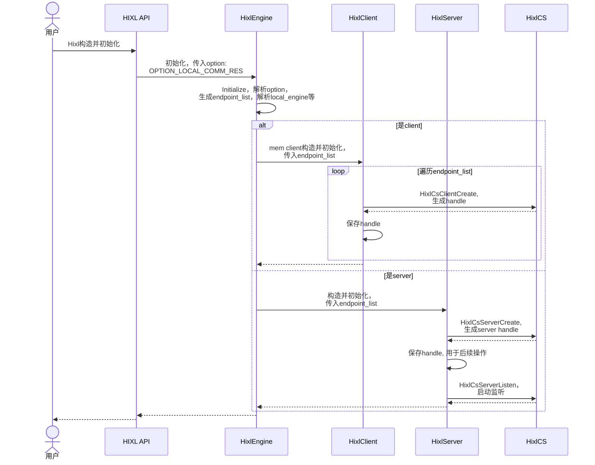
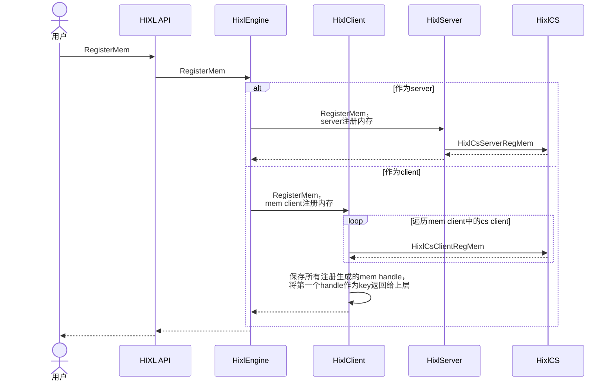
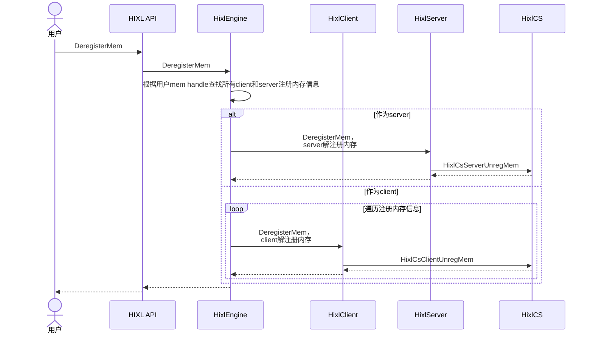
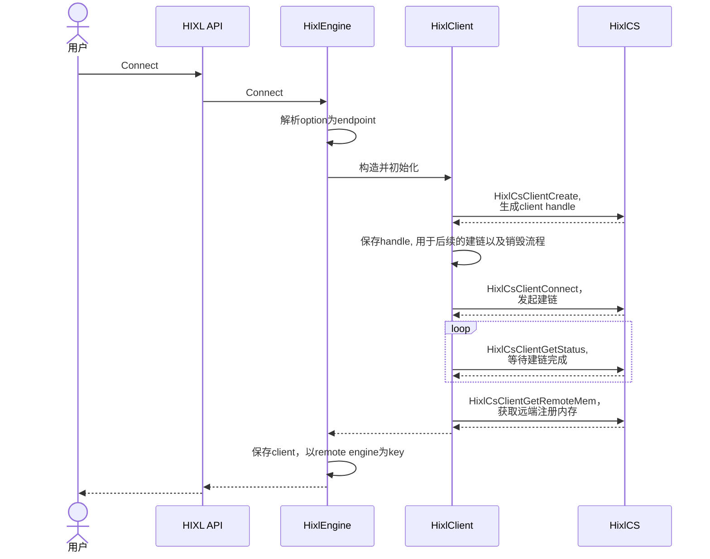
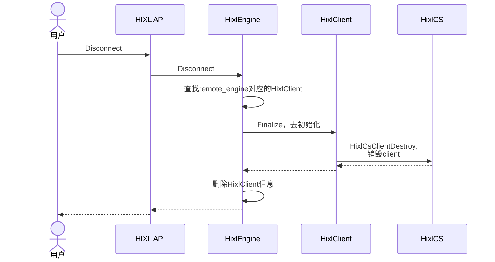
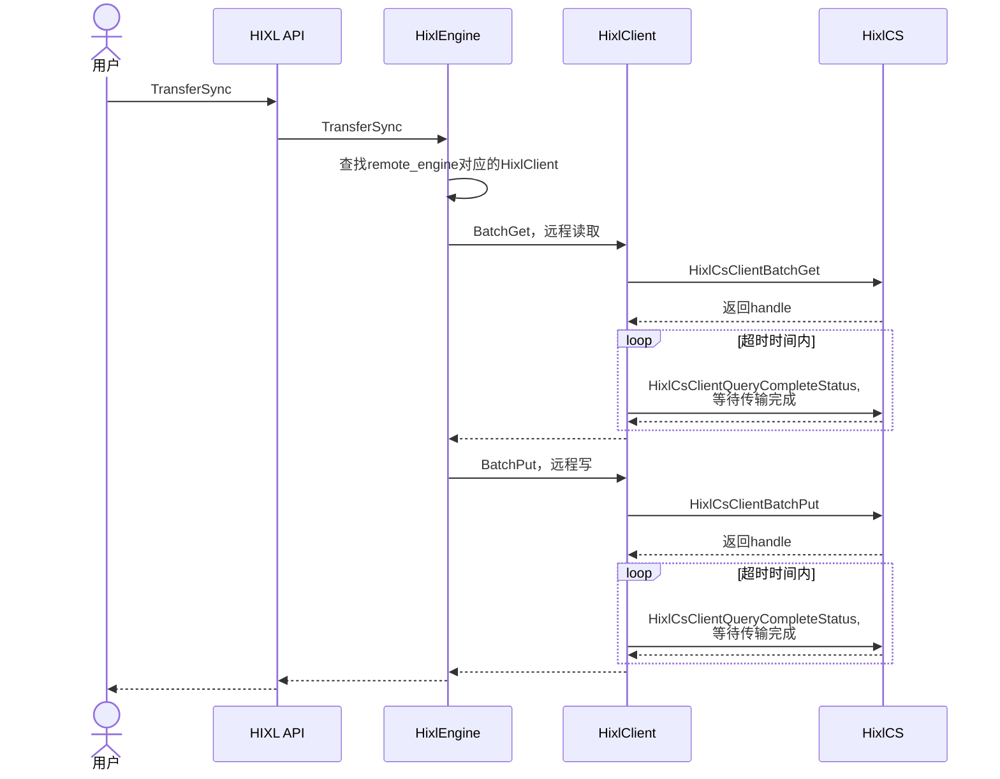
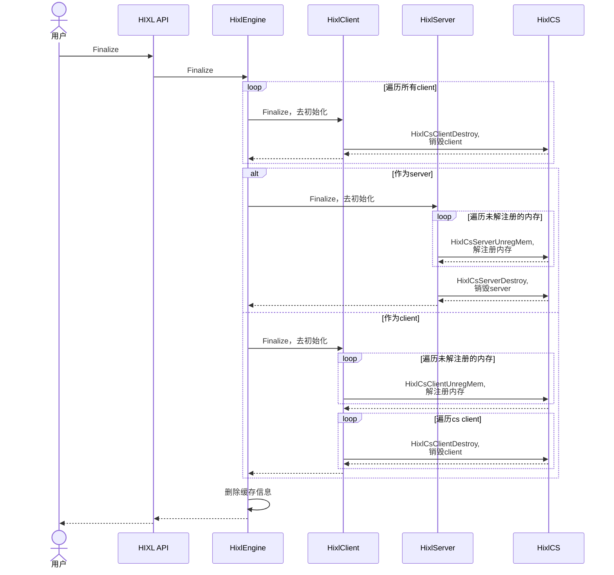

# HIXL对接HCCL单边通信库

## 需求描述
[简要描述要做什么，解决什么问题]

- 背景介绍
HCCL提供单边通信库，与集合通信库并列，共同作为通信库对外提供的基础能力。HIXL需进行对接，以支持更多的芯片类型和更多的通信能力。
- 需要做什么
适配HCCL单边通信库，支持HIXL当前接口已有能力。

## 功能要点
[ ] 支持HixlClient，提供对接HCCL单边通信API能力
```
HixlClient提供根据Endpoint列表初始化的能力
HixlClient提供内存注册、解注册的能力
HixlClient提供建链、销毁的能力
HixlClient提供数据传输的能力
```

[ ] 支持HixlServer，提供对接HCCL单边通信API能力
```
 HixlServer提供初始化、监听、销毁的能力
 HixlServer提供内存注册、解注册的能力
 ```

- [ ] 支持HixlEngine，提供对接HCCL单边通信API能力
```
 支持解析本地通信资源option, 提供HixlEngine，并兼容原生能力。
 HixlEngine支持北向对接Hixl对外接口，南向对接HixlClient和HixlServer能力
 ```

## 技术方案
[简单的技术实现思路]

**新增API和option**：
```
# option key如下，用于描述本地可以使用的通信资源信息
constexpr const char OPTION_LOCAL_COMM_RES[] = "LocalCommRes";
# option value为json格式字符串，格式如下：
std::string local_comm_res = R"(
{
  "version": "1.3",
  "net_instance_id": "superpod1_1",
  "endpoint_list": [
    {
      "protocol": "ub_ctp",
      "comm_id": "eid0-0",
      "placement": "host",
      "plane": "plane-a",
    },
    {
      "protocol": "ub_ctp",
      "comm_id": "eid0-1",
      "placement": "device",
      "dst_eid": "eid1-1",
    },
    {
      "protocol": "ub_ctp",
      "comm_id": "eid0-2",
      "placement": "device",
      "dst_eid": "eid1-2",
    },
    {
      "protocol": "ub_tp",
      "comm_id": "eid0-3",
      "placement": "device",
      "plane": "plane-a",
    },
    {
      "protocol": "roce",
      "comm_id": "ipv4/ipv6地址",
      "placement": "host" 
    }
  ]
}
)";
```

# 通信设备配置字段说明
| 字段名 | 数据类型 | 必选/可选 | 说明 | 支持值/填写规则 |
| ---- | ---- | ---- | ---- | ---- |
| version | 字符串 | 必选 | 版本号 | "1.3" |
| net_instance_id | 字符串 | 必选 | 当前超节点的唯一标识 | 每个超节点唯一即可 |
| endpoint_list | 数组 | 必选 | 可以使用的通信设备列表 | - |
| endpoint_list[].protocol | 字符串 | 必选 | 通信协议 | "roce"/"ub_ctp"/"ub_tp" |
| endpoint_list[].comm_id | 字符串 | 必选 | 通信标识 | protocol为ub_ctp/ub_tp时填${eid}；protocol为roce时填ipv4/ipv6网卡地址 |
| endpoint_list[].placement | 字符串 | 必选 | 通信设备位置 | "host"/"device" |
| endpoint_list[].plane | 字符串 | 可选 | 通信设备平面 | protocol为ub_ctp/ub_tp时，设备区分平面则填写，每个平面唯一（如"plane-a"/"plan-b"） |
| endpoint_list[].dst_eid | 字符串 | 可选 | 与当前通信设备连接的对端通信设备的${eid} | protocol为ub_ctp时，存在full-mesh直连对端则填写对端${eid} |


**调用伪码**:
```
Hixl hixl_engine1;  // client
Hixl hixl_engine2;  // server1
std::map<AscendString, AscendString> options;
std::string local_comm_res = R"(
{
  "endpoint_list": [
    {
      "protocol": "roce",
      "comm_id": "192.10.1.1",
      "placement": "device" 
    }
  ]
  "version": "1.3"
}
)";
// 初始化，以A5为例，支持roce通信
options[OPTION_LOCAL_COMM_RES] = local_comm_res.c_str();
hixl_engine1.Initialize("10.11.11.1", options);
hixl_engine2.Initialize("10.11.11.1:26002", options);

// 内存注册
hixl_engine1.RegisterMem(desc1, MEM_HOST, handle1);
hixl_engine2.RegisterMem(desc2, MEM_DEVICE, handle2);

hixl_engine1.Connect("10.11.11.1:26002");
```

**初始化流程时序图**：


- 初始化时根据option：OPTION_LOCAL_COMM_RES解析为endpoint_list；抽象基类Engine，继承类为AdxlInnerEngine以及HixlEngine，若传入当前option则构造HixlEngine，否则AdxlInnerEnine兼容之前逻辑；
- 根据local_engine端口信息解析是否为client或者server
- 初始化阶段生成的mem client，只用于提前注册内存，伴随Hixl销毁
- server在初始化阶段启动监听

**注册流程时序图**：

- 用户调用内存注册，作为server，则优先注册给server，否则注册给mem client

**解注册流程时序图**：

- 用户调用内存注册，作为server，则优先解注册server，否则解注册mem client


**建链流程时序图**：

- 其中解析option，如果指定OPTION_LOCAL_COMM_RES,解析当前endpoint_list，校验是否是初始化时endpoint_list的子集；如果未指定，则使用初始化的endpoint_list；

**断链流程时序图**：

- HixlClient维护每一条链路，销毁即为断链
- 内存解注册最终由mem client负责，断链不进行解注册动作

**传输流程时序图**：

- 需在超时时间内阻塞等待读写完成，如果未完成，返回传输超时

**销毁流程时序图**：

- Hixl去初始化进行兜底，将所有的内存解注册，并将client和server销毁

## 验收标准

- 所有接口的功能点都要覆盖到
- 所有接口的异常场景符合预期

## 备注
[其他需要说明的事项]
