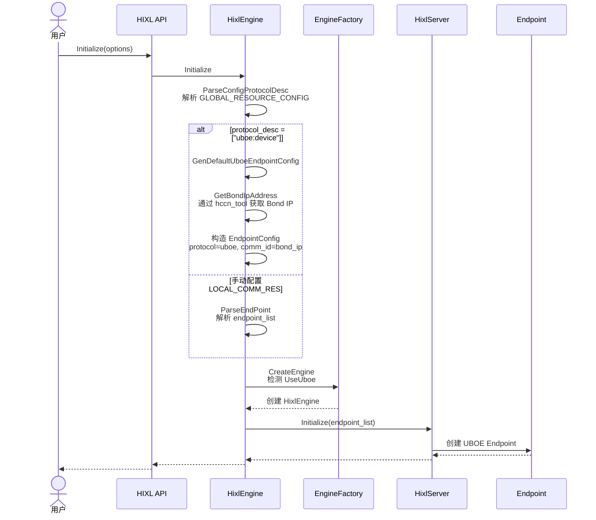
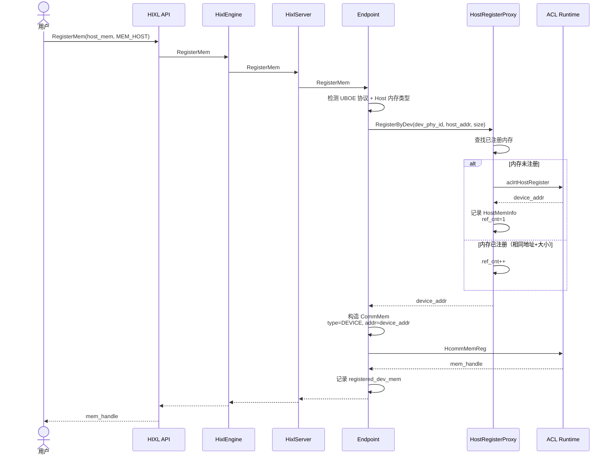
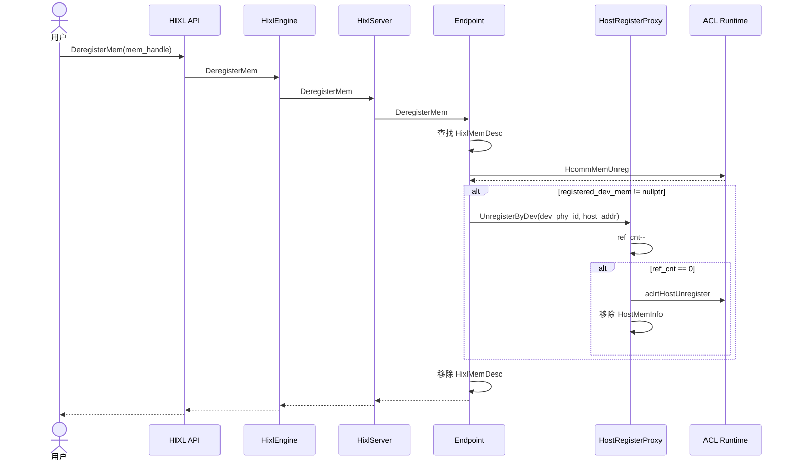
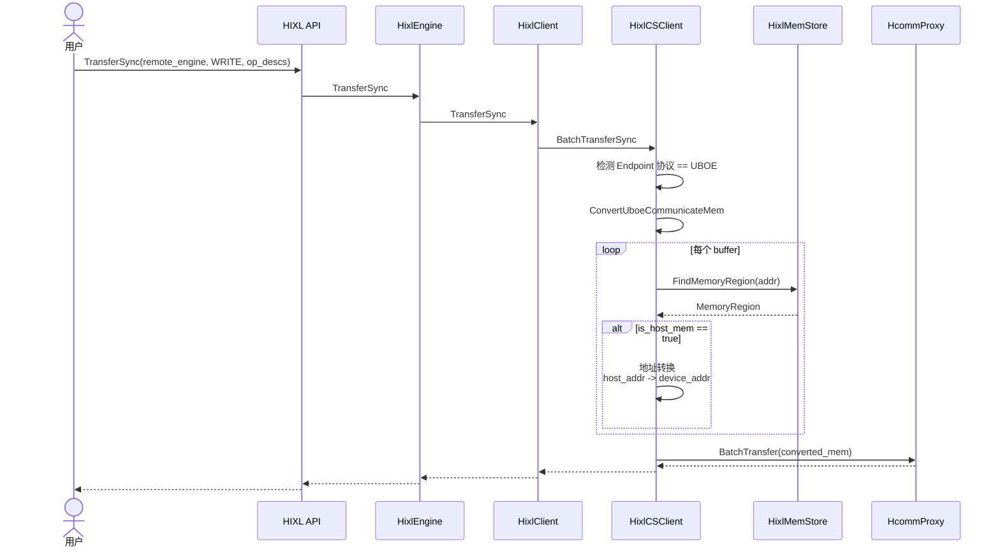

# HIXL支持UBOE协议传输

## 需求描述

- 背景介绍
UBOE（Unified Bus Over Ethernet）是华为统一总线协议的以太网实现版本，相比传统 ROCE 协议，UBOE 能够提供更低的延迟和更高的带宽利用率。HIXL 需要支持 UBOE 协议，用于分布式 AI 场景（LLM 推理 KV Cache 传输、PD 分离等）下的高性能数据传输。

- 需要做什么
1. HIXL 支持 UBOE 协议作为通信传输协议
2. 支持自动配置 UBOE endpoint 信息，简化用户配置

## 功能要点

- [x] 支持UBOE协议类型定义
```
新增协议标识 kProtocolUboe = "uboe"
新增通信类型 COMM_TYPE_UBOE
新增底层协议 COMM_PROTOCOL_UBOE = 7
```

- [x] 支持UBOE Endpoint自动配置
```
支持解析 GlobalResourceConfig option，自动生成 endpoint
支持通过 hccn_tool 自动获取 Bond IP
支持 protocol_desc 配置格式 ["uboe:device"]
```

- [x] 支持Host内存通过UBOE传输
```
新增 HostRegisterProxy，管理 Host 内存到 Device 地址的映射
支持 aclrtHostRegister/aclrtHostUnregister 调用
支持引用计数管理，避免重复映射开销
```

- [x] 支持Endpoint内存注册扩展
```
UBOE 协议下 Host 内存自动转换为 Device 地址注册
支持记录 registered_dev_mem 用于注销时清理
```

- [x] 支持UBOE场景下的地址转换
```
HixlMemStore 记录 is_host_mem 和 register_dev_addr
传输前自动进行地址转换：host_addr -> device_addr
支持连续内存区域检查
```

## 技术方案

**新增API和option**：
```
# 新增 option key
constexpr const char OPTION_GLOBAL_RESOURCE_CONFIG[] = "GlobalResourceConfig";

# option value 为 JSON 格式字符串，支持 protocol_desc 配置
std::string global_resource_config = R"(
{
  "comm_resource_config.protocol_desc": ["uboe:device"]
}
)";

# 新增协议类型
constexpr const char *kProtocolUboe = "uboe";

# Endpoint 配置格式（手动配置方式）
std::string local_comm_res = R"(
{
  "version": "1.3",
  "net_instance_id": "uboe_test_1",
  "endpoint_list": [
    {
      "protocol": "uboe",
      "comm_id": "192.168.1.100",
      "placement": "device"
    }
  ]
}
)";
```

# UBOE Endpoint 配置字段说明
| 字段名 | 数据类型 | 必选/可选 | 说明 | 支持值/填写规则 |
| ---- | ---- | ---- | ---- | ---- |
| protocol | 字符串 | 必选 | 通信协议 | "uboe" |
| comm_id | 字符串 | 必选 | Bond IP 地址 | IPv4 地址（如 192.168.1.100） |
| placement | 字符串 | 必选 | 通信设备位置 | "device"（UBOE 仅支持 device） |
| net_instance_id | 字符串 | 可选 | 网络实例标识 | 自动配置时默认为 "default_superpod1_1" |

# GlobalResourceConfig 配置字段说明
| 字段名 | 数据类型 | 必选/可选 | 说明 | 支持值/填写规则 |
| ---- | ---- | ---- | ---- | ---- |
| comm_resource_config.protocol_desc | 数组 | 必选 | 协议描述列表 | 目前仅支持 ["uboe:device"] |

**调用伪码**:
```cpp
// 自动配置模式（推荐）
Hixl engine;
std::map<AscendString, AscendString> options;
options[hixl::OPTION_GLOBAL_RESOURCE_CONFIG] = 
    "{\"comm_resource_config.protocol_desc\": [\"uboe:device\"]}";
engine.Initialize("192.168.1.100:9999", options);

// Host 内存注册（UBOE 场景自动转换为 Device 地址）
MemDesc host_mem{};
host_mem.addr = reinterpret_cast<uintptr_t>(host_ptr);
host_mem.len = 1024;
MemHandle handle = nullptr;
engine.RegisterMem(host_mem, MEM_HOST, handle);

// 连接远端
engine.Connect("192.168.1.101:9999", 1000);

// 传输
TransferOpDesc op_desc{};
op_desc.local_addr = host_mem.addr;
op_desc.remote_addr = remote_addr;
op_desc.len = host_mem.len;
engine.TransferSync("192.168.1.101:9999", WRITE, {op_desc}, 1000);
```

**初始化流程时序图**：


- 自动配置时，通过 `protocol_desc = ["uboe:device"]` 触发 UBOE endpoint 自动生成
- Bond IP 通过 `hccn_tool -g -ip -i <dev_logic_id> -d bond<slot_id>` 自动获取
- EngineFactory 检测 `UseUboe`，强制使用 HixlEngine

**Host内存注册流程时序图**：


- UBOE 协议下 Host 内存需要转换为 Device 地址才能注册
- HostRegisterProxy 管理映射关系，支持引用计数
- 使用 ScopeGuard 确保异常情况下清理资源

**Host内存解注册流程时序图**：


- 解注册时检查 registered_dev_mem，如果有则需要注销 Host 内存映射
- 引用计数递减，仅当 ref_cnt == 0 时才真正调用 aclrtHostUnregister

**UBOE传输流程时序图**：


- 传输前检查 Endpoint 协议类型，UBOE 场景需要地址转换
- 通过 HixlMemStore 查找 MemoryRegion，获取 register_dev_addr
- 计算偏移量进行地址转换：device_addr = register_dev_addr + offset

## 验收标准

- UBOE Endpoint 自动配置功能正常，Bond IP 自动获取成功
- Host 内存注册、解注册功能正常，引用计数管理正确
- UBOE 场景下 Host 内存传输功能正常，地址转换正确
- D2D 传输验证通过
- 所有接口的异常场景符合预期：
  - Bond IP 未配置返回 FAILED
  - 重复注册不同大小返回 PARAM_INVALID
  - protocol_desc 格式错误返回 PARAM_INVALID

## 备注

- 当前仅支持 `protocol_desc = ["uboe:device"]`，不支持多协议组合
- UBOE 仅支持 `placement = "device"`
- Bond IP 为系统级网络配置，需在部署时预先完成配置
- H2H、H2D、D2H 传输场景待验证
- 相关提交：5d9b1e8a
- 相关设计文档：[UBOE 协议支持设计文档](./uboe_protocol_support.md)、[UBOE 协议设计文档](./uboe_protocol_design.md)