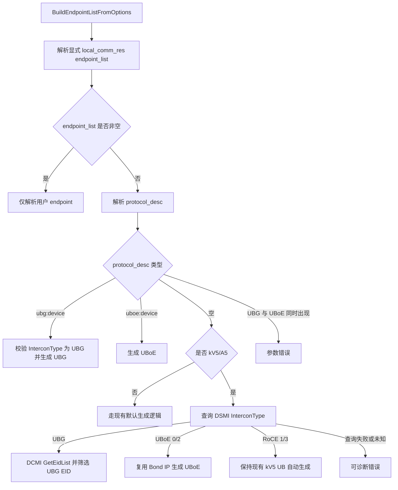
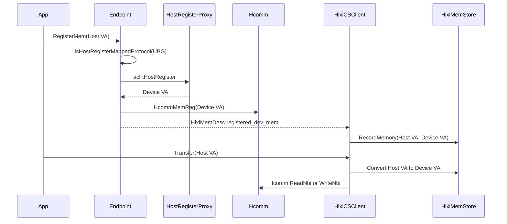
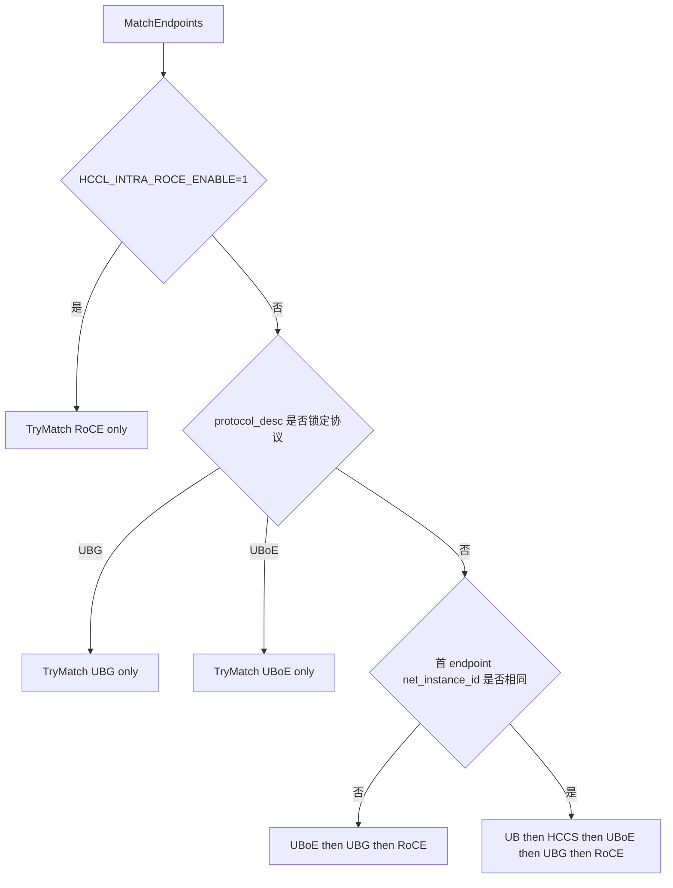

# HIXL单边通信支持UBG协议及ScaleOut自动选口设计

## 需求描述

HIXL 当前已支持 HCCS、RoCE、UB-CTP、UB-TP、UBoE 等通信协议。PC16 液冷服务器使用 UBG 协议，HIXL Engine 需要扩展对 UBG 的支持，覆盖 PC16/kV5/A5 场景下的 ScaleOut 通信资源自动生成、endpoint 建链、Host 内存单边传输和自动选链。

本需求只覆盖 HIXL Engine，不覆盖 LLM-DataDist/ADXL 的 local comm res 或 rank table 自动生成逻辑。

### 目标

1. 支持 `protocol_desc=["ubg:device"]` 显式配置 UBG，并在 PC16/kV5/A5 自动生成路径中基于 DSMI `InterconType` 探测 UBG/UBoE。
2. 新增独立的 UBG 协议建模，HIXL/Hcomm 侧使用 `COMM_PROTOCOL_UBG`，并按 direct 单链路协议接入。
3. UBG Host 内存注册、Device VA 映射、控制面同步和传输前地址翻译复用 UBoE 语义。
4. 重构选链策略，使 UBG 纳入 ScaleOut 自动选口优先级。
5. 更新对外接口文档，补充 `ubg:device` 和 `endpoint_list.protocol="ubg"` 的配置说明。

### 非目标

- 不新增 LLM-DataDist/ADXL 的 UBG 自动资源生成。
- 不改变用户显式 `endpoint_list` 的结构版本，仍使用 `version="1.3"`。
- 不在本期要求真实 PC16 硬件上机闭环；本期测试优先覆盖 UT。

### 已确认约束

- UBG 使用新增独立协议枚举 `COMM_PROTOCOL_UBG = 9`，不复用 `COMM_PROTOCOL_UB_MEM`。
- UBG 使用 `DirectClientHandler`，不走 `ub_ctp`/`ub_tp` 的 UB 多通道 handler。
- UBG endpoint 的 `comm_id` 为 32 位无冒号十六进制 ScaleOut 口 EID，解析为 `COMM_ADDR_TYPE_EID = 3`。
- UBG 和 UBoE 的 Hcomm 调用方式完全相同，无额外特殊参数；差异仅体现在 `EndpointDesc` 的协议和地址字段。
- UBG Host 内存注册继承 UBoE 语义，先映射为 Device VA，再以 `COMM_MEM_TYPE_DEVICE` 调用 `HcommMemReg`。
- UBG EID 通过 DCMI `GetEidList` 获取后按 bit 规则筛选：对应字节前两 bit 为 `10` 表示 UBG，`11` 表示 UBoE。
- 自动 UBoE endpoint 仍复用现有 Bond IP 获取逻辑，不改为 EID。
- `HCCL_INTRA_ROCE_ENABLE=1` 时 RoCE 是绝对最高优先级。
- 自动生成的 UBG/UBoE `net_instance_id` 使用 ACL 查询到的实际 `super_pod_id` 字符串，避免继续使用 UBoE 当前硬编码的 `default_superpod1_1`。

### 假设与待确认

- DSMI `InterconType` 查询接口和入参已确认：调用 `dsmi_get_device_info(device_id, DSMI_MAIN_CMD_CHIP_INF=12, DSMI_CHIP_INF_SUB_CMD_SPOD_INFO=1, ...)`，从出参 `dsmi_spod_info.super_pod_intercon_type` 读取超节点连接类型；HIXL 不依赖驱动头文件，按 DCMI 同款 dlopen 模式以本地常量对齐（定义在 `dsmi_proxy.cc`）。
- DSMI `super_pod_intercon_type` 取值已确认：`0/2` 表示 UBoE，`1/3` 表示 RoCE，`4` 表示 UBG，其中默认值为 `1`（NPU 1825 RoCE）。
- Hcomm/ucomm 已确认支持 UBG direct endpoint/channel 创建和内存注册语义；`COMM_PROTOCOL_UBG` 最终枚举值为 `9`。
- PC16 是否一定被当前 ACL 识别为 `Ascend950`/`SocType::kV5` 仍建议实现前确认；若不是，需要补充 SoC 识别。
- 真实硬件端到端验收依赖 PC16、驱动 DSMI/DCMI 和 Hcomm UBG 能力就绪，本期先以 UT 为主。

## 功能要点

- **UBG 协议接入**：新增 `ubg` 协议字符串、`COMM_PROTOCOL_UBG` 映射、EID 地址解析和 direct handler 建链能力。
- **PC16/kV5/A5 自动资源生成**：在 kV5/A5 自动生成路径中基于 DSMI `InterconType` 生成 UBG 或 UBoE endpoint，并保留 RoCE 类型下的现有 UB 默认生成逻辑。
- **UBG Host 内存单边传输**：复用 UBoE 的 Host register、`registered_dev_mem` 控制面同步和传输前 Host VA 到 Device VA 地址翻译。
- **ScaleOut 自动选链**：按强制 RoCE、跨超节点、超节点内三类场景重构匹配优先级，支持 UBG/UBoE/RoCE/UB/HCCS 多协议共存选择。
- **接口文档和 UT 补齐**：更新 HIXL 接口/数据结构文档，并补充配置解析、自动生成、选链和 Host 映射相关 UT。

## 技术方案

### 1. 协议与 endpoint 描述

新增协议字符串 `ubg`，并在 HIXL endpoint 转换逻辑中映射到 Hcomm 新增协议枚举 `COMM_PROTOCOL_UBG = 9`。

```text
endpoint_list[].protocol = "ubg"
endpoint_list[].comm_id  = 32位无冒号十六进制EID
endpoint_list[].placement = "device"
```

`protocol="ubg"` 的 `comm_id` 使用现有 EID 解析规则，填充为 `COMM_ADDR_TYPE_EID = 3`。如果 EID 长度不是 32 位或包含非十六进制字符，返回参数错误。

Hcomm 侧 UBoE/UBG endpoint 字段差异如下：

| 字段 | UBoE | UBG |
| ---- | ---- | --- |
| `protocol` | `COMM_PROTOCOL_UBOE = 7` | `COMM_PROTOCOL_UBG = 9` |
| `commAddr.type` | `COMM_ADDR_TYPE_IP_V4 = 0` | `COMM_ADDR_TYPE_EID = 3` |
| `commAddr.addr` | IPv4 地址 | 不填 |
| `commAddr.eid` | 不填 | 16 字节 ScaleOut EID |
| `loc.locType` | `ENDPOINT_LOC_TYPE_DEVICE` | 同 UBoE |
| `loc.device.devPhyId` | 设备物理 ID | 同 UBoE |

示例：

```json
{
  "version": "1.3",
  "net_instance_id": "1",
  "endpoint_list": [
    {
      "protocol": "ubg",
      "comm_id": "000000000000004000100000dfdf1672",
      "placement": "device"
    }
  ]
}
```

### 2. 自动资源生成

UBG/UBoE 自动探测只在 PC16/kV5/A5 自动生成路径内生效，不泛化到所有 SoC。已有显式 `endpoint_list` 时，HIXL 只解析用户配置，不再自动派生 UBG/UBoE。




#### 2.1 protocol_desc 规则

- `protocol_desc=["ubg:device"]`：显式生成 UBG。若 DSMI InterconType 接口已提供且探测结果不是 UBG，返回可诊断错误；若驱动暂未提供 InterconType 接口，则跳过该校验，按显式配置生成 UBG。
- `protocol_desc=["uboe:device"]`：显式生成 UBoE，复用现有 Bond IP 获取逻辑。
- `protocol_desc` 同时包含 `ubg:device` 和 `uboe:device`：配置冲突，返回参数错误。
- `protocol_desc` 包含一个支持项和未知值：保持当前 UBoE 兼容行为，处理支持项并忽略未知值。
- `protocol_desc` 非空且完全没有支持项：返回参数错误。

#### 2.2 InterconType 自动生成策略


| InterconType | 含义               | 无显式 endpoint 时行为              |
| ------------ | ---------------- | ----------------------------- |
| 0            | UBoE over SWITCH David->UBG->5808 UBoE 超平面 | 生成 UBoE endpoint |
| 1            | RoCE over NPU 1825，驱动默认值 | 不生成 UBG/UBoE，保持现有 kV5 UB 自动生成 |
| 2            | UBoE over NPU David 直出 | 生成 UBoE endpoint |
| 3            | RoCE over CPU Host 网卡 | 不生成 UBG/UBoE，保持现有 kV5 UB 自动生成 |
| 4            | UBG over NPU David 直出 | 生成 UBG endpoint |
| 接口未提供         | 不可探测             | 回退到现有 kV5 UB 自动生成             |


#### 2.3 UBG EID 筛选

自动生成 UBG 时，调用仓内已有 DCMI 能力获取 EID 列表：

```text
DcmiProxy::LoadDcmi()
  -> DcmiProxy::GetLogicIdFromPhyId(...)
  -> DcmiProxy::GetUrmaDeviceCnt(...)
  -> DcmiProxy::GetEidList(...)
  -> 按 EID 指定位 bit 规则筛选 UBG EID
```

DSMI `InterconType` 通过 `dsmi_spod_info` 的 `super_pod_intercon_type` 字段读取：

```cpp
struct dsmi_spod_info {
  unsigned int sdid;
  unsigned int scale_type;
  unsigned int super_pod_id;
  unsigned int server_id;
  unsigned int chassis_id;
  unsigned int super_pod_type;
  unsigned int super_pod_intercon_type;
  unsigned int reserve[5];
};
```

EID 筛选规则按需求确认：对应字节前两 bit 为 `10` 表示 UBG，`11` 表示 UBoE。若 DSMI 已判定为 UBG，但 DCMI 返回结果中筛不到 UBG EID，直接失败并输出可诊断错误，不回退到 UB/UBoE/RoCE。

### 3. UBG Host 内存处理

当前 UBoE Host 内存路径可抽象为“需要 Host VA 到 Device VA 映射的 direct 协议”。UBG 接入后建议新增协议能力判断，而不是在多处直接写 `protocol == COMM_PROTOCOL_UBOE || protocol == COMM_PROTOCOL_UBG`。

```cpp
bool IsHostRegisterMappedProtocol(CommProtocol protocol) {
  return protocol == COMM_PROTOCOL_UBOE || protocol == COMM_PROTOCOL_UBG;
}
```

处理流程：

1. `Endpoint::RegisterMem` 遇到 UBG + Host 内存时，调用 `aclrtHostRegister` 获取 Device VA（Hcomm 侧 UBG 继承 UBoE 的 host memory 映射语义）。
2. 使用 Device VA 构造 `COMM_MEM_TYPE_DEVICE` 内存并调用 `HcommMemReg`。
3. `HixlMemDesc` 保留用户 Host VA，同时记录 `registered_dev_mem`。
4. 控制面 `GetRemoteMemResp` 继续同步 `registered_dev_mem`。
5. 传输前将 Host VA 转换为 Device VA，再下发 device 侧传输。




### 4. ScaleOut 自动选链

匹配器需要从当前固定瀑布逻辑调整为显式优先级表。显式 `endpoint_list` 多协议共存时，也按统一优先级表选择。

#### 4.1 优先级规则

1. `HCCL_INTRA_ROCE_ENABLE=1`：RoCE 绝对最高优先级，只匹配 RoCE。
2. `protocol_desc` 显式锁定 `ubg:device` 或 `uboe:device`：只匹配对应协议；远端无同协议 endpoint 则失败。
3. 跨超节点：`UBoE -> UBG -> RoCE`。
4. 超节点内：`UB -> HCCS -> UBoE -> UBG -> RoCE`。

超节点内/跨超节点判断保持当前实现，只比较 `endpoint_list` 第一个元素的 `net_instance_id`。自动生成列表必须保证首元素 `net_instance_id` 可靠；用户显式列表由用户负责。




### 5. 可维测要求

- run 日志只记录关键事件，包括 DSMI `InterconType` 结果、自动生成协议、最终选中协议和失败原因。
- debug 日志可记录更细的 EID 筛选和候选匹配信息，但不能在多链路建链时泛滥输出。
- 错误日志需要包含设备 ID、协议类型和失败原因，便于区分 DSMI 查询失败、EID 筛选失败、Bond IP 获取失败和远端协议不匹配。

## 相关文档

本期需要同步更新：

- `docs/cpp/HIXL接口.md`：补充 `protocol_desc=["ubg:device"]`，说明与 `uboe:device` 的冲突规则和显式锁定行为。
- `docs/cpp/HIXL数据结构.md`：补充 `endpoint_list[].protocol="ubg"`、`comm_id` EID 格式和 `placement` 约束。

## 测试方案

本期优先补齐 UT，真实 PC16 上机集成测试作为后续联调项。

### UT 覆盖


| 测试场景                           | 测试功能        | 验证点                                           |
| ------------------------------ | ----------- | --------------------------------------------- |
| `protocol_desc=["ubg:device"]` | 显式 UBG 配置   | 识别 UBG 路径，生成 `protocol=ubg` endpoint          |
| `protocol_desc` 同时包含 UBG/UBoE  | 配置冲突        | 返回参数错误                                        |
| `protocol_desc` 含支持项和未知值       | 兼容行为        | 处理支持项，忽略未知值                                   |
| `InterconType=UBG`             | 自动 UBG 生成   | 调用 DCMI EID 获取并筛出 UBG EID                     |
| `InterconType=2/3/4`           | 自动 UBoE 生成  | 复用 Bond IP 生成 UBoE endpoint                   |
| `InterconType=RoCE`            | 默认回退        | 不生成 UBG/UBoE，保持现有 kV5 UB 自动生成                 |
| UBG EID 为空或筛选失败                | 异常处理        | 返回可诊断错误，不回退                                   |
| UBoE Bond IP 获取失败              | 异常处理        | 返回可诊断错误，不回退                                   |
| `protocol=ubg` + 合法 EID        | endpoint 转换 | 映射 `COMM_PROTOCOL_UBG` 和 `COMM_ADDR_TYPE_EID` |
| `protocol=ubg` + 非法 EID        | 参数校验        | 返回参数错误                                        |
| UBG Host 内存注册                  | Host 映射     | 触发 Host register，并记录 `registered_dev_mem`     |
| UBG 传输前转换                      | 地址翻译        | Host VA 转换为 Device VA                         |
| 强制 RoCE                        | 选链优先级       | `HCCL_INTRA_ROCE_ENABLE=1` 时只匹配 RoCE          |
| 跨超节点                           | 选链优先级       | 按 `UBoE -> UBG -> RoCE` 匹配                    |
| 超节点内                           | 选链优先级       | 按 `UB -> HCCS -> UBoE -> UBG -> RoCE` 匹配      |
| `protocol_desc` 显式锁定           | 协议锁定        | 远端无同协议 endpoint 时失败                           |
| 显式 endpoint_list 多协议共存         | 统一优先级       | 按优先级表选择，而不是按列表顺序                              |


### 建议测试文件

- `tests/cpp/hixl/engine/endpoint_generator_ut.cc`
- `tests/cpp/hixl/engine/hixl_engine_uboe_unittest.cc`
- `tests/cpp/hixl/engine/hixl_engine_unittest.cc`
- `tests/cpp/hixl/cs/hixl_mem_store_uboe_ut.cc`
- `tests/cpp/hixl/engine/hixl_engine_ubg_unittest.cc`（已落地：4 条端到端用例，覆盖 H2H/H2D/D2H/D2D，每条含 READ+WRITE，对应 8 个子方向）

### 后续联调验证

上机集成测试依赖真实 PC16 硬件、DSMI `InterconType=UBG`、DCMI EID 返回规则和 Hcomm UBG 协议能力。待依赖就绪后补充：

- 无配置自动生成 UBG endpoint 并完成建链。
- 显式 `ubg:device` 建链成功。
- UBG Host 内存读写完成 Host register、控制面同步和地址翻译。
- UBG/UBoE/RoCE 多协议共存时选链结果符合优先级表。

## 验收标准

- 配置 `protocol_desc=["ubg:device"]` 且设备为 UBG 时，可生成 `protocol=ubg`、`comm_id=<eid>`、`placement=device` endpoint。
- 无显式 endpoint 且 kV5/A5 `InterconType=UBG` 时，可自动生成 UBG endpoint。
- 无显式 endpoint 且 `InterconType=2/3/4` 时，可自动生成 UBoE endpoint。
- `InterconType=RoCE` 时不自动生成 UBG/UBoE，保持现有 kV5 UB 默认生成逻辑。
- UBG endpoint 可转换为 `COMM_PROTOCOL_UBG` 和 `COMM_ADDR_TYPE_EID`。
- UBG Host 内存可完成 Host register、Device VA 注册、`registered_dev_mem` 同步和传输前地址翻译。
- 选链优先级符合设计：强制 RoCE 优先；跨超节点 `UBoE -> UBG -> RoCE`；超节点内 `UB -> HCCS -> UBoE -> UBG -> RoCE`。
- 异常场景返回可诊断错误；仅 DSMI InterconType 接口未提供时，为兼容当前驱动阶段回退到现有 kV5 UB 自动生成。

