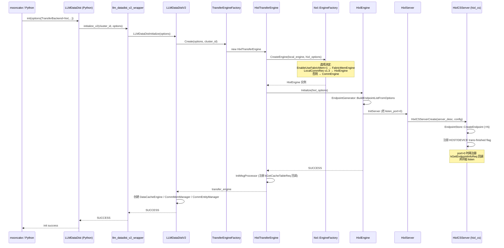
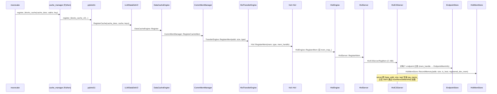
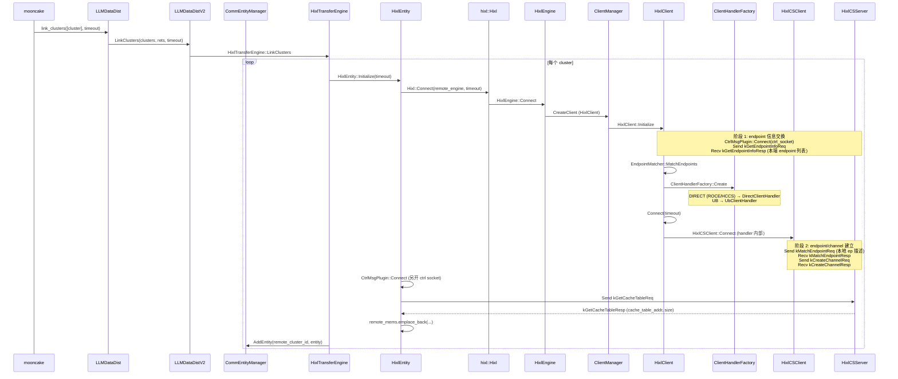
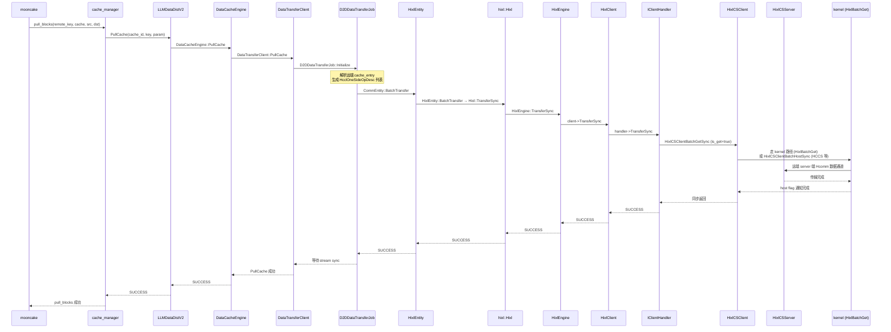
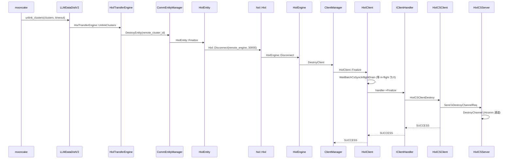
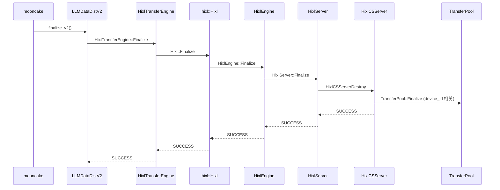

# Mooncake → HIXL → hixl_cs 调用流程

## 一、背景与目标

本文档梳理典型分布式推理场景下，**mooncake → LLM-DataDist (HIXL backend) → HIXL Engine → hixl_cs (A5 client-server)** 的整条调用链，以及内存注册、初始化、建链、传输任务创建与回收资源的关键节点。供初次接触 HIXL 仓库（特别是 A5 场景 `hixl_cs` 链路）的同学快速建立调用全景。

> 说明：本文以 **A5 集群**（HCCS / ROCE + Hcomm 单边通信）作为主线场景，**A2 / A3** 在差异章节末尾单独说明。

---

## 二、整体分层架构

从用户到硬件，整体分为 5 层，调用关系自上而下：

```
┌────────────────────────────────────────────────────────────────────────┐
│ Layer 1  上游框架 (mooncake / vLLM / SGLang)                           │
│           业务侧 KV Cache 调度、PD 分离调度                             │
└────────────────────────────────────────────────────────────────────────┘
                              │ Python
                              ▼
┌────────────────────────────────────────────────────────────────────────┐
│ Layer 2  Python 绑定  (src/python/llm_datadist)                        │
│           LLMDataDist / cache_manager / LLMConfig                      │
│           pybind11 桥接 →  llm_datadist_v2_wrapper                      │
└────────────────────────────────────────────────────────────────────────┘
                              │ C++ (pybind11)
                              ▼
┌────────────────────────────────────────────────────────────────────────┐
│ Layer 3  LLM-DataDist V2  (src/llm_datadist)                           │
│           LLMDataDistV2 (主体入口)                                       │
│           DataCacheEngine / CommMemManager / CommEntityManager         │
│           TransferEngine (抽象)  ←─ HixlTransferEngine / HcclTransferEngine │
└────────────────────────────────────────────────────────────────────────┘
                              │ C++
                              ▼
┌────────────────────────────────────────────────────────────────────────┐
│ Layer 4  HIXL Engine  (src/hixl/engine)                                │
│           Hixl 公开 API                                                │
│           HixlImpl  →  HixlEngine / FabricMemEngine / CommEngine        │
│           HixlServer  /  HixlClient  (A5)                              │
│           ClientManager  /  EndpointGenerator                          │
└────────────────────────────────────────────────────────────────────────┘
                              │ C ABI (hixl_cs.h)
                              ▼
┌────────────────────────────────────────────────────────────────────────┐
│ Layer 5  hixl_cs  (src/hixl/cs)  —— A5 client-server 通信层            │
│           HixlCSServer  (server 进程监听 + EndpointStore)              │
│           HixlCSClient  (client 端连接 + Channel + TransferPool)       │
│           Channel / Endpoint / HixlMemStore / TransferPool / MsgReceiver│
└────────────────────────────────────────────────────────────────────────┘
                              │ Hcomm (HCCS/ROCE)
                              ▼
                          硬件 RDMA / HCCS
```

> 重点：用户在 Python 侧只看到 `LLMDataDist` 和 `cache_manager`；它们都最终下沉到 `hixl_cs` 这一 C ABI 边界（src/hixl/cs/hixl_cs.h），通过 `HixlCSServerCreate` / `HixlCSClientCreate` 等一组 C 函数桥接底层 A5 单边通信。

---

## 三、关键源码定位

下表列出每层最关键的入口类 / 函数，调用时按"自上而下"顺序索引。

| 层 | 文件 | 关键符号 |
|----|------|---------|
| Python 用户 | `src/python/llm_datadist/llm_datadist/v2/llm_datadist.py` | `LLMDataDist.init/link_clusters/register_blocks_cache/pull_blocks/unlink_clusters/finalize` |
| Python 绑定 | `src/python/llm_wrapper/llm_datadist_v2_wrapper.cc` | `pybind11` 模块 `llm_datadist` |
| LLM-DataDist 入口 | `src/llm_datadist/llm_datadist_v2.h` | `LLMDataDistV2` |
| TransferEngine 抽象 | `src/llm_datadist/transfer_engine/transfer_engine.h` | `TransferEngine` / `TransferEngineFactory::Create` |
| HIXL backend | `src/llm_datadist/transfer_engine/hixl_transfer_engine.h` | `HixlTransferEngine` |
| 传输任务 | `src/llm_datadist/data_transfer/d2d_data_transfer_job.h` | `D2DDataTransferJob` / `DataTransferClient` |
| 建链 Entity | `src/llm_datadist/link_mgr/hixl_entity.h` | `HixlEntity` |
| HIXL 公开 API | `include/hixl/hixl.h` | `hixl::Hixl` |
| HIXL 实现 | `src/hixl/engine/hixl_impl.cc` | `Hixl::HixlImpl` |
| Engine 工厂 | `src/hixl/engine/engine_factory.cc` | `EngineFactory::CreateEngine` |
| HixlEngine | `src/hixl/engine/hixl_engine.cc` | `HixlEngine` |
| Server / Client 封装 | `src/hixl/engine/hixl_server.cc` / `hixl_client.cc` | `HixlServer` / `HixlClient` |
| Client Handler 工厂 | `src/hixl/engine/client_handler_factory.cc` | `ClientHandlerFactory::Create` |
| **hixl_cs 边界（C ABI）** | `src/hixl/cs/hixl_cs.h` / `hixl_cs.cc` | `HixlCSServerCreate/Destroy/RegMem/UnregMem/Listen/RegProc`、`HixlCSClientCreate/Destroy/RegMem/UnregMem/BatchPut*/BatchGet*/Connect/GetRemoteMem/QueryCompleteStatus` |
| CS server / client | `src/hixl/cs/hixl_cs_server.cc` / `hixl_cs_client.cc` | `HixlCSServer` / `HixlCSClient` |
| Endpoint 管理 | `src/hixl/cs/endpoint_store.h` / `endpoint.cc` | `EndpointStore` / `Endpoint` |
| 通道 / 内存池 | `src/hixl/cs/channel.h` / `transfer_pool.h` | `Channel` / `TransferPool` |

---

## 四、用户侧使用流程（Python 视角）

对应 `examples/python/hixl_transfer_backend_sample.py`，主线 6 步：

```python
# 1. 构造并初始化（指定 HIXL backend）
datadist = LLMDataDist(role=LLMRole.PROMPT, cluster_id=0)
llm_config = LLMConfig()
llm_config.transfer_backend = "hixl"           # 关键：走 hixl 路径
llm_config.listen_ip_info = "x.x.x.x:26000"    # 本端 server 监听
llm_config.local_comm_res = ""                 # 启用 v1.3 本地通信资源
datadist.init(llm_config.generate_options())

# 2. 注册 KV Cache
cache = cache_manager.register_blocks_cache(cache_desc, addrs, BlocksCacheKey(...))

# 3. 建链
cluster = LLMClusterInfo()
cluster.append_local_ip_info(local_ip, 26000)
cluster.append_remote_ip_info(remote_ip, 26001)
datadist.link_clusters([cluster], timeout=5000)

# 4. 拉取远端 KV
cache_manager.pull_blocks(BlocksCacheKey(remote_id, 0), cache, src_blocks, dst_blocks)

# 5. 断链
datadist.unlink_clusters([cluster], timeout=5000)

# 6. 释放
datadist.finalize()
```

> 选项 `llm.TransferBackend = "hixl"` 是关键开关。当设置后，`LLMDataDistV2` 在初始化时通过 `TransferEngineFactory::Create` 选中 `HixlTransferEngine`（而非 `HcclTransferEngine`），后续建链、内存注册、传输全部走 HIXL 路径。

---

## 五、初始化流程

### 5.1 调用链总览



### 5.2 关键代码路径

| 阶段 | 文件:行 | 说明 |
|------|---------|------|
| Python → pybind11 | `src/python/llm_wrapper/llm_datadist_v2_wrapper.cc` | `initialize_v2` 入口 |
| LLM-DataDist 入口 | `src/llm_datadist/llm_datadist_v2.cc::LLMDataDistInitialize` | 创建 transfer_engine 工厂 |
| 工厂选择 | `src/llm_datadist/transfer_engine/transfer_engine.cc::TransferEngineFactory::Create` | 看 `OPTION_TRANSFER_BACKEND`/`LocalCommRes` 决定 `HixlTransferEngine` / `HcclTransferEngine` |
| 适配 HIXL options | `src/llm_datadist/transfer_engine/hixl_transfer_engine.cc::LLMDataDist2HixlOptions` | `llm.RdmaTrafficClass` → `hixl.RdmaTrafficClass` 等 |
| Engine 工厂 | `src/hixl/engine/engine_factory.cc::EngineFactory::CreateEngine` | 见下表三类 engine 选择 |
| HixlEngine::Initialize | `src/hixl/engine/hixl_engine.cc:44` | 检查 options、构建 endpoint 列表、InitServer |
| HixlServer::Initialize | `src/hixl/engine/hixl_server.cc:30` | 通过 C ABI 调用 `HixlCSServerCreate` |
| hixl_cs server 创建 | `src/hixl/cs/hixl_cs.cc::HixlCSServerCreate` | 实例化 `HixlCSServer`，`Initialize`，必要时 Listen |
| Server 控制消息注册 | `src/hixl/cs/hixl_cs_server.cc::HixlCSServer::Initialize` | 注册 `kMatchEndpointReq` / `kCreateChannelReq` / `kGetRemoteMemReq` / `kDestroyChannelReq` 处理器 |
| kGetEndpointInfoReq 注册 | `src/hixl/engine/hixl_server.cc:60` | HixlServer 在 `HixlCSServerRegProc` 上注册，回复本端 endpoint 列表 |
| 缓存表地址回调 | `src/llm_datadist/transfer_engine/hixl_transfer_engine.cc::InitMsgProcessor` | `HixlTransferEngine` 在 engine 上注册 `kGetCacheTableReq`，返回本端 cache table 内存地址 |

### 5.3 HIXL Engine 工厂路由（A5 场景）

`EngineFactory::CreateEngine` 的路由逻辑（src/hixl/engine/engine_factory.cc:38-66）：

| 条件 | 选择的 Engine | 数据路径 |
|------|--------------|---------|
| `EnableUseFabricMem=1` | `FabricMemEngine` | D2RH（DRAM ↔ HBM），仅 A3 适用 |
| `LocalCommRes` 是 v1.3 JSON | `HixlEngine` | A5：`HixlServer` + `HixlClient` → `hixl_cs` C ABI |
| `protocol_desc` 含 `uboe:device` | `HixlEngine` | A2 走 UBOE（host-resident memory）|
| 其余默认 | `CommEngine` | ADXL 内部引擎（兼容老路径） |

A5 场景一般落入第 2 条：`HixlEngine` → `HixlServer` → `HixlCSServer`。

---

## 六、内存注册流程

### 6.1 概念

A5 架构下，**本端 device/host 内存需要先注册到 `HixlCSServer` 的 `EndpointStore` 中**，并通过 `HixlMemStore` 跟踪可用的 buffer 区间；远端 client 则在 `GetRemoteMem` 时通过 `kGetRemoteMemReq` 控制消息获取本端导出的内存清单，并通过 `HcommProxy::MemImport` 真正把对端内存 import 到本端地址空间。

### 6.2 注册调用链



### 6.3 关键代码

| 阶段 | 文件:行 | 说明 |
|------|---------|------|
| Python → C++ | `src/python/llm_datadist/llm_datadist/v2/cache_manager.py` | `CacheManager.register_blocks_cache` |
| pybind11 | `src/python/llm_wrapper/llm_datadist_v2_wrapper.cc` | `register_blocks_cache_v2` |
| LLM-DataDist | `src/llm_datadist/llm_datadist_v2.cc::LLMDataDistV2::RegisterCache` | 委托 `DataCacheEngine` |
| 缓存引擎 | `src/llm_datadist/cache_mgr/data_cache_engine.cc` | 维护 cache id 与 addr 映射 |
| 内存管理 | `src/llm_datadist/cache_mgr/comm_mem_manager.cc::RegisterCacheMem` | 委托 `TransferEngine` |
| HIXL backend | `src/llm_datadist/transfer_engine/hixl_transfer_engine.cc:114` | `engine_->RegisterMem` |
| HIXL 公开 API | `src/hixl/engine/hixl_impl.cc:267` | `Hixl::RegisterMem` |
| HixlEngine | `src/hixl/engine/hixl_engine.cc:64` | 存 `mem_map_`，调 server |
| HixlServer | `src/hixl/engine/hixl_server.cc:83` | `HixlCSServerRegMem` |
| hixl_cs C ABI | `src/hixl/cs/hixl_cs.cc:44` | `HixlCSServerRegMem` |
| server 内部 | `src/hixl/cs/hixl_cs_server.cc` | `EndpointStore` + `HixlMemStore` |

> 同一个 HIXL 实例 **只允许注册一次**；重复注册同一段地址会复用既有 `mem_handle`（`HixlServer::RegisterMem` 中的 `is_duplicate` 路径）。

---

## 七、建链流程（A5 端点协商 + 通道建立）

### 7.1 总体步骤

A5 建链不是一次性的 socket connect，而是 **3 个阶段**：

1. **endpoint 信息交换**：client 通过控制消息 `kGetEndpointInfoReq` 获取 server 端 endpoint 列表（ROCE / HCCS / UB），本地根据 `EndpointMatcher` 匹配出可用的 endpoint pair，决定走 `DirectClientHandler`（直连，如 ROCE/HCCS）还是 `UbClientHandler`（UB 总线）。
2. **endpoint / channel 建立**：client 通过控制消息 `kMatchEndpointReq` 把本地 endpoint 描述发给 server；server 在自己的 `EndpointStore` 中匹配并 `CreateChannel`（Hcomm 通道）。
3. **缓存表地址交换（LLM-DataDist 扩展）**：`HixlEntity::Initialize` 通过 `kGetCacheTableReq` 控制消息获取对端 cache table 内存地址，写入 `HixlEntity.remote_mems`，用于后续数据面地址映射。

### 7.2 调用链



### 7.3 关键代码

| 阶段 | 文件:行 | 说明 |
|------|---------|------|
| Python | `src/python/llm_datadist/llm_datadist/v2/llm_datadist.py:202` | `LLMDataDist.link_clusters` |
| LLM-DataDist | `src/llm_datadist/llm_datadist_v2.cc::LinkClusters` | |
| HixlTransferEngine | `src/llm_datadist/transfer_engine/hixl_transfer_engine.cc:131-186` | `LinkCluster` / `LinkClusters`（多 cluster 并发） |
| HixlEntity | `src/llm_datadist/link_mgr/hixl_entity.cc:21-56` | `Connect` + 缓存表地址交换 |
| HixlEngine::Connect | `src/hixl/engine/hixl_engine.cc:99` | 调 `ClientManager.CreateClient` |
| ClientManager | `src/hixl/engine/client_manager.cc` | 维护 `remote_engine → HixlClient` 映射 |
| HixlClient::Initialize | `src/hixl/engine/hixl_client.cc:31` | 阶段 1：endpoint 信息交换 |
| EndpointMatcher | `src/hixl/engine/endpoint_matcher.cc` | 决定 handler 类型 |
| ClientHandlerFactory | `src/hixl/engine/client_handler_factory.cc` | 工厂选择 `Direct` / `Ub` |
| HixlClient::Connect | `src/hixl/engine/hixl_client.cc:123` | 进入 handler.Connect → `HixlCSClientConnect` |
| hixl_cs C ABI | `src/hixl/cs/hixl_cs.cc:205` | `HixlCSClientConnect` |
| HixlCSClient::Connect | `src/hixl/cs/hixl_cs_client.cc` | 阶段 2：MatchEndpoint / CreateChannel |

### 7.4 端点协商的控制消息协议

| 控制消息 | 方向 | 作用 |
|---------|------|------|
| `kGetEndpointInfoReq` | client → server | client 询问 server 支持的 endpoint 列表 |
| `kGetEndpointInfoResp` | server → client | server 返回本端 endpoint 列表（JSON 序列化） |
| `kGetCacheTableReq` | client → server | LLM-DataDist 扩展，获取本端 cache table 内存地址 |
| `kGetCacheTableResp` | server → client | 返回 `CacheTableInfo{addr, size}` |
| `kMatchEndpointReq` | client → server | client 发送本地 endpoint 描述，server 匹配 |
| `kMatchEndpointResp` | server → client | server 返回匹配后的远端 endpoint 描述 |
| `kCreateChannelReq` | client → server | 建立 Hcomm 通道（client 角色） |
| `kCreateChannelResp` | server → client | 通道建立结果 |
| `kGetRemoteMemReq` | client → server | client 获取 server 注册的内存清单（addr/size/type/tag） |
| `kGetRemoteMemResp` | server → client | 返回 `CommMem` 列表 + tag 列表 |
| `kDestroyChannelReq` | client → server | 拆除通道 |

> 所有控制消息都跑在 server 的 **控制 socket** 上（`CtrlMsgPlugin::Connect`），与数据通道分离；数据通道由 `Channel::Create` 内部走 Hcomm 建立。

---

## 八、数据传输任务流程

### 8.1 调用链（Pull/READ 为例）



### 8.2 关键代码

| 阶段 | 文件:行 | 说明 |
|------|---------|------|
| Python 入口 | `src/python/llm_datadist/llm_datadist/v2/cache_manager.py::pull_blocks` | |
| LLM-DataDist | `src/llm_datadist/llm_datadist_v2.cc::LLMDataDistV2::PullCache` | 委托 `DataCacheEngine` |
| DataCacheEngine | `src/llm_datadist/cache_mgr/data_cache_engine.cc::PullCache` | 构造 `DataTransferClient` + `D2DDataTransferJob` |
| 任务生成 | `src/llm_datadist/data_transfer/d2d_data_transfer_job.cc` | `GenerateSendTask` 把 cache_entry 切分成 `HcclOneSideOpDesc` 列表 |
| Entity 传输 | `src/llm_datadist/link_mgr/hixl_entity.cc:91-110` | `HixlEntity::BatchTransfer` |
| HIXL 公开 API | `src/hixl/engine/hixl_impl.cc:364` | `Hixl::TransferSync` |
| HixlEngine | `src/hixl/engine/hixl_engine.cc:166` | 通过 `ClientManager.GetClient` 派发 |
| HixlClient | `src/hixl/engine/hixl_client.cc:134` | 校验状态后调 `handler->TransferSync` |
| IClientHandler | `src/hixl/engine/direct_client_handler.cc` / `ub_client_handler.cc` | 视 endpoint 类型走不同路径 |
| hixl_cs 同步传输 | `src/hixl/cs/hixl_cs.cc:158` (`HixlCSClientBatchPutSync`) / `:176` (`HixlCSClientBatchGetSync`) | C ABI 入口 |
| HixlCSClient | `src/hixl/cs/hixl_cs_client.cc` | host/device 两条路径，最终走 `HixlBatchGet` / `HixlBatchPut` 算子或直接通道 |

### 8.3 同步 vs 异步

- **同步 (`TransferSync`)**：阻塞到 host flag（`kTransFlagNameHost`）被置位，由 `HixlCSClient::CheckStatusHost` / `CheckStatusDevice` 通过 host flag 轮询完成。
- **异步 (`TransferAsync` + `GetTransferStatus`)**：HixlEngine 维护 `req_map_`（id → start_time/op_type/remote_engine），client 端 `HixlCSClientBatchPutAsync` 返回 `CompleteHandle`，上层通过 `GetTransferStatus` 轮询；status ∈ {WAITING / COMPLETED / TIMEOUT / FAILED}。

### 8.4 任务粒度

- `HcclOneSideOpDesc{ localAddr, remoteAddr, count, dataType }` 由 `D2DDataTransferJob::GenerateSendTask` 批量生成（一次最多 1024 条，见 `kMaxTaskNum`），后由 `HixlEntity::BatchTransfer` 一次性派发。
- 设备侧单次 kernel 上限由 `kMaxKernelBatchSize = 128U` 控制，超出会分块（`HixlCSClient::LaunchDeviceChunkedKernels`）。

---

## 九、回收资源流程

### 9.1 顺序约束

> **内存解注册前必须先断链**。`HixlEngine::DeregisterMem` 会校验 `client_manager_.IsEmpty()`；`HixlServer::DeregisterMem` 也会校验对应 server 上无未断通道。

### 9.2 断链



### 9.3 内存解注册

`DeregisterMem(handle)` → `HixlEngine::DeregisterMem` → 校验无 client → `HixlServer::DeregisterMem` → `HixlCSServerUnregMem`（C ABI）→ 内部从 `EndpointStore` + `HixlMemStore` 中擦除该 `mem_handle`。

### 9.4 整体 Finalize



> 析构顺序很关键：HixlServer::Finalize 内部先关 listener、注销所有已注册内存、最后 `HixlCSServerDestroy`；期间 `TransferPool::Finalize` 必须在 `HixlCSServer` 析构后调用（context guard 注释说明）。

---

## 十、A2 / A3 与 A5 的差异

> 用户对 A2 / A3 不熟悉，下面是基于本仓库代码能确认的差异点。

| 维度 | A5 | A2 / A3 |
|------|-----|---------|
| 关键选项 | `llm.TransferBackend=hixl` + `llm.LocalCommRes` (v1.3) | 仅 `llm.TransferBackend=hixl`（不传 LocalCommRes）走 ADXL 兼容路径；`EnableUseFabricMem=1` 仅 A3 走 FabricMem |
| Engine 工厂结果 | `HixlEngine` | A2 走 `HixlEngine`（UBOE 模式）；A3 走 `FabricMemEngine`；否则 `CommEngine` |
| 数据通路 | HIXL 单边通信 + hixl_cs C ABI | A2：UBOE 走 host-resident memory；A3：FabricMem 走 D2RH |
| **endpoint 概念** | **A5 必用**：建链阶段需要 endpoint 匹配（ROCE / HCCS / UB） | A2/A3 不直接用 endpoint（走 Hcomm/HCCS 或 FabricMem 共享内存） |
| 内存注册路径 | HixlServer → HixlCSServer → EndpointStore | FabricMem：`FabricMemTransferService::RegisterMem` + 共享句柄导出；CommEngine：ADXL 内部 |
| 端点协商 | 3 阶段控制消息（`kGetEndpointInfo*` / `kMatchEndpoint*` / `kCreateChannel*`） | A3 FabricMem：`FabricMemControlServer` + `FabricMemControlClient::Fetch` 拉取 share handle；A2 UBOE：直连 host memory |
| 缓存表地址交换 | `kGetCacheTableReq`（`HixlEntity` 扩展） | 路径相同但实现可能不一致（A2/A3 的 `HixlEntity` 是否触发？需对照实际编译产物） |

> **A2 / A3 不在 `hixl_cs` 主链路上**：A2 的 UBOE 路径与 A3 的 FabricMem 路径都是独立的传输实现。`hixl_cs` 是 A5 的专有 client-server 通信层，由 user（`hixl_cs.cc/h`）开发维护。

---

## 十一、关键概念速查

| 名词 | 含义 |
|------|------|
| `Engine` (`src/hixl/engine/engine.h`) | HIXL 引擎抽象基类，子类：`HixlEngine` / `FabricMemEngine` / `CommEngine` |
| `HixlEngine` | A5 走 `hixl_cs` 的具体实现 |
| `HixlServer` | 封装 `HixlCSServer`，负责 listen + 注册内存 + 控制消息 |
| `HixlClient` | 封装对远端的连接 + endpoint 协商 + 内存导入 + 通道建立 |
| `ClientManager` | HixlEngine 内管理 `remote_engine → HixlClient` 的容器 |
| `EndpointStore` | hixl_cs server 端按 `EndpointDesc` 维护可用端点 |
| `HixlMemStore` | hixl_cs 端 `addr/size/type` 的内存注册表 |
| `Channel` | hixl_cs 内的 Hcomm 数据通道（client 角色或 server 角色） |
| `TransferPool` | 设备端预分配的 trans-finished flag / notify 资源池 |
| `CommEntity` / `HixlEntity` | LLM-DataDist 内每条对端链路一个 entity，封装对端 cache table 地址 + BatchTransfer |
| `CommEntityManager` | LLM-DataDist 内 `remote_cluster_id → CommEntity` 的容器 |
| `DataCacheEngine` | LLM-DataDist 内的缓存/块管理，桥接 cache_id ↔ addr |
| `CommMemManager` | LLM-DataDist 内的内存注册抽象，委托 TransferEngine |
| `TransferEngine` | LLM-DataDist 内的传输后端抽象，子类：`HixlTransferEngine` / `HcclTransferEngine` |
| `LocalCommRes` | 本端可用通信资源（endpoint 列表）的 JSON 描述，必须为 v1.3 才会走 `HixlEngine` |

---

## 十二、调试 / 排错指引

1. **建链卡住**：先看 `HixlClient::Initialize` 是否能成功收到 `kGetEndpointInfoResp`（控制 socket 是否有数据）；再看 `HixlCSClient::Connect` 内 `ExchangeEndpointAndCreateChannelLocked` 是否有 `kMatchEndpointResp` / `kCreateChannelResp` 返回。
2. **传输返回 0 字节 / 0 handle**：
   - `HixlEngine::DeregisterMem` 中 `client_manager_.IsEmpty()` 不为 true → 先 unlink。
   - `D2DDataTransferJob::GenerateSendTask` 中 `src_addr_num != dst_addr_count` → 检查 cache_desc 与请求侧 buffer_info_count。
3. **endpoint 不匹配**：server 端 `/usr/local/Ascend/driver/topo/950/` 下的 topo 文件 / `LocalCommRes` JSON 是否反映了物理连接拓扑；`EndpointGenerator::BuildEndpointListFromOptions` 是否正确解析。
4. **回收顺序错乱导致崩溃**：注意 listener_running_、TransferPool::Finalize、HixlCSServerDestroy 三者先后顺序（参考 `HixlCSServer::Finalize` 注释）。
5. **A3 D2RH 性能差**：检查 `EnableUseFabricMem=1` 是否生效、是否走了 `FabricMemEngine`（看 log 中 `[FabricMemEngine]` 前缀）；同时 `FabricMemConfig` 解析是否成功。

---

## 十三、相关文档

- `docs/design/LLM-DataDist支持hixl传输后端.md`：LLM-DataDist 抽象 TransferEngine 的设计文档（hixl backend 引入动机）
- `docs/design/FabricMem模式设计.md`：A3 FabricMem 模式设计
- `docs/local_comm_res_enhancement.md`：LocalCommRes 生成器增强需求
- `examples/python/hixl_transfer_backend_sample.py`：端到端使用样例
- `examples/cpp/client_server_h2d.cpp`：直接使用 HIXL C++ API 的样例（绕过 LLM-DataDist）
