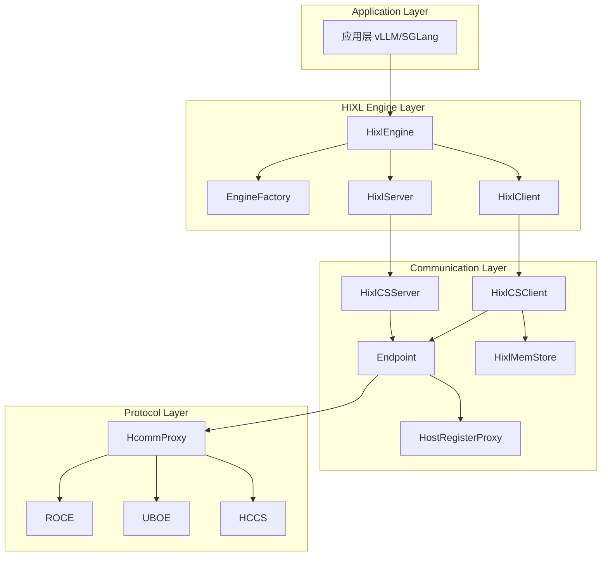
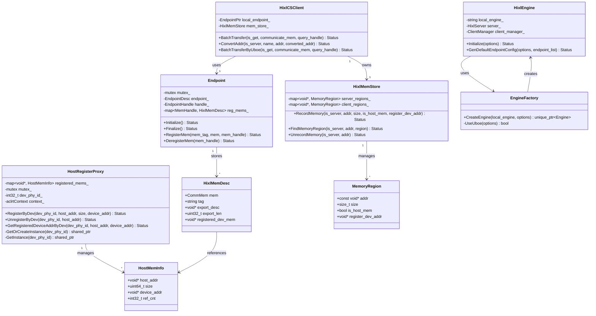
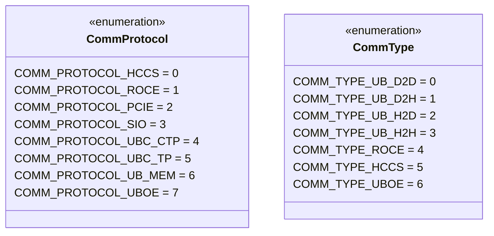
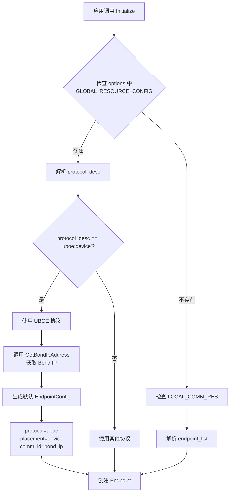
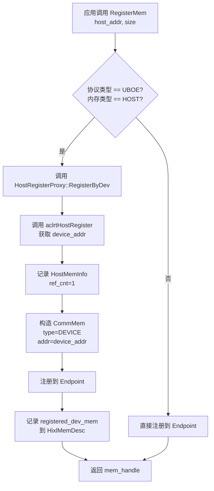
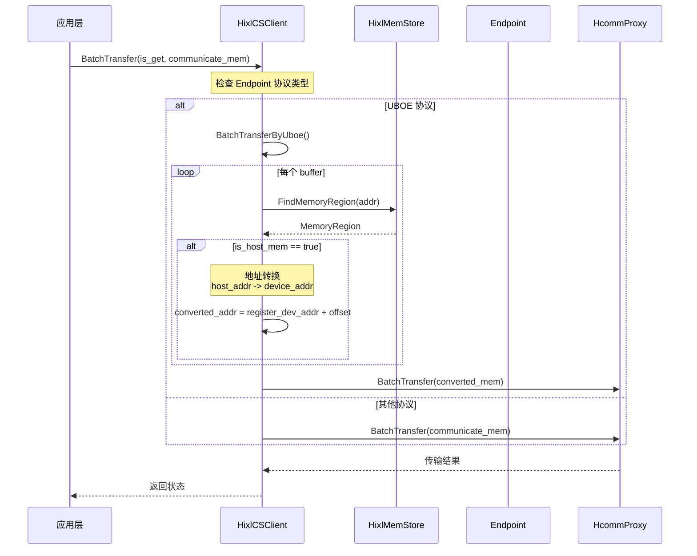
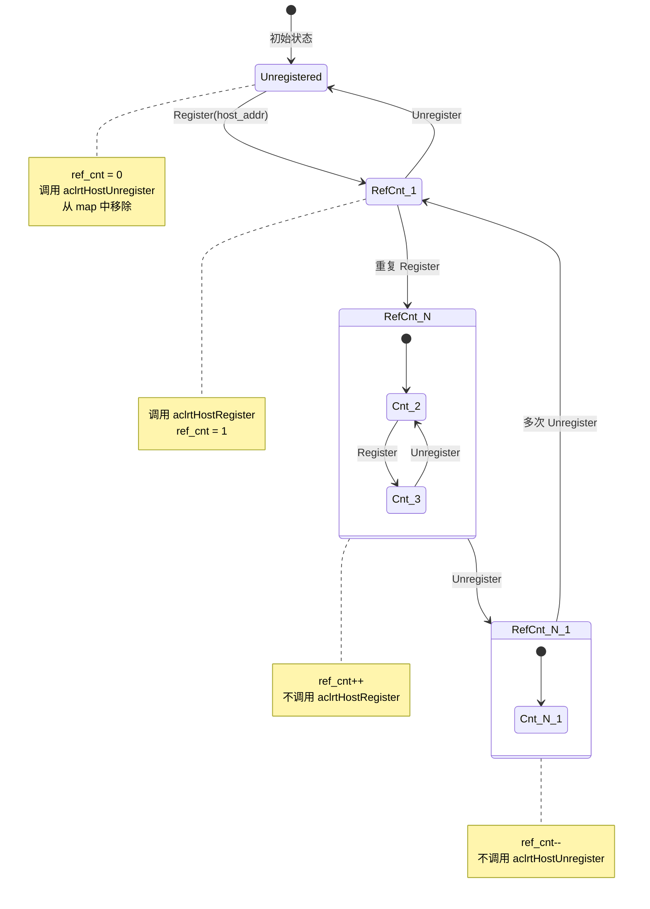

# UBOE 协议支持设计文档

## 1. 概述

### 1.1 需求背景

HIXL 需要支持 UBOE（Unified Bus Over Ethernet）协议，用于分布式 AI 场景下的高性能数据传输。UBOE 是华为统一总线协议的以太网实现版本，相比传统 ROCE 协议，UBOE 能够提供更低的延迟和更高的带宽利用率。

**原始需求**：
- HIXL 支持 UBOE 协议
- 支持自动配置 UBOE endpoint 信息

### 1.2 目标

1. 支持 UBOE 协议作为通信传输协议之一
2. 支持通过配置自动生成 UBOE endpoint 信息
3. 支持 Host 内存通过 UBOE 传输（需转换为 Device 地址）

### 1.3 相关提交

| 提交 | 说明 |
|------|------|
| `c823dd8` | 新增 HostRegisterProxy，实现 Host 内存到 Device 地址的映射 |
| `dd277df` | 新增 UBOE 协议类型定义 |
| `1e26b0e` | 解析 comm_resource_config.protocol_desc 配置，自动生成 endpoint |
| `45d3c86` | Endpoint 支持 RegisterMem/DeregisterMem 时处理 Host 内存注册 |
| `7e65d2d` | MemStore 支持记录内存类型和注册的 Device 地址 |

---

## 2. 架构设计

### 2.1 整体架构



### 2.2 核心类图



### 2.3 协议类型定义



---

## 3. 关键流程

### 3.1 UBOE Endpoint 自动配置流程



### 3.2 Host 内存注册流程



### 3.3 内存传输流程



### 3.4 引用计数管理流程



---

## 4. 详细设计

### 4.1 HostRegisterProxy

#### 4.1.1 职责

`HostRegisterProxy` 负责管理 Host 内存在 Device 侧的映射，支持引用计数管理。

#### 4.1.2 关键接口

| 接口 | 说明 |
|------|------|
| `RegisterByDev` | 将 Host 内存注册到指定设备，返回映射后的 Device 地址 |
| `UnregisterByDev` | 注销 Host 内存注册（引用计数减一） |
| `GetRegisteredDeviceAddrByDev` | 获取已注册的 Device 地址 |

#### 4.1.3 引用计数规则

1. **注册**：
   - 首次注册：调用 `aclrtHostRegister`，`ref_cnt = 1`
   - 重复注册（相同地址+大小）：`ref_cnt++`，返回缓存的 Device 地址
   - 重复注册（不同大小）：返回 `PARAM_INVALID` 错误

2. **注销**：
   - `ref_cnt--`
   - `ref_cnt > 0`：不调用 `aclrtHostUnregister`
   - `ref_cnt == 0`：调用 `aclrtHostUnregister`，从 map 中移除

#### 4.1.4 线程安全

- 使用 `std::mutex` 保护 `registered_mems_` 的并发访问
- 全局实例使用 `g_proxy_mutex` 保护

### 4.2 Endpoint 内存注册

#### 4.2.1 UBOE 协议下的 Host 内存处理

当协议为 UBOE 且内存类型为 HOST 时，`Endpoint::RegisterMem` 执行以下步骤：

```cpp
Status Endpoint::RegisterMem(const char *mem_tag, const CommMem &mem, MemHandle &mem_handle) {
  void *registered_dev_mem = nullptr;

  if (endpoint_.protocol == COMM_PROTOCOL_UBOE && mem.type == COMM_MEM_TYPE_HOST) {
    // 1. 调用 HostRegisterProxy 注册 Host 内存
    HostRegisterProxy::RegisterByDev(endpoint_.loc.device.devPhyId, mem.addr, mem.size, registered_dev_mem);

    // 2. 构造 Device 内存的 CommMem
    CommMem reg_mem{};
    reg_mem.type = COMM_MEM_TYPE_DEVICE;
    reg_mem.addr = registered_dev_mem;
    reg_mem.size = mem.size;

    // 3. 注册 Device 内存到 Endpoint
    HcommProxy::MemReg(handle_, mem_tag, &reg_mem, &mem_handle);
  }

  // 4. 记录 registered_dev_mem 到 HixlMemDesc
  desc.registered_dev_mem = registered_dev_mem;
}
```

### 4.3 HixlMemStore 内存记录

#### 4.3.1 扩展字段

```cpp
struct MemoryRegion {
  const void *addr;           // 内存起始地址
  size_t size;                // 内存区域大小
  bool is_host_mem;           // 是否为 Host 内存
  void *register_dev_addr;    // 注册后的 Device 地址（UBOE 场景有效）
};
```

#### 4.3.2 地址转换

在 UBOE 场景下，Host 内存需要转换为 Device 地址：

```cpp
Status HixlCSClient::ConvertAddr(bool is_server, const char *name, T addr, T &converted_addr) {
  MemoryRegion region;
  FindMemoryRegion(is_server, addr, region);

  converted_addr = addr;
  if (region.is_host_mem) {
    // 计算偏移量
    uintptr_t offset = reinterpret_cast<uintptr_t>(addr) - reinterpret_cast<uintptr_t>(region.addr);
    // 转换为 Device 地址
    converted_addr = static_cast<T>(static_cast<char *>(region.register_dev_addr) + offset);
  }
  return SUCCESS;
}
```

### 4.4 Endpoint 自动配置

#### 4.4.1 配置解析

通过 `OPTION_GLOBAL_RESOURCE_CONFIG` 选项传递配置：

```json
{
  "comm_resource_config.protocol_desc": ["uboe:device"]
}
```

#### 4.4.2 Bond IP 获取

UBOE 协议使用 Bond IP 作为通信地址：

```bash
# 通过 hccn_tool 查询 Bond IP
hccn_tool -g -ip -i 0 -d bond0
```

#### 4.4.3 默认 Endpoint 生成

当检测到 `protocol_desc = ["uboe:device"]` 时：

1. `EngineFactory::UseUboe` 返回 true
2. `HixlEngine::GenDefaultEndpointConfig` 生成默认配置：
   - `protocol = "uboe"`
   - `placement = "device"`
   - `comm_id = bond_ip`

---

## 5. 配置说明

### 5.1 使用 UBOE 协议

#### 方式一：通过 GLOBAL_RESOURCE_CONFIG 配置（推荐）

```python
options = {
    hixl.OPTION_GLOBAL_RESOURCE_CONFIG: '{"comm_resource_config.protocol_desc": ["uboe:device"]}'
}
engine = hixl.Engine(local_engine, options)
```

#### 方式二：通过 LOCAL_COMM_RES 配置

```python
local_comm_res = '''
{
    "version": "1.3",
    "endpoints": [
        {
            "protocol": "uboe",
            "comm_id": "192.168.1.100",
            "placement": "device"
        }
    ]
}
'''
options = {
    hixl.OPTION_LOCAL_COMM_RES: local_comm_res
}
```

### 5.2 前置条件

1. 安装 Ascend CANN toolkit >= 9.0.0
2. 配置 Bond IP（系统级网络配置，参考 Linux bond 网卡配置方法）
3. 确保 UBOE 网络连通

### 5.3 性能优化建议

1. Host 内存建议使用 `aclrtMallocHost` 分配，确保内存对齐
2. 复用已注册的内存，减少注册/注销开销
3. 使用批量传输接口 `BatchTransfer` 提高吞吐

---

## 6. 测试覆盖

### 6.1 单元测试

| 测试文件 | 覆盖内容 |
|----------|----------|
| `host_register_proxy_ut.cc` | HostRegisterProxy 引用计数、注册/注销流程 |
| `hixl_mem_store_ut.cc` | MemoryRegion 记录、地址查找 |
| `endpoint_ut.cc` | Endpoint 内存注册、UBOE 协议处理 |

### 6.2 集成测试

- UBOE 协议端到端传输测试
- Host 内存 UBOE 传输测试
- 混合协议场景测试

---

## 7. 附录

### 7.1 协议对比

| 特性 | ROCE | UBOE |
|------|------|------|
| 传输协议 | RDMA over Ethernet | Unified Bus over Ethernet |
| 延迟 | 中等 | 低 |
| 带宽利用率 | 中等 | 高 |
| Host 内存支持 | 直接支持 | 需转换为 Device 地址 |
| 配置复杂度 | 高（需配置 IP） | 低（支持自动配置） |

### 7.2 文件清单

| 文件路径 | 说明 |
|----------|------|
| `src/hixl/cs/host_register_proxy.h` | HostRegisterProxy 头文件 |
| `src/hixl/cs/host_register_proxy.cc` | HostRegisterProxy 实现 |
| `src/hixl/cs/endpoint.cc` | Endpoint 内存注册逻辑 |
| `src/hixl/cs/hixl_mem_store.h` | HixlMemStore 定义 |
| `src/hixl/cs/hixl_cs_client.cc` | UBOE 地址转换逻辑 |
| `src/hixl/engine/engine_factory.cc` | UBOE 检测和 Engine 创建 |
| `src/hixl/engine/hixl_engine.cc` | 默认 Endpoint 生成 |
| `src/hixl/common/hixl_inner_types.h` | 协议类型定义 |
| `src/hixl/proxy/hcomm/hcomm_res_defs.h` | CommProtocol 枚举定义 |
