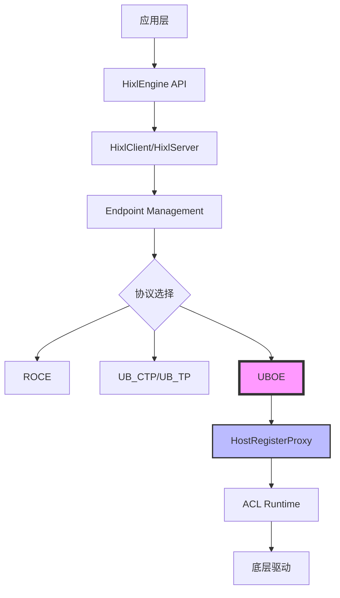
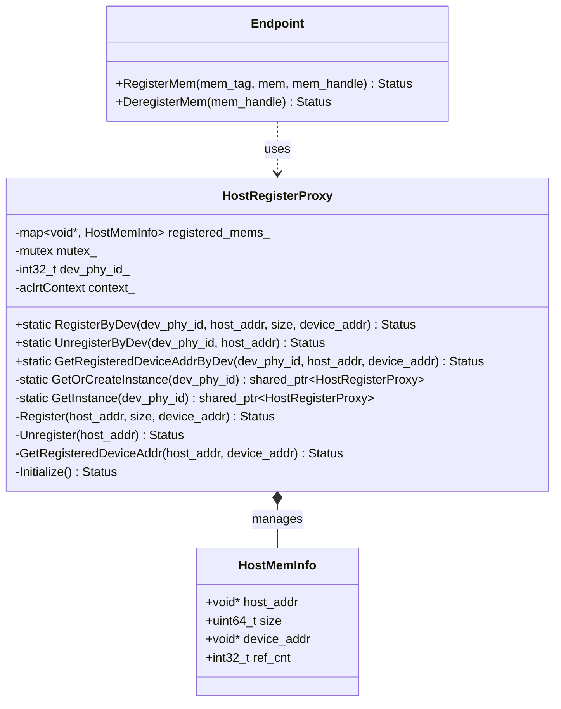
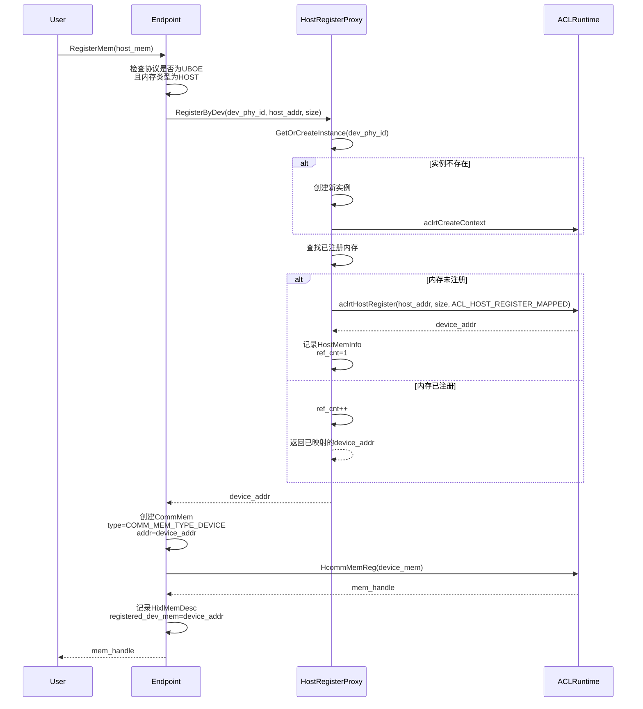
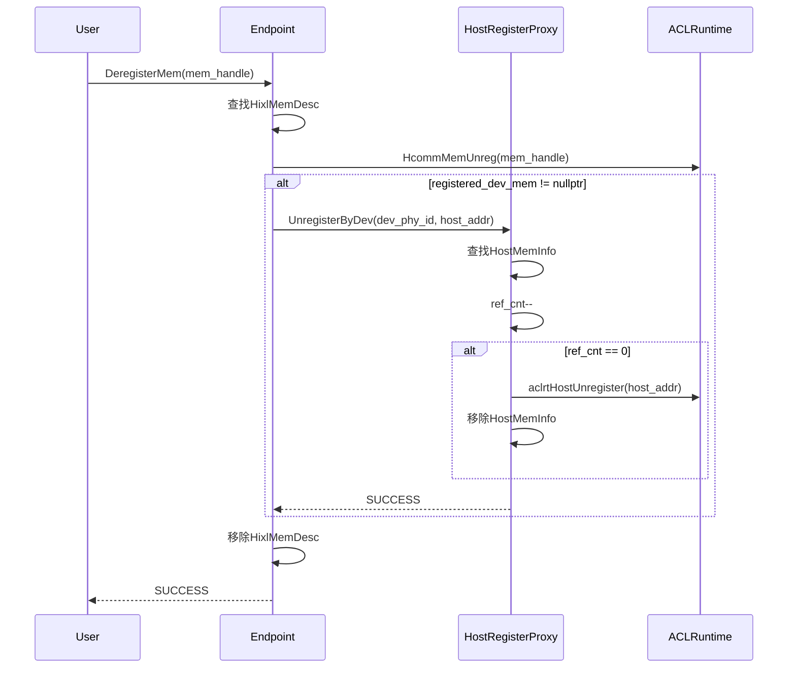
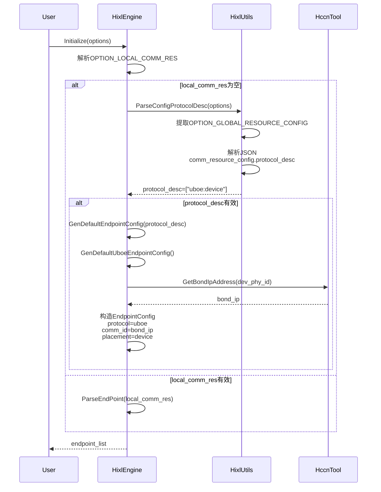
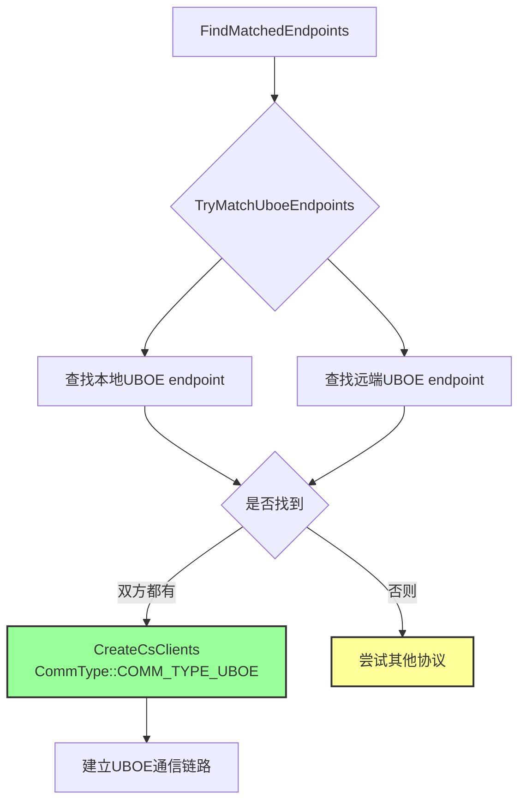
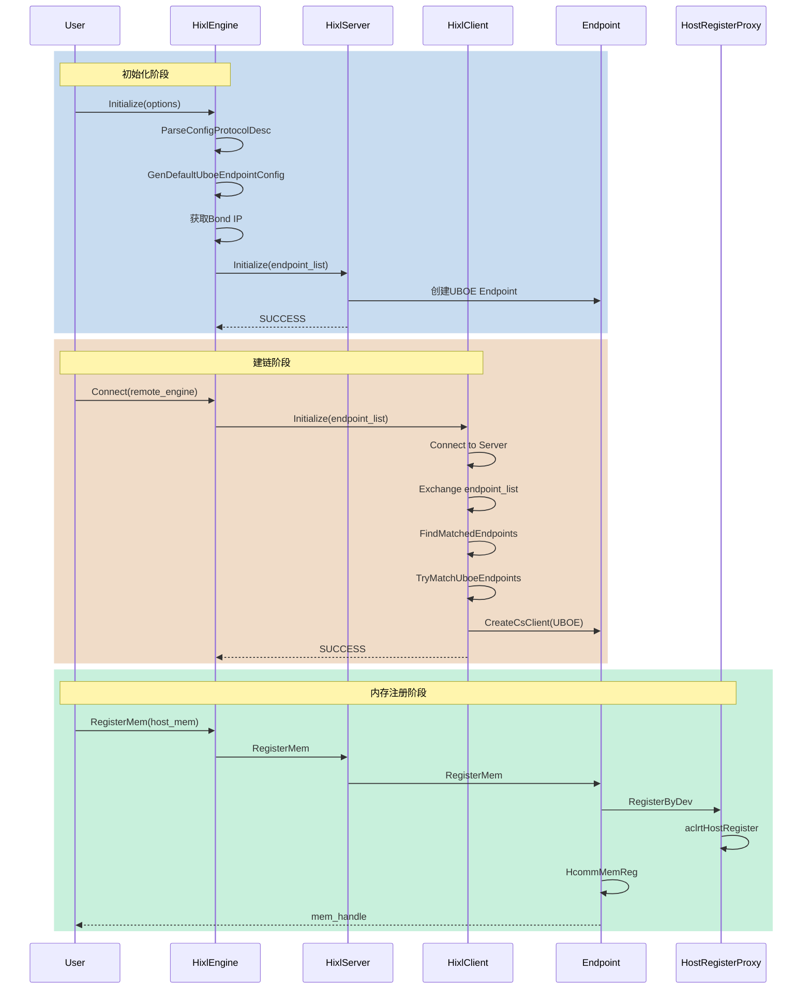
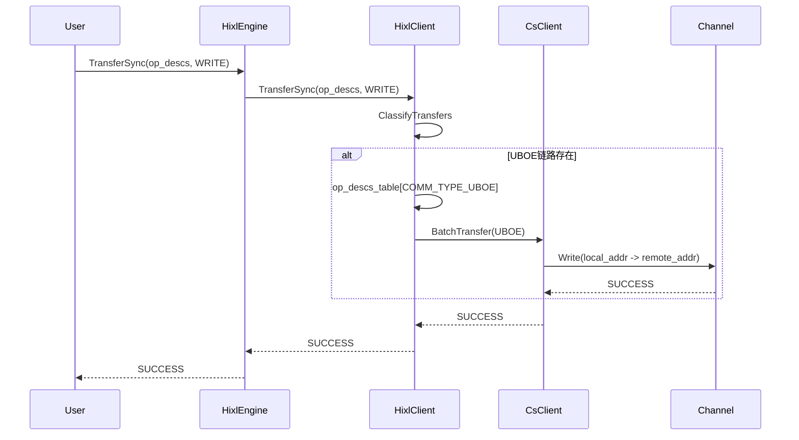
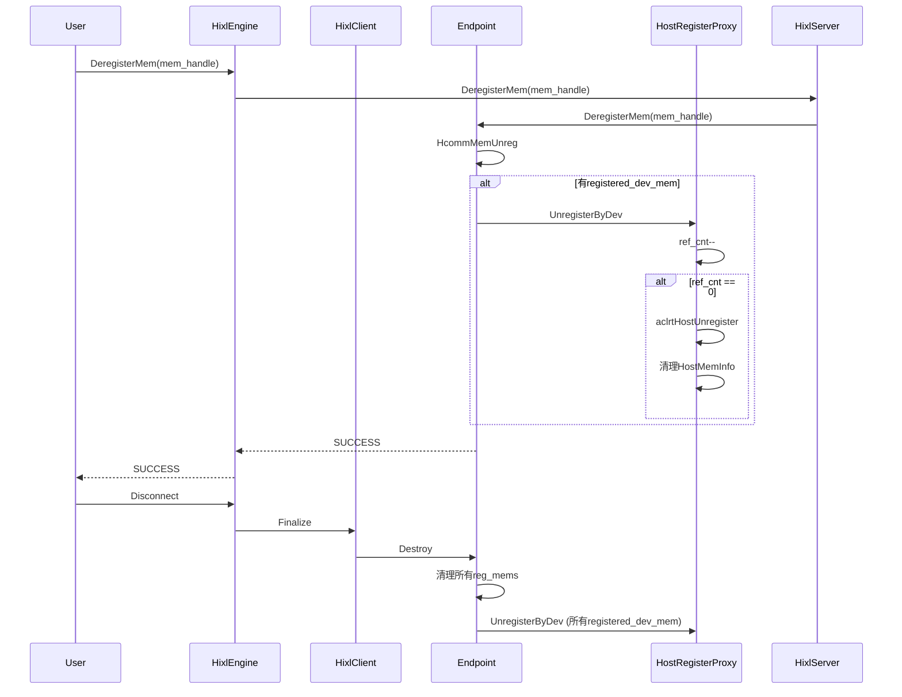
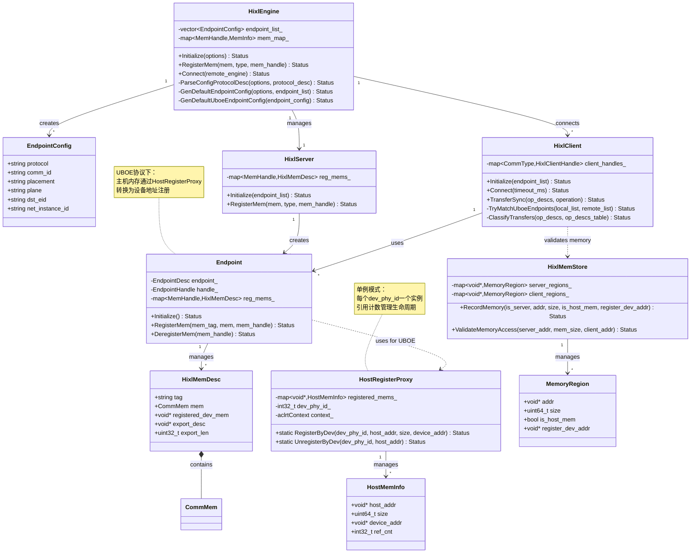

# UBOE 协议支持设计文档

## 1. 概述

### 1.1 需求背景

随着分布式 AI 场景的发展，特别是 LLM 推理中的 KV Cache 传输和 PD 分离场景，对高性能单边通信的需求日益增长。UBOE（Unified Bus Over Ethernet）协议作为一种基于以太网的统一总线协议，能够提供高效的主机-设备间数据传输能力，适用于多种内存类型的通信场景。

### 1.2 需求描述

本设计文档涵盖以下两个核心需求：

1. **HIXL 支持 UBOE 协议**：使 HIXL 通信库能够使用 UBOE 协议进行端到端的数据传输，支持主机内存和设备内存的传输。
2. **支持自动配置 UBOE endpoint 信息**：提供自动化配置能力，减少用户配置复杂度，通过配置项或自动探测生成 UBOE endpoint 配置。

## 2. 总体设计

### 2.1 设计原则

- **最小化侵入性**：在现有架构基础上扩展，保持对其他协议的兼容性。
- **自动化配置优先**：支持通过配置项自动生成 endpoint 信息，减少用户手动配置负担。
- **透明化处理**：对用户透明的主机内存注册机制，用户无需关心底层地址转换。
- **类型安全**：严格区分内存类型，确保传输操作的正确性。

### 2.2 核心组件

本设计涉及以下核心组件：

| 组件 | 文件路径 | 功能描述 |
|------|---------|---------|
| HostRegisterProxy | `src/hixl/cs/host_register_proxy.h/cc` | 主机内存注册代理，管理主机内存到设备地址的映射 |
| Endpoint | `src/hixl/cs/endpoint.cc` | 扩展内存注册/注销接口，支持 UBOE 协议的特殊处理 |
| HixlMemStore | `src/hixl/cs/hixl_mem_store.h/cc` | 内存存储管理，记录内存类型和注册设备地址 |
| HixlEngine | `src/hixl/engine/hixl_engine.cc` | 解析协议描述，自动生成 UBOE endpoint 配置 |
| HixlClient | `src/hixl/engine/hixl_client.cc` | UBOE endpoint 匹配和通信类型识别 |

### 2.3 协议层次结构



## 3. 详细设计

### 3.1 UBOE 协议类型定义

#### 3.1.1 协议标识

在 `hixl_inner_types.h` 中定义：

```cpp
constexpr const char *kProtocolUboe = "uboe";
```

在 `hcomm_res_defs.h` 中定义底层协议类型：

```cpp
typedef enum {
    COMM_PROTOCOL_UBOE = 7,  // UBOE协议
} CommProtocol;
```

在 `hixl_client.h` 中定义通信类型：

```cpp
enum class CommType : uint32_t {
    COMM_TYPE_UBOE = 6U
};
```

#### 3.1.2 协议特性

UBOE 协议与现有协议的对比：

| 特性 | ROCE | UB_CTP/UB_TP | UBOE |
|------|------|--------------|------|
| 传输介质 | RDMA网络 | HCCS/内部总线 | Ethernet |
| 内存类型支持 | Device/Host | Device | Device/Host |
| 地址格式 | IPv4/IPv6 | EID (16字节) | IPv4/IPv6 (Bond IP) |
| Placement | Device/Host | Device | Device |
| 典型应用场景 | 跨节点通信 | 节点内通信 | 主机-设备间高效传输 |

### 3.2 HostRegisterProxy 设计

#### 3.2.1 类图



#### 3.2.2 核心机制

HostRegisterProxy 通过以下机制实现主机内存注册：

1. **单例管理**：每个物理设备（dev_phy_id）对应一个 HostRegisterProxy 实例，通过全局 map 管理。

2. **引用计数**：支持同一主机内存区域的多次注册和注销，通过 ref_cnt 管理生命周期。

3. **ACL Runtime 调用**：
   - `aclrtHostRegister`：将主机内存映射到设备地址空间
   - `aclrtHostUnregister`：取消映射
   - `aclrtCreateContext`：创建设备上下文用于注册操作

4. **线程安全**：所有操作通过 mutex 保护，支持多线程并发访问。

#### 3.2.3 注册流程



#### 3.2.4 注销流程



### 3.3 Endpoint 内存注册扩展

#### 3.3.1 RegisterMem 实现逻辑

`Endpoint::RegisterMem` 针对 UBOE 协议的特殊处理：

```cpp
Status Endpoint::RegisterMem(const char *mem_tag, const CommMem &mem, MemHandle &mem_handle) {
  void *registered_dev_mem = nullptr;
  
  // UBOE协议且主机内存的特殊处理
  if (endpoint_.protocol == COMM_PROTOCOL_UBOE && mem.type == COMM_MEM_TYPE_HOST) {
    // 1. 通过HostRegisterProxy注册主机内存，获取设备地址
    HostRegisterProxy::RegisterByDev(endpoint_.loc.device.devPhyId, 
                                     mem.addr, mem.size, registered_dev_mem);
    
    // 2. 使用设备地址创建CommMem
    CommMem reg_mem{};
    reg_mem.type = COMM_MEM_TYPE_DEVICE;
    reg_mem.addr = registered_dev_mem;
    reg_mem.size = mem.size;
    
    // 3. 使用设备地址进行底层注册
    HcommProxy::MemReg(handle_, mem_tag, &reg_mem, &mem_handle);
  } else {
    // 其他协议或设备内存，直接注册
    HcommProxy::MemReg(handle_, mem_tag, &mem, &mem_handle);
  }
  
  // 4. 记录HixlMemDesc，保存原始内存信息和注册设备地址
  HixlMemDesc desc{};
  desc.mem = mem;
  desc.registered_dev_mem = registered_dev_mem;  // 用于注销时清理
  reg_mems_[mem_handle] = desc;
  
  return SUCCESS;
}
```

#### 3.3.2 DeregisterMem 实现逻辑

`Endpoint::DeregisterMem` 的配套注销处理：

```cpp
Status Endpoint::DeregisterMem(MemHandle mem_handle) {
  auto it = reg_mems_.find(mem_handle);
  
  // 1. 底层注销
  HcommProxy::MemUnreg(handle_, mem_handle);
  
  // 2. 如果有注册的设备内存，需要注销主机内存映射
  if (it->second.registered_dev_mem != nullptr) {
    HostRegisterProxy::UnregisterByDev(endpoint_.loc.device.devPhyId, 
                                       it->second.mem.addr);
  }
  
  // 3. 清理记录
  reg_mems_.erase(it);
  
  return SUCCESS;
}
```

### 3.4 HixlMemStore 扩展

#### 3.4.1 MemoryRegion 结构体扩展

```cpp
struct MemoryRegion {
  const void *addr = nullptr;          // 内存起始地址
  size_t size = 0U;                     // 内存区域大小
  bool is_host_mem = false;            // 是否为主机内存
  void *register_dev_addr = nullptr;   // UBOE场景下注册的设备地址
};
```

#### 3.4.2 RecordMemory 接口扩展

```cpp
Status HixlMemStore::RecordMemory(bool is_server, const void *addr, size_t size, 
                                   bool is_host_mem, void *register_dev_addr) {
  std::lock_guard<std::mutex> lock(mutex_);
  
  MemoryRegion new_region(addr, size, is_host_mem, register_dev_addr);
  
  if (is_server) {
    server_regions_[addr] = new_region;
  } else {
    client_regions_[addr] = new_region;
  }
  
  return SUCCESS;
}
```

#### 3.4.3 连续内存检查

`CheckRegionsContiguous` 函数确保 UBOE 场景下的连续性检查：

- 检查 `addr` 地址连续性（基本前提）
- 如果存在 `register_dev_addr`，也需检查其连续性
- 用于支持多个小内存块合并为一个连续区域的场景

### 3.5 UBOE Endpoint 自动配置

#### 3.5.1 配置项解析流程



#### 3.5.2 配置格式

**方式一：自动配置（推荐）**

用户通过 `OPTION_GLOBAL_RESOURCE_CONFIG` 传递 JSON 配置：

```json
{
  "comm_resource_config": {
    "protocol_desc": ["uboe:device"]
  }
}
```

自动配置流程：
1. 解析 `protocol_desc` 字段
2. 检查是否为 `"uboe:device"` 格式
3. 自动获取 bond IP 地址（通过 `hccn_tool` 命令）
4. 生成完整 EndpointConfig

**方式二：手动配置**

通过 `OPTION_LOCAL_COMM_RES` 传递 JSON：

```json
[
  {
    "protocol": "uboe",
    "comm_id": "192.168.1.100",
    "placement": "device",
    "plane": "data",
    "dst_eid": "",
    "net_instance_id": "default_superpod1_1"
  }
]
```

#### 3.5.3 Bond IP 获取机制

`GetUboeIp` 函数实现 Bond IP 自动获取：

```cpp
Status GetUboeIp(std::string &ip) {
  // 1. 获取当前逻辑设备ID
  aclrtGetDevice(&dev_logic_id);
  
  // 2. 获取物理设备ID
  aclrtGetPhyDevIdByLogicDevId(dev_logic_id, &dev_phy_id);
  
  // 3. 通过hccn_tool获取Bond IP
  // 命令: hccn_tool -g -ip -i <phy_id> -d bond<phy_id>
  GetBondIpAddress(dev_phy_id, ip);
  
  return SUCCESS;
}
```

Bond IP 配置要求：
- Bond 网卡名称：`bond<phy_id>`（如 bond0, bond1）
- 需要预先配置 Bond IP 地址
- 支持通过环境变量或 hccn_tool 查询

### 3.6 Endpoint 匹配逻辑

#### 3.6.1 匹配优先级

在 `HixlClient::FindMatchedEndpoints` 中，UBOE 协议具有最高匹配优先级：

```cpp
Status HixlClient::FindMatchedEndpoints(...) {
  // 优先级1：UBOE协议（最高）
  if (TryMatchUboeEndpoints(local_endpoint_list, remote_endpoint_list) == SUCCESS) {
    return SUCCESS;
  }
  
  // 优先级2：ROCE协议（如果必须使用）
  if (MustUseRoce(...)) {
    return TryMatchRoceEndpoints(...);
  }
  
  // 优先级3：UB协议（UB_CTP/UB_TP）
  // ... UB endpoint匹配逻辑
  
  return FAILED;
}
```

#### 3.6.2 UBOE Endpoint 匹配流程



#### 3.6.3 匹配条件

UBOE endpoint 匹配的必要条件：
1. 本地和远端 endpoint_list 中都包含 `protocol == "uboe"` 的 endpoint
2. placement 必须为 `"device"`
3. comm_id（Bond IP）必须有效且可访问

### 3.7 传输类型分类

#### 3.7.1 ClassifyTransfers 扩展

在传输请求分类时，UBOE 类型优先检查：

```cpp
Status HixlClient::ClassifyTransfers(...) {
  for (const auto &op_desc : op_descs) {
    // 优先检查ROCE和UBOE（这两种协议支持所有内存类型组合）
    bool has_found = false;
    for (const auto comm_type : {CommType::COMM_TYPE_ROCE, CommType::COMM_TYPE_UBOE}) {
      if (client_handles_.find(comm_type) != client_handles_.end()) {
        op_descs_table[comm_type].push_back(op_desc);
        has_found = true;
        break;
      }
    }
    
    if (has_found) continue;
    
    // 如果既没有ROCE也没有UBOE，则根据内存类型分类到UB链路
    // ... UB分类逻辑
  }
}
```

#### 3.7.2 内存注册扩展

在 `RegisterMemToCsClient` 中，UBOE 类型也需要注册内存：

```cpp
Status HixlClient::RegisterMemToCsClient(...) {
  std::vector<CommType> comm_types_to_register;
  
  // 根据内存类型添加UB通信类型
  if (type == MEM_DEVICE) {
    comm_types_to_register.push_back(CommType::COMM_TYPE_UB_D2D);
    // ...
  }
  
  // ROCE和UBOE总是注册
  comm_types_to_register.push_back(CommType::COMM_TYPE_ROCE);
  comm_types_to_register.push_back(CommType::COMM_TYPE_UBOE);
  
  // 注册到对应的cs_client
  for (const auto type : comm_types_to_register) {
    if (client_handles_.find(type) != client_handles_.end()) {
      client_handles_[type]->RegisterMem(...);
    }
  }
}
```

## 4. 流程图

### 4.1 UBOE 建链完整流程



### 4.2 UBOE 传输流程



### 4.3 资源清理流程



## 5. 类图

### 5.1 核心类关系图



## 6. 关键实现细节

### 6.1 UBOE 与其他协议的兼容性

在 `ConvertToEndpointDesc` 函数中，UBOE 与 ROCE 共用 IP 地址解析逻辑：

```cpp
Status ConvertToEndpointDesc(const EndpointConfig &endpoint_config, 
                             EndpointDesc &endpoint, uint32_t dev_phy_id) {
  // 协议映射
  static const std::map<std::string, CommProtocol> protocol_map = {
    {kProtocolRoce, COMM_PROTOCOL_ROCE},
    {kProtocolUbCtp, COMM_PROTOCOL_UBC_CTP},
    {kProtocolUbTp, COMM_PROTOCOL_UBC_TP},
    {kProtocolUboe, COMM_PROTOCOL_UBOE}  // 新增UBOE
  };
  
  // ROCE和UBOE都使用IP地址
  if (endpoint_config.protocol == kProtocolRoce || 
      endpoint_config.protocol == kProtocolUboe) {
    ParseIpAddress(endpoint_config.comm_id, endpoint.commAddr);
  }
  
  // UB协议使用EID地址
  if (endpoint_config.protocol == kProtocolUbCtp || 
      endpoint_config.protocol == kProtocolUbTp) {
    ParseEidAddress(endpoint_config.comm_id, endpoint.commAddr);
  }
}
```

### 6.2 ScopeGuard 保护机制

在 `Endpoint::RegisterMem` 中使用 ScopeGuard 确保异常情况下清理资源：

```cpp
Status Endpoint::RegisterMem(...) {
  void *registered_dev_mem = nullptr;
  
  ScopeGuard reg_guard([this, &mem, &registered_dev_mem]() {
    if (registered_dev_mem != nullptr) {
      HostRegisterProxy::UnregisterByDev(endpoint_.loc.device.devPhyId, mem.addr);
    }
  });
  
  // 注册主机内存
  HostRegisterProxy::RegisterByDev(..., registered_dev_mem);
  
  // 底层注册
  HcommProxy::MemReg(...);
  
  reg_guard.Dismiss();  // 注册成功，取消清理
  
  return SUCCESS;
}
```

### 6.3 TemporaryRtContext 使用

在 `HostRegisterProxy::Register` 中使用 `TemporaryRtContext` 确保正确的 ACL Runtime 上下文：

```cpp
Status HostRegisterProxy::Register(void *host_addr, uint64_t size, void *&device_addr) {
  {
    TemporaryRtContext context_guard(context_);
    aclrtHostRegister(host_addr, size, ACL_HOST_REGISTER_MAPPED, &dev_ptr);
  }
  // context_guard析构时恢复原上下文
}
```

### 6.4 错误处理

关键错误场景：

| 场景 | 错误码 | 处理方式 |
|------|--------|---------|
| Bond IP 未配置 | FAILED | 通过 hccn_tool 查询失败，返回错误 |
| 主机内存注册失败 | ACL_ERROR | 清理已创建资源，返回错误 |
| 协议描述格式错误 | PARAM_INVALID | 仅支持 "uboe:device" 格式 |
| 主机内存大小不一致 | PARAM_INVALID | 已注册内存与新请求大小不同 |
| Endpoint 未初始化 | FAILED | RegisterMem 前必须 Initialize |

## 7. 使用示例

### 7.1 自动配置模式

```cpp
// 用户代码
std::map<AscendString, AscendString> options;
options[hixl::OPTION_GLOBAL_RESOURCE_CONFIG] = 
    "{\"comm_resource_config\":{\"protocol_desc\":[\"uboe:device\"]}}";

HixlEngine engine("192.168.1.100:9999");
engine.Initialize(options);

// 内部自动生成endpoint配置：
// protocol: uboe
// comm_id: <bond_ip>  // 自动查询
// placement: device
// net_instance_id: default_superpod1_1

engine.RegisterMem(host_mem_desc, MemType::MEM_HOST, handle);
engine.Connect("192.168.1.101:9999", timeout);
engine.TransferSync(remote_engine, WRITE, op_descs, timeout);
```

### 7.2 手动配置模式

```cpp
// 用户代码
std::map<AscendString, AscendString> options;
options[hixl::OPTION_LOCAL_COMM_RES] = 
    "[{\"protocol\":\"uboe\",\"comm_id\":\"192.168.1.100\",\"placement\":\"device\"}]";

HixlEngine engine("192.168.1.100:9999");
engine.Initialize(options);
// ... 使用与自动配置相同
```

### 7.3 Bond IP 配置要求

Bond IP 为系统级网络配置，需在部署时完成配置（参考 Linux bond 网卡配置方法）。

```bash
# 查询 Bond IP（验证是否已配置）
hccn_tool -g -ip -i 0 -d bond0
# 输出: ipaddr:192.168.1.100
```

## 8. 性能考虑

### 8.1 主机内存注册开销

| 操作 | 开销 | 优化建议 |
|------|------|---------|
| aclrtHostRegister | 较高（页表映射） | 预注册大块内存，避免频繁小块注册 |
| 引用计数查找 | 低（map查找） | 已注册内存直接返回，避免重复映射 |
| 上下文切换 | 中等（TemporaryRtContext） | 仅在必要时切换，立即恢复 |

### 8.2 内存复用策略

- **大块内存预注册**：建议一次性注册大块主机内存，后续通过偏移量使用
- **引用计数机制**：同一内存区域可多次注册/注销，避免重复映射开销
- **生命周期管理**：Endpoint 销毁时自动清理所有注册内存

## 9. 测试要点

### 9.1 功能测试

| 测试场景 | 测试内容 | 验证点 |
|---------|---------|--------|
| 自动配置 | 解析 protocol_desc | endpoint_list 正确生成 |
| Bond IP 获取 | hccn_tool 查询 | comm_id 为有效 IP |
| 主机内存注册 | RegisterMem(host_mem) | registered_dev_mem 有效 |
| 主机内存注销 | DeregisterMem | ref_cnt 正确递减，最终清理 |
| UBOE 建链 | Connect | TryMatchUboeEndpoints 成功 |
| UBOE 传输 | TransferSync(WRITE) | 主机内存正确传输到远端 |

### 9.2 异常测试

| 测试场景 | 异常条件 | 预期行为 |
|---------|---------|---------|
| Bond IP 未配置 | hccn_tool 失败 | Initialize 返回 FAILED |
| 重复注册不同大小 | 已注册 addr，新请求不同 size | 返回 PARAM_INVALID |
| 未注册内存注销 | DeregisterMem 未注册 handle | 返回 SUCCESS（已注销或不存在） |
| Endpoint 未初始化 | RegisterMem 前未 Initialize | 返回 FAILED |

### 9.3 性能测试

| 测试指标 | 测试方法 | 基准值 |
|---------|---------|--------|
| 主机内存注册延迟 | 测量 aclrtHostRegister 时间 | < 10ms（小块） |
| 传输带宽 | 大块主机内存传输 | > 10GB/s |
| 并发注册 | 多线程同时注册不同内存 | 无死锁，正确性100% |

## 10. 未来扩展

### 10.1 支持更多 protocol_desc 格式

当前仅支持 `"uboe:device"`，未来可扩展：
- `"uboe:host"`：支持 Host Placement
- `"uboe:device,roce:device"`：多协议组合配置
- 动态协议选择：根据网络拓扑自动选择最优协议

### 10.2 更智能的 Bond IP 探测

- 支持多种 Bond IP 配置方式（静态配置、DHCP、自动协商）
- Bond 网卡状态监控和故障切换
- 多 Bond 网卡负载均衡

### 10.3 内存注册优化

- 大块内存池化：预注册内存池，按需分配
- 零拷贝传输：直接使用主机内存，避免注册开销
- 内存预热：提前注册常用内存区域

## 11. 总结

本设计文档详细描述了 HIXL 支持 UBOE 协议和自动配置 UBOE endpoint 信息的设计方案。核心实现包括：

1. **HostRegisterProxy**：主机内存到设备地址的映射管理，支持引用计数和线程安全。
2. **Endpoint 扩展**：RegisterMem/DeregisterMem 针对 UBOE 协议的特殊处理。
3. **自动配置机制**：通过 protocol_desc 和 Bond IP 自动生成 endpoint 配置。
4. **Endpoint 匹配优先级**：UBOE 协议具有最高匹配优先级。
5. **内存类型支持**：支持 Device 和 Host 内存类型，透明处理主机内存注册。

通过本设计，用户可以轻松使用 UBOE 协议进行高效的主机-设备间数据传输，无需关心底层复杂的内存注册机制，同时支持自动化配置，简化部署流程。

---

**版本历史**

| 版本 | 作者 | 日期 | 变更说明 |
|------|------|------|---------|
| v1.0 | lining23666 | 2026-04 | 初版：基于提交 c823dd8, dd277df, 1e26b0e, 45d3c86, 7e65d2d 生成 |