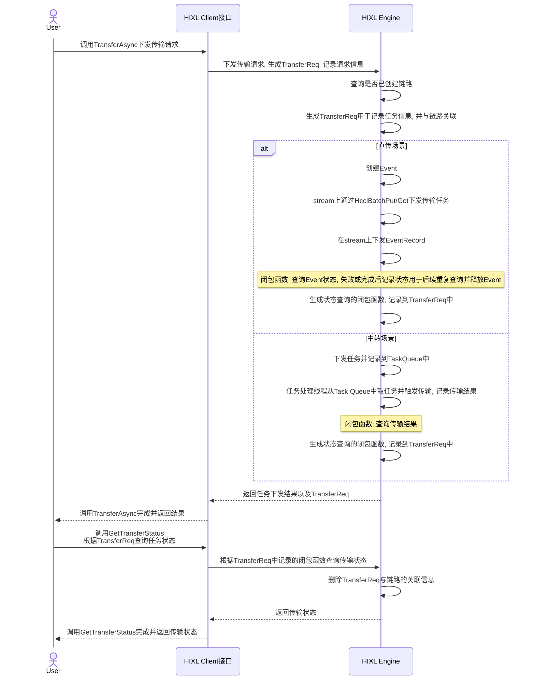

# 支持异步传输

## 需求描述
[简要描述要做什么，解决什么问题]

- 背景介绍
复杂的业务场景中，通常需要与其它组件协同工作（如结合计算任务、存储操作等），异步传输可实现 “非阻塞” 的任务编排。例如，在传输数据的同时，可并行执行数据处理、校验或存储操作，无需等待传输完成，从而优化端到端的流程效率。
如果采用同步传输，用户需等待数据传输完成后才能继续后续操作，若传输过程中出现延迟（如网络波动、数据收发处理缓慢），会导致用户线程资源被长时间占用，无法处理其它任务，造成资源浪费。异步传输允许用户在发出数据后立即继续执行其它操作，无需等待响应，提高了CPU、网络等资源的利用率，尤其适合高并发、大数据量的传输场景。

- 需要做什么
HIXL需提供异步传输和状态查询的能力。

## 功能要点
- [ ] HIXL支持异步传输
- [ ] HIXL支持异步传输状态查询

## 技术方案
[简单的技术实现思路]
新增API如下：
```
  using TransferReq = void *;
  struct TransferArgs {
    uint8_t reserved[128] = {};
  };
  enum TransferStatus {
    WAITING,     // 传输中
    COMPLETED,   // 传输完成
    TIMEOUT,     // 传输超时, 暂不支持
    FAILED       // 传输失败
  };

  /**
   * @brief 批量异步传输,下发传输请求
   * @param [in] remote_engine 远端Hixl引擎的唯一标识
   * @param [in] operation 操作类型, 支持读或写远端Hixl引擎的内存
   * @param [in] op_descs 批量读写的本地及远端内存信息
   * @param [in] optional_args 可选参数, 预留
   * @param [out] req 传输请求, 用于后续查询传输状态
   * @return 成功:SUCCESS, 失败:其它.
   */
  Status TransferAsync(const AscendString &remote_engine, TransferOp operation, const std::vector<TransferOpDesc> &op_descs, const TransferArgs &optional_args, TransferReq *req);
```
```
  /**
   * @brief 获取传输状态
   * @param [in] req 传输请求, 由TransferAsync API调用生成
   * @param [out] status 传输状态
   * @return 成功:SUCCESS, 失败:其它.
   */
  Status GetTransferStatus(TransferReq req, TransferStatus &status);
```
使用说明:
1. 调用TransferAsync下发传输请求, 得到req
2. 利用req调用GetTransferStatus查询对应传输请求的完成状态

约束:
1. 下发传输请求后, 必须查询任务状态。如果不查询, 可能残留资源
2. 查询传输请求状态时, 如果status为COMPLETED或出错, 则req资源会被回收, 无法继续使用
3. 异步传输由用户自行判断是否超时, 超时为不可恢复异常, 需销毁链路重新创建。销毁链路时, 将清理该链路下的传输请求

关键时序图如下：



## 验收标准
1. 异步传输功能要点测试通过
2. 异步传输性能与同步传输保持一致

## 备注
[其他需要说明的事项]
1. 下发传输任务生成TransferReq后, 必须通过GetTransferStatus查询任务状态。如果不查询, 可能残留资源
2. 异步传输时, 用户自行判断是否超时。如果用户认为超时, 需销毁链路。销毁链路时, 将清理所有相关的请求资源
3. 暂不提供批量查询传输请求状态的接口, 后续看是否有使用场景
