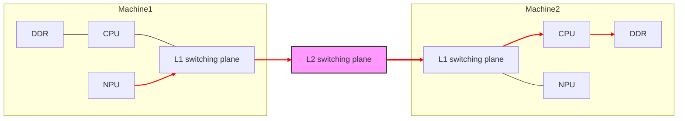

# FabricMem Mode
## Background

With the exponential growth of Large Language Model (LLM) parameter scales, inference deployment faces unprecedented memory pressure. Taking GPT‑4–class models as an example, hundreds of billions of parameters require hundreds of gigabytes of GPU memory just for weights under FP16 precision. However, the largest memory consumption comes from the KV Cache—in long‑sequence inference scenarios, KV Cache capacity demands often exceed the model weights themselves several times over.

The industry response is to build a **multi‑level caching architecture**, using GPU memory as the L1 cache, distributed DRAM as the L2 cache, and SSD/NVMe as the L3 cache. Distributed KV Cache systems such as Mooncake are becoming mainstream choices. HIXL, as a transport backend, has already integrated with Mooncake, making efficient cross‑supernode KV Cache transfer a core challenge.

In DRAM‑based distributed memory pools, traditional solutions rely on RoCE (RDMA over Converged Ethernet) networks, which deliver about 20 GB/s of saturated bandwidth. In Atlas 800T A3 SuperPoD deployments, this becomes a significant performance bottleneck. To address this, HIXL provides the FabricMem mode, increasing intra‑SuperPoD transfer bandwidth to the order of 100 GB/s.

## Overall Solution

In an Atlas 800T A3 SuperPoD, the DRAM memory of all compute nodes is uniformly addressed, allowing NPUs to directly access the remote node memory via high-speed HCCS links.

The core benefits of FabricMem are as follows:

- **Unified DRAM addressing within a SuperPoD**: breaking node boundaries to pool memory resources
- **High-bandwidth D2RH/RH2D transfers**: high‑speed bidirectional channels between device and remote host 
- **CPU‑bypass unilateral communication**: source‑initiated transfers with zero overhead on the peer side

### VMM-based Memory Management

The FabricMem mode relies fundamentally on CANN's **Virtual Memory Manager** mechanism, enabling globally unified addressing and direct access by all processes. The implementation is as follows: 

1. Each process allocates its own on‑chip memory and DRAM memory: It first calls `aclrtMallocPhysical` to allocate physical memory, then calls `aclrtReserveMemAddress` to reserve virtual memory, and finally calls `aclrtMapMem` to map the physical memory to the virtual memory. 
2. Exchanges physical addresses.
3. Maps the physical address to the access process's page table.
4. Initiates SDMA access to read and write a process's on-chip memory and DRAM memory.

Data flow for writing data from the local NPU on-chip memory to the remote host memory:

## Installation and Runtime Dependencies

| Dependency                             | Version Requirement                                                                                                                |
| -------------------------------- |----------------------------------------------------------------------------------------------------------------------|
| HDK                              | [25.5 or later](https://support.huawei.com/enterprise/en/ascend-computing/ascend-hdk-pid-252764743/software)               |
| LingQu Computing Network| [1.5.0 or later](https://support.huawei.com/enterprise/en/ascend-computing/lingqu-computing-network-pid-258003841/software)|
| CANN                             | **Later than 9.0**                                                                                                           |

Note: HDK 25.5 does not support the `aclrtMemRetainAllocationHandle` API. You must use ADXL‑provided `MallocMem` and `FreeMem` APIs to manage the host memory. HDK 26.0 or later allows direct calls to ACL APIs for host memory management. 
- **Enabling method**: During engine initialization, configure `OPTION_ENABLE_USE_FABRIC_MEM` in `options`. The value `1` enables FabricMem while `0` disables it. See HIXL API · options.
- **Optional global configuration**: Use `OPTION_GLOBAL_RESOURCE_CONFIG` to configure the capacity, start address, and per-task stream counts of the Fabric virtual memory pool. See the `fabric_memory.*` field in [HIXL API]. 

**Hardware scope**: Only **Atlas A3 training products** and **Atlas A3 inference products** are supported.

## Performance Reference

### Real‑World Single‑Node 16‑NPU Benchmark

**Benchmark program**: `fabric_mem_kv_benchmark`

**What is tested**: The size of a single block matches the DeepSeek-R1 KV shape, **61 x 128 KB + 61 x 16 KB = 8784 KB/block**. Total blocks are evenly distributed among NPUs for counts of 16 / 32 / 48 / 64; **Put (D2RH) is performed only on rank 0**; **Get (RH2D) is executed on every NPU**. The displayed Get time is **arithmetic mean over 10 runs**. 

### Large‑Block Data Bandwidth Test

| Data Transfer Direction                         | Data Size Per Run (GB)| Time (µs)| Bandwidth (GB/s)|
|---------------------------------|-----------------|------------|----------|
| RH2D                            | 1 | 9723| 103      |
| RH2D                            | 2 | 19388| 103      |
| D2RH                            | 1 | 15650| 64       |
| D2RH                            | 2 | 31250| 64       |
| RD2D                            | 1 | 6500| 155      |
| RD2D                            | 2 | 12929| 155      |
| D2RD                            | 1 | 7832 | 128      |
| D2RD                            | 2 | 15643 | 128      |

> Note: 1 GB/s = 1024 x 1024 x 1024 B/s
