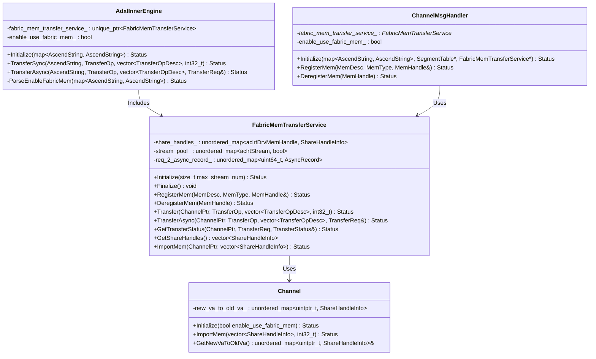
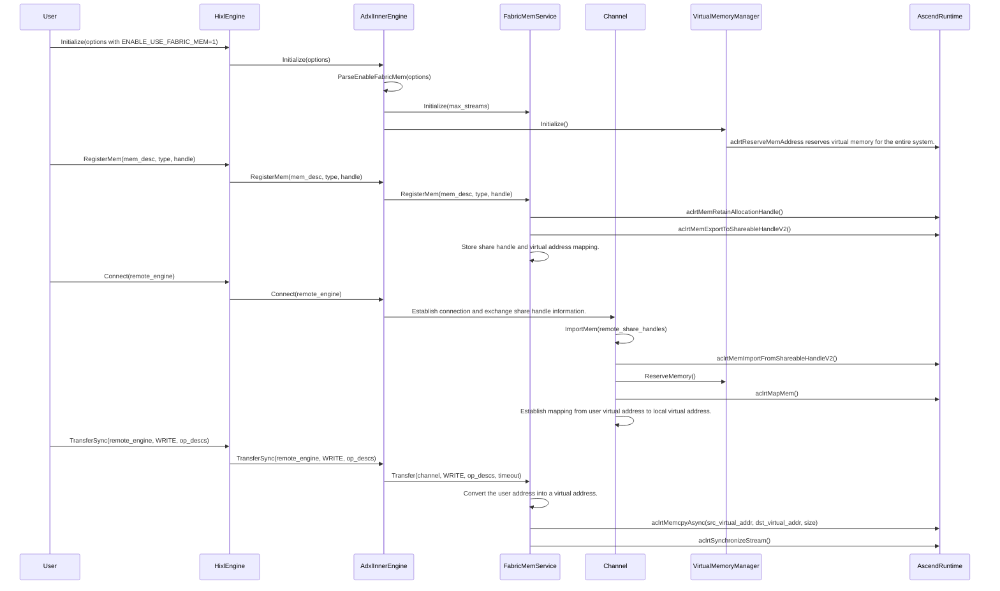

#### Fabric Mem Transmission Mode Requirements
##### Overview
**Background**
1. As the scale of Large Language Model (LLM) inference expands, the size of the KV Cache is growing significantly. The industry has adopted multi-level caching solutions, represented by Mooncake. The Mooncake Store component can be used to build a distributed DRAM cache pool, which places higher demands on the transmission performance of data transferred from the NPU's HBM to DRAM (D2RH).
2. The A3 server provides Fabric Memory technology, which supports unified addressing of DRAM within a supernode. It can utilize the HCCS link for D2RH/RH2D transfers, with measured transmission bandwidths reaching 64 GB/s and 103 GB/s, respectively. In contrast, the RoCE transmission bandwidth is only 20 GB/s.
3. Limitations and disadvantages of other modes:
   * The HCCS transfer mode, which calls the underlying HCCL interface, does not support D2RH transfers.
   * The performance of the relay mode on the A3 is limited by the lack of PCIe, and it competes with the model for HBM bandwidth, significantly impacting model inference.

##### Input/Output
**Introduction to Inputs during Usage**
1. **Configuration Option**: Enable Fabric Mem mode via the `OPTION_ENABLE_USE_FABRIC_MEM` option, where a value of `1` indicates enabled.
2. **Memory Description**: Register memory using the `MemDesc` structure, which includes the memory address and length.
3. **Transfer Operation**: Use the `TransferOp` enum (READ/WRITE) to describe the direction during transfer, and use `TransferOpDesc` to describe the transfer addresses.

**Example:**
```cpp
// Initialize the HIXL engine, enabling Fabric Mem mode.
Hixl engine1;
std::map<AscendString, AscendString> options1;
options1[OPTION_ENABLE_USE_FABRIC_MEM] = "1";
engine1.Initialize("127.0.0.1", options1);

// Register the memory.
std::vector<uint8_t> buffer(size, 0xAA);
hixl::MemDesc mem_desc{};
mem_desc.addr = reinterpret_cast<uintptr_t>(buffer.data());
mem_desc.len = size;
MemHandle handle = nullptr;
engine1.RegisterMem(mem_desc, MEM_HOST, handle);

// Establish a connection.
engine1.Connect("127.0.0.1:26001");

// Perform the transfer.
TransferOpDesc desc{src_addr, dst_addr, size};
engine1.TransferSync("127.0.0.1:26001", WRITE, {desc});
```

**Introduction to Outputs during Usage**
1. **Memory Handle**: When registering memory, a `MemHandle` type is returned to identify the registered memory region.
2. **Transfer Request**: During asynchronous transfer, a `TransferReq` type is returned for querying the status of the asynchronous transfer.
3. **Transfer Status**: When querying the status of an asynchronous task, a `TransferStatus` enum is returned to indicate the completion status of the asynchronous transfer.

##### Processing


**Class Diagram**


**Sequence Diagram** (Data Transfer in Fabric Mem Mode)


**Introduction to the Overall Feature Processing**
1. **Initialization Phase**
   - The user enables Fabric Mem mode via the `OPTION_ENABLE_USE_FABRIC_MEM` option.
   - `AdxlInnerEngine` parses the option and creates a `FabricMemTransferService` instance.
   - Upon service initialization, it obtains the device ID and sets the maximum number of streams.

2. **Memory Registration Phase**
   - The user calls `RegisterMem` to register memory.
   - `FabricMemTransferService` obtains the physical memory handle via `aclrtMemRetainAllocationHandle`.
   - It exports the handle as a Fabric-shareable handle using `aclrtMemExportToShareableHandleV2`.
   - The share handle information is stored in the `share_handles_` map.

   **Specifics of H2H Transfer Mode**
   - For HOST memory, Fabric Mem transfer requires additional conversion processing.
   - HOST memory must first obtain the physical memory handle via `aclrtMemRetainAllocationHandle`.
   - Then, it is exported as a shareable handle using `aclrtMemExportToShareableHandleV2`.
   - Subsequently, VMM mapping is performed to map the physical memory to the virtual address space.

3. **Connection Establishment Phase**
   - When establishing a connection, both sides exchange memory registration information: primarily the `share_handles_` information.
   - The remote end imports the remote memory's share handles via `ImportMem`.
   - It imports the share handles using `aclrtMemImportFromShareableHandleV2` and maps them to the virtual address space.
   - It establishes the mapping relationship from local virtual addresses to remote virtual addresses.

4. **Data Transfer Phase**
   - First, convert the user virtual address to the mapped virtual address.
   - Obtain the required stream resources from the stream pool. Currently, 4 streams are used by default per task, which is customizable.
   - Execute memory copy operations between devices using `aclrtMemcpyAsync`.
   - For synchronous transfer, it blocks and waits. For asynchronous transfer, it issues an EventRecord on an additional stream, uses `aclrtStreamWaitEvent` to establish the relationship between the copy task stream and the additional EventRecord stream, and queries the task status by calling `aclrtQueryEventStatus`.

5. **Resource Cleanup Phase**
   - The user calls `DeregisterMem` to unregister memory.
   - Release the physical memory handle and share handle.
   - Clean up all resources, including streams, asynchronous resources, and imported memory mappings.

##### End-to-End Usage Flow

1. **Memory Allocation**
   ```cpp
   // Use `aclrtReserveMemAddress` to reserve virtual address space.
   aclrtReserveMemAddress(&va, mem_size, 0, nullptr, 1);

   // Configure physical memory attributes: device memory and huge page mode.
   aclrtPhysicalMemProp prop{};
   prop.handleType = ACL_MEM_HANDLE_TYPE_NONE;
   prop.allocationType = ACL_MEM_ALLOCATION_TYPE_PINNED;
   prop.memAttr = ACL_HBM_MEM_HUGE;
   prop.location.type = ACL_MEM_LOCATION_TYPE_DEVICE;
   prop.location.id = device_id;

   // Allocate physical memory and map it to the virtual address space.
   aclrtMallocPhysical(&pa_handle, mem_size, &prop, 0);
   aclrtMapMem(va, mem_size, 0, pa_handle, 0);

   // Initialize memory data: Copy data from the host to the device.
   aclrtMallocHost(&host_data, mem_size);
   memset_s(host_data, mem_size, device_id, mem_size);
   aclrtMemcpy(va, kMemSize, host_data, mem_size, ACL_MEMCPY_HOST_TO_DEVICE);
   ```
   - Unlike traditional memory allocation, Fabric Mem requires the use of physical memory handles.
   - It requires explicit mapping of physical memory to virtual addresses.
   - Huge page mode (`ACL_HBM_MEM_HUGE`) is used to improve performance.

2. **Engine Initialization and Memory Registration**
   - Enable Fabric Mem mode: `options[OPTION_ENABLE_USE_FABRIC_MEM] = "1"`
   - Initialize HIXL
   - Register specially allocated memory: `engine.RegisterMem(desc, MEM_DEVICE, handle)`

3. **Connection Establishment and Data Exchange**
   - Call the `Connect` method to establish a connection.

4. **Data Transfer and Verification**
   - Execute D2D transfer: `engine.TransferSync(remote_engine, WRITE, {desc})`
   - Verify transfer results: Read the data written remotely and verify it.

**Key Features of the End-to-End Flow**
- Memory allocation requires using special physical memory APIs instead of the traditional `aclrtMalloc`.
- It requires explicit management of the mapping relationship from virtual addresses to physical memory.
- After the transfer is complete, verification is required to ensure data correctness.


##### Key Checkpoints
**List of Checkpoints**
1. **Configuration Conflict Check**: Fabric Mem mode and Buffer Pool mode cannot be enabled simultaneously; this is checked in `ParseBufferPoolParams`.
2. **Memory Type Check**: In Fabric Mem mode, device memory registration requires special handling.
3. **Transfer Parameter Check**: Verify that the address range in the transfer descriptor is within the registered memory range.
4. **Stream Resource Management Check**: Ensure stream resources in the stream pool are correctly allocated and released to avoid resource leaks.
5. **Asynchronous Request Status Check**: Correctly track request status during asynchronous transfers to ensure accurate status queries.
6. **Memory Mapping Cleanup Check**: Correctly clean up imported memory mapping relationships when the connection is disconnected.
7. **Concurrency Safety Check**: Ensure safe access to shared data structures in a multi-threaded environment.
8. **Peer Abnormal Offline**: When the peer goes offline abnormally, relevant resources need to be cleaned up to avoid resource leaks.

**Performance Key Points**
1. **Stream Pool Management**: Pre-create and manage device streams to avoid the overhead of frequent creation and destruction.
2. **Multi-stream Concurrency**: Support the concurrent processing of multiple streams in a single task.
3. **Asynchronous Operations**: Support asynchronous transfers, allowing the overlapping of computation and communication.

**Compatibility Considerations**
1. **Backward Compatibility**: Fabric Mem mode is not enabled by default, maintaining compatibility with traditional modes.
