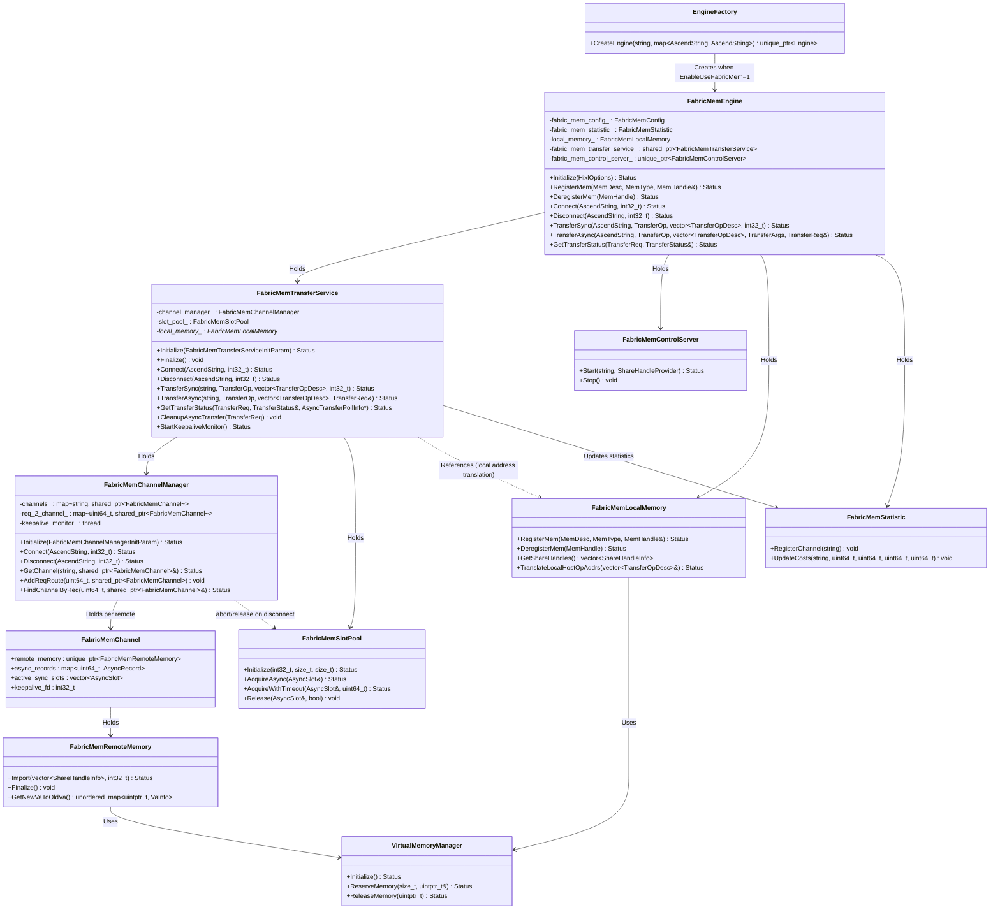
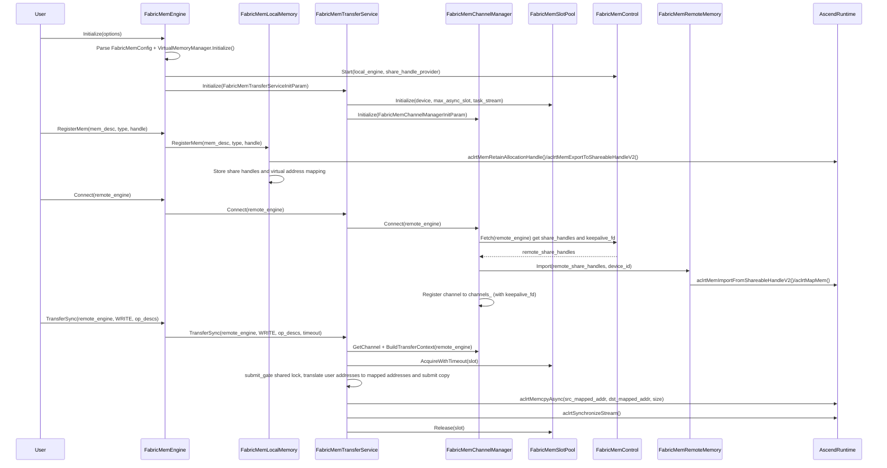

# FabricMem Transmission Mode Requirements

##### Introduction

**Background**:
1. As the scale of Large Language Model (LLM) inference expands, KV Cache scales become increasingly large. Mooncake store and other distributed DRAM cache pool scenarios place higher demands on NPU to DRAM (D2RH) transmission performance.
2. A3 servers provide FabricMemory technology, supporting unified addressing of DRAM within superpods, enabling D2RH/RH2D transmission via HCCS links.
3. Limitations and disadvantages of other modes:
    * HCCS transmission mode calling underlying HCCL interfaces does not support D2RH transmission.
    * Relay mode on A3 occupies HBM bandwidth, significantly impacting model inference.

##### Input & Output

**Input description during usage**:
1. **Configuration option**: Enable FabricMem mode via `OPTION_ENABLE_USE_FABRIC_MEM` option, value "1" means enabled.
2. **Memory description**: Use `MemDesc` structure when registering memory, containing memory address and length.
3. **Transfer operation**: Use `TransferOp` enum (READ/WRITE) to describe direction during transfer, use `TransferOpDesc` to describe transfer addresses.

**Usage example**:
```cpp
// Initialize HIXL engine, enable FabricMem mode
Hixl engine1;
std::map<AscendString, AscendString> options1;
options1[OPTION_ENABLE_USE_FABRIC_MEM] = "1";
engine1.Initialize("127.0.0.1:26000", options1);

// Register memory
std::vector<uint8_t> buffer(size, 0xAA);
hixl::MemDesc mem_desc{};
mem_desc.addr = reinterpret_cast<uintptr_t>(buffer.data());
mem_desc.len = size;
MemHandle handle = nullptr;
engine1.RegisterMem(mem_desc, MEM_HOST, handle);

// Establish connection
engine1.Connect("127.0.0.1:26001");

// Execute transfer
TransferOpDesc desc{src_addr, dst_addr, size};
engine1.TransferSync("127.0.0.1:26001", WRITE, {desc});
```

**Output description during usage**:
1. **Memory handle**: Returns `MemHandle` when registering memory, used to identify registered memory region.
2. **Transfer request**: Returns `TransferReq` during async transfer, used for async transfer status query.
3. **Transfer status**: Returns `TransferStatus` enum when querying async task status.

##### Processing

FabricMem is carried by independent `FabricMemEngine`, no longer intruding `HixlEngine`, `AdxlInnerEngine`, `ChannelMsgHandler` or `Channel`. `EngineFactory` creates `FabricMemEngine` when discovering `OPTION_ENABLE_USE_FABRIC_MEM=1`, subsequent registration, connection, transfer, statistics and cleanup are handled by `src/hixl/fabric_mem` and `src/hixl/engine/fabric_mem_engine.cc`.

**Class Diagram**:


**Sequence Diagram** (Data transfer in FabricMem mode):


**Overall feature processing flow introduction**:
1. **Initialization phase**:
    - User enables FabricMem mode via `OPTION_ENABLE_USE_FABRIC_MEM` option.
    - `EngineFactory` creates `FabricMemEngine` based on this option, not entering `AdxlInnerEngine` or `HixlEngine`.
    - `FabricMemEngine` parses `FabricMemConfig`, initializes `VirtualMemoryManager`, `FabricMemTransferService`, `FabricMemControlServer` and `FabricMemStatistic`.

2. **Memory registration phase**:
    - User calls `RegisterMem` to register memory.
    - `FabricMemTransferService` obtains physical memory handle via `aclrtMemRetainAllocationHandle`.
    - Uses `aclrtMemExportToShareableHandleV2` to export as Fabric-shareable handle.
    - Stores share handle information in `share_handles_`.

    **H2H transfer mode specifics**:
    - For HOST memory, FabricMem transfer requires additional conversion processing.
    - HOST memory needs to first obtain physical memory handle via `aclrtMemRetainAllocationHandle`.
    - Then use `aclrtMemExportToShareableHandleV2` to export as shareable handle.
    - Then perform VMM mapping, mapping physical memory to virtual address space.

3. **Connection establishment phase**:
    - Local `FabricMemChannelManager` pulls `share_handles_` from remote `FabricMemControlServer` via `FabricMemControlClient`.
    - `FabricMemChannelManager` imports remote memory's share handles via `FabricMemRemoteMemory`.
    - Uses `aclrtMemImportFromShareableHandleV2` to import share handles, mapping to virtual address space.
    - Establishes mapping from remote user address to local mapped address, registers to `channels_` connection table.

4. **Data transfer phase**:
    - `FabricMemEngine` obtains channel via `FabricMemChannelManager` and builds `FabricMemTransferContext`.
    - `FabricMemTransferService` performs user address and mapped address translation.
    - Acquires stream resources needed for tasks from stream pool.
    - Uses `aclrtMemcpyAsync` to execute memory copy operation.
    - Sync transfer blocks and waits; async transfer appends host flag D2H on each copy stream, polls host flag to determine completion (no longer uses EventRecord/query event).
    - Transfer duration, real copy duration, total bytes and op desc count are recorded in `FabricMemStatistic`.

5. **Resource cleanup phase**:
    - User calls `DeregisterMem` to deregister memory.
    - Releases physical memory handle and share handle.
    - On connection disconnect or Finalize, cleans up remote imported mappings, streams, async resources (including host flag pool) and statistics channels; `Disconnect` immediately aborts in-flight sync/async streams for that channel (not waiting for transfer completion), clears its async record and request routing, then destroys async slot.

##### Concurrency and Lock Design

**Design premise**: Does not consider `Finalize` concurrent with external APIs; external API entry only does `is_initialized_` check.

**Component responsibilities**:
- `FabricMemEngine`: Thin facade, orchestrates TransferService / LocalMemory / ControlServer; holds `FabricMemLocalMemory`, does not hold connection table or async record.
- `FabricMemTransferService`: External transfer facade, holds `FabricMemChannelManager` and `FabricMemSlotPool`; responsible for copy orchestration, async record query/completion (including prof metadata).
- `FabricMemChannelManager`: Connection lifecycle (Fetch/Install/Disconnect), request routing `req_2_channel_`, outbound keepalive thread, disconnect immediately aborts.
- `FabricMemSlotPool`: async slot (stream + host flag) pool.
- `FabricMemLocalMemory`: Local memory registration, Export, share handle management.
- `FabricMemRemoteMemory`: Single channel imported remote memory mapping (held by channel).

**Lock hierarchy**:

| Component | Lock | Protected Object |
|------|-----|----------|
| Engine | `mutex_` | Initialize/Finalize orchestration |
| LocalMemory | `share_handle_mutex_` | `share_handles_` (including overlap check) |
| ChannelManager | `connect_mutex_` | Fetch + Install serialization (independent, no `channels_mutex_` held during network I/O phase) |
| ChannelManager | `channels_mutex_` | `channels_` connection table and `initialized_` |
| ChannelManager | `req_route_mutex_` | `req_2_channel_` request routing table |
| Channel | `submit_gate` (`shared_mutex`) | Transfer submission and disconnect mutual exclusion: submission holds **shared lock** parallel copy submission, disconnect `AbortAndClearChannelRecords` holds **exclusive lock** drain in-flight submission then abort/unmap (abort-before-unmap) |
| Channel | `records_mutex` | Single channel's `disconnecting` / `async_records` / `active_sync_slots` brief bookkeeping (not including copy submission) |
| SlotPool | `pool_mutex_` | slot pool (leaf lock) |
| RemoteMemory | `mutex_` | Single channel imported mapping (leaf lock) |
| ControlServer | `State::mutex` | `sessions` / `client_id_to_fd` / listen and epoll fd; all sends outside lock |

**Fixed lock order**:
1. `channels_mutex_` held independently, no network I/O inside.
2. Single channel: `submit_gate` → `records_mutex`: transfer submission holds `submit_gate` shared lock, only briefly holds `records_mutex` when registering record/slot; `AbortAndClearChannelRecords` first holds `submit_gate` exclusive lock then `records_mutex`.
3. `submit_gate` → `req_route_mutex_`: `IssueAsyncCopyAndRegister` calls `AddReqRoute` **after** releasing `records_mutex`, still holding `submit_gate` shared lock; `RemoveReqRoute` calls after releasing `submit_gate`. Reverse order prohibited.
4. `connect_mutex_` and `channels_mutex_` separated.
5. `pool_mutex_` / `share_handle_mutex_` / RemoteMemory `mutex_` are leaf locks, no nesting with above locks.

**Cross-component rules**: Engine API does not nest locks across multiple components; typical transfer path is TransferService via ChannelManager get channel → hold `submit_gate` shared lock submit copy, inside `records_mutex` register record/slot, async path then hold `submit_gate` shared lock call `AddReqRoute` → `GetTransferStatus` queries stream status inside `records_mutex` and retrieves record, only blocking synchronize outside lock.

**Typical concurrency scenarios**:

| Scenario | Behavior |
|------|------|
| Multi-thread TransferSync same remote | Copy submits under `submit_gate` shared lock parallel, `records_mutex` only for registering `active_sync_slots` for disconnect abort |
| TransferAsync + GetTransferStatus | Copy submits under `submit_gate` shared lock parallel; async record protected by channel `records_mutex`; `GetTransferStatus` queries stream status inside lock and retrieves record (avoid racing with disconnect destroying stream), only needs `req` |
| Disconnect | Immediately aborts, not waiting for transfer completion: first sets `disconnecting=true`, holds `submit_gate` exclusive lock drain in-flight submissions, inside `records_mutex` retrieves and clears async record, abort sync slot (only abort); outside lock destroys async slot and clears request routing |
| keepalive thread auto-disconnect | keepalive thread encapsulated in ChannelManager; does not hold Engine lock, independent Disconnect |
| RemoveChannel | First abort/clear that channel's async record and request routing, then clean imported mapping, streams, statistics channel |

**Heartbeat**: `FabricMemControlClient::SendHeartBeat` / inbound ADXL parsing encapsulated in `fabric_mem_control`; self-connect session and remote session uniformly enable heartbeat timeout check. `ControlServer`'s worker thread only does session read and map changes inside `State::mutex`, all sends outside lock; `pending_connections` only accessed by worker thread, `Stop()` cleans map after join worker.

1. **Memory allocation**:
   ```cpp
   void *fabric_ptr = nullptr;
   Hixl::MallocMem(MEM_HOST, mem_size, &fabric_ptr);
   ```
   - FabricMem host memory allocation encapsulated by `FabricMemTransferService::MallocMem`.
   - Underlying completes virtual address reservation, physical memory allocation and mapping.
   - Released via `Hixl::FreeMem` after transfer.

2. **Engine initialization and memory registration**:
   - Enable FabricMem mode: `options[OPTION_ENABLE_USE_FABRIC_MEM] = "1"`.
   - Initialize Hixl.
   - Register memory: `engine.RegisterMem(desc, MEM_HOST, handle)` or `engine.RegisterMem(desc, MEM_DEVICE, handle)`.

3. **Connection establishment and data exchange**:
   - Call `Connect` method to establish connection.
   - `FabricMemEngine` pulls and imports remote share handles.

4. **Data transfer and verification**:
   - Execute transfer: `engine.TransferSync(remote_engine, WRITE, {desc})`.
   - Verify transfer result: read remotely written data and verify.

##### Key Checkpoints

**Checkpoint list**:
1. **Engine routing check**: `OPTION_ENABLE_USE_FABRIC_MEM=1` must be `FabricMemEngine` created by `EngineFactory`.
2. **Configuration validity check**: `FabricMemConfig` parses `EnableUseFabricMem`, `GlobalResourceConfig`, stream count, virtual address capacity and start address.
3. **Memory type check**: In FabricMem mode, HOST memory registration requires additional local import and mapping processing.
4. **Transfer parameter check**: Validates address range in transfer description is within locally registered or remotely imported memory range.
5. **Stream resource management check**: Ensures stream resources in stream pool correctly allocated and released, avoiding resource leak.
6. **Async request status check**: Async transfer correctly tracks request status, ensures status query accuracy.
7. **Memory mapping cleanup check**: Connection disconnect correctly cleans `FabricMemRemoteMemory` imported mapping relationships.
8. **Concurrency safety check**: Access to shared data structures safe in multi-thread environment.
9. **Peer abnormal offline**: When peer abnormal offline, needs to clean related resources, avoiding resource leak.

**Performance key points**:
1. **Stream pool management**: Pre-create and manage device streams, avoiding frequent creation/destruction overhead.
2. **Multi-stream concurrency**: Supports using multiple streams concurrently for single task.
3. **Async operations**: Supports async transfer, allowing overlap of computation and communication.

**Compatibility considerations**:
1. **Backward compatibility**: FabricMem mode not enabled by default, maintains compatibility with traditional ADXL/HCCL paths.
2. **Statistics attribution**: FabricMem transfer statistics maintained by `FabricMemStatistic`, ADXL side `StatisticManager` only maintains ADXL/HCCL path connection and transfer statistics.