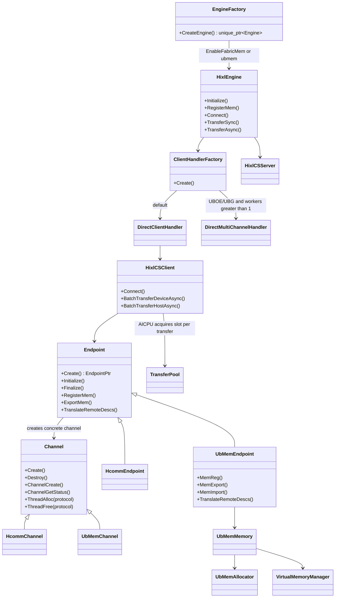
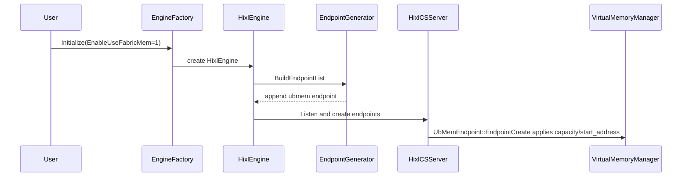
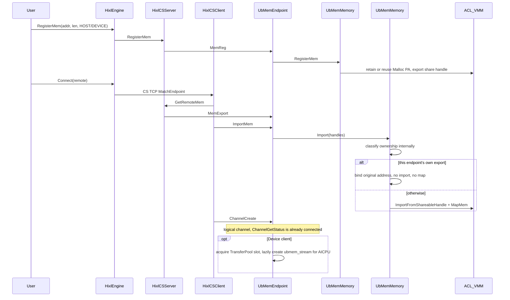
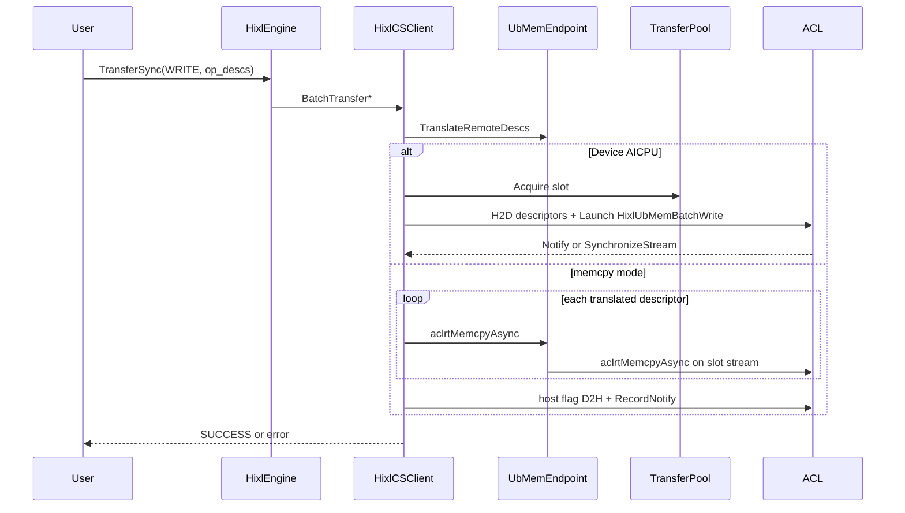

# FabricMem Transfer Mode

## Requirement

KV Cache in LLM inference is often larger than the model weights. Intra-SuperPoD RoCE saturates around 20 GB/s and becomes the bottleneck for DRAM cache pools. Atlas A3 Fabric Memory gives DRAM a unified address space inside a SuperPoD, so an NPU can read and write remote Host or Device memory over HCCS. HIXL must provide unilateral D2RH, RH2D, D2D, and H2H on that path: the source posts the copy, and the peer stays off the data plane.

The previous implementation owned a separate Engine, ControlServer, ChannelManager, and SlotPool. That duplicated HIXL CS connection, registration, and transfer control. This requirement folds FabricMem into `HixlEngine` / `hixl_cs`. `ubmem` is one transport backend. Callers still use `Initialize`, `RegisterMem`, `Connect`, `TransferSync`, and `TransferAsync`.

HCCL direct transfer cannot do D2RH. Buffer relay on A3 burns HBM bandwidth and hurts inference. FabricMem covers those two gaps. It is limited to Atlas A3 training and inference products, and matching only selects it inside one SuperPoD. Cross-SuperPoD traffic needs RoCE, UBOE, or another protocol in `protocol_desc`.

### Assumptions and open items

- **Where the per-batch cap is enforced.** The public API documents FabricMem `transfer_config.max_transfer_count_per_batch` as `[1, 1920]`. `GlobalConfig` first accepts the global range `[1, 32766]`. `DirectClientHandler` currently reapplies 1920 only for HCCS. The AICPU in-flight RTSQ budget is `kFabricMemMaxInFlightRtsqTasks = 1920`. Acceptance and error codes change depending on whether Handler validation is added or the document is relaxed.
- **Who owns the process-wide VMM.** `VirtualMemoryManager` (the VA pool) is the only process-wide singleton and follows the process lifetime; endpoints and `adxl::MallocMem` allocations are users. `UbMemEndpoint::EndpointCreate` only initializes the pool with the first endpoint's configured capacity/start address. `EndpointDestroy` does not release the global VA pool; the singleton destructor releases it. Local registrations belong to each endpoint and are released with it.

## Feature points

- [ ] After FabricMem is enabled, intra-SuperPoD unilateral D2RH / RH2D / D2D / H2H runs over HCCS without a separate Engine.
- [ ] The local side registers memory and exports a Fabric share handle. The peer imports it into local VA space, except for a handle this endpoint exported itself, which identity-binds the original VA with no import and no map. Transfers translate only peer addresses; local buffers keep the original VA.
- [ ] AICPU unfolding is the default; Host per-descriptor `aclrtMemcpyAsync` is the alternative. Cross-SuperPoD traffic does not use ubmem and falls back to RoCE/UBOE from `protocol_desc`.
- [ ] Public APIs and error codes stay on the existing HIXL semantics. On HDK 25.5, Host memory must use ADXL `MallocMem` / `FreeMem`. From HDK 26.0, callers may manage Host memory with ACL.

## Technical design

### Approach

FabricMem is no longer a side engine. The transport integration layer is `Endpoint` / `Channel` itself: shared code (the registration table, channel table, orchestration, Host VA mapping) lives in the base class, and `HcommEndpoint` / `HcommChannel` and `UbMemEndpoint` / `UbMemChannel` only add protocol specifics. `Endpoint::Create()` picks the concrete type from the protocol: ubmem yields `UbMemEndpoint`, every other protocol yields `HcommEndpoint`; `Endpoint` creates the matching Channel subclass internally instead of exposing that factory to subclasses or callers. Endpoint creation, memory registration/export/import, and logical-channel creation live on these two layers; Hcomm copies keep the existing HcommProxy path, and UBMem memcpy mode is submitted directly by `HixlCSClient`. The only process-wide singleton is the VA pool in `VirtualMemoryManager`, which follows the process lifetime; local registrations and imported mappings belong to each `UbMemEndpoint`. `UbMemAllocator` keeps process-wide state as well: the allocation table (one export per allocation) and the exported-range ledger the ownership check uses. The process-wide settings are the client's or server's own `GlobalConfig`, passed in whole through `Endpoint::Create`. This leaves `Endpoint::Create` as the only protocol branch. Method ownership: `EndpointCreate/Destroy/GetListenPort`, `MemReg/Unreg/Export/Import/Unimport`, and `TranslateRemoteDescs` belong to Endpoint; `ChannelCreate/Destroy/GetStatus` and `ThreadAlloc/ThreadFree` belong to Channel as protocol hooks that `HcommChannel` / `UbMemChannel` override. `TransferPool` registers its slots before any channel exists, so `Initialize` takes the endpoint protocol instead of holding a channel object as the key source. These hooks only take what the object cannot know itself: one Channel is one channel and one Endpoint is one endpoint, so apart from `EndpointCreate` / `ChannelCreate` (which produce the handle) no hook is passed its own handle and the implementations read `GetHandle()`.

Callers have two equivalent switches after parse:

1. `OPTION_ENABLE_USE_FABRIC_MEM=1`
2. `ubmem` in `protocol_desc` under `OPTION_GLOBAL_RESOURCE_CONFIG`

`HixlOptions::ApplyUbMemEquivalence()` sets `enable_fabric_mem` to true and ensures `protocol_desc` contains `ubmem`. `fabric_memory.task_stream_num` and `multi_channel.num_workers` are aligned: one copies to the other; both set must match. AICPU unfolding allows `num_workers=1` only.

`EngineFactory` creates `HixlEngine` when FabricMem is on. Listen, GetEndpointInfo, GetRemoteMem, and channel control stay on CS.

`EndpointGenerator` appends one `protocol=ubmem, placement=device` endpoint. A5 auto generation does not append it even when `protocol_desc` carries the `ubmem` token: FabricMem is available on A3 only, so the filter drops `ubmem` on A5. `fabric_memory.enable_aicpu_unfold` selects only the data-plane submission mode and never changes endpoint placement. This endpoint does not listen on a NIC port. `EndpointGetListenPort` returns not supported. `EndpointStore` matches ubmem by Host/Device location only, not by `comm_id`.

`HixlOptions::ApplyUbMemEquivalence()` sets `enable_fabric_mem` to true and ensures `protocol_desc` contains `ubmem`. `fabric_memory.task_stream_num` and `multi_channel.num_workers` are aligned: one copies to the other; both set must match. AICPU unfolding allows `num_workers=1` only.

The handler type is DIRECT. UB_MEM always keeps a single `DirectClientHandler`, regardless of the AICPU or memcpy mode and worker count.

### Module relationships



### Enablement, matching, and initialization

#### Core flow



`HixlCSServer` / `HixlCSClient` pass their own `GlobalConfig` through to `Endpoint::Create` rather than singling out a sub-struct; only a ubmem endpoint reads it and every other protocol ignores it. Capacity and start address come from `fabric_memory.max_capacity` and `fabric_memory.start_address`, in TB, and `UbMemEndpoint::EndpointCreate` applies them before `VirtualMemoryManager::Initialize`. An endpoint created afterwards fails if its configuration disagrees with the values already in effect, matching the previous protocol-level init conflict check.

`TransferPool` owns one slot type for every protocol. Each slot allocates a real Hcomm thread, so a device client initialized first under UB_MEM and a later client using another protocol share the same thread model. The slot also carries an `aclrtStream ubmem_stream`, created lazily for UB_MEM AICPU transfers only, where it supplies the RTSQ metadata for kernel parameters; it is released on abort or slot teardown.

### Allocation, registration, and share handles

Host memory on HDK 25.5 cannot call `aclrtMemRetainAllocationHandle`. That path must use ADXL `AdxlEngine::MallocMem` / `FreeMem`, which is `UbMemAllocator`: reserve VA, allocate PA, `aclrtMapMem`. Host `MallocMem` calls `aclrtMemSetAccess` so the NPU can reach that DRAM. ACL export is allowed once per physical allocation; the handle is cached in the allocator. From HDK 26.0, callers may allocate with ACL and then `RegisterMem`.

`HixlEngine::RegisterMem` goes only to CS Server endpoints. If `protocol_desc` contains both `ubmem` and `roce:device`, the same user buffer is registered on both endpoints. There is no extra `extra_mem_handle` path.

`UbMemEndpoint::MemReg` calls `UbMemMemory::RegisterMem`:

- Memory from this process's `MallocMem` is exported only. It is not imported locally. Transfers use the original VA.
- Foreign memory retains the full PA with `aclrtMemRetainAllocationHandle` and exports by page. Adjacent user ranges may share one PA.

`MemExport` encodes `ShareHandleInfo` as JSON bytes in the CS `export_desc`. On connect, the client `GetRemoteMem`s, the server `ExportMem`s, and the client `ImportMem`s. `ImportMem` decodes the payload and hands the entire list to `UbMemMemory::Import()`; ownership classification, identity binding, and foreign import all remain inside `ubmem_memory.cc`. The server's `ExportMem` only exports the server endpoints held in its own store, so nobody ever fetches the registrations of a client endpoint: on the ubmem path `HixlCSClient::RegMem` / `UnRegMem` therefore return success without a local registration or export.

- **A range this process exported**: Ownership classification happens inside `UbMemMemory::Import()` and has two sources of evidence: this endpoint's own export records, and the process-wide ledger of exported ranges (`UbMemAllocator::RecordExportedRange` / `IsRangeExportedHere`). A handle is looked up by share handle bytes plus `va_addr` and `len`. A hit means the peer's buffer is already addressable here and is bound directly to its original address: the translation table holds the peer address as both key and value, with no import, no `aclrtMapMem`, and no VMM reservation. The check never compares address numbers, because both processes start their VMM pool at 40 TB and allocate in 1 GB blocks, so cross-process address ranges do collide; an ACL share handle identifies its exporter, so another process's handles never match. No device id takes part: a ubmem endpoint only ever registers memory of the device it runs on, so it never has to tell two devices' registrations apart.

  The process-wide ledger is required rather than redundant: a fabric share handle only works **across** processes (export means "share to other process", and import has no flag that would allow a same-process import), so a range this process exported can never be imported here and has to be identity-bound. Judging ownership by the local export records alone stayed invisible only while both the server and the client registered the same buffer in one process, because then each endpoint had its own matching record. The ubmem CS client skips that registration, so its records are empty and the ledger is the only evidence left. The ledger records `{va, len, share_handle}` on every successful local export, refcounted because one export can be shared by several registrations (the allocator exports once per allocation), and drops the range when the registration that holds it releases it.
- **Everything else** (ranges this process never exported, including a peer in another process): the memory module reserves **one contiguous local address range** covering the whole span of the peer's export, then imports each PA block with `aclrtMemImportFromShareableHandleV2` and maps it at the offset that block occupies inside the span. One peer address range therefore stays one contiguous local address range with the same offsets, even when several PA blocks back it. The translation table keys peer user addresses and stores locally mapped addresses.

`UbMemMemory` records per mapping whether it was imported or identity-bound. An identity entry was never mapped and holds no VMM reservation, so releasing it only drops the entry. Imported entries are found by `Unimport()` through the share handle identity and then unmapped and freed with `aclrtFreePhysical`. The reservation of one `Import` is shared by all of its ranges, so releasing a range only drops its reference and the block goes back to the VMM once the last one is gone; a partial `Unimport` never disturbs its siblings. The lookup matches on the handle bytes rather than the address, because cross-process address ranges collide and because the local registration that classified the handle may already be deregistered. Both kinds land in the translation index, so `TranslateRemoteDescs` needs no special case.

The `MemUnimport` hook is the entry point for that release: it decodes `export_desc` and hands the handles to `Unimport()`. `Endpoint::UnimportMem()` validates and then calls it; on the CS client side `HixlCSClient::CloseImportedBufs()` calls `UnimportMem()` once per imported descriptor, and `ClearRemoteMemInfo()` then reclaims the descriptor buffers. The import lifetime therefore follows the descriptor: `ImportRemoteMem()` calls `ClearRemoteMemInfo()` first, so a Connect retry cannot accumulate mappings, and `HixlCSClient::Destroy()` releases again while the release inside `EndpointDestroy` only acts as a backstop. A handle that was never mapped here logs a warning instead of failing, because this runs on teardown paths.

An identity binding holds no ACL reference and no VMM reservation. If the user calls `FreeMem` / `DeregisterMem` on that memory while a connection is alive, the addresses in the channel dangle — the same constraint that already applies to locally registered memory.

`Endpoint::TranslateRemoteDescs` rewrites only `remote_buf` before a transfer. One import is one contiguous local range and one translation entry, so a user range inside it is never split; only a range spanning several imports, or one whose part was released, becomes one descriptor per mapped range. Local `local_buf` stays on the original VA.

#### Core flow



### Data transfer

The CS client endpoint is always Device. `HixlCSClient` only dispatches UB_MEM transfers to `UbMemEngine`; non-UB_MEM transfers keep the existing device and host paths. The UB_MEM engine owns mode selection, address rewriting, descriptor preparation, AICPU launch, host-submitted memcpy, completion handles, and failure latching.

`enable_aicpu_unfold=true` uses the AICPU kernel; `false` uses Host-submitted memcpy on the Device stream. Both paths enter `UbMemEngine::TranslateUbMemOpDescs`, which delegates to `Endpoint::TranslateRemoteDescs`. That ubmem-only hook rewrites `remote_buf` and may expand one descriptor into several; Hcomm uses the base-class default and returns nothing.

An empty result means nothing was rewritten, so the caller's original array is submitted. Translation cannot write in place: the caller's array is const and the rewrite can grow.

**AICPU (default)**

1. `BuildUbMemTransferDescs` splits each op into AICPU descriptors. A copy larger than 4 GiB is cut at the `uint32` max so one descriptor is one SDMA SQE.
2. Descriptors are copied to Device, then `HixlUbMemBatchRead` / `HixlUbMemBatchWrite` launches. `UbMemAicpuKernelParam` carries translated VA ranges, the worker RTSQ, optional Notify, timeout, and `transfer_ctx_key` — which reuses the slot's `thread`, exactly as the Hcomm AICPU kernels do, instead of minting a second key. The kernel must not take communication channel objects.
3. One kernel accepts at most 128 descriptors. `max_transfer_count_per_batch` is the logical batch and Notify boundary. A kernel never crosses a batch. STARS queue depth still follows the 2K model: 1920 in-flight entries, plus NotifyRecord, plus one ring slot left empty.
4. Sync transfer uses `aclrtSynchronizeStreamWithTimeout`. Async transfer appends a host-flag D2H on the copy stream and polls the flag. On transfer failure (err flag set, timeout, or submission failure), the slot's err flag is set and `TransferPool::Abort` runs only when the last in-flight handle of that slot is released, so a slot still shared by other handles is not aborted early; the engine itself does not latch failures, and `HixlCSClient` latches once when status query or a sync transfer returns failure.

**Memcpy mode**

1. `HixlCSClient` calls `aclrtMemcpyAsync(..., DEVICE_TO_DEVICE)` for each descriptor on the Device stream (`slot.stream`) of the slot it acquires for that transfer. It holds the slot until the completion handle is released, so every copy of one transfer lands on that single ordered stream.
2. READ and WRITE both post immediately; neither fences. UB posts no descriptors, copies on one stream are already ordered, and a fence would have nothing to drain while stalling the host.
3. `max_transfer_count_per_batch` only slices the submission loop. It does not add extra synchronization at the boundary. The async path appends the host-flag D2H and then records one Notify; completion requires both the flag to be written and NotifyRecord to be submitted. Failure paths set the slot's err flag and abort it when the last in-flight handle of that slot is released, as described in AICPU step 4.
4. A larger worker count does not split UB_MEM across multiple CS clients.

   The memcpy path uses `slot.stream`; `ubmem_stream` serves AICPU unfolding only.



### Cleanup, concurrency, and heartbeat

`Disconnect` / `Finalize` stay on the CS path: `ClientManager::DestroyClient` → handler `Finalize` → `HixlCSClient::Destroy`. Destroy runs `AbortAllPendingDeviceHandles()` first, then `Endpoint::Finalize`: destroy channels, `MemUnreg`, `EndpointDestroy`. `EndpointDestroy` drops local registrations, while an already imported remote mapping is released normally through `UnimportMem` (via `ClearRemoteMemInfo`); the unmap inside `UbMemMemory` on endpoint destroy is only a backstop. The pool frees each slot's `ubmem_stream` on abort and teardown.

Peer liveness stays on CS. With `auto_connect`, `ClientManager` sends heartbeats and DestroyClient on failure. The server reclaims sessions with `EPOLLRDHUP` and TCP keepalive. `enable_fabric_mem` does not start its own heartbeat thread.

Concurrency: `Finalize` is not considered concurrent with other public APIs. One CS client's Connect, transfer, and Destroy are serialized by `HixlCSClient::mutex_`; UB_MEM always uses one client per handler. `VirtualMemoryManager::global_virtual_memory_mutex_` guards the VMM pool, its initialization, and its configuration; the channel table moved down to each endpoint, so it needs no process-wide lock. Inside `UbMemMemory`, the registration mutex guards registration and overlap checks, and the mapping mutex guards imports. `TransferPool` owns the slot pool and the `ubmem_stream` lifetime. Disconnect aborts in-flight device work before unmap so a live stream cannot touch a torn-down mapping.

### Key pseudocode

```cpp
Status EnableFabricMem(HixlOptions &options) {
  if (!options.EnableFabricMem() && !options.HasProtocolDesc("ubmem")) {
    return SUCCESS;
  }
  options.SetEnableFabricMem(true);
  options.EnsureProtocolDescContains("ubmem");
  return AlignTaskStreamNumWithWorkers(options);
}

EndpointPtr Endpoint::Create(const EndpointDesc &local_endpoint, const EndpointDesc &remote_endpoint,
                             const GlobalConfig &global_config) {
  if (IsUbMemProtocol(local_endpoint.protocol)) {
    return MakeShared<UbMemEndpoint>(local_endpoint, remote_endpoint, global_config);
  }
  return MakeShared<HcommEndpoint>(local_endpoint, remote_endpoint);
}

Status UbMemEndpoint::InitializeProcessWideVaPool() {
  const UbMemoryConfig &ub_memory = global_config_.UbMemory();
  if (ub_memory.max_capacity.has_value()) {
    HIXL_CHK_STATUS_RET(VirtualMemoryManager::GetInstance().SetVirtualMemoryCapacity(*ub_memory.max_capacity),
                        "[UbMemEndpoint] Failed to set virtual memory capacity.");
  }
  if (ub_memory.start_address.has_value()) {
    HIXL_CHK_STATUS_RET(VirtualMemoryManager::GetInstance().SetGlobalStartAddress(*ub_memory.start_address),
                        "[UbMemEndpoint] Failed to set virtual memory start address.");
  }
  return VirtualMemoryManager::GetInstance().Initialize();
}

Status TransferOneBatch(UbMemEngine &engine, bool is_get, const HixlOneSideOpDesc *ops, uint32_t n,
                        uint32_t timeout_ms, void **query_handle) {
  return engine.SubmitAsync(is_get, n, ops, query_handle);
}
```

## Related documents

- `docs/zh/design/FabricMem_design.md`, `docs/en/design/FabricMem_design.md`: this design.
- `docs/zh/FabricMem.md`, `docs/en/FabricMem.md`: usage, dependencies, and data-path diagrams.
- `docs/zh/api/cpp/HIXL-interface.md`, `docs/en/api/python/HIXL-interface.md`: `OPTION_ENABLE_USE_FABRIC_MEM`, `fabric_memory.*`, and Host memory constraints. The public `protocol_desc` table does not list the `ubmem` token yet; that should be aligned with the implementation.
- `docs/zh/api/cpp/HIXL_CS-interface.md`: CS `global_resource_config` fields `fabric_memory.enable_aicpu_unfold`, UB_MEM capacity, start address, and stream count. The CS copy path still follows the endpoint `locType`.
- `docs/zh/api/cpp/deprecated_ADXL-interface.md`: `AdxlEngine::MallocMem` / `FreeMem` / `ExportToShareableHandle`.
- `benchmarks/performance.md`: performance reference.
- No new public C API. Behavior changes follow the existing HIXL/ADXL interface documents.

## Test plan

### Unit tests

- `tests/cpp/hixl/cs/endpoint_factory_ut.cc`
- `tests/cpp/hixl/ubmem/ubmem_endpoint_ut.cc`
- `tests/cpp/hixl/ubmem/ubmem_cs_client_ut.cc`
- `tests/cpp/hixl/ubmem/ubmem_cs_server_ut.cc`
- `tests/cpp/hixl/ubmem/ubmem_aicpu_param_ut.cc`
- `tests/cpp/hixl/engine/client_handler_factory_ut.cc`
- `tests/cpp/hixl/engine/endpoint_generator_ut.cc`
- `tests/cpp/hixl/engine/hixl_options_unittest.cc`
- `tests/cpp/hixl/engine/hixl_engine_unittest.cc`
- `tests/cpp/hixl/ubmem/ubmem_unittest.cc`
- `tests/cpp/hixl/ubmem/ubmem_virtual_memory_manager_unittest.cc`
- `tests/cpp/hixl/ubmem/ubmem_config_parser_unittest.cc`
- `tests/cpp/hixl/ubmem/ubmem_aicpu_kernel_unittest.cc`
- `tests/cpp/adxl/adxl_malloc_mem_unittest.cc`

| Scenario | Function | Checks |
| --- | --- | --- |
| Integration layer selection | `Endpoint::Create` | `COMM_PROTOCOL_UB_MEM` yields `UbMemEndpoint`, RoCE yields `HcommEndpoint`; ubmem does not support listen port |
| Runtime init conflict | `UbMemEndpoint::EndpointCreate` | an endpoint configured with a capacity that disagrees with the applied one fails |
| Process-wide VA pool lifetime | `VirtualMemoryManager` | endpoint teardown does not release the global VA pool; the singleton destructor releases it after process-wide users are gone; local registrations are per endpoint |
| Switch equivalence | `HixlOptions::ApplyUbMemEquivalence` | `EnableUseFabricMem=1` injects `ubmem`; `task_stream_num` aligns with `num_workers`; AICPU with workers>1 returns `PARAM_INVALID` |
| Endpoint generation | `AppendUbMemIfRequested` | ubmem always emits device; A5 auto generation never appends ubmem; `enable_aicpu_unfold` changes submission mode only; can coexist with `roce:device`; `ubmem:host` is invalid |
| Handler selection | `ClientHandlerFactory` | ubmem uses one `DirectClientHandler` in AICPU and memcpy modes; UBOE/UBG still use `DirectMultiChannelHandler` with multiple workers |
| Register/export/import | `UbMemMemory` / `UbMemEndpoint` | local export plus peer import rewrites peer addresses in `TranslateRemoteDescs`; null address rejected; overlapping ranges reuse a handle |
| Loopback ownership | `UbMemMemory::Import` | the endpoint's or this process's export record matches; flipped handle bytes or a changed va/len do not; the identity path imports nothing and maps nothing, and `Finalize` unmaps nothing; a desc with flipped handle bytes still takes the import path; an export ends with the registration that holds it |
| Descriptor codec | `EncodeShareHandles` / `DecodeShareHandles` | round-trip keeps va/len/share_handle/mem_type; empty payload fails |
| Switch equivalence | `HixlOptions::ApplyUbMemEquivalence` | `EnableUseFabricMem=1` injects `ubmem`; `task_stream_num` aligns with `num_workers`; AICPU with workers>1 returns `PARAM_INVALID` |
| Logical channel | `UbMemChannel::ChannelCreate` | Hcomm is not called; creating a channel claims no slot; `ChannelGetStatus` is connected; `Channel::ThreadAlloc` mints non-zero, distinct keys for UB_MEM by protocol |
| Memcpy submission | `HixlCSClient` Device ubmem | memcpy mode submits `aclrtMemcpyAsync` without a kernel launch; each transfer claims or reuses a pool slot through `AcquireSharedSlot` and holds it until its completion handle is released; async completion requires the host flag and NotifyRecord |
| AICPU params | `BuildUbMemTransferDescs` / kernel UT | >4 GiB splits; direction, RTSQ, Notify, timeout, and `transfer_ctx_key` land in `UbMemAicpuKernelParam` |
| VMM allocation | `VirtualMemoryManager` / `UbMemAllocator` | reserve/release, Host SetAccess, Map failure rollback, non-Malloc addresses cannot export |
| Engine routing | `EngineFactory` / `HixlEngine` | FabricMem on creates `HixlEngine`; Connect to self is allowed; Connect to self is rejected when FabricMem is off |

### System / integration tests

The old standalone `fabric_mem_st` left with the side engine. The CS path covers the control plane with existing hixl_cs / engine unit tests. Real HCCS SDMA, cross-process import, and AICPU RTSQ cannot be replaced by stubs.

| Scenario | Function | Checks |
| --- | --- | --- |
| Intra-SuperPoD connect and copy | Initialize + RegisterMem + Connect + TransferSync | matching selects ubmem; WRITE/READ data matches; Disconnect unmaps imports |
| Both unfold modes | `enable_aicpu_unfold` true/false | AICPU uses `HixlUbMemBatch*`; Host submits `aclrtMemcpyAsync` on the Device stream; results match |
| Intra plus cross SuperPoD | `protocol_desc=["ubmem","roce:device"]` | same `net_instance_id` uses FabricMem; different SuperPoDs use Device RoCE |
| Async and disconnect | TransferAsync + Disconnect | status is queryable; Destroy aborts then unmaps; no use-after-unmap |
| Multi-worker configuration | `num_workers>1` with memcpy unfold | UB_MEM still uses one CS client and preserves existing routing semantics |

### On-machine integration

These cases need an Atlas A3 SuperPoD, HDK ≥ 25.5, LingQu ≥ 1.5.0, and CANN ≥ 9.0. VMM share handles, HCCS SDMA, AICPU RTSQ, and real bandwidth all depend on hardware and the CANN runtime. UT/ST stubs cannot prove them.

| Scenario | Function | Checks |
| --- | --- | --- |
| D2RH / RH2D correctness | cross-process Host DRAM and Device HBM | data compares equal; HDK 25.5 must use `AdxlEngine::MallocMem` |
| Bandwidth | FabricMem cases in benchmarks | order-of-magnitude gain versus RoCE; see `benchmarks/performance.md` |
| Longevity and peer crash | peer kill, timeout, repeated Initialize/Finalize | no VA/PA leak; heartbeat or `EPOLLRDHUP` reclaims the session |
