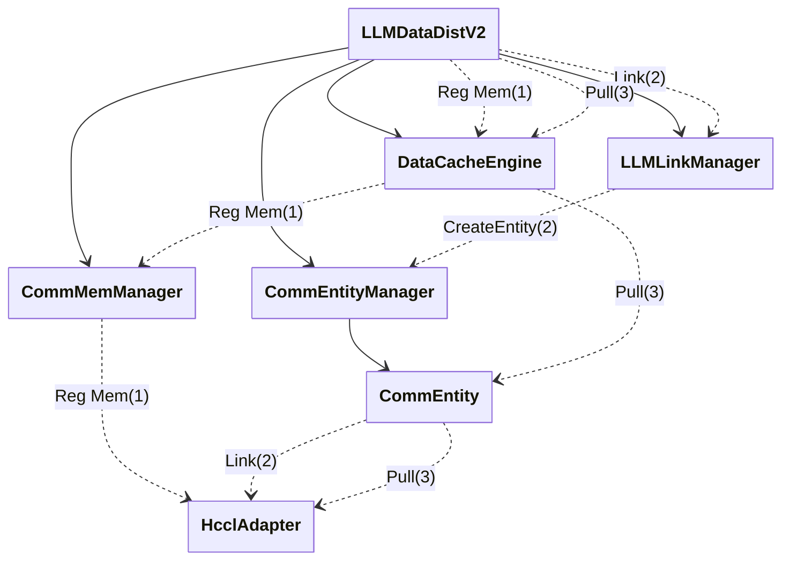
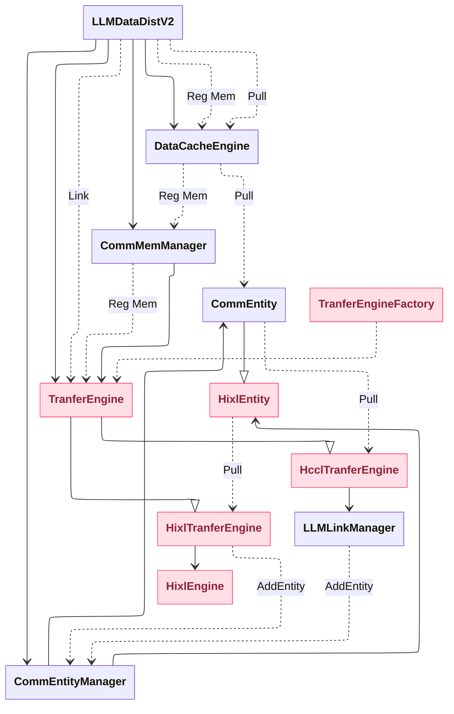
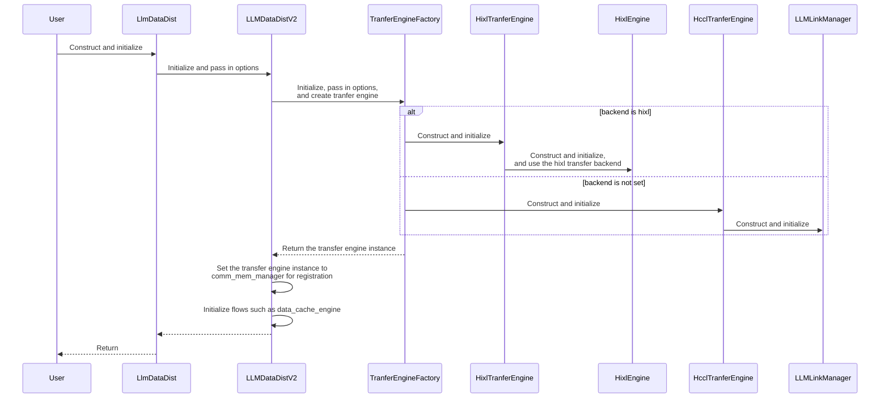
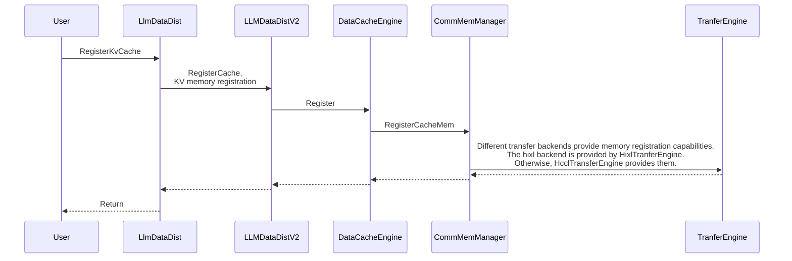
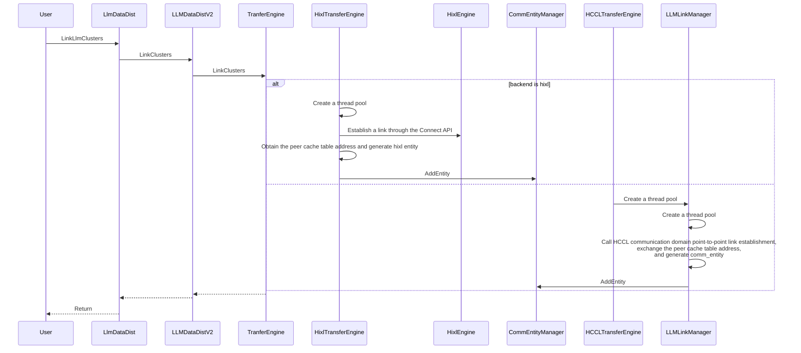
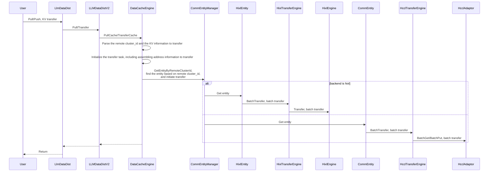

# LLM-DataDist Supporting the HIXL Transfer Backend

## Requirement Description

- Background: 
HCCL provides a one-sided communication library. It is exposed as a basic communication library capability together with the collective communication library. LLM-DataDist needs to integrate with it to support more chip types and more communication capabilities.
- What Needs to Be Done: 
The one-way link establishment process of LLM-DataDist V2 integrates with the HCCL one-sided communication library and supports the existing capabilities of the current APIs.

## Key Features
- [ ] LLM-DataDist provides the capability to integrate with HCCL one-sided communication APIs.
```
It supports parsing the local communication resource option. Hixl provides link management and transfer capabilities, and it remains compatible with native capabilities.
The link establishment, unlink, memory registration, deregistration, and data transfer processes need to be abstracted. Related capabilities also need to be implemented based on Hixl and Hccl communication domains.
```

## Technical Solution

**New APIs and Options**:
```
# The existing option key is as follows. It is used to describe locally available communication resource information and needs to support the 1.3 format.
constexpr const char OPTION_LOCAL_COMM_RES[] = "llm.LocalCommRes";
# The option value is a JSON string. The supported 1.3 format is as follows:
std::string local_comm_res = R"(
{
  "version": "1.3",
  "net_instance_id": "superpod1_1",
  "endpoint_list": [
    {
      "protocol": "ub_ctp",
      "comm_id": "eid0-0",
      "placement": "host",
      "plane": "plane-a",
    },
    {
      "protocol": "ub_ctp",
      "comm_id": "eid0-1",
      "placement": "device",
      "dst_eid": "eid1-1",
    },
    {
      "protocol": "ub_ctp",
      "comm_id": "eid0-2",
      "placement": "device",
      "dst_eid": "eid1-2",
    },
    {
      "protocol": "ub_tp",
      "comm_id": "eid0-3",
      "placement": "device",
      "plane": "plane-a",
    },
    {
      "protocol": "roce",
      "comm_id": "ipv4/ipv6 address",
      "placement": "host" 
    }
  ]
}
)";

New option: tranfer_backend. It is used to support setting the transfer backend. Because the hixl engine needs to support integration with the hixl cs API capabilities and llm-datadist can reuse hixl capabilities, the llm-datadist transfer layer is abstracted as a transfer backend. It supports using hixl as the llm-datadist transfer backend to reuse the basic capabilities of hixl.
The configuration method is as follows:
config.tranfer_backend = "hixl"
```

# Communication Device Configuration Field Description
| Field Name | Data Type | Required/Optional | Description | Supported Values/Filling Rules |
| ---- | ---- | ---- | ---- | ---- |
| version | String | Required | Version number | 1.3 |
| net_instance_id | String | Required | Unique identifier of the current supernode | It only needs to be unique for each supernode |
| endpoint_list | Array | Required | List of available communication devices | - |
| endpoint_list[].protocol | String | Required | Communication protocol | roce/ub_ctp/ub_tp |
| endpoint_list[].comm_id | String | Required | Communication identifier | When protocol is ub_ctp/ub_tp, fill in ${eid}; when protocol is roce, fill in the ipv4/ipv6 NIC address |
| endpoint_list[].placement | String | Required | Communication device location | host/device |
| endpoint_list[].plane | String | Optional | Communication device plane | When protocol is ub_ctp/ub_tp, fill this field if the device distinguishes planes. Each plane must be unique, such as plane-a/plane-b |
| endpoint_list[].dst_eid | String | Optional | ${eid} of the peer communication device connected to the current communication device | When protocol is ub_ctp, fill in the peer ${eid} if a full-mesh direct peer exists |


**C++ Call Pseudocode**:
```
LlmDataDist llm_datadist_p(1U, LlmRole::kPrompt);
std::map<AscendString, AscendString> options_p;
options_p[llm_datadist::OPTION_LISTEN_IP_INFO] = "127.0.0.1:26000";
options_p[llm_datadist::OPTION_DEVICE_ID] = "0";
options_p[llm_datadist::OPTION_TRANSFER_BACKEND] = "hixl";
options_p[llm_datadist::OPTION_LOCAL_COMM_RES] = R"(
{
   "net_instance_id": "superpod1_1",
   "endpoint_list": [
       {
           "protocol": "roce",
           "comm_id": "1.0.0.1",
           "placement": "host"
       }
   ],
   "version": "1.3"
}
)";


llm_datadist_p.Initialize(options_p);

LlmDataDist llm_datadist_d(2U, LlmRole::kDecoder);
std::map<AscendString, AscendString> options_d;
options_d[llm_datadist::OPTION_LISTEN_IP_INFO] = "127.0.0.1:26001";
options_d[llm_datadist::OPTION_DEVICE_ID] = "1";
options_d[llm_datadist::OPTION_TRANSFER_BACKEND] = "hixl";
options_d[llm_datadist::OPTION_LOCAL_COMM_RES] = R"(
{
   "net_instance_id": "superpod2_1",
   "endpoint_list": [
       {
           "protocol": "roce",
           "comm_id": "1.0.0.2",
           "placement": "host"
       }
   ],
   "version": "1.3"
}
)";

llm_datadist_d.Initialize(options_d);

// Memory registration
llm_datadist_p.RegisterKvCache(cache_desc1, tensor_addrs1, {}, cache_id1);
llm_datadist_d.RegisterKvCache(cache_desc2, tensor_addrs2, {}, cache_id2);


llm_datadist_d.LinkLlmClusters(clusters1, rets);
```

**Main Relationship of the Current LLM-DataDist Class Diagram**:


- LLMDataDistV2 is the main entry point and exposes link establishment, unlink, memory registration, deregistration, and data transfer capabilities.
- DataCacheEngine provides memory registration, deregistration, and transfer capabilities.
- LLMLinkManager provides link establishment and unlink capabilities.
- CommMemManager provides memory registration and deregistration capabilities.
- CommEntityManager provides link management capabilities. Each CommEntity represents a point-to-point transfer link.
- HcclAdapter provides underlying link establishment, unlink, memory registration, deregistration, and data transfer.


**Main Relationship of the Class Diagram for LLM-DataDist Integration With the HCCL One-Sided Communication Library**:


- The link establishment, unlink, memory registration, deregistration, and transfer processes are abstracted as TranferEngine. A factory class is provided to create different instances based on the passed OPTION_TRANSFER_BACKEND. If the specified format version is 1.3, Hixl-related instances are created. Otherwise, instances of the original version are generated to remain compatible with the previous logic.
- HixlTranferEngine provides link establishment, unlink, registration, deregistration, and transfer capabilities of the hixl engine.
- HcclTranferEngine is compatible with the native logic and uses hccl-related APIs to provide link establishment, unlink, registration, deregistration, and transfer capabilities.

**Initialization Process Sequence Diagram**:

- Whether the transfer backend option value is hixl determines whether the new flow is used. Otherwise, the old-version logic remains compatible.
- In the new flow, the hixl engine stored by HixlTranferEngine is used for memory registration, deregistration, link establishment, and transfer. Initialization requires listen ip info.
- The compatible flow provides capabilities through HcclTranferEngine and is basically the same as the original initialization flow, so details are not repeated.

**Memory Registration and Deregistration Process Sequence Diagram**:

- Deregistration is basically the same as registration, so details are not repeated.

**Link Establishment Process Sequence Diagram**:

- HixlTransferEngine completes link establishment through the Connect API of HixlEngine. It needs to create a socket to obtain the peer cache table address for subsequent data-plane communication.
- Non-remote cache index mode is not supported, that is, the access_remote_cache=false scenario is not supported.
- Two-way link establishment is not supported. Calling Link-related APIs reports an error and returns unsupported.
- Forced link establishment is supported. After the client exits, link establishment can be initiated again and succeeds. This capability is supported by HCCL open-source one-sided communication.
- SetRole capability: In the hixl backend scenario, both sides need to specify ip and port. Both sides act as servers and can initiate link establishment with the peer and complete data-plane communication. Therefore, this is unrelated to the role and directly returns success.

**Transfer Process Sequence Diagram**:

- After one link is established, data sending and receiving on both sides are not supported.
- Data reads and writes can be initiated only from the client side, that is, the side that calls LinkClusters. If both sides need to access each other, the server side also needs to initiate LinkClusters to establish a link to the client side.

## End-to-End Usage Guide

Python usage reference:
```
examples/python/hixl_tranfer_backend_sample.py
```

## Notes
1. During initialization, specify the transfer backend option as hixl.
2. During initialization, specify the locally listened IP address and port.
3. Before initiating transfer with the peer, establish a link in advance.
