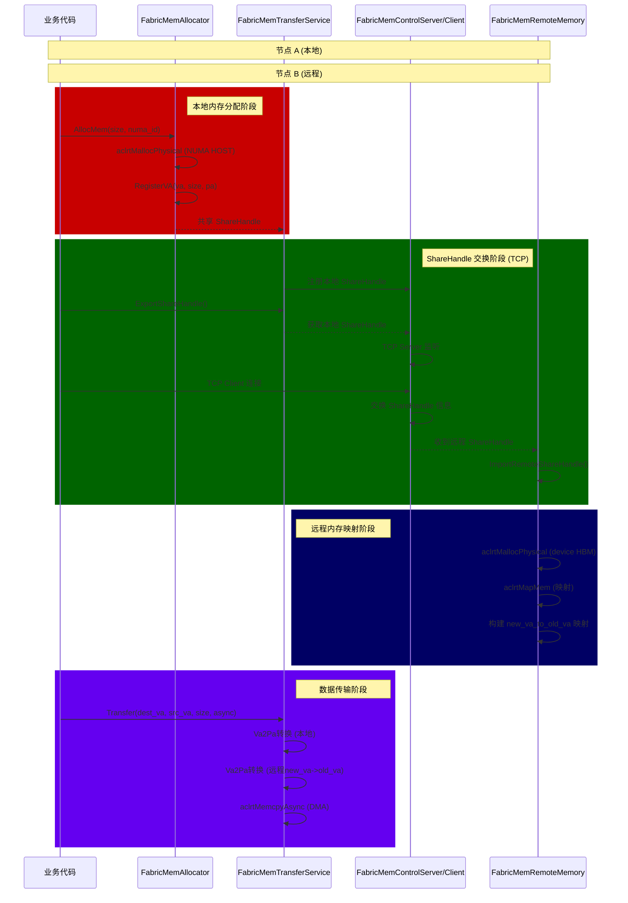

# Fabric Memory 模块代码解读

## 概述

Fabric Memory 是 HIXL 中负责管理跨节点共享内存的子系统，基于华为 CANN 的 Fabric 通信机制实现。它支持：

- **NUMA-aware 主机端内存分配**：在指定 NUMA 节点上分配主机端物理内存
- **设备端 HBM 内存分配**：在昇腾设备上分配 High-Bandwidth Memory
- **虚拟地址映射管理**：维护 VA（虚拟地址）到 PA（物理地址）的映射表，支持远程内存映射
- **TCP 控制通道**：通过 TCP 协议在节点间交换 ShareHandle，实现共享内存的发现和建立
- **异步数据传输**：基于 ACL Stream 的异步 DMA 拷贝，支持同步/异步两种传输模式
- **统计信息**：记录传输耗时、成本统计，定期打印

---

## 核心数据结构

### fabric_mem_types.h

| 结构体 | 用途 |
|--------|------|
| `VaInfo` | 虚拟地址信息：va_base, va_size, pa_base, flags |
| `ShareHandleInfo` | ShareHandle 封装：handle、VA信息、生命周期标志 |
| `AsyncResource` | 异步传输资源：目的 VA/PA、stream、callback、状态 |
| `AsyncRecord` | 异步传输记录：key、transfer_context 指针、耗时成本 |
| `FabricMemTransferContext` | 传输上下文：本地 ShareHandle 列表、远程 VA 映射表、异步资源池、统计信息 |

---

## 整体工作流



---

## 各模块详解

### 1. fabric_mem_config.cc — 配置解析

**用途**：解析 Fabric Memory 相关配置选项，包括开关、容量、起始地址、任务流数量、自动连接等。

**接口函数**：

| 函数 | 功能 |
|------|------|
| `FabricMemConfig::Init()` | 解析 `fabric_mem_enabled`、`fabric_mem_capacity_tb`、`fabric_mem_start_address_tb`、`fabric_mem_task_stream_num`、`fabric_mem_auto_connect` 等选项 |
| `FabricMemConfig::GetCapacityTb()` | 返回容量（TB） |
| `FabricMemConfig::GetStartAddressTb()` | 返回起始虚拟地址（TB） |
| `FabricMemConfig::GetTaskStreamNum()` | 返回任务流数量 |
| `FabricMemConfig::IsAutoConnect()` | 返回是否自动建立连接 |
| `FabricMemConfig::IsEnabled()` | 返回模块是否启用 |

**配置项**：

| 选项 | 说明 | 默认值 |
|------|------|--------|
| `fabric_mem_enabled` | 是否启用 | false |
| `fabric_mem_capacity_tb` | VA 空间容量（TB） | 0（未配置） |
| `fabric_mem_start_address_tb` | 起始 VA（TB） | 0 |
| `fabric_mem_task_stream_num` | 传输任务流数量 | 0 |
| `fabric_mem_auto_connect` | 是否自动连接 | false |

---

### 2. virtual_memory_manager.cc — 虚拟地址空间管理

**用途**：Singleton 模式的虚拟地址空间管理器，基于 Bitmap 管理进程的虚拟地址分配。

**接口函数**：

| 函数 | 功能 |
|------|------|
| `VirtualMemoryManager::GetInstance()` | 获取单例实例 |
| `VirtualMemoryManager::AllocVirtualMemory(uint64_t size, int numa_id)` | 在指定 NUMA 节点分配虚拟内存 |
| `VirtualMemoryManager::FreeVirtualMemory(uint64_t va, uint64_t size)` | 释放虚拟内存 |
| `VirtualMemoryManager::ReserveHugePages(uint64_t va, uint64_t size)` | 预留大页（huge pages） |
| `VirtualMemoryManager::GetNumaNode(int fd)` | 通过 hugepage 文件描述符获取 NUMA 节点 |

**设计要点**：

- 使用 Bitmap 标记已分配的 VA 块
- 支持 huge-page 预留（`MAP_HUGETLB`）
- 通过 `/sys/devices/system/node/node*/meminfo` 解析 huge page 尺寸

---

### 3. fabric_mem_allocator.cc — 物理内存分配与 VA 映射

**用途**：负责主机端和设备端的物理内存分配，以及维护 VA 到 PA 的映射关系。

**接口函数**：

| 函数 | 功能 |
|------|------|
| `FabricMemAllocator::Init(const FabricMemConfig &config)` | 初始化：设置容量和起始地址 |
| `FabricMemAllocator::AllocMem(uint64_t size, int numa_id, uint64_t *va, uint64_t *pa)` | 分配物理内存，返回虚拟地址和物理地址 |
| `FabricMemAllocator::FreeMem(uint64_t va, uint64_t size)` | 释放内存，更新 VA 映射表 |
| `FabricMemAllocator::Va2Pa(uint64_t va)` | 根据 VA 查询物理地址 |
| `FabricMemAllocator::Dump() const` | 打印当前 VA 映射表状态 |

**关键成员**：

- `VaInfoMap va_info_map_`：维护 `va → VaInfo` 的映射
- `capacity_tb_`、`start_address_tb_`：容量和起始地址配置
- `VirtualMemoryManager`：底层 VA 管理

**内存分配流程**：

```
AllocMem(size)
  → VirtualMemoryManager::AllocVirtualMemory() 分配 VA
  → aclrtMallocPhysical() 分配 NUMA HOST 或 device HBM 物理内存
  → RegisterVa(va, size, pa, flags) 记录 VA→PA 映射
  → 返回 va, pa
```

---

### 4. fabric_mem_remote_memory.cc — 远程内存导入

**用途**：管理从其他节点导入的共享内存，包括远程 ShareHandle 的导入、映射和地址翻译。

**接口函数**：

| 函数 | 功能 |
|------|------|
| `FabricMemRemoteMemory::ImportRemoteShareHandle(const ShareHandle &handle, uint64_t *new_va)` | 将远程 ShareHandle 映射到本地 VA 空间 |
| `FabricMemRemoteMemory::GetRemoteVa(uint64_t old_va) const` | 通过 old_va 查找对应的本地新 VA |
| `FabricMemRemoteMemory::GetRemotePa(uint64_t new_va) const` | 获取远程内存的设备物理地址 |
| `FabricMemRemoteMemory::Dump() const` | 打印远程内存映射表 |

**关键映射**：

- `new_va_to_old_va_`：本地新 VA → 远程原始 VA
- `new_va_to_new_pa_`：本地新 VA → 本地分配的设备 PA
- `old_va_to_new_va_`：远程原始 VA → 本地新 VA

**远程内存映射流程**：

```
ImportRemoteShareHandle(handle)
  → aclrtMallocPhysical() 分配设备 HBM
  → aclrtMapMem() 将远程 PA 映射到本地 VA
  → 构建 old_va → new_va 的双向映射
  → 返回 new_va
```

---

### 5. fabric_mem_transfer_service.cc — 数据传输引擎

**用途**：核心传输引擎，负责注册本地 ShareHandle、发起远程传输、管理传输流池、记录统计信息。

**接口函数**：

| 函数 | 功能 |
|------|------|
| `FabricMemTransferService::Init(const FabricMemConfig &config)` | 初始化：创建传输流池、设置配置 |
| `FabricMemTransferService::RegisterMem(const ShareHandle &handle)` | 注册本地 ShareHandle 到传输服务 |
| `FabricMemTransferService::ExportShareHandle(int32_t rank)` | 根据 rank 导出对应节点的 ShareHandle |
| `FabricMemTransferService::Transfer(uint64_t dest_va, uint64_t src_va, uint64_t size, bool async)` | 执行数据传输（同步/异步） |
| `FabricMemTransferService::TransferAsync(uint64_t dest_va, uint64_t src_va, uint64_t size, AsyncTransferCallback callback)` | 异步传输，带回调 |
| `FabricMemTransferService::GetStream(int32_t rank)` | 获取指定 rank 关联的传输流 |
| `FabricMemTransferService::CreateStream()` | 创建传输 ACL Stream |
| `FabricMemTransferService::Destroy()` | 销毁流池 |

**传输流池**：

- 按 `task_stream_num` 配置创建多个 ACL Stream
- 通过 rank 对 Stream 数量取模，实现 Stream 的复用
- `rank_to_stream_idx_` 维护 rank 到 stream 索引的映射

**地址翻译流程**：

```
Transfer(dest_va, src_va, size)
  → Va2Pa(dest_va)           // 查本地 VaInfoMap
  → old_va → new_va 翻译      // 如果是远程 VA
  → Va2Pa(new_va)            // 查远程内存的设备 PA
  → aclrtMemcpyAsync()       // DMA 拷贝
```

**ShareHandle 注册流程**：

```
RegisterMem(handle)
  → 获取 ShareHandleInfo
  → 调用 Va2Pa(va) 获取物理地址
  → 保存 <rank, ShareHandleInfo> 到 registered_mem_
  → ExportShareHandle(rank) 供远程节点获取
```

---

### 6. fabric_mem_control.cc — TCP 控制通道

**用途**：通过 TCP 协议在节点间交换 ShareHandle 信息。包含 Server（被动监听）和 Client（主动连接）两个角色。

**FabricMemControlServer 接口**：

| 函数 | 功能 |
|------|------|
| `Init(int port)` | 绑定端口并监听 |
| `PushShareHandle(int32_t rank, const ShareHandle &handle)` | 缓存待发送给指定 rank 的 ShareHandle |
| `PushNewPeerNotify(int32_t rank)` | 推送新节点通知 |
| `Run()` | 事件循环，处理连接和请求 |
| `Stop()` | 停止服务 |

**FabricMemControlClient 接口**：

| 函数 | 功能 |
|------|------|
| `Connect(const std::string &server_ip, int port)` | 主动连接服务器 |
| `RequestShareHandle(int32_t rank)` | 向服务器请求指定 rank 的 ShareHandle |
| `WaitForRemoteShareHandle(int32_t rank, ShareHandle *handle, int timeout_ms)` | 阻塞等待远程 ShareHandle |
| `Close()` | 关闭连接 |

**TCP 消息类型**：

| 类型 | 方向 | 用途 |
|------|------|------|
| `kGetShareHandle` | Client→Server | 请求某个 rank 的 ShareHandle |
| `kShareHandleRsp` | Server→Client | 返回 ShareHandle 数据 |
| `kNewPeerNotify` | Server→Client | 通知有新节点加入 |

**Notify Queue 机制**：

- Server 为每个 Client 维护一个 `std::deque<Notify>` 队列
- 收到新 peer 通知时入队，Client 请求时出队返回
- 支持 `kNewPeerNotify` 类型，携带 rank 信息

---

### 7. fabric_mem_statistic.cc — 统计信息

**用途**：记录每次传输的时间戳和耗时成本，定期打印统计摘要。

**接口函数**：

| 函数 | 功能 |
|------|------|
| `FabricMemStatistic::Record(uint64_t key, uint64_t cost_ns)` | 记录一次传输的耗时 |
| `FabricMemStatistic::Dump()` | 打印统计信息（次数、最大、平均、总耗时） |
| `FabricMemStatistic::GetTotalCost(int32_t rank) const` | 获取指定 rank 的总耗时 |
| `FabricMemStatistic::GetRecordCount(int32_t rank) const` | 获取指定 rank 的传输次数 |

**统计维度**：

- 按 `rank` 维度分别统计
- 每次传输以 `dest_va ^ src_va ^ size ^ timestamp` 作为 key
- 定期（间隔 `DumpInterval`）输出统计报告

---

### 8. acl_compat.h — ACL 兼容性层

**用途**：封装昇腾 ACL API 的跨版本兼容性处理，包括：

- `aclrtMallocPhysical`：物理内存分配
- `aclrtMalloc`：设备端内存分配
- `aclrtFree`：内存释放
- `aclrtMapMem`：将主机/远程物理地址映射到进程虚拟地址空间
- `aclrtUnmapMem`：解除映射
- `aclrtMemcpyAsync`：异步内存拷贝
- `aclrtCreateStreamWithConfig`：创建 ACL Stream

**兼容性处理**：

- 使用 `dlsym` 动态查找符号，避免链接时报错
- 函数指针包装，提供统一的错误码返回值（返回 `cb` 函数对象或错误码）

---

## 典型使用流程

### 场景：节点 A 向节点 B 共享内存

```cpp
// === 节点 A（发送方） ===
// 1. 分配本地内存
uint64_t local_va, local_pa;
FabricMemAllocator::Instance()->AllocMem(size, numa_id, &local_va, &local_pa);

// 2. 注册到传输服务
ShareHandle handle = {local_va, local_pa, size, rank};
FabricMemTransferService::Instance()->RegisterMem(handle);

// 3. 启动 TCP Server，等待 B 连接
FabricMemControlServer server;
server.Init(port);
server.PushShareHandle(rank, handle);

// === 节点 B（接收方） ===
// 1. 连接 A 的 TCP Server
FabricMemControlClient client;
client.Connect(server_ip, port);

// 2. 请求 A 的 ShareHandle
client.RequestShareHandle(rank);
ShareHandle remote_handle;
client.WaitForRemoteShareHandle(rank, &remote_handle);

// 3. 导入远程 ShareHandle 到本地 VA 空间
uint64_t new_va;
FabricMemRemoteMemory::Instance()->ImportRemoteShareHandle(remote_handle, &new_va);

// === 数据传输 ===
// 4. 在新 VA 上进行 DMA 传输
FabricMemTransferService::Instance()->Transfer(dest_va, src_va, size, false);
```
