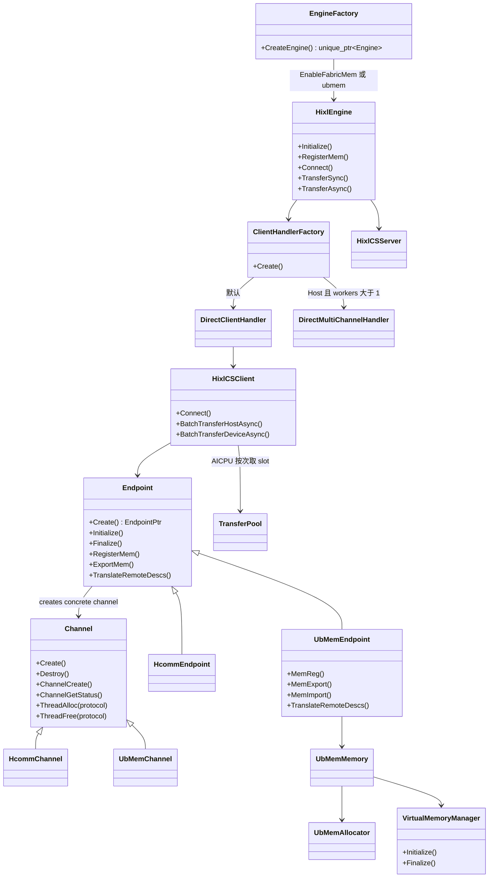
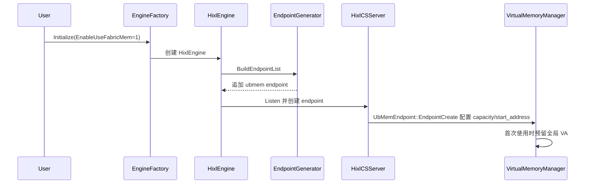
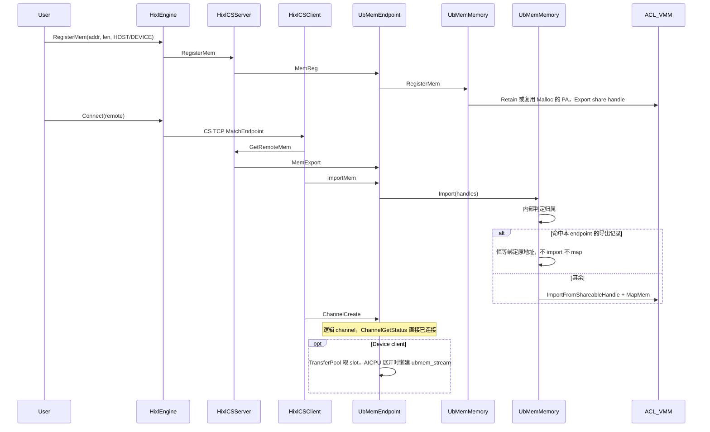
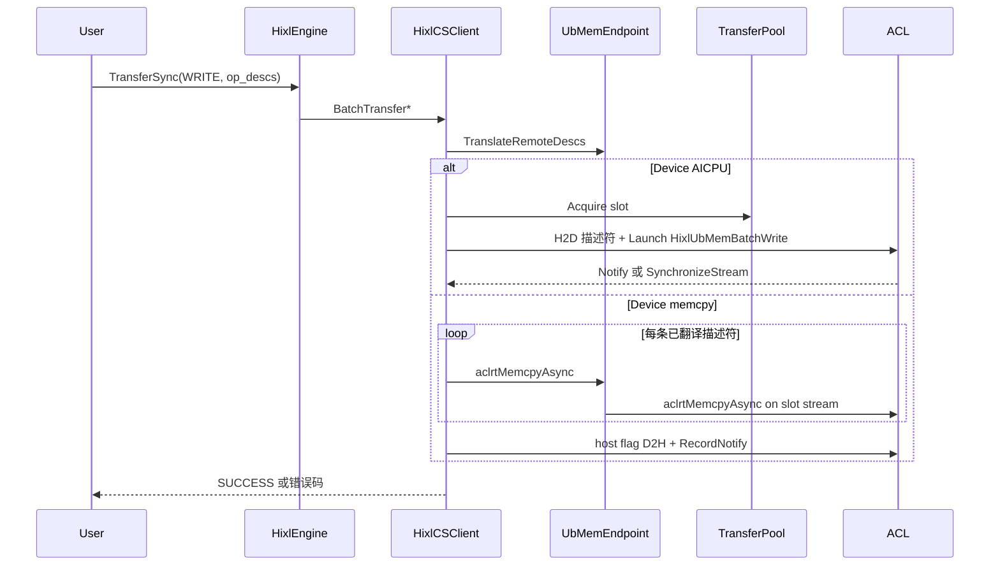

# FabricMem 传输模式

## 需求描述

大模型推理里，KV Cache 经常比权重还大。超节点内如果继续走 RoCE，带宽会卡在大约 20 GB/s，拖住 DRAM 池化缓存。Atlas A3 的 Fabric Memory 把超节点内 DRAM 统一编址，NPU 可以经 HCCS 直接读写远端 Host/Device 内存。HIXL 要在这条链路上提供单边 D2RH、RH2D、D2D、H2H，源端发起，对端不参与数据面。

旧实现为 FabricMem 单独做了一套 Engine、ControlServer、ChannelManager 和 SlotPool。这和 HIXL CS 的建链、注册、传输控制面重复。本需求把 FabricMem 收进 `HixlEngine` / `hixl_cs`：`ubmem` 只是一种传输后端，对外仍走现有 `Initialize` / `RegisterMem` / `Connect` / `TransferSync` / `TransferAsync`。

HCCL 直传不支持 D2RH。A3 上的 Buffer 中转会占 HBM，干扰推理。FabricMem 用来补这两条短板。它只服务 Atlas A3 训练/推理系列，并且只在同一超节点内选路；跨超节点要在 `protocol_desc` 里同时给出 RoCE/UBOE 等协议。

### 假设与待确认

- **批次上限校验挂在哪一层。** 接口文档把 FabricMem 的 `transfer_config.max_transfer_count_per_batch` 写成 `[1, 1920]`。代码里 `GlobalConfig` 先按全局范围 `[1, 32766]` 解析；`DirectClientHandler` 目前只对 HCCS 再卡 1920。AICPU 内核在途 RTSQ 预算是 `kFabricMemMaxInFlightRtsqTasks = 1920`。若要让文档和实现一致，需要确认是补 Handler 校验，还是改文档口径。这影响验收和错误码。
- **进程级 VMM 归谁管。** 进程内唯一的单例是 `VirtualMemoryManager`（VA 池），生命周期跟随进程；endpoint 和 `adxl::MallocMem` 分配都只是使用方。`UbMemEndpoint::EndpointCreate` 只负责按首个配置初始化 VMM，`EndpointDestroy` 不释放全局 VA 池，最终由单例析构释放。本端注册表归每个 `UbMemEndpoint` 自己所有，随 endpoint 销毁而释放。

## 功能要点

- [ ] 用户打开 FabricMem 后，超节点内可以用 HCCS 做单边 D2RH / RH2D / D2D / H2H，不必再走独立 Engine。
- [ ] 本端注册内存并导出 Fabric share handle。对端导入后映射到本地 VA；对端发回的就是本 endpoint 自己导出的 handle 时，按原 VA 恒等绑定，不 import、不 map。传输只翻译对端地址，本端继续用原来的 VA。
- [ ] 默认由 AICPU 展开 SDMA；也可以改成 Host 在 Device stream 上逐条提交 `aclrtMemcpyAsync`。超节点之间不走 ubmem，靠 `protocol_desc` 里的 RoCE/UBOE 等协议。
- [ ] 公开 API、错误码保持现有 HIXL 语义。HDK 25.5 的 Host 内存必须用 ADXL `MallocMem` / `FreeMem`；26.0 起可以用 ACL 自己管。

## 技术方案

### 设计思路

FabricMem 不再是旁路引擎。传输集成层就是 `Endpoint` / `Channel` 本身：公共代码（注册表、channel 表、编排、Host VA mapping）放在基类，`HcommEndpoint` / `HcommChannel` 与 `UbMemEndpoint` / `UbMemChannel` 只提供协议实现。`Endpoint::Create()` 按协议选具体子类：ubmem 走 `UbMemEndpoint`，其它协议走 `HcommEndpoint`；`Endpoint` 在内部创建对应 Channel 子类，不把该工厂暴露给子类或调用方。建 Endpoint、注册/导出/导入内存、建逻辑 Channel 都落在这两层上；Hcomm 拷贝继续走既有 HcommProxy 路径，UBMem memcpy 模式由 `HixlCSClient` 直接提交。进程内唯一的单例是 `VirtualMemoryManager`（VA 池），生命周期跟随进程；进程级配置就是 client / server 自己那份 `GlobalConfig`，随 `Endpoint::Create` 整份传进来。`UbMemAllocator` 里另有进程级状态：allocation 表（每个 allocation 只 export 一次）和已导出区间台账，归属判定要用。这样 `Endpoint::Create` 是仅剩的按协议分支点。方法归属：`EndpointCreate/Destroy/GetListenPort`、`MemReg/Unreg/Export/Import/Unimport`、`TranslateRemoteDescs` 属于 Endpoint；`ChannelCreate/Destroy/GetStatus`、`ThreadAlloc/ThreadFree` 属于 Channel（由 `HcommChannel` / `UbMemChannel` 各自复写的协议钩子）。`TransferPool` 在建任何 channel 之前就要注册 slot，所以 `Initialize` 接收 endpoint 的协议，而不是持有 channel 对象做 key source。这些钩子只接收自己处理不了的东西：一个 Channel 就是一个 channel、一个 Endpoint 就是一个 endpoint，所以除 `EndpointCreate` / `ChannelCreate`（要产出 handle）外，钩子都不再传自身的 handle，实现直接读 `GetHandle()`。

用户侧开关有两个，解析后等价：

1. `OPTION_ENABLE_USE_FABRIC_MEM=1`
2. `OPTION_GLOBAL_RESOURCE_CONFIG` 的 `protocol_desc` 含 `ubmem`

`HixlOptions::ApplyUbMemEquivalence()` 会把 `enable_fabric_mem` 置为 true，并保证 `protocol_desc` 里有 `ubmem`。`fabric_memory.task_stream_num` 和 `multi_channel.num_workers` 对齐：只配一个就抄到另一个；两个都配则必须相等。AICPU 展开只允许 `num_workers=1`。

`EngineFactory` 看到 FabricMem 开启，就创建 `HixlEngine`。后面的 Listen、GetEndpointInfo、GetRemoteMem、Channel 控制面全部复用 CS。

`EndpointGenerator` 给 endpoint 列表追加一条 `protocol=ubmem, placement=device` 的记录。A5 的自动生成不加这条记录，即使 `protocol_desc` 里带了 `ubmem`：FabricMem 只在 A3 可用，A5 上 `ubmem` 被按协议过滤掉。`fabric_memory.enable_aicpu_unfold` 只选择数据面展开方式，不改变 endpoint placement。这条 endpoint 不监听真实网卡端口。`EndpointGetListenPort` 返回不支持。`EndpointStore` 匹配 ubmem 时只看 Host/Device 位置，不看 `comm_id`。

同超节点优先选 ubmem，再才是 UB 组、HCCS、UBOE、UB_RTP、RoCE。跨超节点规则里没有 ubmem。所以 `["ubmem","roce:device"]` 的效果是：超内走 FabricMem，跨超走 Device RoCE。

Handler 类型是 DIRECT。ubmem 始终是 Device endpoint；AICPU 展开只允许 `num_workers=1`，memcpy 展开也保持一个 `DirectClientHandler`。

### 模块关系



### 启用、选路与初始化

#### 核心流程



`HixlCSServer` / `HixlCSClient` 把各自的 `GlobalConfig` 直接传给 `Endpoint::Create`，不挑子结构体：只有 ubmem endpoint 读它，其余协议忽略。容量和起始地址来自 `fabric_memory.max_capacity`、`fabric_memory.start_address`，单位 TB，由 `UbMemEndpoint::EndpointCreate` 在 `VirtualMemoryManager::Initialize` 之前设置。后建的 endpoint 如果带了与已生效值不一致的配置就会失败，等价于原先「按协议先初始化一次」的冲突检查。

`TransferPool` 对所有协议使用同一种 Slot。每个 slot 都固定申请真实 Hcomm thread，因此先以 UB_MEM 初始化的 device client 和后续其他协议的 client 共享同一套线程模型。slot 另外带一个 `aclrtStream ubmem_stream`，只在 UB_MEM AICPU 路径懒创建，用于给内核参数提供 RTSQ 元数据，abort 或 slot 销毁时释放。

### 内存申请、注册与共享句柄

Host 内存在 HDK 25.5 不能 `aclrtMemRetainAllocationHandle`。这条路径必须走 ADXL 的 `AdxlEngine::MallocMem` / `FreeMem`，内部是 `UbMemAllocator`：预留 VA、申请 PA、`aclrtMapMem`。Host 在 Malloc 时 `aclrtMemSetAccess`，让 NPU 能访问这块 DRAM。同一块物理内存只允许 ACL export 一次，句柄缓存在 allocator 里。HDK 26.0 起可以用 ACL 自己申请，再 `RegisterMem`。

`HixlEngine::RegisterMem` 只打到 CS Server 的 endpoint。如果 `protocol_desc` 同时有 `ubmem` 和 `roce:device`，同一块用户内存会在两条 endpoint 上都注册，不再另做 `extra_mem_handle`。

`UbMemEndpoint::MemReg` 调用本 endpoint 的 `UbMemMemory::RegisterMem`：

- 地址是本次 `MallocMem` 得到的，走本端 export，不再本地 import。传输用原来的 VA。
- 别人申请的内存走 foreign 路径：`aclrtMemRetainAllocationHandle` 拿到整段 PA，按页 export。相邻用户区间可以共用同一段 PA。

`MemExport` 把 `ShareHandleInfo` 编成 JSON 字节，塞进 CS 的 `export_desc`。建链时 client 先 `GetRemoteMem`，server `ExportMem`，client `ImportMem`。`ImportMem` 解码后把整批 handle 交给 `UbMemMemory::Import()`；归属判定、恒等绑定和普通 import 都封装在 `ubmem_memory.cc` 内。server 侧 `ExportMem` 只导出自己 store 里的 server endpoint，client endpoint 的注册不会被任何人取走，所以 ubmem 链路的 `HixlCSClient::RegMem` / `UnRegMem` 直接成功返回，不做本端注册导出。

- **对端发的是本端进程的导出**：归属判定由 `UbMemMemory::Import()` 在 memory 模块内部完成，证据有两个来源：本 endpoint 的导出记录，以及进程级已导出区间台账（`UbMemAllocator::RecordExportedRange` / `IsRangeExportedHere`）。判定用 share handle 字节 + `va_addr` + `len`，命中说明这块 buffer 在本端本来就可寻址，直接按原地址做恒等绑定：翻译表 key 与 value 都是对端地址，不走 import、不 `aclrtMapMem`、不占 VMM。判定不看地址数值——两个进程的 VMM 池默认都从 40 TB 起、按 1 GB 对齐分配，跨进程地址会撞车；ACL share handle 内含导出方身份，别人导出的 handle 不会误命中。注册表不按 device 索引：ubmem 只会注册当前实例所在 device 的内存，所以没有 device 维度的判定。

  进程级台账是必需的，不是冗余：ACL 的 fabric share handle 只在**跨进程**之间可用（export 的语义就是 share to other process，import 也没有允许同进程导入的开关），所以本进程导出的区间在这里无法 import，只能恒等绑定。判定原先只认本 endpoint 的导出记录，这在"同一个进程里 server 和 client 都注册同一块内存"时露不出来（各有一条自己的注册记录），但 ubmem 的 CS client 已经跳过注册，此时本 endpoint 的记录是空的，归属证据只能来自进程级台账。台账在本端每次 export 成功后登记 `{va, len, share_handle}` 并引用计数——同一个 export 可能被多个注册共用（allocator 路径一个 allocation 只 export 一次）——在注册注销释放该区间时注销。
- **其余情况**（本进程没导出过的区间，含跨进程对端）：归属判定未命中的句柄由 memory 模块统一 import：先按对端这次 export 的总跨度在本地 VMM 预留**一整块连续地址范围**，再对每个 PA 段 `aclrtMemImportFromShareableHandleV2` + `aclrtMapMem`，映射位置按该段在整段里的偏移来放。所以对端一段地址即便物理上是多段 PA，本端映射出来仍是同一块连续地址范围，且偏移与对端一致。翻译表的 key 是对端用户地址，value 是本端映射地址。

`UbMemMemory` 内部逐条记录该映射是 import 来的还是恒等绑定的。恒等条目既没 `aclrtMapMem` 也没预留 VMM，释放时只丢弃；import 条目由 `Unimport()` 按 share handle 身份反查，逐条 unmap、`aclrtFreePhysical`。一次 `Import` 预留的那块地址范围由这批 range 共享，逐条释放只减引用，最后一条释放后才把整块还给 VMM，所以部分 `Unimport` 不会动到同批其它 range。反查用的是句柄字节而不是地址，因为跨进程地址会撞车，也因为本端那条注册记录可能已经注销掉了。两种条目都会进翻译表，所以传输侧的 `TranslateRemoteDescs` 不用区分。

虚钩子 `MemUnimport` 承接的就是这套释放：解码 `export_desc` 后交给 `Unimport()`。Endpoint 的 `UnimportMem()` 会做校验后调它，CS client 侧的 `HixlCSClient::CloseImportedBufs()` 对每个已 import 的 desc 调一次 `UnimportMem()`，`ClearRemoteMemInfo()` 再回收 desc buffer。所以 import 的生命周期是跟着 descriptor 走的：`ImportRemoteMem()` 开头先 `ClearRemoteMemInfo()` 放掉上一轮，Connect 重试不会累积映射；`HixlCSClient::Destroy()` 里再放一次，`EndpointDestroy` 里的释放只是兜底。没映射过的句柄只记一条 WARN，不当失败处理。

恒等绑定不持有 ACL 引用，也不占 VMM。连接存续期间用户若 `FreeMem` / `DeregisterMem` 这块内存，通道里的地址会悬空——这条约束和本端注册内存一致。

传输前 `Endpoint::TranslateRemoteDescs` 只改 `remote_buf`。一次 import 在本地就是一段连续 VA、翻译表里也就一条，所以落在这段里的用户 range 不会再被拆；只有跨了多次 import，或其中一段已被部分 `Unimport` 掉，才按段拆成多条描述符。本端 `local_buf` 保持原 VA。

#### 核心流程



### 数据传输

CS client 的 endpoint 始终是 Device。`HixlCSClient` 只把 UB_MEM 传输分发给 `UbMemEngine`，非 UB_MEM 传输继续走既有 device / host 路径。UBMem 引擎自己负责模式选择、地址翻译、描述符准备、AICPU 下发、Host 提交 memcpy、完成句柄和失败锁存。

`enable_aicpu_unfold=true` 走 AICPU kernel；false 走 Device stream 上的 Host 提交 memcpy。两条路径都先进入 `UbMemEngine::TranslateUbMemOpDescs`，再委托 `Endpoint::TranslateRemoteDescs`。该 hook 只有 ubmem 实现，只改 `remote_buf`，且可能一条拆成多条；Hcomm 走基类默认实现，什么都不返回。

返回的 vector 为空表示没有发生改写，此时提交调用方原数组。翻译不能原地改：调用方数组是 const，且改写可能变长。

**AICPU（默认）**

1. `BuildUbMemTransferDescs` 把每条 op 拆成 AICPU 描述符。单条长度超过 4 GiB 时按 `uint32` 上限切开，一条描述符对应一条 SDMA SQE。
2. 描述符拷到 Device 后，launch `HixlUbMemBatchRead` / `HixlUbMemBatchWrite`。内核参数是 `UbMemAicpuKernelParam`：已翻译的 VA、worker RTSQ、可选 Notify、超时，以及 `transfer_ctx_key`——它直接取 slot 的 `thread`，和 hcomm AICPU 算子一样，没有第二个字段。内核不碰通信 Channel 对象。
3. 单个 kernel 最多 128 条描述符。`max_transfer_count_per_batch` 是逻辑批次和 Notify 边界，kernel 不跨批次。STARS 队列深度仍按 2K 模型预留：在途 1920 + NotifyRecord + 环空一位。
4. 同步传输 `aclrtSynchronizeStreamWithTimeout`。异步传输在 copy stream 上追加 host flag D2H，轮询 flag。传输失败（err flag 置位、超时或提交失败）时置位该 slot 的 err flag，并推迟到该 slot 最后一个在途请求释放时才 `TransferPool::Abort` 再回收，避免 abort 仍被其他 handle 共享的 slot；引擎本身不锁存失败，由 `HixlCSClient` 在状态查询或同步传输返回失败时统一 latch。

**Memcpy 展开**

1. `HixlCSClient` 按描述符顺序直接调用 `aclrtMemcpyAsync(..., DEVICE_TO_DEVICE)`，用的是它为本次传输认领的 slot 的 Device stream（`slot.stream`），并持有该 slot 到 completion handle 释放，这样一次传输里的所有拷贝（含完成事件）都落在同一条有序 stream 上。
2. READ 和 WRITE 都是直接下发，没有 fence。UB 不发描述符，同一 stream 上的拷贝本来就有序；fence 没有东西可排空，只会把 host 卡住。
3. `max_transfer_count_per_batch` 只切开提交循环，不在边界加额外同步。异步路径先追加 host flag D2H，再追加 `aclrtRecordNotify`；完成判定要求 flag 已写入且 NotifyRecord 已记录。失败路径同样置位 err flag 并在 slot 最后一个在途请求释放时 Abort 再回收（见 AICPU 第 4 条）。
4. 两端共享的仍是 slot notify，不需要 server 侧 FabricMem flag。

   Memcpy 展开用的是 `slot.stream`，不是 `ubmem_stream`：后者只服务 AICPU 展开，且只在展开时懒创建。



### 清理、并发与心跳

`Disconnect` / `Finalize` 走 CS 原路径：`ClientManager::DestroyClient` → handler `Finalize` → `HixlCSClient::Destroy`。Destroy 先 `AbortAllPendingDeviceHandles()`，再 `Endpoint::Finalize`：拆 channel、MemUnreg、`EndpointDestroy`。`EndpointDestroy` 释放本端注册；已 import 的远端映射由 `UnimportMem`（经 `ClearRemoteMemInfo`）正常释放，`UbMemMemory` 的 unmap 在 endpoint 销毁时兜底。传输的 slot 由 `HixlCSClient` 在 completion handle 释放时归还，channel 自己不持 slot；slot 上的 `ubmem_stream` 由 pool 在 abort 和销毁时释放。

对端存活仍靠 CS：`auto_connect` 开启时 `ClientManager` 发心跳；失败则 DestroyClient。Server 用 `EPOLLRDHUP` 和 TCP keepalive 回收会话。`enable_fabric_mem` 本身不单独拉心跳线程。

并发约定：不考虑 `Finalize` 和对外 API 并行。单条 CS client 的 Connect、传输、Destroy 由 `HixlCSClient::mutex_` 串行。`VirtualMemoryManager::global_virtual_memory_mutex_` 保护 VA 池和配置；本端注册表是 per-endpoint 的，`UbMemMemory` 内部的注册表互斥量保护注册和 overlap 检查，映射表互斥量保护 import 映射。`TransferPool` 自己管 slot 池和 `ubmem_stream` 生命周期。断链先 abort 在途 device 任务，再 unmap，避免 stream 还在跑时拆映射。

### 关键伪代码

```cpp
Status EnableFabricMem(HixlOptions &options) {
  if (!options.EnableFabricMem() && !options.HasProtocolDesc("ubmem")) {
    return SUCCESS;
  }
  options.SetEnableFabricMem(true);
  options.EnsureProtocolDescContains("ubmem");
  return AlignTaskStreamNumWithWorkers(options);
}

EndpointPtr Endpoint::Create(const EndpointDesc &local_endpoint, const EndpointDesc &remote_endpoint,
                             const GlobalConfig &global_config) {
  if (IsUbMemProtocol(local_endpoint.protocol)) {
    return MakeShared<UbMemEndpoint>(local_endpoint, remote_endpoint, global_config);
  }
  return MakeShared<HcommEndpoint>(local_endpoint, remote_endpoint);
}

Status UbMemEndpoint::InitializeProcessWideVaPool() {
  ApplyFabricMemoryConfig(global_config_.UbMemory());  // capacity / start_address，若非空
  return VirtualMemoryManager::GetInstance().Initialize();
}

Status TransferOneBatch(UbMemEngine &engine, bool is_get, const HixlOneSideOpDesc *ops, uint32_t n,
                        uint32_t timeout_ms, void **query_handle) {
  return engine.SubmitAsync(is_get, n, ops, query_handle);
}
```

## 相关文档

- `docs/zh/design/FabricMem_design.md`、`docs/en/design/FabricMem_design.md`：本设计。
- `docs/zh/FabricMem.md`、`docs/en/FabricMem.md`：使用说明、依赖和数据流向。
- `docs/zh/api/cpp/HIXL-interface.md`、`docs/en/api/python/HIXL-interface.md`：`OPTION_ENABLE_USE_FABRIC_MEM`、`fabric_memory.*`、Host 内存约束。公开 `protocol_desc` 表目前未列出 `ubmem` 令牌，和实现不等价，后续接口文档需要对齐。
- `docs/zh/api/cpp/HIXL_CS-interface.md`：CS `global_resource_config` 中的 `fabric_memory.enable_aicpu_unfold` 及 UB_MEM 容量、起始地址、流数量。CS 传输路径仍由 endpoint 的 `locType` 决定。
- `docs/zh/api/cpp/deprecated_ADXL-interface.md`：`AdxlEngine::MallocMem` / `FreeMem` / `ExportToShareableHandle`。
- `benchmarks/performance.md`：性能参考。
- 不新增公开 C API。行为变化以现有 HIXL/ADXL 接口文档为准。

## 测试方案

### 单元测试

- `tests/cpp/hixl/cs/endpoint_factory_ut.cc`
- `tests/cpp/hixl/ubmem/ubmem_endpoint_ut.cc`
- `tests/cpp/hixl/ubmem/ubmem_cs_client_ut.cc`
- `tests/cpp/hixl/ubmem/ubmem_cs_server_ut.cc`
- `tests/cpp/hixl/ubmem/ubmem_aicpu_param_ut.cc`
- `tests/cpp/hixl/engine/client_handler_factory_ut.cc`
- `tests/cpp/hixl/engine/endpoint_generator_ut.cc`
- `tests/cpp/hixl/engine/hixl_options_unittest.cc`
- `tests/cpp/hixl/engine/hixl_engine_unittest.cc`
- `tests/cpp/hixl/ubmem/ubmem_unittest.cc`
- `tests/cpp/hixl/ubmem/ubmem_virtual_memory_manager_unittest.cc`
- `tests/cpp/hixl/ubmem/ubmem_config_parser_unittest.cc`
- `tests/cpp/hixl/ubmem/ubmem_aicpu_kernel_unittest.cc`
- `tests/cpp/adxl/adxl_malloc_mem_unittest.cc`

| 测试场景 | 测试功能 | 验证点 |
| --- | --- | --- |
| 集成层级选择 | `Endpoint::Create` | `COMM_PROTOCOL_UB_MEM` 拿到 `UbMemEndpoint`，RoCE 拿到 `HcommEndpoint`；ubmem 不支持 listen port |
| 初始化冲突 | `UbMemEndpoint::EndpointCreate` | 后建的 endpoint 带与已生效容量不一致的配置时失败 |
| Initialize/Finalize 配对 | `UbMemEndpoint` / `VirtualMemoryManager` | 每个 endpoint 成对占/放一个引用；最后一个 endpoint 销毁才拆全局 VA 池；本端注册表是 per-endpoint 的，由 endpoint 自己释放 |
| 等价开关 | `HixlOptions::ApplyUbMemEquivalence` | `EnableUseFabricMem=1` 写入 `ubmem`；`task_stream_num` 与 `num_workers` 对齐；AICPU 且 workers>1 返回 `PARAM_INVALID` |
| Endpoint 生成 | `AppendUbMemIfRequested` | 生成 device ubmem；A5 自动生成不追加 ubmem；`enable_aicpu_unfold` 只选择数据面展开方式；可与 `roce:device` 共存；`ubmem:host` 非法 |
| Handler 选择 | `ClientHandlerFactory` | Device 保持单 client；memcpy 展开不切换 DirectMultiChannelHandler |
| 注册/导出/导入 | `UbMemMemory` / `UbMemEndpoint` | 本端 export、对端 import 后 `TranslateRemoteDescs` 改写远端地址；空地址拒绝；重复区间复用 handle |
| 自连判归属 | `UbMemMemory::Import` | 命中本 endpoint 或本进程的导出记录；伪造 handle 字节、同 handle 改 va/len 都不命中；恒等路径不 import、不 map，`Finalize` 不 unmap；伪造 handle 的 desc 仍走 import；导出随注册注销而失效 |
| 描述符编解码 | `EncodeShareHandles` / `DecodeShareHandles` | 往返后 va/len/share_handle/mem_type 一致；空 payload 失败 |
| 地址翻译 | `TranslateRemoteOpDescs` | 落在 import 段内成功；恒等绑定段内 remote VA 不变；一段 export 由多段 PA 组成时 import 后翻译表合成一条、整段传输不拆分；跨 import 或部分释放仍按段拆分；越界或长度为 0 失败 |
| 逻辑 Channel | `UbMemChannel::ChannelCreate` | 不调 Hcomm；建 channel 不占 slot；`ChannelGetStatus` 为已连接；`Channel::ThreadAlloc` 按协议为 UB_MEM 发非零不重复 key |
| Memcpy 完成 | `HixlCSClient` Device ubmem | memcpy 展开使用 slot stream；异步路径 host flag D2H 后记录一次 NotifyRecord，且 NotifyRecord 是完成必要条件 |
| AICPU 参数 | `BuildUbMemTransferDescs` / kernel UT | 超 4 GiB 拆分；方向、RTSQ、Notify、timeout、`transfer_ctx_key` 写入 `UbMemAicpuKernelParam` |
| VMM 分配 | `VirtualMemoryManager` / `UbMemAllocator` | 预留/释放、Host SetAccess、Map 失败回滚、非 Malloc 地址不能 export |
| 引擎选路 | `EngineFactory` / `HixlEngine` | FabricMem 开启创建 `HixlEngine`；允许 Connect 自己；未开启时拒绝自连 |

### 系统/集成测试

旧的独立 `fabric_mem_st` 已随旁路引擎删除。CS 路径用现有 hixl_cs / engine UT 覆盖控制面。真正的 HCCS SDMA、跨进程 import、AICPU RTSQ 不能用 stub 代替。

| 测试场景 | 测试功能 | 验证点 |
| --- | --- | --- |
| 同超建链传输 | Initialize + RegisterMem + Connect + TransferSync | 超内选 ubmem；WRITE/READ 数据正确；Disconnect 后 import 映射释放 |
| 两种展开 | `enable_aicpu_unfold` true/false | AICPU 走 `HixlUbMemBatch*`；Host 提交 Device stream `aclrtMemcpyAsync`；结果一致 |
| 超内加跨超 | `protocol_desc=["ubmem","roce:device"]` | 同 `net_instance_id` 走 FabricMem；不同超走 Device RoCE |
| 异步与断链 | TransferAsync + Disconnect | 状态可查；Destroy 先 abort 再 unmap；无 use-after-unmap |

### 上机集成测试

必须在 Atlas A3 超节点、HDK ≥ 25.5、灵衢 ≥ 1.5.0、CANN ≥ 9.0 上跑。原因是 VMM share handle、HCCS SDMA、AICPU RTSQ 和真实带宽都依赖硬件与 CANN runtime，UT/ST stub 验证不了。

| 测试场景 | 测试功能 | 验证点 |
| --- | --- | --- |
| D2RH / RH2D 正确性 | 跨进程 Host DRAM 与 Device HBM | 数据比对通过；HDK 25.5 必须用 `AdxlEngine::MallocMem` |
| 带宽 | benchmarks 中 FabricMem 用例 | 相对 RoCE 有数量级提升，见 `benchmarks/performance.md` |
| 长稳与异常下线 | 对端 kill、超时、重复 Initialize/Finalize | 无 VA/PA 泄漏；心跳或 `EPOLLRDHUP` 能回收会话 |
