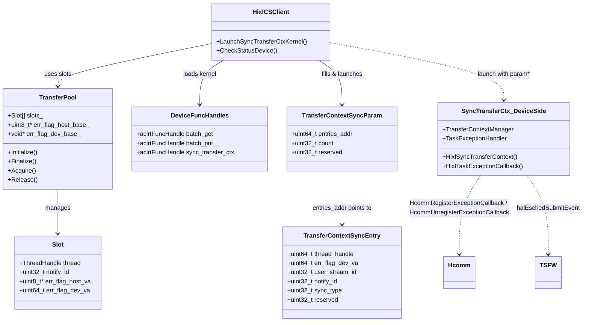
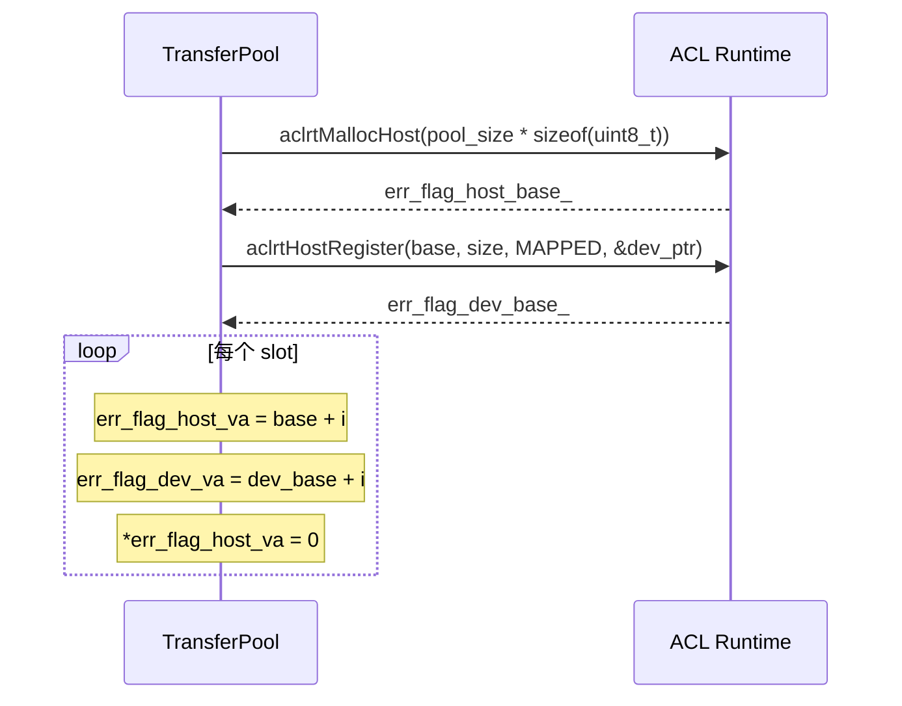
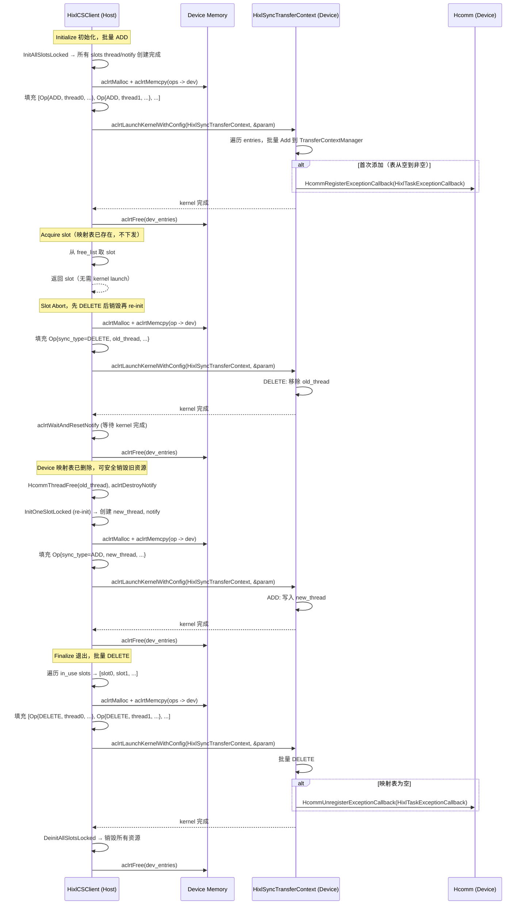
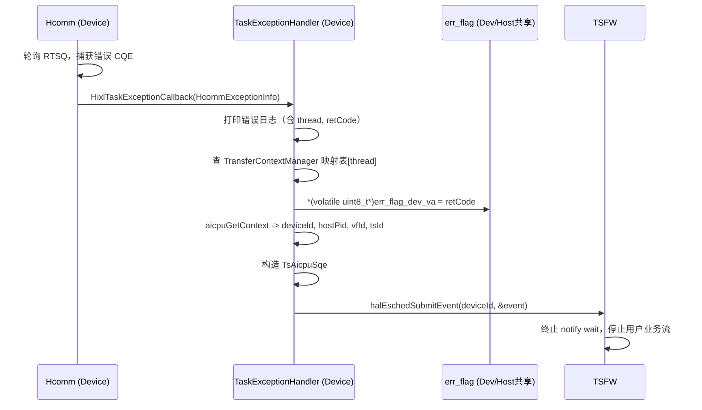

# HIXL 异常上报 SRS

## 需求描述

当前 HIXL CS 路径（TransferPool + HixlCSClient）的异步传输错误只能通过轮询 `CheckStatus` 接口获取 `complete_flag` 来判断任务是否完成。当 Device 侧 Hcomm 通信线程（`COMM_ENGINE_AICPU_TS`）发生底层传输异常（如 RDMA 重传超次、网卡故障、链路闪断等）时，AICPU Kernel 无法正常完成，导致 `complete_flag` 永远不会被置位。用户侧只能等待超时，无法及时感知异常并采取恢复措施。

本需求在 CS 路径上建立一条从 Device 侧 Hcomm 到 Host 侧 HIXL 再到 TSFW 的异常上报通路：

1. Host 侧通过 `HixlSyncTransferContext` Kernel 在 Device 侧注册异常回调并维护全局映射表 `{thread -> {user_stream_id, notify_id, err_flag_dev_va}}`。
2. Hcomm 后台线程轮询 RTSQ 捕获错误 CQE，通过回调通知 Device 侧异常处理逻辑。
3. Device 侧解析异常信息，写入 `err_flag`，构造 `ts_aicpu_sqe_t` 并通过 `halEschedSubmitEvent` 通知 TSFW 终止 notify wait。
4. 用户通过异步查询接口先读 `complete_flag`，若仍为 WAITING，再读 `err_flag`（Host VA）获取异常错误码。

### 假设与待确认

- **Hcomm 异常回调 API**：Device 侧通过 `HcommRegisterExceptionCallback` / `HcommUnregisterExceptionCallback` 注册/注销异常回调，回调函数签名为 `void (*)(const HcommExceptionInfo *exceptionInfo)`，其中 `HcommExceptionInfo` 包含 `taskId`、`thread`、`channel`、`retCode`（HcclResult）、`expandInfo`（扩展错误信息）。
- **`HixlSyncTransferContext` Kernel 的函数签名待确认**：复用现有 kernel JSON 配置新增的函数，其入参结构需与 Device 侧 kernel 开发者对齐。
- **err_flag 错误码值域待确认**：当前设计为 `uint8_t`，0 表示正常，非 0 表示错误码。Hcomm 回调提供的错误码暂不转换，直接透传给 TS（`ret_code` 字段），后续视需求再决定是否做错误码映射。
- **Device 侧映射表容量上限待确认**：全局映射表的最大条目数需与 `TransferPool::kMaxPoolSize = 4096` 对齐，确保不会溢出。
- **本需求仅影响 CS 路径**（TransferPool + HixlCSClient），不涉及 FabricMem 和 ADXL 路径。

## 功能要点

- [ ] **err_flag 资源管理**：在 TransferPool 资源池中为每个 slot 新增 `err_flag`（`uint8_t`）资源，通过 Host Register 映射生成 Device 可访问的 Access VA，支持 Host 侧读和 Device 侧写。
- [ ] **`HixlSyncTransferContext` Kernel 与 Device 侧映射表管理**：新增 `HixlSyncTransferContext` Kernel（复用现有 JSON 配置，新增独立函数），在 Device 侧维护全局映射表 `{thread -> {user_stream_id, notify_id, err_flag_dev_va}}`，通过 `TransferContextSyncParam` 入参接收操作列表，每条 `TransferContextSyncEntry` 自带 `sync_type`（ADD/DELETE）。**调用时机**：Initialize 时批量 ADD、Finalize 时批量 DELETE、Abort 时先 DELETE 等待完成再销毁再 ADD。首次注册时自动向 Hcomm 注册异常回调，映射表清空时自动注销。
- [ ] **Device 侧异常处理与 TSFW 通知**：Device 侧接收 Hcomm 异常回调后，记录错误日志（必须包含 thread 信息），写入 `err_flag`，查找映射表获取 `notify_id`/`user_stream_id`，构造 `ts_aicpu_sqe_t` 并通过 `halEschedSubmitEvent` 发布事件通知 TSFW 终止 notify wait。
- [ ] **用户侧异常查询**：用户通过异步查询接口先读 `complete_flag`，若为 WAITING，再读 `err_flag`（Host VA）获取错误码（0=正常，非 0=异常错误码），实现异常感知。

## 技术方案

### 设计思路

本需求在现有 CS 传输路径上新增一条异常上报旁路，不改变正常数据面的传输流程和 Kernel 入参。异常回调注册、全局映射表维护、异常处理逻辑**全部在 Device 侧完成**，Host 侧仅负责 err_flag 内存管理和在关键时机（Initialize/Finalize/Abort）通过 kernel 下发 ADD/DELETE 指令。

核心改动集中在三个模块：

1. **TransferPool**（`src/hixl/cs/transfer_pool.h/.cc`）：扩展 Slot/SlotHandle 结构，新增 err_flag 内存管理（整块申请 + 按 slot 拆分）。
2. **HixlCSClient**（`src/hixl/cs/hixl_cs_client.h/.cc`）：新增 `LaunchSyncTransferCtxKernel` 方法（batch add/delete 指令下发）、`CheckStatusDevice` 扩展。
3. **load_kernel / hixl_sync_transfer_ctx**（`src/hixl/cs/load_kernel.h/.cc`、`src/ops/hixl_kernel/`）：扩展 `DeviceFuncHandles`，新增 kernel 函数句柄和 Device 侧实现。

### Kernel 接口与数据结构设计

#### 数据结构

```cpp
// 单条同步操作（32字节，无内部空洞）
// Host 侧填充，通过 aclrtMemcpy(H2D) 拷贝到 Device 内存后，
// Kernel 通过 entries_addr 字段访问
// 字段排列原则：大字段在前，小字段在后，避免内部 padding
struct TransferContextSyncEntry {
  uint64_t thread_handle;     // Hcomm 通信线程句柄
  uint64_t err_flag_dev_va;   // err_flag 的 Device 可访问地址（Host Register 映射）
  uint32_t user_stream_id;    // 用户业务流 ID -> ts_aicpu_sqe_t.aicpu_record.fault_stream_id
  uint32_t notify_id;         // notify 对象 ID -> ts_aicpu_sqe_t.aicpu_record.record_id
  uint32_t sync_type;         // 同步操作类型：SYNC_TYPE_ADD=0, SYNC_TYPE_DELETE=1
  uint32_t reserved;          // 保留字段，对齐到32字节
};

// Kernel 入参结构（16字节，无内部空洞）
// 与 HixlOneSideOpParam 同模式：runtime launch kernel 时自动将
// 此结构体从 Host 拷贝到 Device，Kernel 函数通过指针访问
struct TransferContextSyncParam {
  uint64_t entries_addr;      // TransferContextSyncEntry 数组的 Device 地址
                              // （Host 侧预先 aclrtMalloc + aclrtMemcpy）
  uint32_t count;             // 本次操作的条目数
  uint32_t reserved;          // 保留字段，对齐到16字节
};
```

#### Kernel 函数签名

```cpp
// 与 HixlBatchGet/HixlBatchPut 同模式
// runtime 自动将 TransferContextSyncParam 从 Host 拷贝到 Device
extern "C" uint32_t HixlSyncTransferContext(TransferContextSyncParam *param);
```

#### 同步操作类型

| 值 | 名称 | 语义 |
|----|------|------|
| 0 | `SYNC_TYPE_ADD` | 添加 thread 映射条目到 Device 侧全局映射表。若为首次添加（表从空变为非空），自动向 Hcomm 注册异常回调。 |
| 1 | `SYNC_TYPE_DELETE` | 删除 thread 映射条目。若删除后映射表为空，自动向 Hcomm 注销异常回调。 |

#### Host 侧 launch 流程（与 LaunchDeviceKernel 一致）

```
1. aclrtMalloc(&dev_entries, count * sizeof(TransferContextSyncEntry))
2. aclrtMemcpy(dev_entries, ..., host_entries, ..., ACL_MEMCPY_HOST_TO_DEVICE)
3. 填充 TransferContextSyncParam{entries_addr=(uint64_t)dev_entries, count}
4. aclrtKernelArgsInit(func, &argsHandle)
5. aclrtKernelArgsAppend(argsHandle, &param, sizeof(TransferContextSyncParam), &paraHandle)
   // runtime 自动将 param 从 Host 拷贝到 Device
6. aclrtKernelArgsFinalize(argsHandle)
7. aclrtLaunchKernelWithConfig(func, block_dim=1, stream, &cfg, argsHandle, nullptr)
8. aclrtWaitAndResetNotify(notify, stream, timeout)
9. aclrtFree(dev_entries)
```

#### Device 侧 Kernel 行为

```
Device 侧全局状态（跨 kernel launch 持久化）：
  - TransferContextManager: 单例，维护映射表 {thread -> TransferContext{state, user_stream_id, notify_id, err_flag_dev_va}}
  - TaskExceptionHandler: 单例，管理 Hcomm 异常回调注册/注销（内部 atomic flag 保证只注册一次）

HixlSyncTransferContext 流程：
  遍历 entries 数组，逐条处理：
    if (entry.op == TRANSFER_CONTEXT_OP_ADD):
      TransferContextManager::Add(thread, user_stream_id, notify_id, err_flag_dev_va)
      TaskExceptionHandler::EnableExceptionCallback()  // 首次调用注册，后续 no-op
    elif (entry.op == TRANSFER_CONTEXT_OP_DELETE):
      TransferContextManager::Delete(thread)
      if (映射表为空):
        TaskExceptionHandler::DisableExceptionCallback()  // 注销回调

异常回调流程（Hcomm 触发，TaskExceptionHandler 内部）：
  1. 从 HcommExceptionInfo 获取 thread, retCode
  2. 打印错误日志（必须包含 thread 信息）
  3. 查找 TransferContextManager 映射表[thread]
  4. 写入 err_flag: *(volatile uint8_t*)ctx.err_flag_dev_va = retCode
  5. 调用 NotifyTsfwTaskException(notify_id, user_stream_id, retCode) 通知 TSFW
```

#### Hcomm 异常回调与 TSFW 通知实现（`task_exception_handler.cc`）

```cpp
// Hcomm 异常信息结构体
typedef void (*ExceptionCallback)(const HcommExceptionInfo *exceptionInfo);

struct HcommExceptionInfo {
  uint32_t taskId;
  uint64_t thread;       // ThreadHandle
  uint64_t channel;      // ChannelHandle
  uint32_t retCode;      // HcclResult 错误码
  HcommExceptionExpandInfo expandInfo;
};

// Device 侧回调函数（TaskExceptionHandler 内部，外部不感知）
void HixlTaskExceptionCallback(const HcommExceptionInfo *exceptionInfo) {
  uint64_t thread_handle = exceptionInfo->thread;
  uint32_t error_code = exceptionInfo->retCode;

  auto ctx = TransferContextManager::Instance().Get(thread_handle);
  if (ctx == nullptr || ctx->GetState() != TRANSFER_THREAD_STATE_INITIALIZED) { return; }

  // 1. 写入 err_flag
  *(volatile uint8_t *)(ctx->err_flag_dev_va) = (uint8_t)error_code;

  // 2. 获取 device context（aicpuGetContext）
  aicpu::aicpuContext_t aicpu_ctx = {};
  aicpu::aicpuGetContext(&aicpu_ctx);

  // 3. 构造 ts_aicpu_sqe_t 并通过 halEschedSubmitEvent 提交
  TsAicpuSqe aicpu_sqe = {};
  aicpu_sqe.pid = aicpu_ctx.hostPid;
  aicpu_sqe.cmd_type = AICPU_RECORD;
  aicpu_sqe.vf_id = aicpu_ctx.vfId;
  aicpu_sqe.ts_id = aicpu_ctx.tsId;
  aicpu_sqe.aicpu_record.record_type = AICPU_MSG_NOTIFY_RECORD;
  aicpu_sqe.aicpu_record.record_id = ctx->notify_id;
  aicpu_sqe.aicpu_record.fault_stream_id = ctx->user_stream_id;
  aicpu_sqe.aicpu_record.ret_code = static_cast<uint16_t>(error_code);  // 透传，暂不转换

  struct event_summary event = {};
  event.dst_engine = TS_CPU;
  event.policy = ONLY;
  event.event_id = EVENT_TS_CTRL_MSG;
  event.msg_len = sizeof(TsAicpuSqe);
  event.msg = reinterpret_cast<char *>(&aicpu_sqe);
  halEschedSubmitEvent(aicpu_ctx.deviceId, &event);
}
```

**TaskExceptionHandler 单例接口：**
- `EnableExceptionCallback()`：调用 `HcommRegisterExceptionCallback(HixlTaskExceptionCallback)`，内部 `atomic<bool>` 保证只注册一次
- `DisableExceptionCallback()`：调用 `HcommUnregisterExceptionCallback(HixlTaskExceptionCallback)`，按函数指针注销

**依赖头文件：**
- `ascend_hal.h`：`halEschedSubmitEvent`（弱符号）、`event_summary`、`drvError_t`
- `aicpu/aicpu_schedule/aicpu_context.h`：`aicpu::aicpuGetContext`、`aicpu::aicpuContext_t`（弱符号）
- `hixl/hixl_types.h`：`Status`（`SUCCESS`/`FAILED`）

### 模块关系



### 功能点 1：err_flag 资源管理

#### 核心流程



#### 关键设计

**TransferPool::Slot 扩展：**

```cpp
struct Slot {
  bool in_use;
  aclrtContext ctx;
  aclrtStream stream;
  ThreadHandle thread;
  aclrtNotify notify;
  uint32_t notify_id;
  uint8_t *err_flag_host_va;  // 新增：Host 侧 err_flag 指针
  uint64_t err_flag_dev_va;   // 新增：Device 可访问的 err_flag 地址
};
```

**TransferPool 新增成员：**

```cpp
uint8_t *err_flag_host_base_{nullptr};  // Host 侧整块内存基址
void *err_flag_dev_base_{nullptr};      // Device 侧映射基址（Access VA）
```

**SlotHandle 扩展：**

```cpp
struct SlotHandle {
  // ... 现有字段不变
  uint8_t *err_flag_host_va;  // 新增
  uint64_t err_flag_dev_va;   // 新增
};
```

**初始化（`Initialize` 新增步骤）：**
1. `aclrtMallocHost` 分配 `pool_size * sizeof(uint8_t)`，初始化为 0。
2. `aclrtHostRegister(ACL_HOST_REGISTER_MAPPED)` 获取 Device 可访问地址。
3. 按索引拆分至各 slot：`err_flag_host_va = base + i`，`err_flag_dev_va = dev_base + i`。

**销毁（`DeinitAllSlotsLocked` 新增步骤）：**
1. `aclrtHostUnregister(err_flag_host_base_)` 解除映射。
2. `aclrtFreeHost(err_flag_host_base_)` 释放 Host 内存。

### 功能点 2：`HixlSyncTransferContext` Kernel 与 Device 侧映射表管理

#### 核心流程



#### 关键设计

**DeviceFuncHandles 扩展（`load_kernel.h`）：**

```cpp
struct DeviceFuncHandles {
  aclrtFuncHandle batch_get;
  aclrtFuncHandle batch_put;
  aclrtFuncHandle sync_transfer_ctx;  // 新增
};
```

**load_kernel 扩展：**
- JSON 配置中新增函数名 `"HixlSyncTransferContext"`。
- `LoadDeviceKernelAndGetHandles` 中通过 `aclrtBinaryGetFunction` 一并加载。

**HixlCSClient 新增方法：**

```cpp
Status LaunchSyncTransferCtxKernel(const std::vector<TransferContextSyncEntry> &ops);
```

**LaunchSyncTransferCtxKernel 流程（与现有 LaunchDeviceKernel 模式一致）：**
1. `aclrtMalloc` 分配 Device 内存 `dev_entries`。
2. `aclrtMemcpy(dev_entries, ops.data(), size, ACL_MEMCPY_HOST_TO_DEVICE)`。
3. 填充 `TransferContextSyncParam{entries_addr=(uint64_t)dev_entries, count}`。
4. `aclrtKernelArgsInit` + `aclrtKernelArgsAppend(&param, sizeof(TransferContextSyncParam))` + `aclrtKernelArgsFinalize`。
5. `aclrtLaunchKernelWithConfig(func, block_dim=1, stream, &cfg, argsHandle, nullptr)`。
6. `aclrtWaitAndResetNotify` 等待 kernel 完成。
7. `aclrtFree(dev_entries)` 释放临时 Device 内存。

**调用时机（关键约束：销毁资源前必须先通知 Device 删除）：**
- **Initialize 初始化**：`InitAllSlotsLocked` 为所有 slots 创建 thread/notify 后，**批量 ADD**（一次 kernel launch 下发所有 slots），避免逐个 Acquire 时下发。
- **Acquire**：映射表已存在（Initialize 时已批量注册），**不下发 kernel**。除非 slot 曾被 Abort 过（thread 变化），此时需单条 ADD。
- **Release**：**不下发 kernel**。仅减少引用计数并归还池，资源未销毁。
- **Abort**：**两次独立 kernel launch**，串行执行：
  1. 先下发 DELETE（old_thread）→ `aclrtWaitAndResetNotify` 等待完成 → Device 映射表已删除
  2. 销毁旧资源（HcommThreadFree、aclrtDestroyNotify）→ re-init 创建新资源
  3. 下发 ADD（new_thread）→ 归还池
  - **无法批量/混合**：old_thread 和 new_thread 串行依赖，需等待 DELETE 完成才能销毁，销毁后才能 re-init，re-init 后才能 ADD。
- **Finalize 退出**：遍历所有 `in_use` slots，**批量 DELETE**（一次 kernel launch 下发多条），等待完成后销毁资源。

**批量场景汇总：**
| 场景 | 批量支持 | 说明 |
|------|----------|------|
| Initialize 初始化 | ✅ 批量 ADD | 所有 slots thread/notify 已创建，一次 kernel 下发 |
| Finalize 退出 | ✅ 批量 DELETE | 所有 in_use slots，一次 kernel 下发 |
| Abort 恢复 | ❌ 两次独立 | DELETE → 销毁 → re-init → ADD，串行依赖 |
| Acquire/Release | ❌ 不下发 | 映射表已存在 / 资源未销毁 |

### 功能点 3：Device 侧异常处理与 TSFW 通知

#### 核心流程



### 功能点 4：用户侧异常查询

#### 关键设计

**CheckStatusDevice 扩展（Host 侧唯一查询改动）：**

```cpp
Status CheckStatusDevice(DeviceCompleteHandle &qh, HixlCompleteStatus &status) {
  volatile uint64_t *flag_ptr = static_cast<uint64_t *>(qh.host_flag);
  if (*flag_ptr == kDeviceFlagDoneValue) {
    status = HIXL_COMPLETE_STATUS_COMPLETED;
    return ReleaseDevCompleteHandle(&qh);
  }
  // 新增：complete_flag 未完成时，检查 err_flag
  auto *err = qh.shared_slot->err_flag_host_va;
  if (err != nullptr && *err != 0) {
    status = HIXL_COMPLETE_STATUS_FAILED;
    return ReleaseDevCompleteHandle(&qh);
  }
  status = HIXL_COMPLETE_STATUS_WAITING;
  return SUCCESS;
}
```

**err_flag 重置**：在 `ReleaseDevCompleteHandle` 中将 `*err_flag_host_va = 0`，确保 slot 复用时 err_flag 为干净状态。

## 相关文档

- 新增：`docs/zh/design/HIXL异常上报SRS.md`（本文档）
- 扩展：`src/ops/hixl_kernel/transfer_context_manager.h/.cc`（追加异常上报字段，调用 TaskExceptionHandler）
- 新增：`src/ops/hixl_kernel/task_exception_handler.h/.cc`（Hcomm 异常回调注册/注销 + TSFW 通知，单例封装）
- 更新：`docs/cpp/HIXL_CS接口.md`（CheckStatus FAILED 语义扩展）
- 更新：`docs/cpp/HIXL错误码.md`（err_flag 错误码说明，当前透传 Hcomm 原始错误码）
- 更新：kernel JSON 配置文件（新增 `HixlSyncTransferContext` 函数）

## 测试方案

### 单元测试

- `tests/cpp/hixl/cs/transfer_pool_err_flag_unittest.cc`
- `tests/cpp/hixl/cs/hixl_cs_client_sync_ctx_unittest.cc`

| 测试场景 | 测试功能 | 验证点 |
| --- | --- | --- |
| err_flag 初始化 | TransferPool Initialize | 每个 slot 的 err_flag_host_va 非空、值为 0、err_flag_dev_va 非零 |
| err_flag 释放 | TransferPool Finalize | Host 内存和 Device 映射正确释放，无泄漏 |
| err_flag 重置 | ReleaseDevCompleteHandle | 释放 handle 后 err_flag 被重置为 0 |
| slot 复用 err_flag 干净 | Acquire -> Release -> Acquire | 第二次 Acquire 的 slot err_flag 值为 0 |
| Kernel ADD launch | LaunchSyncTransferCtxKernel(ADD) | Param 正确填充，dev_entries 正确分配/释放，kernel launch 成功 |
| Kernel DELETE launch | LaunchSyncTransferCtxKernel(DELETE) | Param 正确填充，dev_entries 正确分配/释放，kernel launch 成功 |
| Initialize 批量 ADD | LaunchSyncTransferCtxKernel(所有 slots ADD) | 所有 slots thread/notify 有效，一次 kernel 下发成功，映射表完整 |
| Finalize 批量 DELETE | LaunchSyncTransferCtxKernel(所有 in_use slots DELETE) | 批量删除，映射表清空后 callback 注销 |
| CheckStatusDevice err_flag | 异常后查询 | complete_flag=WAITING 且 err_flag!=0 时返回 FAILED |
| CheckStatusDevice 正常完成 | 正常传输后查询 | complete_flag=1 时返回 COMPLETED，不读 err_flag |

### 系统/集成测试

| 测试场景 | 测试功能 | 验证点 |
| --- | --- | --- |
| Initialize 批量注册 | TransferPool Initialize + 批量 kernel launch | 所有 slots 映射表正确，callback 已注册 |
| 端到端异常上报 | Hcomm 模拟错误 CQE -> Device 侧回调 -> err_flag -> Host 侧查询 | CheckStatus 返回 FAILED，err_flag 携带正确错误码 |
| 正常传输不受影响 | 无异常场景 BatchTransferAsync + CheckStatus | 传输正常完成，err_flag 保持为 0 |
| slot Abort 后恢复 | Abort 流程：DELETE → 销毁 → re-init → ADD | 两次独立 kernel，时序正确：先 DELETE 等待完成再销毁，re-init 后再 ADD |
| Finalize 批量销毁 | 多个 in_use slots 批量 DELETE | 一次 kernel launch 下发所有 DELETE，等待完成后销毁资源，callback 注销 |
| 多 slot 并发异常 | 多 slot 同时触发异常 | 各 slot err_flag 独立正确，Device 侧映射表无冲突 |
| 映射表增删一致性 | Initialize -> Acquire/Release -> Abort -> Finalize | Device 侧映射表与 Host 侧 slot 状态始终一致 |

### 上机集成测试

| 测试场景 | 测试功能 | 验证点 |
| --- | --- | --- |
| 真实 RDMA 链路异常 | 物理断链或模拟重传超时 | Hcomm 捕获 CQE 错误 -> Device 侧回调 -> err_flag 写入 -> halEschedSubmitEvent -> TSFW 终止 notify wait -> Host 侧感知 FAILED |
| halEschedSubmitEvent 联动 | 异常后 TSFW 事件通知 | ts_aicpu_sqe_t 字段正确填充，TSFW 正确停止 notify wait 对应的用户业务流 |

> 上机集成测试依赖真实 Ascend 硬件和 Hcomm 运行时，无法通过 UT/ST 替代。
