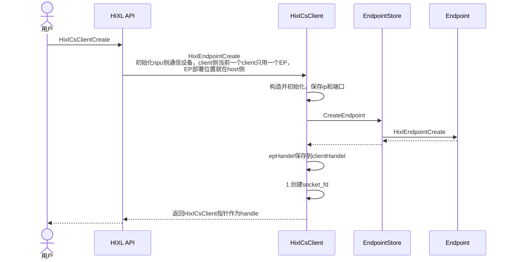
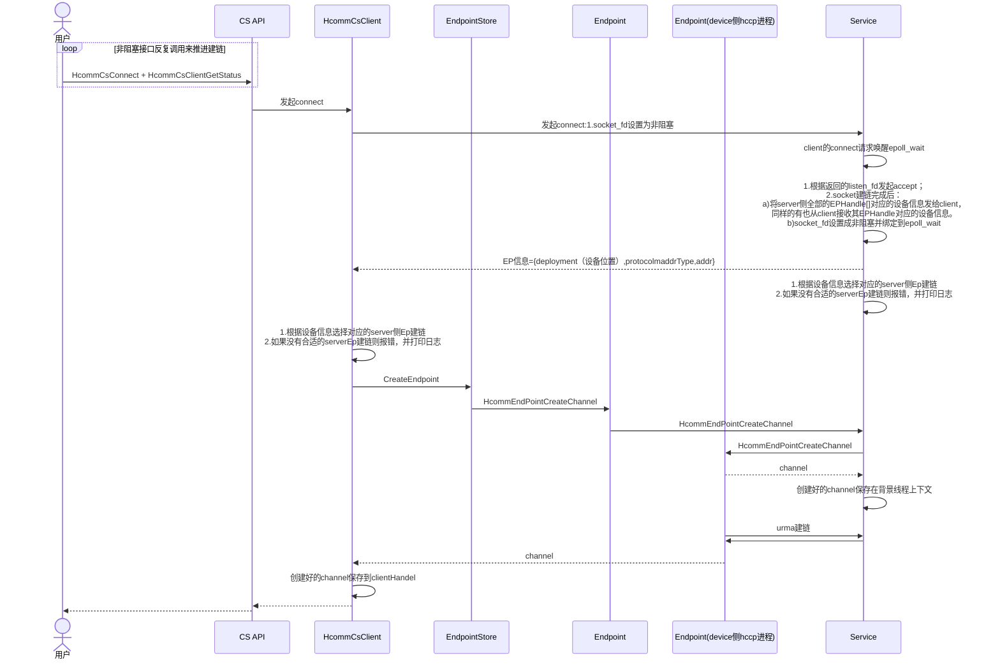
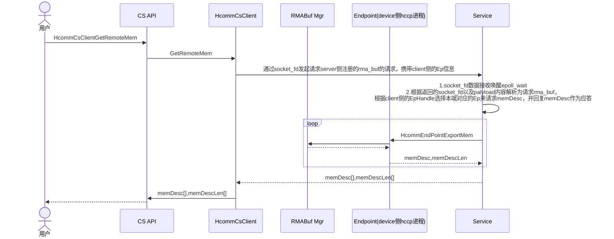
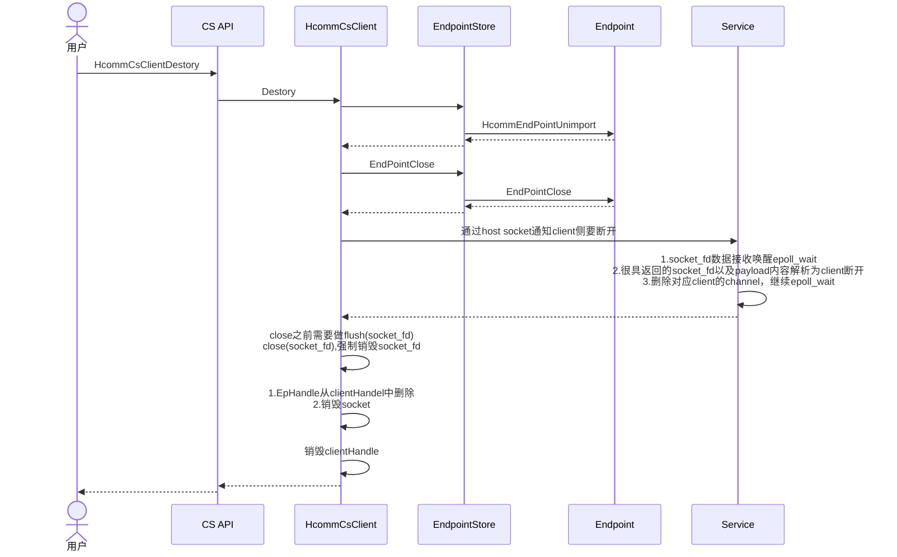

# 单边通信库设计

## 需求描述
[简要描述要做什么，解决什么问题]

- 背景介绍
HCCL提供单边通信库，与集合通信库并列，共同作为通信库对外提供的基础能力。
- 需要做什么
HCCL提供新接口支持单边通信场景。

## 功能要点
- [ ] 支持Server侧创建并启动监听
- [ ] 支持Client向Server异步建链，与建链状态查询
- [ ] 支持Client-Server内存注册注销
- [ ] 支持Client侧查询Server侧内存
- [ ] 支持Client数据异步读写与传输状态查询

## 技术方案
[简单的技术实现思路]
对外API：
```c++
using ClientHandle = void *;
/** 
 * @brief 创建Client
 * @param [in] serverIp 服务端的监听ipv4地址
 * @param [in] serverPort 服务端的监听端口号
 * @param [in] srcEndPoint 源端点 客户端用于数据面通信的资源描述
 * @param [in] dstEndPoint 目的端点
 * @param [out] clientHandle 客户端句柄 client创建返回的handle信息，用于后续调用其他接口
 * @return 成功：HcclResult.HCCL_SUCCESS 失败：其它
 * 1.创建客户端句柄2.查询客户端句柄创建完成后才可发起服务端共享内存的访问
 */
HcclResult HixlCSClientCreate(char *serverIp, uint32_t serverPort, const EndPoint *srcEndPoint, const EndPoint *dstEndPoint, ClientHandle **clientHandle)

/**
 * @brief Client连接到Server
 * @param [in] clientHandle client创建返回的handle
 * @return 成功：HcclResult.HCCL_SUCCESS 失败：其它
 */
HcclResult HixlCSClientConnect(ClientHandle *clientHandle)

/**
 * @brief 查询客户端的创建完成状态
 * @param [in] clientHandle client创建返回的handle
 * @param [out] status 连接状态 0=尚未完成，1=完成，其它：保留
 * @return 成功：HcclResult.HCCL_SUCCESS 失败：其它
 */
HcclResult HixlCSClientGetStatus(ClientHandle *clientHandle, int32_t *status)

/**
 * @brief 获取远端内存信息
 * @param [in] clientHandle client创建返回的handle
 * @param [in] remoteMemList 服务端共享内存列表
 * @param [in] memTagList 服务端共享内存的标识列表
 * @param [in] listNum 共享内存实际数量
 * @param [in] timeout 请求的超时时间，单位：秒
 * @return 成功：HcclResult.HCCL_SUCCESS 失败：其它
 */
HcclResult HixlCSClientGetRemoteMem	(ClientHandle *clientHandle, HcclMem **remoteMemList, char **memTagList, uint32_t *listNum, uint32_t timeout)

/**
 * @brief client销毁
 * @param [in] clientHandle client创建返回的handle 调用者传入HcommCsClientCreate得到的ClientHandle 
 * @return 成功：HcclResult.HCCL_SUCCESS 失败：其它
 * 关闭句柄会销毁句柄附属的全部资源，使用者必须确保Endpoint上的通信操作全部完成之后再做关闭
 */
HcclResult HixlCSClientDestroy(ClientHandle *clientHandle)

```

依赖的API:
```c++
typedef enum {
    HCCL_SUCCESS = 0,               /**< success */
    HCCL_E_PARA = 1,                /**< parameter error */
    HCCL_E_PTR = 2,                 /**< empty pointer */
    HCCL_E_MEMORY = 3,              /**< memory error */
    HCCL_E_INTERNAL = 4,            /**< internal error */
    HCCL_E_NOT_SUPPORT = 5,         /**< not support feature */
    HCCL_E_NOT_FOUND = 6,           /**< not found specific resource */
    HCCL_E_UNAVAIL = 7,             /**< resource unavailable */
    HCCL_E_SYSCALL = 8,             /**< call system interface error */
    HCCL_E_TIMEOUT = 9,             /**< timeout */
    HCCL_E_OPEN_FILE_FAILURE = 10,  /**< open file fail */
    HCCL_E_TCP_CONNECT = 11,        /**< tcp connect fail */
    HCCL_E_ROCE_CONNECT = 12,       /**< roce connect fail */
    HCCL_E_TCP_TRANSFER = 13,       /**< tcp transfer fail */
    HCCL_E_ROCE_TRANSFER = 14,      /**< roce transfer fail */
    HCCL_E_RUNTIME = 15,            /**< call runtime api fail */
    HCCL_E_DRV = 16,                /**< call driver api fail */
    HCCL_E_PROFILING = 17,          /**< call profiling api fail */
    HCCL_E_CCE = 18,                /**< call cce api fail */
    HCCL_E_NETWORK = 19,            /**< call network api fail */
    HCCL_E_AGAIN = 20,              /**< try again */
    HCCL_E_REMOTE = 21,             /**< error cqe */
    HCCL_E_SUSPENDING = 22,         /**< error communicator suspending*/
    HCCL_E_IN_STATUS = 1041,        /**< The error information is in the status. */
    HCCL_E_RESERVED                 /**< reserved */
} HcclResult;
/**
 * @brief 通信连接通道的端侧
 *
 */
typedef struct {
    uint32_t rankId;    ///< rank标识
    CommProtocol protocol;  ///< 通信协议
    CommAddr commAddr;      ///< 通信地址
} EndPoint;

/**
 * @brief 通信协议类型枚举
 * @warning
 */
typedef enum {
    COMM_PROTOCOL_RESERVED = -1,  ///< 保留协议类型
    COMM_PROTOCOL_HCCS = 0,        ///< HCCS协议
    COMM_PROTOCOL_TCP = 1,        ///< 标准TCP协议
    COMM_PROTOCOL_ROCE = 2,       ///< RDMA over Converged Ethernet
    COMM_PROTOCOL_UB_CTP = 3,    ///< 华为统一总线UB_CTP
    COMM_PROTOCOL_UB_TP = 4,     ///< 华为统一总线UB_TP
    COMM_PROTOCOL_PCIE = 5,      ///< PCIE协议
    COMM_PROTOCOL_SIO = 6,        ///< SIO协议
} CommProtocol;

/**
 * @brief 通信设备地址描述结构体
 */
typedef struct {
    CommAddrType type;  ///< 通信地址类别
    union {
        uint32_t id;            ///< 标识
        struct in_addr addr;   ///< IPv4地址结构
        struct in6_addr addr6; ///< IPv6地址结构
    };
} CommAddr;

/**
 * @brief 通信设备地址类别
 */
typedef enum {
    COMM_ADDR_TYPE_RESERVED = -1, ///< 保留地址类型
    COMM_ADDR_TYPE_IP_V4 = 0,     ///< IPv4地址类型
    COMM_ADDR_TYPE_IP_V6 = 1,     ///< IPv6地址类型
    COMM_ADDR_TYPE_ID = 2,        ///< ID地址类型
} CommAddrType;
/**
 * @struct HcclMem
 * @brief 内存段元数据描述结构体
 * @var type  - 内存物理位置类型，参见HcclMemType
 * @var addr  - 内存虚拟地址
 * @var size  - 内存区域字节数
 */
typedef struct {
    HcclMemType type;
    void *addr;
    uint64_t size;
} HcclMem;

/**
 * @enum HcclMemType
 * @brief 内存类型枚举定义
 */
typedef enum {
    HCCL_MEM_TYPE_DEVICE, ///< 设备侧内存（如NPU等）
    HCCL_MEM_TYPE_HOST,   ///< 主机侧内存
    HCCL_MEM_TYPE_NUM     ///< 内存类型数量
} HcclMemType;
```

内部实现关键接口设计：
```c++
class ASCEND_FUNC_VISIBILITY HcommCsClient {
 public:
  HcommCsClient();
  ~HcommCsClient();

      /**
     * @brief 创建客户端
     */
    HcclResult Create(char* server_ip, uint32_t server_port, 
                      const EndPoint* src_end_point, const EndPoint* dst_end_point, 
                      ClientHandle** client_handle);

    /**
     * @brief 连接到服务端
     */
    HcclResult Connect(ClientHandle* client_handle);

    /**
     * @brief 查询客户端的创建完成状态
     */
    HcclResult GetStatus(ClientHandle* client_handle, int32_t* status);

    /**
     * @brief 获取远端内存信息
     */
    HcclResult GetRemoteMem(ClientHandle* client_handle, HcclMem** remote_mem_list, 
                            char** mem_tag_list, uint32_t* list_num, uint32_t timeout);

    /**
     * @brief 销毁客户端
     */
    HcclResult Destroy(ClientHandle* client_handle);

 private:
  std::string server_ip_;
  uint32_t server_port_;
  EndPoint src_end_point_;
  EndPoint dst_end_point_;
  bool is_connected_;
  std::mutex mutex_;
  std::map<MemHandle, std::vector<EndpointMemInfo>> remote_mem_info_;  // 保存远端的注册内存信息
  std::mutex chn_mutex_;
  std::map<int32_t, EndpointChannelInfo> channels_;  // 保存与服务端的channel信息，使用client链接的fd作为key
};


using EndpointHandle = void *;
using ChannelHandle = void *;

class ASCEND_FUNC_VISIBILITY EndpointStore {
 public:
  EndpointStore();
  ~EndpointStore();

  HcclResult CreateEndpoint(const EndPoint &endpoint, EndpointHandle *endpoint_handle);

  HcclResult DestroyEndpoint(EndpointHandle endpoint_handle);

  std::vector<EndpointHandle> GetAllEndpointHandles();

  HcclResult MatchEndpoint(const EndPoint &peer_endpoint, EndpointHandle *endpoint_handle, EndPoint &matched_endpoint);

  HcclResult RegisterMem(EndpointHandle endpoint_handle, const char *mem_tag, const HcclMem *mem, MemHandle *mem_handle);

  HcclResult DeregisterMem(EndpointHandle endpoint_handle, MemHandle mem_handle);

  HcclResult ExportMem(EndpointHandle endpoint_handle, std::vector<MemDesc> &mem_descs);

  HcclResult CreateChannel(EndpointHandle endpoint_handle, ChannelHandle *channel_handle);

  HcclResult DestroyChannel(EndpointHandle endpoint_handle, ChannelHandle channel_handle);
};
```

时序图：


**流程分析：**

1. **用户调用API**:
   - 用户通过`CS API`调用`HcommCsClientCreate`函数，开始创建客户端。
2. **API初始化客户端**:
   - `CS API`调用`HcommCsClient`的`HcommEndpointCreate`方法，初始化NPU侧的通信设备。
3. **客户端构造与初始化**:
   - `HcommCsClient`构造并初始化，保存服务端的IP和端口信息。
4. **创建端点**:
   - `HcommCsClient`调用`EndpointStore`的`CreateEndpoint`方法，创建一个端点（Endpoint）。
   - `EndpointStore`调用`Endpoint`的`HcommEndpointCreate`方法，完成端点的创建。
5. **返回客户端句柄**:
   - `EndpointStore`将创建的端点信息返回给`HcommCsClient`。
   - `HcommCsClient`返回一个指向自身的指针作为客户端句柄。
6. **API处理句柄**:
   - `CS API`将客户端句柄保存到`clientHandle`中，并返回给用户。

**设计关键点：**

- 通过EndpointStore保存所有Endpoint信息并提供接口能力，以EndpointHandle作为索引



**流程分析：**

1. **用户调用非阻塞接口**:
   - 用户通过`CS API`调用`HcommCsConnect`和`HcommCsClientGetStatus`，以非阻塞的方式推进建链过程。
2. **客户端发起连接**:
   - `CS API`调用`HcommCsClient`的`HcommCsConnect`方法，客户端开始发起连接请求。
3. **服务端接收连接请求**:
   - 客户端通过socket发起连接请求，服务端的`epoll_wait`被唤醒。
   - 服务端根据返回的`listen_fd`发起`accept`，完成socket建链。
4. **设备信息交换**:
   - socket建链完成后，服务端将所有设备信息（`EPHandle[]`）发送给客户端，同时从客户端接收其设备信息。
   - socket设置为非阻塞，并绑定到`epoll_wait`以实现异步通信。
5. **服务端处理设备信息**:
   - 服务端根据设备信息选择对应的server侧Ep建链。
   - 如果没有合适的serverEp建链，则报错并打印日志。
6. **客户端创建通道**:
   - `CS API`调用`HcommCsClient`的`CreateEndpoint`方法，创建通道。
   - `HcommCsClient`调用`EndpointStore`的`HcommEndPointCreateChannel`方法，创建通道。
7. **通道创建与URMA建链**:
   - 通道创建后，服务端和客户端通过URMA协议建立连接。
   - 创建好的channel保存在背景线程上下文中。
8. **返回结果**:
   - 创建好的channel保存到`clientHandle`中，最终返回给用户。



**流程分析：**

1. **用户调用API**:
   - 用户通过`CS API`调用`HcommCsClientGetRemoteMem`函数，开始获取远程内存描述符。
2. **客户端发起请求**:
   - `CS API`调用`HcommCsClient`的`GetRemoteMem`方法，客户端通过socket发起请求，携带客户端侧的Ep信息。
3. **服务端处理请求**:
   - 服务端通过`socket_fd`接收请求，唤醒`epoll_wait`。
   - 解析请求内容，根据客户端侧的EpHandle选择本端对应的Ep，请求`memDesc`，并回复`memDesc`作为应答。
4. **内存描述符的获取**:
   - 服务端调用`HcommEndPointExportMem`方法，获取内存描述符。
   - 内存描述符的获取可能涉及到与`RMABuf Mgr`的交互，以获取具体的内存信息。
5. **返回内存描述符**:
   - 服务端将获取的`memDesc`和`memDescLen`返回给客户端。
   - 客户端将`memDesc`和`memDescLen`返回给`CS API`，最终返回给用户。



**流程分析**：

1. **用户调用API**:
   - 用户通过`CS API`调用`HcommCsClientDestory`函数，开始销毁客户端。
2. **客户端销毁操作**:
   - `CS API`调用`HcommCsClient`的`Destory`方法，客户端开始执行销毁操作。
3. **EndpointStore的调用**:
   - 客户端调用`EndpointStore`，开始执行与端点相关的销毁操作。
4. **端点的反导入**:
   - `EndpointStore`调用`Endpoint`的`HcommEndPointUnimport`方法，执行端点的反导入操作。
5. **端点的关闭**:
   - `EndpointStore`调用`Endpoint`的`EndPointClose`方法，关闭端点。
6. **服务端通知**:
   - 客户端通过host socket通知服务端要断开连接。
7. **服务端处理断开请求**:
   - 服务端通过`socket_fd`接收断开请求，唤醒`epoll_wait`。
   - 解析请求内容，删除对应客户端的channel，并继续`epoll_wait`。
8. **客户端的清理**:
   - 客户端在关闭socket之前执行`flush(socket_fd)`，确保所有数据被发送。
   - 关闭`socket_fd`，强制销毁socket。
   - 从`clientHandle`中删除EpHandle，并销毁socket。
   - 销毁`clientHandle`，释放相关资源。
9. **返回结果**:
   - 客户端完成销毁操作后，返回结果给`CS API`，最终返回给用户。

## 验收标准


## 备注
[其他需要说明的事项]