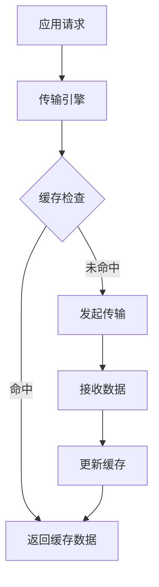
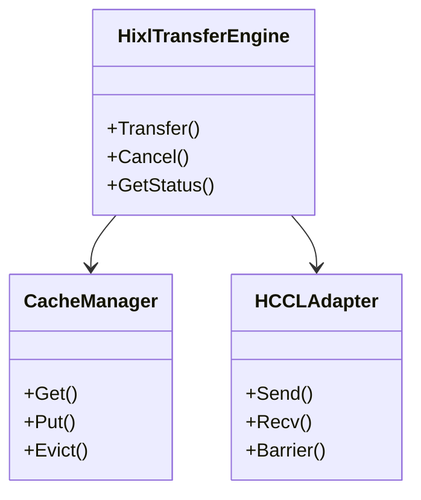

# PR自动创建流程详细设计

## 1. 整体流程图

```
开始
  │
  ├─> 检查git状态
  │   ├─ 工作区有未提交更改？→ 提示用户确认
  │   └─ 检查通过
  │
  ├─> 检查远程仓库配置
  │   ├─ origin存在？→ 否：退出
  │   ├─ upstream存在？→ 否：退出
  │   └─ 检查通过
  │
  ├─> 获取GitCode Token
  │   ├─ 环境变量GITCODE_TOKEN存在？→ 使用环境变量
  │   └─ 否：交互式输入（不回显）
  │
  ├─> 获取当前分支名
  │
  ├─> 确认commit范围
  │   ├─ 是否基于最新单个commit？
  │   │   ├─ 是：使用HEAD~1..HEAD
  │   │   └─ 否：输入起始commit ID → 验证有效性 → 使用commit_id..HEAD
  │
  ├─> 推送分支到origin
  │   ├─ git push origin <branch>
  │   ├─ 推送失败？→ 分析错误 → 退出
  │   └─ 推送成功
  │
  ├─> 分析变更内容（基础分析）
  │   ├─ 获取文件变更列表（git diff --name-status）
  │   ├─ 提取commit messages（git log --format="%s"）
  │   ├─ 统计变更类型（新增/修改/删除）
  │   └─ 检测测试文件
  │
  ├─> 深度代码分析
  │   ├─ 调用code_analyzer.py
  │   ├─ 解析C++代码（类、方法、调用关系）
  │   ├─ 解析Python代码（类、函数、依赖关系）
  │   ├─ 分析代码差异（新增/修改/删除的代码块）
  │   └─ 生成结构化分析结果（JSON格式）
  │
  ├─> 收集PR信息（交互式）
  │   ├─ 选择PR类型标签（Bug修复/新特性/代码重构/文档更新/其他）
  │   ├─ 确认PR标题（从第一个commit message提取，可编辑）
  │   ├─ 选择需要生成的Mermaid图表类型
  │   │   ├─ 流程图（flowchart）？
  │   │   ├─ 时序图（sequenceDiagram）？
  │   │   ├─ 类图（classDiagram）？
  │   │   └─ 架构图（graph）？
  │   └─ 确认目标分支（默认：upstream/master）
  │
  ├─> 调用LLM生成详细PR描述
  │   ├─ 调用llm_helper.py（使用GLM-4.7）
  │   ├─ 生成背景描述
  │   ├─ 生成问题描述
  │   ├─ 生成修改方案
  │   ├─ 生成代码流程说明
  │   ├─ 生成核心逻辑说明
  │   ├─ 按需生成Mermaid图表
  │   │   ├─ 需要流程图？→ 生成flowchart代码
  │   │   ├─ 需要时序图？→ 生成sequenceDiagram代码
  │   │   ├─ 需要类图？→ 生成classDiagram代码
  │   │   └─ 需要架构图？→ 生成graph代码
  │   └─ 组合成完整PR描述（Markdown格式）
  │
  ├─> 收集测试信息
  │   ├─ 有测试文件变更？
  │   │   ├─ 是：自动生成测试项描述
  │   │   └─ 否：询问是否需要添加测试信息
  │   └─ 询问测试结果（交互式输入）
  │
  ├─> 填充PR模板
  │   ├─ 读取.gitcode/PULL_REQUEST_TEMPLATE.zh-CN.md
  │   ├─ 填充类型标签
  │   ├─ 填充描述（LLM生成的详细描述）
  │   ├─ 填充测试项
  │   ├─ 填充测试结果
  │   └─ 生成完整的PR body
  │
  ├─> 调用GitCode API创建PR
  │   ├─ 构造API请求（POST /api/v5/repos/cann/hixl/pulls）
  │   ├─ 设置请求参数（title, body, head, base）
  │   ├─ 发送请求（带Token认证）
  │   ├─ 成功？
  │   │   ├─ 是：显示PR URL → 结束
  │   │   └─ 否：分析错误原因
  │   │       ├─ 尝试自动解决
  │   │       ├─ 失败3次后询问用户是否继续
  │   │       ├─ 用户选择继续？
  │   │       │   ├─ 是：重试
  │   │       │   └─ 否：保存PR描述到文件 → 结束
  │
结束
```

## 2. 详细步骤说明

### 2.1 前置检查阶段

**步骤1：检查git状态**
- 命令：`git rev-parse --git-dir`
- 目的：确认当前目录是git仓库
- 异常处理：如果不是git仓库，提示错误并退出

**步骤2：检查工作区状态**
- 命令：`git status --porcelain`
- 目的：检查是否有未提交的更改
- 处理：如果有未提交更改，提示用户确认是否继续

**步骤3：检查远程仓库配置**
- 命令：`git remote get-url origin` 和 `git remote get-url upstream`
- 目的：确认origin和upstream远程仓库已配置
- 异常处理：如果任一远程仓库不存在，提示错误并退出

### 2.2 Token获取阶段

**步骤4：获取GitCode Token**
- 优先级1：检查环境变量`GITCODE_TOKEN`
- 优先级2：交互式输入（使用`read -s`不回显）
- 存储：仅在内存中使用，不保存到文件
- 验证：在后续API调用中验证有效性

### 2.3 Commit范围确认阶段

**步骤5：获取当前分支名**
- 命令：`git rev-parse --abbrev-ref HEAD`
- 示例输出：`feature/new-api`

**步骤6：确认commit范围**
- 交互式询问：`是否基于最新的单个commit创建PR？(y/n)`
- 选项A（是）：使用`HEAD~1..HEAD`
- 选项B（否）：
  - 提示：`请输入起始commit ID:`
  - 验证：`git rev-parse <commit_id>`
  - 使用范围：`<commit_id>..HEAD`

### 2.4 推送阶段

**步骤7：推送分支到origin**
- 命令：`git push origin <branch_name>`
- 超时：60秒
- 错误处理：
  - 网络错误：提示检查网络连接
  - 权限错误：提示检查origin仓库权限
  - 冲突错误：提示先解决冲突
  - 其他错误：显示错误信息并退出

### 2.5 基础变更分析阶段

**步骤8：获取文件变更列表**
- 命令：`git diff --name-status <commit_range>`
- 输出格式：
  ```
  M       file1.cpp
  A       file2.h
  D       file3.py
  ```

**步骤9：提取commit messages**
- 命令：`git log --format="%s" <commit_range>`
- 输出格式：
  ```
  feat: 添加新功能
  fix: 修复bug
  ```

**步骤10：统计变更类型**
- 统计新增文件数（A）
- 统计修改文件数（M）
- 统计删除文件数（D）
- 输出格式：`新增:2 修改:3 删除:1`

**步骤11：检测测试文件**
- 匹配模式：`tests/**/*_test.cpp`, `tests/**/test_*.py`
- 输出：测试文件列表或空

### 2.6 深度代码分析阶段

**步骤12：调用code_analyzer.py**
- 命令：`python3 scripts/code_analyzer.py <commit_range>`
- 输入：commit范围
- 输出：JSON格式的分析结果

**步骤13：解析C++代码**
- 提取类定义（`class ClassName`）
- 提取方法定义（返回类型、方法名、参数列表）
- 提取调用关系（函数调用、方法调用）
- 提取继承关系（`class Derived : public Base`）
- 分析了代码差异（新增/修改/删除的代码块）

**步骤14：解析Python代码**
- 使用AST解析
- 提取类定义（`class ClassName:`）
- 提函数定义（`def function_name():`）
- 提取导入依赖（`import`, `from ... import`）
- 提取调用关系

**步骤15：生成结构化分析结果**
- JSON格式输出
- 包含：
  - 文件列表及变更类型
  - 类定义及继承关系
  - 方法/函数定义
  - 调用关系图
  - 依赖关系图
  - 代码差异摘要

### 2.7 PR信息收集阶段

**步骤16：选择PR类型标签**
- 显示选项：
  ```
  请选择PR类型标签：
  1) Bug修复
  2) 新特性
  3) 代码重构
  4) 文档更新
  5) 其他
  ```
- 用户输入：1-5
- 如果选择5，要求输入具体描述

**步骤17：确认PR标题**
- 默认标题：从第一个commit message提取
- 显示：`默认PR标题: <title>`
- 询问：`是否使用此标题？(y/n)`
- 如果否，要求输入自定义标题

**步骤18：选择Mermaid图表类型**
- 显示选项：
  ```
  请选择需要生成的Mermaid图表类型（可多选，用空格分隔）：
  1) 流程图（flowchart）
  2) 时序图（sequenceDiagram）
  3) 类图（classDiagram）
  4) 架构图（graph）
  ```
- 用户输入：如`1 3`表示生成流程图和类图

**步骤19：确认目标分支**
- 默认：`master`
- 询问：`请输入目标分支 (默认: master):`
- 验证：检查分支在upstream中存在

### 2.8 LLM生成PR描述阶段

**步骤20：调用llm_helper.py**
- 命令：`python3 scripts/llm_helper.py --analysis <analysis.json> --charts <chart_types>`
- LLM模型：GLM-4.7
- API配置：内置配置，无需额外API Key

**步骤21：生成背景描述**
- Prompt：基于commit messages和文件变更生成背景说明
- 内容：改动的背景、原因、业务价值
- 长度：200-300字

**步骤22：生成问题描述**
- Prompt：基于代码变更生成问题描述
- 内容：当前存在的问题、需要解决的痛点
- 长度：150-200字

**步骤23：生成修改方案**
- Prompt：基于代码分析生成修改方案
- 内容：采用的技术方案、关键改动点、实现思路
- 长度：300-400字

**步骤24：生成代码流程说明**
- Prompt：基于代码分析生成代码流程说明
- 内容：主要执行流程、关键步骤、数据流向
- 长度：200-300字

**步骤25：生成核心逻辑说明**
- Prompt：基于代码分析生成核心逻辑说明
- 内容：关键算法、核心数据结构、重要设计决策
- 长度：200-300字

**步骤26：按需生成Mermaid图表**
- 如果选择了流程图：
  - Prompt：基于代码分析生成flowchart代码
  - 输出：```mermaid flowchart ... ```
- 如果选择了时序图：
  - Prompt：基于调用关系生成sequenceDiagram代码
  - 输出：```mermaid sequenceDiagram ... ```
- 如果选择了类图：
  - Prompt：基于类关系生成classDiagram代码
  - 输出：```mermaid classDiagram ... ```
- 如果选择了架构图：
  - Prompt：基于模块关系生成graph代码
  - 输出：```mermaid graph ... ```

**步骤27：组合成完整PR描述**
- 格式：Markdown
- 结构：
  ```markdown
  ## 背景
  {背景描述}

  ## 问题描述
  {问题描述}

  ## 修改方案
  {修改方案}

  ## 代码流程
  {代码流程说明}

  {流程图（如果选择）}

  ## 核心逻辑
  {核心逻辑说明}

  {时序图/类图/架构图（如果选择）}
  ```

### 2.9 测试信息收集阶段

**步骤28：收集测试信息**
- 如果有测试文件变更：
  - 自动生成测试项描述：`检测到以下测试文件变更：\n{test_files}`
  - 询问：`是否已运行测试？(y/n)`
  - 如果是：输入测试结果
  - 如果否：设置测试结果为占位符
- 如果无测试文件变更：
  - 询问：`是否需要添加测试信息？(y/n)`
  - 如果是：输入测试项和测试结果
  - 如果否：设置为无测试

### 2.10 PR模板填充阶段

**步骤29：读取PR模板**
- 文件：`.gitcode/PULL_REQUEST_TEMPLATE.zh-CN.md`

**步骤30：填充模板**
- 类型标签：根据用户选择勾选对应选项
- 描述：填充LLM生成的详细描述
- 测试项：填充测试项描述
- 测试结果：填充测试结果
- Checklist：自动勾选部分选项（如代码风格）

**步骤31：生成完整PR body**
- 格式：Markdown
- 包含所有填充内容

### 2.11 API调用阶段

**步骤32：构造API请求**
- URL：`https://gitcode.com/api/v5/repos/cann/hixl/pulls`
- Method：POST
- Headers：
  - `Authorization: token <token>`
  - `Content-Type: application/json`
- Body（JSON）：
  ```json
  {
    "title": "<pr_title>",
    "body": "<pr_body>",
    "head": "origin:<branch_name>",
    "base": "<target_branch>"
  }
  ```

**步骤33：发送API请求**
- 工具：`curl`
- 超时：30秒
- 重试机制：最多3次

**步骤34：处理响应**
- 成功（HTTP 200）：
  - 解析响应JSON
  - 提取PR URL（`html_url`字段）
  - 显示：`PR创建成功！PR链接: <url>`
  - 退出
- 失败（HTTP 4xx/5xx）：
  - 分析错误原因
  - 尝试自动解决（如Token无效提示重新输入）
  - 失败3次后询问用户是否继续
  - 用户选择继续：重试
  - 用户选择不继续：保存PR描述到文件

**步骤35：：保存PR描述到文件**
- 文件名：`scripts/pr_description_<timestamp>.md`
- 内容：
  ```markdown
  # PR标题：<pr_title>

  <pr_body>

  ---
  此文件由 create_pr.sh 自动生成
  时间：<timestamp>
  ```
- 显示：`PR描述已保存到: <file_path>`

## 3. 错误处理策略

### 3.1 Git操作错误

| 错误类型 | 处理方式 |
|---------|---------|
| 不是git仓库 | 提示错误并退出 |
| 远程仓库不存在 | 提示配置远程仓库并退出 |
| 推送失败 | 分析错误原因，提示解决方案并退出 |
| Commit ID无效 | 提示重新输入 |

### 3.2 代码分析错误

| 错误类型 | 处理方式 |
|---------|---------|
| Python脚本不存在 | 提示安装依赖并退出 |
| 代码解析失败 | 使用基础分析结果继续 |
| JSON格式错误 | 使用空分析结果继续 |

### 3.3 LLM API错误

| 错误类型 | 处理方式 |
|---------|---------|
| API调用失败 | 使用基础PR描述继续 |
| 超时 | 重试3次，失败后使用基础描述 |
| 返回格式错误 | 使用基础PR描述继续 |

### 3.4 GitCode API错误

| 错误类型 | 处理方式 |
|---------|---------|
| Token无效（401） | 提示重新输入Token |
| 权限不足（403） | 提示检查Token权限 |
| 分支不存在（404） | 提示检查分支名 |
| API限流（429） | 等待后重试 |
| 网络超时 | 自动重试 |
| 其他错误 | 显示错误信息，保存描述文件 |

## 4. 配置说明

### 4.1 GitCode Token

**获取方式**：
1. 访问GitCode：https://gitcode.com
2. 进入个人设置 → 个人访问令牌
3.创建新令牌，勾选必要的权限（repo, pull_request）
4. 复制生成的Token

**使用方式**：
- 方式1（推荐）：设置环境变量
  ```bash
  export GITCODE_TOKEN="your_token_here"
  ./scripts/create_pr.sh
  ```
- 方式2：运行时交互式输入
  ```bash
  ./scripts/create_pr.sh
  # 脚本会提示：请输入GitCode Personal Access Token: ****
  ```

### 4.2 LLM配置

**GLM-4.7配置**（内置在llm_helper.py中）：
```python
LLM_CONFIG = {
    'model': 'glm-4.7',
    'api_endpoint': 'https://open.bigmodel.cn/api/paas/v4/chat/completions',
    'temperature': 0.7,
    'max_tokens': 2000,
    'timeout': 30
}
```

**无需额外配置**：
- LLM配置已内置在脚本中
- 无需用户提供API Key
- 使用内部配置的GLM-4.7模型

### 4.3 Mermaid图表配置

**按需生成**：
- 在PR信息收集阶段选择需要生成的图表类型
- 支持单选或多选
- 不强制生成所有图表

**图表类型说明**：
- 流程图（flowchart）：展示代码执行流程
- 时序图（sequenceDiagram）：展示组件交互时序
- 类图（classDiagram）：展示类和依赖关系
- 架构图（graph）：展示模块和组件架构

## 5. 文件清单

### 5.1 脚本文件

| 文件路径 | 说明 |
|---------|------|
| `scripts/create_pr.sh` | 主脚本，协调整个PR创建流程 |
| `scripts/code_analyzer.py` | 代码深度分析工具 |
| `scripts/llm_helper.py` | LLM API集成模块 |
| `scripts/pr_description_generator.py` | PR描述生成器 |

### 5.2 配置文件

| 文件路径 | 说明 |
|---------|------|
| `.gitcode/PULL_REQUEST_TEMPLATE.zh-CN.md` | PR模板文件 |
| `.gitignore` | 忽略PR描述文件（已更新） |

### 5.3 输出文件

| 文件路径 | 说明 |
|---------|------|
| `scripts/pr_description_<timestamp>.md` | API失败时保存的PR描述 |

## 6. 使用示例

### 6.1 标准流程

```bash
# 1. 设置GitCode Token（推荐）
export GITCODE_TOKEN="your_token_here"

# 2. 运行PR创建脚本
./scripts/create_pr.sh

# 3. 按照提示操作
# - 确认commit范围
# - 选择PR类型
# - 确认PR标题
# - 选择Mermaid图表类型（如：1 3）
# - 确认目标分支
# - 输入测试结果

# 4. 等待LLM生成详细描述
# - 自动生成背景、问题、方案、流程、逻辑
# - 自动生成选定的Mermaid图表

# 5. 查看结果
# - PR创建成功：显示PR链接
# - PR创建失败：显示保存的描述文件路径
```

### 6.2 交互式输入Token

```bash
# 不设置环境变量，直接运行
./scripts/create_pr.sh

# 脚本会提示：
# 请输入GitCode Personal Access Token: ****
# （输入不会回显）

# 后续流程相同
```

### 6.3 基于commit范围创建PR

```bash
./scripts/create_pr.sh

# 脚本提示：
# 是否基于最新的单个commit创建PR？(y/n) n
# 请输入起始commit ID: abc123def456

# 后续基于 abc123def456..HEAD 范围创建PR
```

### 6.4 选择多种Mermaid图表

```bash
./scripts/create_pr.sh

# 脚本提示：
# 请选择需要生成的Mermaid图表类型（可多选，用空格分隔）：
# 1) 流程图（flowchart）
# 2) 时序图（sequenceDiagram）
# 3) 类图（classDiagram）
# 4) 架构图（graph）
# 请输入选项（1-4，可多选）: 1 2 4

# 将生成流程图、时序图和架构图
```

## 7. 输出示例

### 7.1 成功创建PR

```
[INFO] 开始PR创建流程...
[INFO] 当前分支: feature/new-api
[INFO] Commit范围: HEAD~1..HEAD
[INFO] 推送分支 feature/new-api 到origin...
[INFO] 推送成功
[INFO] 分析变更内容...
[INFO] 进行深度代码分析...
[INFO] 收集PR信息...
请选择PR类型标签：
1) Bug修复
2) 新特性
3) 代码重构
4) 文档更新
5) 其他
请输入选项(1-5): 2
[INFO] 默认PR标题: feat: 添加新的API接口
是否使用此标题？(y/n) y
请选择需要生成的Mermaid图表类型（可多选，用空格分隔）：
1) 流程图（flowchart）
2) 时序图（sequenceDiagram）
3) 类图（classDiagram）
4) 架构图（graph）
请输入选项（1-4，可多选）: 1 3
请输入目标分支 (默认: master): 
[INFO] 生成详细PR描述...
[INFO] 调用GLM-4.7生成PR描述...
[INFO] 生成流程图...
[INFO] 生成类图...
检测到以下测试文件变更：
M       tests/cpp/api_test.cpp
是否已运行测试？(y/n) y
请输入测试结果: 所有测试通过，覆盖率85%
[INFO] 填充PR模板...
[INFO] 创建PR...
[INFO] 尝试创建PR (第1次)...
[INFO] PR创建成功！
PR链接: https://gitcode.com/cann/hixl/pulls/123
```

### 7.2 API失败，保存描述文件

```
[INFO] 开始PR创建流程...
...
[INFO] 创建PR...
[INFO] 尝试创建PR (第1次)...
[ERROR] API调用失败: Token无效或已过期
[WARN] 尝试重新获取Token...
请输入GitCode Personal Access Token: ****
[INFO] 尝试创建PR (第2次)...
[ERROR] API调用失败: 网络超时
[INFO] 尝试创建PR (第3次)...
[ERROR] API调用失败: API限流
是否继续尝试？(y/n) n
[ERROR] PR创建失败
[INFO] PR描述已保存到: scripts/pr_description_20260303_204530.md
文件路径: scripts/pr_description_20260303_204530.md
```

### 7.3 生成的PR描述示例

```markdown
## 背景
本次改动是为了解决LLM训练过程中KV Cache数据传输效率低的问题。当前实现存在网络延迟高、内存占用大等问题，影响了整体训练性能。通过引入新的传输引擎和优化策略，可以显著提升数据传输效率，降低内存占用。

## 问题描述
当前KV Cache数据传输存在以下问题：
1. 传输延迟高，影响训练吞吐量
2. 内存占用大，容易OOM
3. 缺乏有效的缓存管理机制
4. 跨节点通信效率低

## 修改方案
采用以下技术方案：
1. 引入新的传输引擎，支持零拷贝传输
2. 实现智能缓存管理，减少内存占用
3. 优化跨节点通信协议，降低延迟
4. 添加传输性能监控和调优接口

关键改动点：
- 新增HixlTransferEngine类
- 优化CacheManager的缓存策略
- 改进HCCL通信适配器
- 添加性能统计模块

## 代码流程
数据传输的主要流程如下：
1. 应用层发起数据传输请求
2. 传输引擎接收请求并进行预处理
3. 检查本地缓存，命中则直接返回
4. 缓存未命中，发起跨节点传输
5. 接收数据并更新缓存
6. 返回结果给应用层

### 流程图


## 核心逻辑
核心逻辑包括：

1. **缓存管理策略**
   - 使用LRU算法管理缓存
   - 支持多级缓存（本地+远程）
   - 自动缓存淘汰和预取

2. **零拷贝传输**
   - 使用共享内存减少数据拷贝
   - 支持RDMA直接内存访问
   - 优化数据序列化和反序列化

3. **智能调度**
   - 基于网络状况动态调整传输策略
   - 支持批量传输和流水线优化
   - 实现自适应拥塞控制

### 类图


## 测试项
检测到以下测试文件变更：
M       tests/cpp/api_test.cpp

## 测试结果
所有测试通过，覆盖率85%
```

## 8. 技术依赖

### 8.1 系统依赖

| 依赖 | 版本要求 | 用途 |
|------|---------|------|
| bash | 4.0+ | 脚本执行 |
| git | 2.0+ | 版本控制 |
| curl | 7.0+ | HTTP请求 |

### 8.2 Python依赖

| 依赖 | 版本要求 | 用途 |
|------|---------|------|
| Python | 3.7+ | 脚本语言 |
| ast | 内置 | Python代码解析 |
| re | 内置 | 正则表达式 |
| subprocess | 内置 | 子进程调用 |
| json | 内置 | JSON处理 |
| requests | 2.0+ | HTTP请求（LLM API） |

### 8.3 安装Python依赖

```bash
pip install requests
```

## 9. 注意事项

### 9.1 安全性

- GitCode Token不会保存到文件或日志中
- Token仅在内存中使用，脚本退出后自动清除
- 交互式输入Token时不回显

### 9.2 性能

- 代码分析可能需要较长时间（取决于变更规模）
- LLM API调用可能有延迟（约5-10秒）
- 建议在commit范围较小时使用

### 9.3 兼容性

- 支持Linux和macOS
- 需要Git 2.0+版本
- 需要Python 3.7+版本

### 9.4 限制

- 不支持Windows（bash脚本）
- 不支持dry-run模式
- 不支持指定不同的origin分支名
- 不支持自动运行代码检查

## 10. 故障排查

### 10.1 常见问题

**问题1：推送失败**
- 检查网络连接
- 检查origin仓库权限
- 检查分支名是否正确

**问题2：Token无效**
- 检查Token是否过期
- 检查Token权限（需要repo和pull_request权限）
- 重新生成Token

**问题3：LLM调用失败**
- 检查网络连接
- 检查Python依赖是否安装
- 脚本会自动降级到基础描述

**问题4：代码分析失败**
- 检查Python版本（需要3.7+）
- 检查代码文件是否存在
- 脚本会自动降级到基础分析

### 10.2 日志查看

脚本会输出详细的日志信息：
- `[INFO]`：正常信息
- `[WARN]`：警告信息
- `[ERROR]`：错误信息

### 10.3 调试模式

如需调试，可以修改脚本中的日志级别或添加`set -x`启用bash调试。

---

**文档版本**：v1.0
**最后更新**：2026-03-03
**维护者**：HIXL团队
