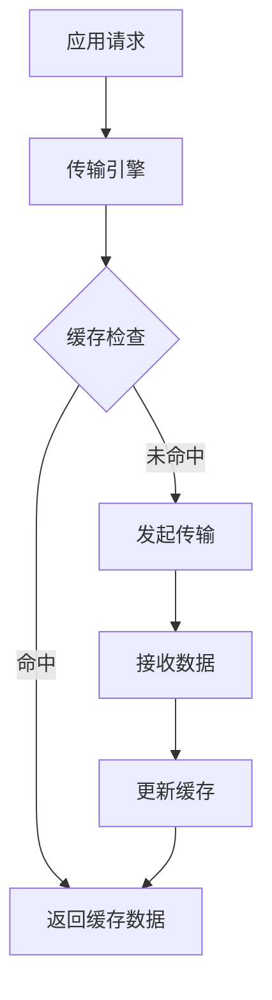
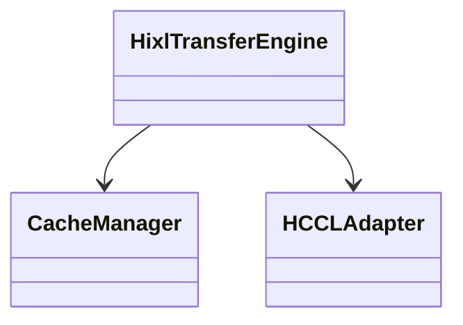

# PR自动创建工具使用说明

## 概述

本工具集提供了自动创建GitCode Pull Request的完整流程，包括：

1. **代码深度分析**：解析C++和Python代码，提取类、方法、调用关系
2. **LLM智能生成**：使用GLM-4.7大模型生成详细的PR描述
3. **Mermaid图表**：按需生成流程图、时序图、类图、架构图
4. **自动创建PR**：调用GitCode API自动创建Pull Request

## 文件说明

| 文件 | 说明 |
|------|------|
| `scripts/create_pr.sh` | 主脚本，协调整个PR创建流程 |
| `scripts/code_analyzer.py` | 代码深度分析工具 |
| `scripts/llm_helper.py` | LLM API集成模块（GLM-4.7） |
| `scripts/pr_description_generator.py` | PR描述生成器 |
| `scripts/PR_CREATION_FLOW.md` | 详细流程文档 |

## 快速开始

### 1. 准备工作

**获取GitCode Token**：
1. 访问 https://gitcode.com
2. 进入个人设置 → 个人访问令牌
3. 创建新令牌，勾选必要的权限（repo, pull_request）
4. 复制生成的Token

**安装Python依赖**：
```bash
pip install requests
```

### 2. 使用方式

#### 方式1：使用环境变量（推荐）

```bash
# 设置Token
export GITCODE_TOKEN="your_token_here"

# 运行脚本
./scripts/create_pr.sh
```

#### 方式2：交互式输入

```bash
# 直接运行，脚本会提示输入Token
./scripts/create_pr.sh
```

### 3. 操作流程

运行脚本后，按照提示操作：

1. **确认commit范围**
   - 是否基于最新的单个commit？
   - 如果否，输入起始commit ID

2. **选择PR类型标签**
   - Bug修复
   - 新特性
   - 代码重构
   - 文档更新
   - 其他

3. **确认PR标题**
   - 默认使用第一个commit message
   - 可以编辑修改

4. **选择Mermaid图表类型**（可多选）
   - 1) 流程图（flowchart）
   - 2) 时序图（sequenceDiagram）
   - 3) 类图（classDiagram）
   - 4) 架构图（graph）
   - 示例：`1 3` 表示生成流程图和类图

5. **确认目标分支**
   - 默认：master
   - 可以指定其他分支

6. **输入测试结果**
   - 如果有测试文件变更，询问是否已运行测试
   - 输入测试结果

7. **等待LLM生成**
   - 自动生成背景、问题、方案、流程、逻辑描述
   - 自动生成选定的Mermaid图表

8. **查看结果**
   - PR创建成功：显示PR链接
   - PR创建失败：显示保存的描述文件路径

## 使用示例

### 示例1：基于单个commit创建PR

```bash
export GITCODE_TOKEN="your_token_here"
./scripts/create_pr.sh

# 交互过程：
# 是否基于最新的单个commit创建PR？(y/n) y
# 请选择PR类型标签：
# 1) Bug修复
# 2) 新特性
# 3) 代码重构
# 4) 文档更新
# 5) 其他
# 请输入选项(1-5): 2
# 默认PR标题: feat: 添加新功能
# 是否使用此标题？(y/n) y
# 请选择需要生成的Mermaid图表类型（可多选，用空格分隔）：
# 1) 流程图（flowchart）
# 2) 时序图（sequenceDiagram）
# 3) 类图（classDiagram）
# 4) 架构图（graph）
# 请输入选项（1-4，可多选，留空跳过）: 1 3
# 请输入目标分支 (默认: master): 
# 检测到测试文件变更：
# M       tests/cpp/api_test.cpp
# 是否已运行测试？(y/n) y
# 请输入测试结果: 所有测试通过，覆盖率85%

# 输出：
# [INFO] PR创建成功！
# PR链接: https://gitcode.com/cann/hixl/pulls/123
```

### 示例2：基于commit范围创建PR

```bash
./scripts/create_pr.sh

# 交互过程：
# 是否基于最新的单个commit创建PR？(y/n) n
# 请输入起始commit ID: abc123def456
# ... 后续流程相同
```

### 示例3：不生成Mermaid图表

```bash
./scripts/create_pr.sh

# 交互过程：
# ...
# 请选择需要生成的Mermaid图表类型（可多选，用空格分隔）：
# 1) 流程图（flowchart）
# 2) 时序图（sequenceDiagram）
# 3) 类图（classDiagram）
# 4) 架构图（graph）
# 请输入选项（1-4，可多选，留空跳过）: 
# （留空，不生成任何图表）
```

## 生成的PR描述示例

```markdown
## 背景
本次改动是为了解决LLM训练过程中KV Cache数据传输效率低的问题。当前实现存在网络延迟高、内存占用大等问题，影响了整体训练性能。通过引入新的传输引擎和优化策略，可以显著提升数据传输效率，降低内存占用。

## 问题描述
当前KV Cache数据传输存在以下问题：
1. 传输延迟高，影响训练吞吐量
2. 内存占用大，容易OOM
3. 缺乏有效的缓存管理机制
4. 跨节点通信效率低

## 修改方案
采用以下技术方案：
1. 引入新的传输引擎，支持零拷贝传输
2. 实现智能缓存管理，减少内存占用
3. 优化跨节点通信协议，降低延迟
4. 添加传输性能监控和调优接口

## 代码流程
数据传输的主要流程如下：
1. 应用层发起数据传输请求
2. 传输引擎接收请求并进行预处理
3. 检查本地缓存，命中则直接返回
4. 缓存未命中，发起跨节点传输
5. 接收数据并更新缓存
6. 返回结果给应用层

### 流程图


## 核心逻辑
核心逻辑包括：

1. **缓存管理策略**
   - 使用LRU算法管理缓存
   - 支持多级缓存（本地+远程）
   - 自动缓存淘汰和预取

2. **零拷贝传输**
   - 使用共享内存减少数据拷贝
   - 支持RDMA直接内存访问
   - 优化数据序列化和反序列化

3. **智能调度**
   - 基于网络状况动态调整传输策略
   - 支持批量传输和流水线优化
   - 实现自适应拥塞控制

### 类图


## 变更文件列表
- 新增: src/hixl/engine/hixl_transfer_engine.h
- 修改: src/llm_datadist/cache_mgr/cache_manager.cc
- 修改: src/llm_datadist/hccl/hccl_adapter.cc

## 影响范围
### C++模块
- src/hixl/engine/hixl_transfer_engine.h
  类: HixlTransferEngine
- src/llm_datadist/cache_mgr/cache_manager.cc
  类: CacheManager

**统计信息**：
- 总文件数: 3
- C++文件: 3
- Python文件: 0
- 新增: 1
- 修改: 2
- 删除: 0

## 测试项
检测到以下测试文件变更：
M       tests/cpp/api_test.cpp

## 测试结果
所有测试通过，覆盖率85%
```

## 错误处理

### API调用失败

如果GitCode API调用失败，脚本会：

1. 分析错误原因（Token无效、权限不足、网络超时等）
2. 尝试自动解决（如提示重新输入Token）
3. 失败3次后询问用户是否继续
4. 如果用户选择不继续，保存PR描述到文件

### 保存的描述文件

文件名格式：`scripts/pr_description_YYYYMMDD_HHMMSS.md`

内容包含：
```markdown
# PR标题：<pr_title>

<pr_body>

---
此文件由 create_pr.sh 自动生成
时间：<timestamp>
```

用户可以复制内容到GitCode网页手动创建PR。

## 技术细节

### 代码分析

**C++代码分析**：
- 使用正则表达式提取类定义
- 提取方法定义（返回类型、方法名、参数）
- 提取函数调用关系
- 分析代码差异

**Python代码分析**：
- 使用AST解析
- 提取类定义和方法
- 提取导入依赖
- 提取函数调用关系

### LLM集成

**模型**：GLM-4.7
**配置**：内置在脚本中，无需额外配置
**功能**：
- 生成背景描述
- 生成问题描述
- 生成修改方案
- 生成代码流程说明
- 生成核心逻辑说明
- 生成Mermaid图表代码

### Mermaid图表

**支持的图表类型**：
1. **流程图（flowchart）**：展示代码执行流程
2. **时序图（sequenceDiagram）**：展示组件交互时序
3. **类图（classDiagram）**：展示类和依赖关系
4. **架构图（graph）**：展示模块和组件架构

**按需生成**：在PR信息收集阶段选择需要生成的图表类型。

## 注意事项

### 安全性

- GitCode Token不会保存到文件或日志中
- Token仅在内存中使用，脚本退出后自动清除
- 交互式输入Token时不回显

### 性能

- 代码分析可能需要较长时间（取决于变更规模）
- LLM API调用可能有延迟（约5-10秒）
- 建议在commit范围较小时使用

### 兼容性

- 支持Linux和macOS
- 需要Git 2.0+版本
- 需要Python 3.7+版本
- 不支持Windows

### 限制

- 不支持dry-run模式
- 不支持指定不同的origin分支名
- 不支持自动运行代码检查

## 故障排查

### 问题1：推送失败

**可能原因**：
- 网络连接问题
- origin仓库权限不足
- 分支名错误

**解决方法**：
- 检查网络连接
- 检查origin仓库权限
- 检查分支名是否正确

### 问题2：Token无效

**可能原因**：
- Token已过期
- Token权限不足

**解决方法**：
- 重新生成Token
- 确保Token有repo和pull_request权限

### 问题3：LLM调用失败

**可能原因**：
- 网络连接问题
- Python依赖未安装

**解决方法**：
- 检查网络连接
- 安装Python依赖：`pip install requests`
- 脚本会自动降级到基础描述

### 问题4：代码分析失败

**可能原因**：
- Python版本过低（需要3.7+）
- 代码文件不存在

**解决方法**：
- 检查Python版本
- 检查代码文件是否存在
- 脚本会自动降级到基础分析

## 详细文档

完整的流程设计文档请参考：`scripts/PR_CREATION_FLOW.md`

## 反馈与支持

如有问题或建议，请联系HIXL团队。
