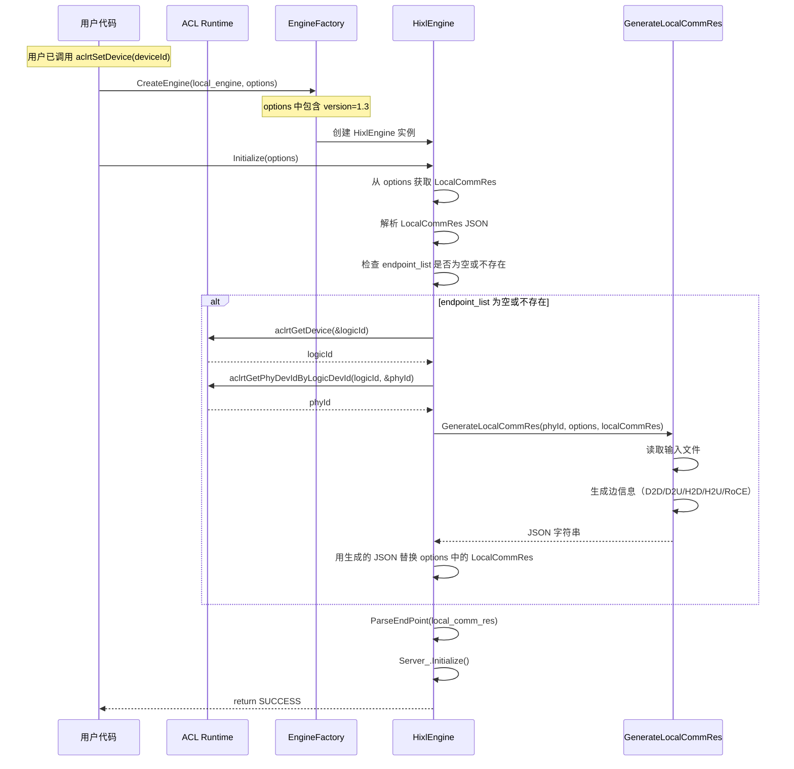
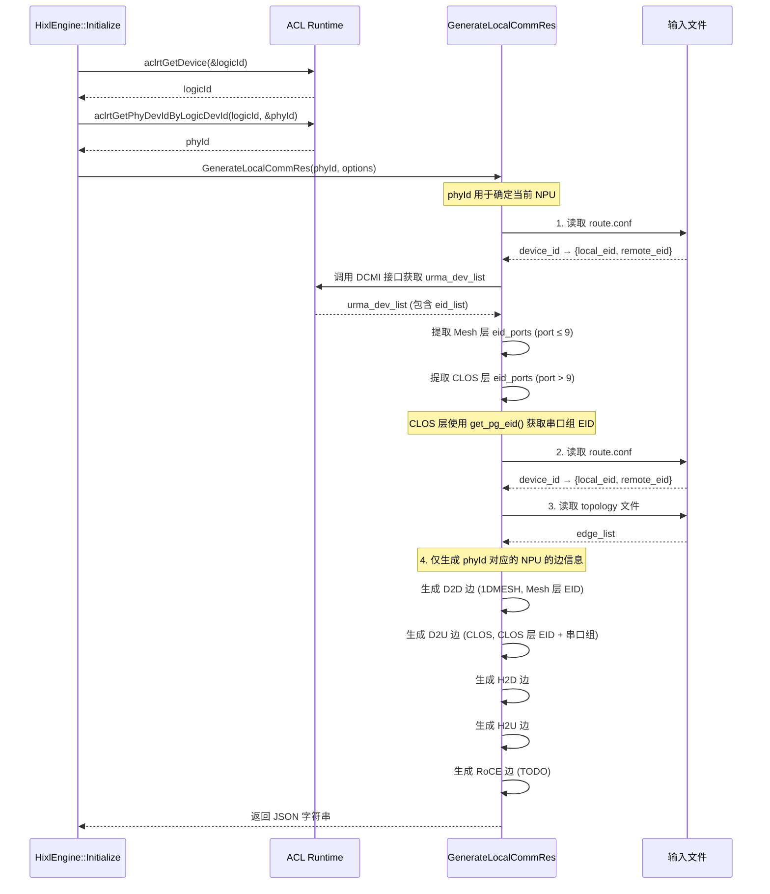

# HIXL LocalCommRes 自动生成工具设计文档

## 1. 背景与目标

### 1.1 背景

当前执行 HIXL 用例时，需要用户自行在入参后添加 local comm res（本地通信资源）信息。这增加了用户的使用成本，尤其是对于不熟悉内部实现的用户。

### 1.2 目标

1. 新增一个 C++ 工具函数 `GenerateLocalCommRes`，在 HIXL 初始化阶段自动检测用户输入
2. 如果用户提供的 `endpoint_list` 为空或不存在，则自动从系统配置文件中读取并生成
3. 输出为 JSON 字符串，直接赋值给 `OPTION_LOCAL_COMM_RES`
4. 通过 ACL 接口获取当前使用的 NPU ID，实现按需生成

### 1.3 用户收益

- 降低使用门槛，用户无需手动配置复杂的通信资源信息
- 自动化流程减少人工配置错误
- 按需生成，只生成当前 NPU 需要的边信息

---

## 2. 术语说明

| 术语 | 说明 |
|------|------|
| NPU | Neural Processing Unit，神经网络处理器 |
| David | NPU 的基本计算单元，1个Pod有8×8个David |
| D2D | Device to Device，设备间直连通信 |
| D2H | Device to Host，设备到主机通信 |
| H2D | Host to Device，主机到设备通信 |
| H2H | Host to Host，主机间通信 |
| RoCE | RDMA over Converged Ethernet，融合以太网RDMA |
| UB | Unified Bus，统一总线 |
| EID | Endpoint Identifier，端点标识符 |
| comm_id | 通信标识符 |
| plane_id | 平面标识符，用于路由 |
| Logic Dev ID | 逻辑设备 ID，用户通过 `aclrtSetDevice` 设置 |
| Phy Dev ID | 物理设备 ID，硬件层面的设备标识 |

---

## 3. ACL 设备接口说明

用户在使用 HIXL Engine 前必须先调用 `aclrtSetDevice` 指定使用的 NPU。本工具通过以下 ACL 接口获取设备信息：

### 3.1 接口列表

| 接口 | 说明 |
|------|------|
| `aclrtSetDevice(int32_t deviceId)` | 设置当前线程使用的逻辑设备 ID |
| `aclrtGetDevice(int32_t *deviceId)` | 获取当前线程已设置的逻辑设备 ID |
| `aclrtGetPhyDevIdByLogicDevId(int32_t logicDevId, int32_t *phyDevId)` | 将逻辑设备 ID 转换为物理设备 ID |

### 3.2 使用流程

```cpp
// 1. 用户设置设备（已有流程）
int32_t logicDeviceId = 0;
aclrtSetDevice(logicDeviceId);

// 2. 在 HixlEngine::Initialize 中获取设备信息
int32_t logicId = 0;
int32_t phyId = 0;
aclrtGetDevice(&logicId);  // 获取逻辑 ID
aclrtGetPhyDevIdByLogicDevId(logicId, &phyId);  // 转换为物理 ID
```

### 3.3 接口约束

根据 HIXL接口.md 第 148 行：
> 初始化前需要先调用 aclrtSetDevice。

因此在调用 `HixlEngine::Initialize` 时，当前的逻辑设备 ID 已经通过 `aclrtSetDevice` 设置完成，可以通过 `aclrtGetDevice` 获取。

---

## 4. 输入输出说明

### 4.1 输入文件

| 文件 | 来源                                                  | 说明 | 遗留事项 |
|------|-----------------------------------------------------|------|-----|
| `atlas_xxx.json` | 固定目录（如 `/etc/superpod_2d_noroce.json`）              | Topology 配置文件，记录设备拓扑连接信息 |确认是否适配标卡，是否已有环境变量可以用与配置文件路径|
| DCMI 接口 | 通过 `aclmdlGetDcmiInterface` 获取 | 获取 urma_dev_list 和 eid_list，用于构建 eid_ports 映射 | 替代 hccl_rootinfo.json |
| `route.conf` | 固定目录（如 `/lib/route.conf`）                           | CPU-Device 配对的 EID 映射 |
| `host_pairs.txt` | 用户指定路径                                              | RoCE 网卡 IP 映射表（可选，用于 RoCE 边生成） |暂时还存在一些问题，不使用该方案

### 4.2 DCMI 接口获取 eid_ports 映射

由于 `hccl_rootinfo.json` 不可获取，改用 DCMI 接口获取 EID 和 port 映射关系。

#### 4.2.1 数据结构

```cpp
struct NpuEidPort {
    int npu_id;                                              // NPU 物理 ID
    std::vector<std::map<std::string, std::string>> eid_ports; // [{"eid": "...", "port": "die/port"}, ...]
};
```

#### 4.2.2 核心算法

1. **调用 DCMI 接口获取 urma_dev_list**（等价于 Python 的 `get_urma_device_list`）

2. **对于每个 urma_dev (URMA 设备)**:
   - 获取该设备的 `eid_list`
   - 对于每个 eid:
     - 计算 `port = get_eid_port(eid)`
     - 计算 `die_id = get_eid_die_id(eid)` [server 类型]
     - 计算 `die_id = get_pod_die_id_by_eid(eid)` [pod 类型]
     - 如果 port 有效 (1-9):
       - `port_str = f"{die_id}/{port - 1}"`
       - 添加到结果列表: `{"eid": eid, "port": port_str}`

3. **返回结构体**: `{npu_id: npu_id, eid_ports: [...]}`

#### 4.2.3 EID 解析函数

**Port 提取** (`get_eid_port`):
```cpp
int get_eid_port(const std::string& eid) {
    std::string last = eid.substr(eid.length() - 2);  // 取最后 2 位
    int h = std::stoi(last, nullptr, 16);
    int p = ((~128) & h) >> 3;  // 清除最高位，右移 3 位
    return p;  // 返回 port 编号 (0-9)
}
```

**Die ID 提取 - Server 类型** (`get_eid_die_id`):
```cpp
int get_eid_die_id(const std::string& eid) {
    char low = eid[eid.length() - 2];  // 取倒数第 2 个字符
    int h = std::stoi(std::string(1, low), nullptr, 16);
    int die_id = (8 & h) >> 3;  // 提取 bit3
    return die_id;  // 返回 0 或 1
}
```

**Die ID 提取 - Pod 类型** (`get_pod_die_id_by_eid`):
```cpp
int get_pod_die_id_by_eid(const std::string& eid) {
    char third_from_last = eid[eid.length() - 3];  // 取倒数第 3 个字符
    int h = std::stoi(std::string(1, third_from_last), nullptr, 16);
    int die_id = (4 & h) >> 2;  // 提取 bit2
    return die_id;
}
```

#### 4.2.4 Port 有效性过滤条件

```cpp
// Server 类型
if (p > 9) {  // port 超过 9 则无效
    continue;
}

// Pod 类型
if (p > 9 || (int(eid[-3], 16) & 8) != 0) {
    // port 超过 9 或 EID 中 bit3 置位则无效
    continue;
}
```

#### 4.2.5 完整处理流程（Mesh 层）

```
对于每个 npu_id:
    1. 调用 DCMI 接口获取 urma_dev_list

    2. 对于每个 urma_dev (URMA 设备):
        a. 获取该设备的 eid_list

        b. 对于每个 eid:
            - 计算 port = get_eid_port(eid)
            - 计算 die_id = get_eid_die_id(eid)  [server]
                            或 get_pod_die_id_by_eid(eid)  [pod]

            - 如果 port 有效 (1-9):
                - port_str = f"{die_id}/{port - 1}"
                - 添加到结果列表: {"eid": eid, "port": port_str}

    3. 返回结构体: {npu_id: npu_id, eid_ports: [ {...}, ... ]}
```

### 4.3 CLOS 层 EID 和 Port 获取

CLOS 层（Level 1）的 EID 和 Port 与 Mesh 层（Level 0）有本质区别：
- **Mesh 层**：port ≤ 9 的 EID 对应单个物理串口
- **CLOS 层**：port > 9 的 EID 对应串口组（多个物理串口的聚合）

#### 4.3.1 获取 CLOS 层 EID（PG EID）

**函数**: `get_pg_eid(urma_dev)`

```cpp
std::string get_pg_eid(const UramaDevice& urma_dev) {
    for (const auto& eid : urma_dev.eid_list) {
        int p = get_eid_port(eid);  // 复用 Mesh 层的 port 计算方法
        if (p > 9) {
            return eid;  // 第一个 port > 9 的 EID 即为 PG EID
        }
    }
    return "";  // 未找到 CLOS 层 EID
}
```

**原理说明**：
- CLOS 层使用 port > 9 的 EID 作为串口组标识
- 这种 EID 代表的是一组串口的聚合，而不是单个物理串口
- 遍历 eid_list，找到第一个 port > 9 的 EID 即为 PG EID

#### 4.3.2 CLOS 层 Port 配置

CLOS 层是串口组，多个物理串口组成一个组，用一个 PG EID 表示。

**Server 类型** - `get_level1_config_server()`:
```cpp
std::vector<std::tuple<int, int, std::vector<int>>> get_level1_config_server(int mainboard_id) {
    if (mainboard_id == 35) {  // 2+4 服务器
        return {{0, 3, {4, 5, 6, 7}}, {1, 2, {5, 6}}};
    }
    if (mainboard_id == 37 || mainboard_id == 39) {
        return {{0, 3, {1, 2, 3, 4, 5, 6, 7, 8}}};
    }
    return {};
}
```

**Pod 类型** - `get_level1_config_pod()`:
```cpp
std::vector<std::tuple<int, int, std::vector<int>>> get_level1_config_pod(int mainboard_id, int phy_id) {
    if (mainboard_id == 3 && (phy_id % 8) < 4) {
        return {{0, 2, {1, 2}}, {1, 2, {0, 1, 2, 3, 5, 6}}};
    }
    if (mainboard_id == 3 && (phy_id % 8) >= 4) {
        return {{1, 2, {1, 2}}, {0, 2, {0, 1, 2, 3, 4, 5}}};
    }
    return {};
}
```

**配置格式**: `(die_id, fe_id, (port_tuple))`
- `die_id`: 目标 die ID
- `fe_id`: 目标 FE ID
- `port_tuple`: 该 die/fe 组合对应的串口组

#### 4.3.3 CLOS 层 EID 和 Port 数据结构

```cpp
struct ClosEidPort {
    int npu_id;                              // NPU 物理 ID
    std::string pg_eid;                      // CLOS 层 EID（串口组标识）
    std::vector<std::string> ports;          // 串口组: ["die/p1", "die/p2", ...]
    std::string plane_id;                   // plane_pg_0 或 plane_pg_1
};
```

#### 4.3.4 CLOS 层处理流程

```
对于每个 urma_dev:
    1. 获取 pg_eid = get_pg_eid(urma_dev)
       - 遍历 eid_list，找到第一个 port > 9 的 EID

    2. 获取 urma_dev 的 fe_id 和 die_id

    3. 根据 mainboard_id 和 phy_id 获取 level1_config

    4. 对于配置中的每个 (target_die, target_fe, ports):
        - 如果 die_id == target_die 且 fe_id == target_fe:
            - port_list = [f"{die_id}/{p}" for p in ports]
            - plane_id = "plane_pg_0" (6 ports) 或 "plane_pg_1" (其他)
            - 添加到 CLOS 结果列表
```

#### 4.3.5 CLOS 层 vs Mesh 层对比

| 特性 | Mesh 层 (Level 0) | CLOS 层 (Level 1) |
|------|-------------------|-------------------|
| **EID 区分** | port ≤ 9 | port > 9 |
| **Port 类型** | 单个物理串口 | 串口组（多个串口聚合） |
| **Port 格式** | `"die/port"` 单元素 | `["die/p1", "die/p2", ...]` 多元素 |
| **获取方法** | 从 eid_list 过滤 port ≤ 9 | `get_pg_eid()` 获取第一个 port > 9 的 EID |
| **plane_id** | `plane_{die_id}` | `plane_pg_0` 或 `plane_pg_1` |
| **配置来源** | DCMI 接口 eid_list | 根据 mainboard_id 和 phy_id 查询配置表 |

### 4.4 统一数据结构

将 Mesh 层和 CLOS 层的结果统一到以下数据结构：

```cpp
struct NpuEidPort {
    int npu_id;                                              // NPU 物理 ID
    std::vector<std::map<std::string, std::string>> mesh_eid_ports;  // Mesh 层: [{"eid": "...", "port": "die/port"}, ...]
    std::vector<ClosEidPort> clos_eid_ports;                // CLOS 层: 串口组列表
};

struct ClosEidPort {
    std::string pg_eid;                    // CLOS 层 EID
    std::vector<std::string> ports;       // 串口组
    std::string plane_id;                  // plane_pg_0 或 plane_pg_1
};
```

### 4.5 输出格式

按照OPTION_LOCAL_COMM_RES的格式生存一个结构体变量（不用再生成json字符串再提取内容），直接赋值给 `OPTION_LOCAL_COMM_RES`：

```json
{
  "version": "1.3",
  "net_instance_id": "xxxx",
  "endpoint_list": [
    {
      "protocol": "ub_ctp",
      "comm_id": "eid0-0",
      "placement": "host",
      "plane": "plane-a"
    },
    {
      "protocol": "ub_ctp",
      "comm_id": "eid0-1",
      "placement": "device",
      "dst_eid": "eid1-1"
    },
    {
      "protocol": "ub_ctp",
      "comm_id": "eid0-2",
      "placement": "device",
      "dst_eid": "eid1-2"
    },
    {
      "protocol": "ub_tp",
      "comm_id": "eid0-3",
      "placement": "device",
      "plane": "plane-a"
    },
    {
      "protocol": "roce",
      "comm_id": "ipv4/ipv6地址",
      "placement": "host"
    }
  ]
}
```

---

## 5. 边信息类型

根据需求，本次需要生成以下 5 种边信息：

### 5.1 D2D 直连边（Device to Device）

**拓扑筛选条件**：
- `net_layer = 0`
- `link_type = PEER2PEER`
- `topo_type = 1DMESH`
- `local_a` 在 NPU ID 范围内

**JSON 格式**：
```json
{
  "protocol": "ub_ctp",
  "comm_id": "<本地 NPU 的 local_a_ports 对应的 addr>",
  "placement": "device",
  "dst_eid": "<目标 NPU 的 local_b_ports 对应的 addr>"
}
```

**实现状态**：✓ 已实现（参考 `generate_ep.py` 的 `find_peer_eid_from_1dmesh` 函数）

---

### 5.2 D2U 非直连边（Device to UB Gateway - CLOS 层）

**拓扑筛选条件**：
- `net_layer = 1`
- `link_type = PEER2NET`
- `topo_type = CLOS`
- `local_a` 在 NPU ID 范围内

**JSON 格式**：
```json
{
  "protocol": "ub_ctp",
  "comm_id": "<local_a_ports 列表对应的 addr>",
  "placement": "device",
  "plane": "plane_pg_0"
}
```

**说明**：
- CLOS 层的 EID 是串口组标识（port > 9），用 `get_pg_eid()` 获取
- 每个 NPU 会有多条 D2U 边，分别对应不同的串口组配置
- 根据 `mainboard_id` 和 `phy_id` 确定具体的 port 配置
- 按轮询方式选择可用边

**实现状态**：✓ 已实现（参考 `generate_ep.py` 的 `get_h2d_plane_id` 函数）

---

### 5.3 H2D 直连边（Host to Device）

**数据来源**：从 `route.conf` 获取，在route.conf中，按照npu id获取local_eid作为comm_id，之后选择remote_eid作为dst_eid。

**JSON 格式**：
```json
{
  "protocol": "ub_ctp",
  "comm_id": "<local_eid>",
  "placement": "host",
  "dst_eid": "<remote_eid>"
}
```

**实现状态**：✓ 已实现

---

### 5.4 H2U 非直连边（Host to UB Gateway）

**数据来源**：从 `route.conf` 获取 `local_eid`，从 `rootinfo.json` 获取 `plane_id`

**JSON 格式**：
```json
{
  "protocol": "ub_ctp",
  "comm_id": "<local_eid>",
  "placement": "host",
  "plane": "plane_pg_0"
}
```

**实现状态**：✓ 已实现

---

### 5.5 RoCE 边（方案尚未实现，预留接口）

**数据来源**：先判断topo文件中是否有roce信息，如果有，从 `host_pairs.txt` 获取 host IP

**JSON 格式**：
```json
{
  "protocol": "roce",
  "comm_id": "<host IP 地址>",
  "placement": "host"
}
```

**说明**：
- `protocol` 字段：如果 topology 中为 `ROCE` 则填 `roce`，如果为 `UBOE` 则填 `uboe`
- `comm_id` 字段：从 `host_pairs.txt` 中根据 NPU ID 查找对应的 host IP

**实现状态**：✗ 未实现（`generate_ep.py` 中标记为 `todo: 'roce', 'uboe'`）

---

## 6. 调用流程

### 6.1 整体工作流程时序图



### 6.2 LocalCommRes 生成时序图



---

## 7. 实现方案

### 7.1 项目结构

```
src/
├── tools/
│   ├── CMakeLists.txt                    # 新增或修改
│   └── generate_local_comm_res.cpp       # 新增：生成逻辑
├── hixl/
│   └── engine/
│       ├── hixl_engine.cc                # 修改：调用 GenerateLocalCommRes
│       └── hixl_engine.h                # 修改：声明 GenerateLocalCommRes
```

### 7.2 核心数据结构

参考 `src/hixl/common/hixl_inner_types.h` 中的 `EndpointConfig`：

```cpp
struct EndpointConfig {
  std::string protocol;       // "ub_ctp", "ub_tp", "roce"
  std::string comm_id;        // EID 地址
  std::string placement;      // "device" 或 "host"
  std::string plane;          // plane_id（可选）
  std::string dst_eid;        // 目标 EID（用于直连场景）
  std::string net_instance_id;// 网络实例 ID
};
```

**Mesh 层数据结构**（单个物理串口）：

```cpp
struct NpuEidPort {
    int npu_id;                                              // NPU 物理 ID
    std::vector<std::map<std::string, std::string>> mesh_eid_ports;  // Mesh 层: [{"eid": "...", "port": "die/port"}, ...]
};
```

**CLOS 层数据结构**（串口组）：

```cpp
struct ClosEidPort {
    int npu_id;                              // NPU 物理 ID
    std::string pg_eid;                      // CLOS 层 EID（串口组标识，port > 9）
    std::vector<std::string> ports;          // 串口组: ["die/p1", "die/p2", ...]
    std::string plane_id;                    // plane_pg_0 或 plane_pg_1
};
```

**统一数据结构**（同时支持 Mesh 层和 CLOS 层）：

```cpp
struct NpuEidPortWithClos {
    int npu_id;                                              // NPU 物理 ID
    std::vector<std::map<std::string, std::string>> mesh_eid_ports;  // Mesh 层: [{"eid": "...", "port": "die/port"}, ...]
    std::vector<ClosEidPort> clos_eid_ports;                // CLOS 层: 串口组列表
};
```

### 7.3 函数签名设计

```cpp
namespace hixl {

/**
 * @brief 生成 LocalCommRes JSON 字符串
 * @param [in] phy_dev_id 物理设备 ID，通过 aclrtGetPhyDevIdByLogicDevId 获取
 * @param [in] options 生成选项，包含输入文件路径等
 * @param [out] local_comm_res 输出的 JSON 字符串
 * @return 成功:SUCCESS, 失败:其它
 */
Status GenerateLocalCommRes(
    int32_t phy_dev_id,
    const std::map<AscendString, AscendString>& options,
    std::string& local_comm_res
);

/**
 * @brief 从 EID 获取 Mesh 层 port（单个物理串口）
 * @param [in] eid EID 字符串
 * @return port 编号 (0-9)，port > 9 表示 CLOS 层串口组
 */
int GetMeshPort(const std::string& eid);

/**
 * @brief 从 EID 获取 die_id（Server 类型）
 * @param [in] eid EID 字符串
 * @return die_id (0 或 1)
 */
int GetServerDieId(const std::string& eid);

/**
 * @brief 从 EID 获取 die_id（Pod 类型）
 * @param [in] eid EID 字符串
 * @return die_id (0 或 1)
 */
int GetPodDieId(const std::string& eid);

/**
 * @brief 从 urma_dev 获取 CLOS 层 EID（PG EID）
 * @param [in] urma_dev URMA 设备，包含 eid_list
 * @return 第一个 port > 9 的 EID，若未找到则返回空字符串
 */
std::string GetPgEid(const UramaDevice& urma_dev);

/**
 * @brief 获取 CLOS 层串口组配置（Server 类型）
 * @param [in] mainboard_id 主板 ID
 * @return 配置列表: [(die_id, fe_id, [port1, port2, ...]), ...]
 */
std::vector<std::tuple<int, int, std::vector<int>>> GetLevel1ConfigServer(int mainboard_id);

/**
 * @brief 获取 CLOS 层串口组配置（Pod 类型）
 * @param [in] mainboard_id 主板 ID
 * @param [in] phy_id 物理设备 ID
 * @return 配置列表: [(die_id, fe_id, [port1, port2, ...]), ...]
 */
std::vector<std::tuple<int, int, std::vector<int>>> GetLevel1ConfigPod(int mainboard_id, int phy_id);

}  // namespace hixl
```

### 7.4 集成到 HixlEngine（先不用实现）

在 `HixlEngine::Initialize` 中，当 `endpoint_list` 为空或不存在时自动生成：

```cpp
Status HixlEngine::Initialize(const std::map<AscendString, AscendString> &options) {
  HIXL_LOGI("[HixlEngine] Initialization started, local_engine:%s", local_engine_.c_str());
  std::lock_guard<std::mutex> lock(mutex_);
  HIXL_CHK_STATUS_RET(CheckOptions(options), "[HixlEngine] Failed to check options");

  std::string local_comm_res;
  auto hixl_it = options.find(hixl::OPTION_LOCAL_COMM_RES);
  auto adxl_it = options.find(adxl::OPTION_LOCAL_COMM_RES);
  auto it = hixl_it == options.cend() ? adxl_it : hixl_it;
  if (it != options.cend()) {
    local_comm_res = it->second.GetString();
  }

  // 新增：如果 local_comm_res 不为空，解析并检查 endpoint_list
  bool need_auto_generate = false;
  if (!local_comm_res.empty()) {
    try {
      auto config = nlohmann::json::parse(local_comm_res);
      if (!config.contains("endpoint_list") ||
          config["endpoint_list"].empty()) {
        need_auto_generate = true;
      }
    } catch (const nlohmann::json::exception& e) {
      HIXL_LOGW("[HixlEngine] Failed to parse LocalCommRes, will auto-generate");
      need_auto_generate = true;
    }
  } else {
    need_auto_generate = true;
  }

  // 自动生成 LocalCommRes
  if (need_auto_generate) {
    HIXL_LOGI("[HixlEngine] LocalCommRes not provided or endpoint_list is empty, auto-generating...");

    // 获取当前设备 ID
    int32_t logicId = 0;
    int32_t phyId = 0;
    aclrtGetDevice(&logicId);
    aclrtGetPhyDevIdByLogicDevId(logicId, &phyId);

    HIXL_CHK_STATUS_RET(
      GenerateLocalCommRes(phyId, options, local_comm_res),
      "[HixlEngine] Failed to generate LocalCommRes"
    );
  }

  HIXL_CHK_STATUS_RET(ParseEndPoint(local_comm_res, endpoint_list_), ...);
  // ...
}
```

### 7.5 CLI 参数设计（独立工具模式）

```bash
./generate_local_comm_res \
  --topo-path <path>          # topology 文件路径
  --route-path <path>         # route.conf 路径
  --device-id <id>            # NPU 物理设备 ID
  --mode <pod|server>         # 拓扑模式（默认 pod）
  # DCMI 接口通过 aclmdlGetDcmiInterface 调用，无需显式传参
```

---

## 8. 待确认事项

| 序号 | 问题 | 状态 | 备注 |
|------|------|------|------|
| 1 | `host_pairs.txt` 的确切路径和格式？ | 待确认 | 用于 RoCE 边生成 |
| 2 | RoCE 边是否需要在本次需求中实现？ | 待确认 | 当前 `generate_ep.py` 中未实现 |
| 3 | 生产环境中 topology 文件的固定路径是否在运行时可访问？ | 待确认 | `/etc/hccl_xxx.json` 等 |
| 4 | 权限问题：输出目录默认使用当前目录还是需要 root 权限？ | 已明确 | 不再生成文件，无需考虑 |
| 5 | DCMI 接口是否在所有环境都可访问？ | 待确认 | 需要确认 urma_dev_list 获取方式 |
| 6 | 如何确定本节点所有需要通信的 NPU ID 范围？ | 已解决 | 通过 ACL 接口获取当前 NPU ID，再从 route.conf 获取关联信息 |

---

## 9. 参考资料

- `scripts/generate_ep.py` - Python 版实现参考
- `scripts/EID_PORT_Development_Document.md` - DCMI 接口获取 eid_ports 映射方案
- `src/hixl/engine/hixl_engine.cc` - HIXL Engine 初始化逻辑
- `src/hixl/engine/engine_factory.cc` - Engine 创建工厂
- `src/hixl/common/hixl_inner_types.h` - EndpointConfig 定义
- `include/hixl/hixl_types.h` - HIXL 类型定义
- `docs/cpp/HIXL接口.md` - HIXL 接口文档

---

## 10. 团队成员

| 角色 | 职责 |
|------|------|
| 需求提出方 | 提供业务需求和边信息格式说明 |
| 开发者 | 实现 C++ 工具和集成 |
| 测试 | 编写单元测试和集成测试 |

---

## 11. 里程碑

| 阶段 | 任务 | 状态 |
|------|------|------|
| M1 | 需求评审 | 待开始 |
| M2 | 详细设计评审 | 待开始 |
| M3 | 代码实现 | 未开始 |
| M4 | 单元测试 | 未开始 |
| M5 | 集成测试 | 未开始 |
| M6 | 上线 | 未开始 |