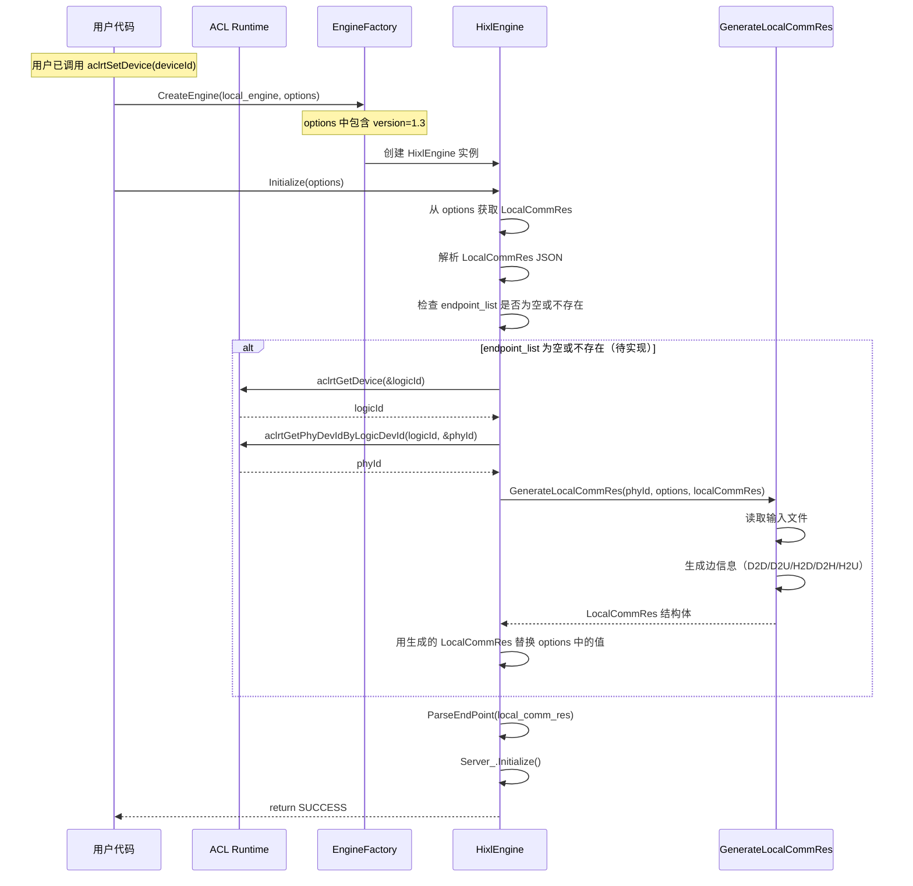
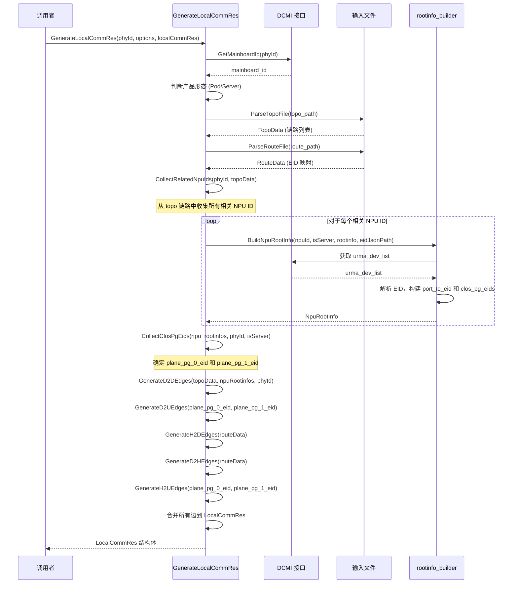

# HIXL LocalCommRes 自动生成工具设计文档

## 1. 背景与目标

### 1.1 背景

当前执行 HIXL 用例时，需要用户自行在入参后添加 local comm res（本地通信资源）信息。这增加了用户的使用成本，尤其是对于不熟悉内部实现的用户。

### 1.2 目标

1. 新增一个 C++ 工具函数 `GenerateLocalCommRes`，根据 NPU 物理设备 ID 自动生成本地通信资源信息
2. 从系统配置文件（topology 文件、route.conf、EID JSON 文件）和 DCMI 接口读取数据
3. 输出为 `LocalCommRes` 结构体，供 HIXL 初始化使用
4. 通过 DCMI 接口获取当前 NPU 的 mainboard_id，自动判断产品形态（Pod/Server）

### 1.3 用户收益

- 降低使用门槛，用户无需手动配置复杂的通信资源信息
- 自动化流程减少人工配置错误
- 按需生成，只生成当前 NPU 需要的边信息

---

## 2. 术语说明

| 术语 | 说明 |
|------|------|
| NPU | Neural Processing Unit，神经网络处理器 |
| David | NPU 的基本计算单元，1个Pod有8×8个David |
| D2D | Device to Device，设备间直连通信 |
| D2H | Device to Host，设备到主机通信 |
| H2D | Host to Device，主机到设备通信 |
| H2H | Host to Host，主机间通信 |
| RoCE | RDMA over Converged Ethernet，融合以太网RDMA |
| UB | Unified Bus，统一总线 |
| EID | Endpoint Identifier，端点标识符 |
| comm_id | 通信标识符 |
| plane_id | 平面标识符，用于路由 |
| Logic Dev ID | 逻辑设备 ID，用户通过 `aclrtSetDevice` 设置 |
| Phy Dev ID | 物理设备 ID，硬件层面的设备标识 |

---

## 3. ACL 设备接口说明

用户在使用 HIXL Engine 前必须先调用 `aclrtSetDevice` 指定使用的 NPU。本工具通过以下 ACL 接口获取设备信息：

### 3.1 接口列表

| 接口 | 说明 |
|------|------|
| `aclrtSetDevice(int32_t deviceId)` | 设置当前线程使用的逻辑设备 ID |
| `aclrtGetDevice(int32_t *deviceId)` | 获取当前线程已设置的逻辑设备 ID |
| `aclrtGetPhyDevIdByLogicDevId(int32_t logicDevId, int32_t *phyDevId)` | 将逻辑设备 ID 转换为物理设备 ID |

### 3.2 使用流程

```cpp
// 1. 用户设置设备（已有流程）
int32_t logicDeviceId = 0;
aclrtSetDevice(logicDeviceId);

// 2. 在 HixlEngine::Initialize 中获取设备信息
int32_t logicId = 0;
int32_t phyId = 0;
aclrtGetDevice(&logicId);  // 获取逻辑 ID
aclrtGetPhyDevIdByLogicDevId(logicId, &phyId);  // 转换为物理 ID
```

### 3.3 接口约束

根据 HIXL接口.md 第 148 行：
> 初始化前需要先调用 aclrtSetDevice。

因此在调用 `HixlEngine::Initialize` 时，当前的逻辑设备 ID 已经通过 `aclrtSetDevice` 设置完成，可以通过 `aclrtGetDevice` 获取。

---

## 4. 输入输出说明

### 4.1 输入文件

| 文件 | 来源 | 说明 | 遗留事项 |
|------|------|------|----------|
| `atlas_xxx.json` | 通过 options 的 `topo_path` 传入 | Topology 配置文件，记录设备拓扑连接信息 | 确认是否适配标卡 |
| DCMI 接口 | 通过 dlopen 加载 `libdcmi.so` | 获取 urma_dev_list 和 eid_list，用于构建 NpuRootInfo | - |
| `route.conf` | 通过 options 的 `route_path` 传入 | CPU-Device 配对的 EID 映射 | - |
| EID JSON 文件 | 通过 options 的 `eid_json_path` 传入（可选） | 从文件加载 EID 列表，替代 DCMI 接口调用（用于调试） | - |
| `host_pairs.txt` | 用户指定路径 | RoCE 网卡 IP 映射表（可选，用于 RoCE 边生成） | 暂时还存在一些问题，不使用该方案 |

### 4.2 DCMI 接口获取 EID 和 Port 映射

通过 DCMI 接口获取 URMA 设备信息，构建 `NpuRootInfo` 结构。

#### 4.2.1 数据结构

```cpp
/**
 * @brief NPU 串口到 EID 的映射信息
 */
struct NpuRootInfo {
    std::map<std::string, std::string> port_to_eid;  // Mesh 层串口到 EID 映射，key: "die_id/port"
    std::vector<ClosPgEidInfo> clos_pg_eids;          // CLOS 层 PG EID 列表
};

/**
 * @brief CLOS PG EID 信息
 */
struct ClosPgEidInfo {
    std::string eid;       // CLOS PG EID
    int die_id;           // 该 PG EID 对应的 die_id
};

/**
 * @brief URMA Device 结构
 */
struct UrmaDevice {
    std::string name;                      // 设备名称，如 "udma0"
    std::vector<std::string> eid_list;    // 该设备下的所有 EID 列表
};
```

#### 4.2.2 核心算法

1. **调用 DCMI 接口获取 urma_dev_list**

2. **对于每个 urma_dev (URMA 设备)**:
   - 获取该设备的 `eid_list`
   - 对于每个 eid:
     - 调用 `ParseEidByte6(eid)` 解析第6字节
     - 如果 `is_pg_eid == true`，则为 CLOS 层 EID，添加到 `clos_pg_eids`
     - 否则为 Mesh 层 EID，计算 `port_str = f"{die_id}/{port}"`，添加到 `port_to_eid`

3. **返回 NpuRootInfo 结构**

#### 4.2.3 EID 解析函数

**EID 第6字节解析** (`ParseEidByte6`):
```cpp
EidByte6Info ParseEidByte6(const std::string& eid) {
    // 取 EID 的第6字节（索引5）
    int byte6 = /* 从 eid 字符串解析 */;
    int high_nibble = (byte6 >> 4) & 0xF;  // 高4位
    int low_nibble = byte6 & 0xF;           // 低4位
    int die_id = (low_nibble >> 3) & 1;     // bit3
    bool is_pg_eid = (high_nibble & 8) != 0; // bit7
    int port = low_nibble & 0x7;            // 低3位
    return {byte6, high_nibble, low_nibble, die_id, is_pg_eid, port};
}
```

#### 4.2.4 完整处理流程

```
BuildNpuRootInfo(npu_id, is_server, rootinfo):
    1. 调用 DCMI 接口获取 urma_dev_list（或从 JSON 文件加载）

    2. 对于每个 urma_dev:
        a. 获取该设备的 eid_list

        b. 对于每个 eid:
            - 解析第6字节: ParseEidByte6(eid)
            - 如果 is_pg_eid:
                - 添加到 rootinfo.clos_pg_eids
            - 否则:
                - port_str = f"{die_id}/{port}"
                - rootinfo.port_to_eid[port_str] = eid

    3. 返回 rootinfo
```

### 4.3 CLOS 层 EID 和 Port 获取

CLOS 层（Level 1）的 EID 和 Port 与 Mesh 层（Level 0）有本质区别：
- **Mesh 层**：`is_pg_eid == false` 的 EID 对应单个物理串口
- **CLOS 层**：`is_pg_eid == true` 的 EID 对应串口组（多个物理串口的聚合）

#### 4.3.1 CLOS 层 EID 识别

在 `BuildNpuRootInfo` 中，通过 `ParseEidByte6` 解析 EID 的第6字节：
- 如果 `is_pg_eid == true`（第6字节高4位的 bit7 置位），则为 CLOS 层 EID
- 将该 EID 添加到 `rootinfo.clos_pg_eids` 列表

#### 4.3.2 CLOS 层 vs Mesh 层对比

| 特性 | Mesh 层 (Level 0) | CLOS 层 (Level 1) |
|------|-------------------|-------------------|
| **EID 区分** | `is_pg_eid == false` | `is_pg_eid == true` |
| **Port 类型** | 单个物理串口 | 串口组（多个串口聚合） |
| **存储位置** | `rootinfo.port_to_eid` | `rootinfo.clos_pg_eids` |
| **用途** | D2D 边生成 | D2U、H2U 边生成 |

### 4.4 统一数据结构

将 Mesh 层和 CLOS 层的结果统一到 `NpuRootInfo` 结构：

```cpp
struct NpuRootInfo {
    std::map<std::string, std::string> port_to_eid;  // Mesh 层串口到 EID 映射，key: "die_id/port"
    std::vector<ClosPgEidInfo> clos_pg_eids;          // CLOS 层 PG EID 列表
};
```

### 4.5 输出格式

输出为 `LocalCommRes` 结构体，直接供 HIXL 初始化使用：

```cpp
struct LocalCommRes {
    std::string version;                        // 版本号，默认 "1.3"
    std::string net_instance_id;                // 网络实例 ID（暂未赋值）
    std::vector<EndpointConfig> endpoint_list;  // 端点列表
};

struct EndpointConfig {
    std::string protocol;       // "ub_ctp"
    std::string comm_id;        // EID 地址
    std::string placement;      // "device" 或 "host"
    std::string plane;          // plane_id（可选，用于 D2U/H2U 边）
    std::string dst_eid;        // 目标 EID（可选，用于 D2D/H2D/D2H 边）
};
```

---

## 5. 边信息类型

根据需求，本次需要生成以下 5 种边信息：

### 5.1 D2D 直连边（Device to Device）

**拓扑筛选条件**：
- `net_layer = 0`
- `link_type = PEER2PEER`
- `topo_type = 1DMESH`
- `local_a` 在 NPU ID 范围内


**JSON 格式**：
```json
{
  "protocol": "ub_ctp",
  "comm_id": "<本地 NPU 的 local_a_ports 对应的 addr>",
  "placement": "device",
  "dst_eid": "<目标 NPU 的 local_b_ports 对应的 addr>"
}
```

**实现状态**：✓ 已实现（参考 `generate_ep.py` 的 `find_peer_eid_from_1dmesh` 函数）

---

### 5.2 D2U 非直连边（Device to UB Gateway - CLOS 层）

**拓扑筛选条件**：
- `net_layer = 1`
- `link_type = PEER2NET`
- `topo_type = CLOS`
- `local_a` 在 NPU ID 范围内

**JSON 格式**：
```json
{
  "protocol": "ub_ctp",
  "comm_id": "<local_a_ports 列表对应的 addr>",
  "placement": "device",
  "plane": "plane_pg_0"
}
```

**说明**：
- CLOS 层的 EID 是串口组标识（port > 9），用 `get_pg_eid()` 获取
- 每个 NPU 会有多条 D2U 边，分别对应不同的串口组配置
- 根据 `mainboard_id` 和 `phy_id` 确定具体的 port 配置
- 按轮询方式选择可用边

**实现状态**：✓ 已实现（参考 `generate_ep.py` 的 `get_h2d_plane_id` 函数）

---

### 5.3 H2D 直连边（Host to Device）

**数据来源**：从 `route.conf` 获取，在route.conf中，按照npu id获取local_eid作为comm_id，之后选择remote_eid作为dst_eid。

**JSON 格式**：
```json
{
  "protocol": "ub_ctp",
  "comm_id": "<local_eid>",
  "placement": "host",
  "dst_eid": "<remote_eid>"
}
```

**实现状态**：✓ 已实现

---

### 5.4 D2H 直连边（Device to Host）

**数据来源**：从 `route.conf` 获取，remote_eid 作为 comm_id，local_eid 作为 dst_eid

**格式**：
```cpp
{
  .protocol = "ub_ctp",
  .comm_id = "<remote_eid>",
  .placement = "device",
  .dst_eid = "<local_eid>"
}
```

**实现状态**：✓ 已实现

---

### 5.5 H2U 非直连边（Host to UB Gateway）

**数据来源**：从 CLOS PG EIDs 获取 plane_pg_0_eid 和 plane_pg_1_eid

**格式**：
```cpp
{
  .protocol = "ub_ctp",
  .comm_id = "<plane_pg_0_eid 或 plane_pg_1_eid>",
  .placement = "host",
  .plane = "plane_pg_0 或 plane_pg_1"
}
```

**实现状态**：✓ 已实现

---

### 5.5 RoCE 边（方案尚未实现，预留接口）

**数据来源**：先判断topo文件中是否有roce信息，如果有，从 `host_pairs.txt` 获取 host IP

**JSON 格式**：
```json
{
  "protocol": "roce",
  "comm_id": "<host IP 地址>",
  "placement": "host"
}
```

**说明**：
- `protocol` 字段：如果 topology 中为 `ROCE` 则填 `roce`，如果为 `UBOE` 则填 `uboe`
- `comm_id` 字段：从 `host_pairs.txt` 中根据 NPU ID 查找对应的 host IP

**实现状态**：✗ 未实现（`generate_ep.py` 中标记为 `todo: 'roce', 'uboe'`）

---

## 6. 调用流程

### 6.1 整体工作流程时序图



### 6.2 LocalCommRes 生成时序图



---

## 7. 实现方案

### 7.1 项目结构

```
scripts/
├── local_comm_res/
│   ├── local_comm_res_tool.h             # 头文件：数据结构和接口声明
│   ├── local_comm_res_tool.cc            # 实现：GenerateLocalCommRes 及辅助函数
│   ├── rootinfo_builder.h                # 头文件：RootInfo 构建接口
│   ├── rootinfo_builder.cc              # 实现：BuildNpuRootInfo 等
│   └── local_comm_res_interface.md       # 接口说明文档
├── generate_local_comm_res.md            # 本文档
```

### 7.2 核心数据结构

**输出结构体**（定义在 `local_comm_res_tool.h`）：

```cpp
struct LocalCommRes {
    std::string version;                        // 版本号，默认 "1.3"
    std::string net_instance_id;                // 网络实例 ID（暂未赋值）
    std::vector<EndpointConfig> endpoint_list;  // 端点列表
};

struct EndpointConfig {
    std::string protocol;       // "ub_ctp"
    std::string comm_id;        // EID 地址
    std::string placement;      // "device" 或 "host"
    std::string plane;          // plane_id（可选）
    std::string dst_eid;        // 目标 EID（可选）
};
```

**RootInfo 数据结构**（定义在 `rootinfo_builder.h`）：

```cpp
struct NpuRootInfo {
    std::map<std::string, std::string> port_to_eid;  // Mesh 层串口到 EID 映射
    std::vector<ClosPgEidInfo> clos_pg_eids;          // CLOS 层 PG EID 列表
};

struct ClosPgEidInfo {
    std::string eid;       // CLOS PG EID
    int die_id;           // 该 PG EID 对应的 die_id
};
```

### 7.3 函数签名设计

**local_comm_res_tool.h 中的接口**：

```cpp
namespace hixl {

/**
 * @brief 生成 LocalCommRes 结构体
 * @param [in] phy_dev_id 物理设备 ID
 * @param [in] options 生成选项，包含输入文件路径
 *        - "topo_path": topology 文件路径
 *        - "route_path": route.conf 路径
 *        - "eid_json_path": EID JSON 文件路径（可选）
 * @param [out] local_comm_res 输出的 LocalCommRes 结构体
 * @return 成功: SUCCESS, 失败: 其它错误码
 */
int32_t GenerateLocalCommRes(
    int32_t phy_dev_id,
    const std::map<std::string, std::string>& options,
    LocalCommRes& local_comm_res
);

// DCMI 接口封装
int32_t GetUBEntityList(int32_t phy_dev_id, UEList& ue_list);
int32_t GetMainboardId(int32_t phy_dev_id, unsigned int& mainboard_id);

// 文件解析
int32_t ParseTopoFile(const std::string& topo_path, TopoData& topo_data);
int32_t ParseRouteFile(const std::string& route_path, RouteData& route_data);

// 边生成
int32_t GenerateD2DEdges(const TopoData& topo_data,
                         const std::map<int32_t, NpuRootInfo>& npu_rootinfos,
                         int32_t phy_id,
                         std::vector<EndpointConfig>& edges);

void GenerateD2UEdges(const std::string& plane_pg_0_eid,
                      const std::string& plane_pg_1_eid,
                      std::vector<EndpointConfig>& d2u_edges);

int32_t GenerateH2DEdges(const RouteData& route_data,
                         std::vector<EndpointConfig>& edges);

int32_t GenerateD2HEdges(const RouteData& route_data,
                         std::vector<EndpointConfig>& edges);

void GenerateH2UEdges(const std::string& plane_pg_0_eid,
                       const std::string& plane_pg_1_eid,
                       std::vector<EndpointConfig>& h2u_edges);

}  // namespace hixl
```

**rootinfo_builder.h 中的接口**：

```cpp
namespace hixl {

EidByte6Info ParseEidByte6(const std::string& eid);

int32_t BuildNpuRootInfo(int32_t npu_id, bool is_server, NpuRootInfo& rootinfo,
                         const std::string& json_path = "");

int32_t GetUrmaDeviceList(int32_t npu_id, std::vector<UrmaDevice>& urma_devices,
                          const std::string& json_path = "");

int GetMeshDieId(int32_t npu_id, bool is_server);

}  // namespace hixl
```

### 7.4 集成到 HixlEngine（先不用实现）

在 `HixlEngine::Initialize` 中，当 `endpoint_list` 为空或不存在时自动生成：

```cpp
Status HixlEngine::Initialize(const std::map<AscendString, AscendString> &options) {
  HIXL_LOGI("[HixlEngine] Initialization started, local_engine:%s", local_engine_.c_str());
  std::lock_guard<std::mutex> lock(mutex_);
  HIXL_CHK_STATUS_RET(CheckOptions(options), "[HixlEngine] Failed to check options");

  std::string local_comm_res;
  auto hixl_it = options.find(hixl::OPTION_LOCAL_COMM_RES);
  auto adxl_it = options.find(adxl::OPTION_LOCAL_COMM_RES);
  auto it = hixl_it == options.cend() ? adxl_it : hixl_it;
  if (it != options.cend()) {
    local_comm_res = it->second.GetString();
  }

  // 新增：如果 local_comm_res 不为空，解析并检查 endpoint_list
  bool need_auto_generate = false;
  if (!local_comm_res.empty()) {
    try {
      auto config = nlohmann::json::parse(local_comm_res);
      if (!config.contains("endpoint_list") ||
          config["endpoint_list"].empty()) {
        need_auto_generate = true;
      }
    } catch (const nlohmann::json::exception& e) {
      HIXL_LOGW("[HixlEngine] Failed to parse LocalCommRes, will auto-generate");
      need_auto_generate = true;
    }
  } else {
    need_auto_generate = true;
  }

  // 自动生成 LocalCommRes
  if (need_auto_generate) {
    HIXL_LOGI("[HixlEngine] LocalCommRes not provided or endpoint_list is empty, auto-generating...");

    // 获取当前设备 ID
    int32_t logicId = 0;
    int32_t phyId = 0;
    aclrtGetDevice(&logicId);
    aclrtGetPhyDevIdByLogicDevId(logicId, &phyId);

    HIXL_CHK_STATUS_RET(
      GenerateLocalCommRes(phyId, options, local_comm_res),
      "[HixlEngine] Failed to generate LocalCommRes"
    );
  }

  HIXL_CHK_STATUS_RET(ParseEndPoint(local_comm_res, endpoint_list_), ...);
  // ...
}
```

### 7.5 CLI 参数设计（独立工具模式）

```bash
./generate_local_comm_res \
  --topo-path <path>          # topology 文件路径
  --route-path <path>         # route.conf 路径
  --device-id <id>            # NPU 物理设备 ID
  --mode <pod|server>         # 拓扑模式（默认 pod）
  # DCMI 接口通过 aclmdlGetDcmiInterface 调用，无需显式传参
```

---

## 8. 待确认事项

| 序号 | 问题 | 状态 | 备注 |
|------|------|------|------|
| 1 | `host_pairs.txt` 的确切路径和格式？ | 待确认 | 用于 RoCE 边生成 |
| 2 | RoCE 边是否需要在本次需求中实现？ | 待确认 | 当前 `generate_ep.py` 中未实现 |
| 3 | 生产环境中 topology 文件的固定路径是否在运行时可访问？ | 待确认 | `/etc/hccl_xxx.json` 等 |
| 4 | 权限问题：输出目录默认使用当前目录还是需要 root 权限？ | 已明确 | 不再生成文件，无需考虑 |
| 5 | DCMI 接口是否在所有环境都可访问？ | 待确认 | 需要确认 urma_dev_list 获取方式 |
| 6 | 如何确定本节点所有需要通信的 NPU ID 范围？ | 已解决 | 通过 ACL 接口获取当前 NPU ID，再从 route.conf 获取关联信息 |

---

## 9. 参考资料

- `scripts/generate_ep.py` - Python 版实现参考
- `scripts/EID_PORT_Development_Document.md` - DCMI 接口获取 eid_ports 映射方案
- `src/hixl/engine/hixl_engine.cc` - HIXL Engine 初始化逻辑
- `src/hixl/engine/engine_factory.cc` - Engine 创建工厂
- `src/hixl/common/hixl_inner_types.h` - EndpointConfig 定义
- `include/hixl/hixl_types.h` - HIXL 类型定义
- `docs/cpp/HIXL接口.md` - HIXL 接口文档

---

## 10. 团队成员

| 角色 | 职责 |
|------|------|
| 需求提出方 | 提供业务需求和边信息格式说明 |
| 开发者 | 实现 C++ 工具和集成 |
| 测试 | 编写单元测试和集成测试 |

---

## 11. 里程碑

| 阶段 | 任务 | 状态 |
|------|------|------|
| M1 | 需求评审 | 待开始 |
| M2 | 详细设计评审 | 待开始 |
| M3 | 代码实现 | 未开始 |
| M4 | 单元测试 | 未开始 |
| M5 | 集成测试 | 未开始 |
| M6 | 上线 | 未开始 |